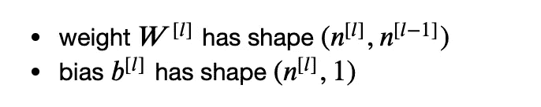
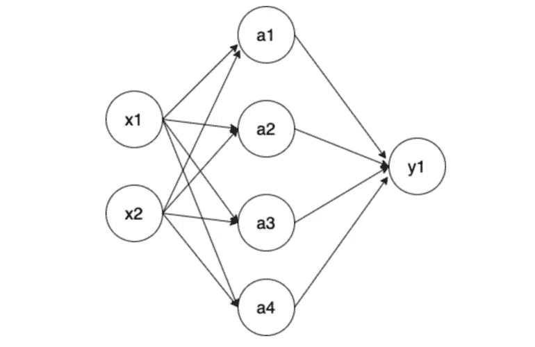
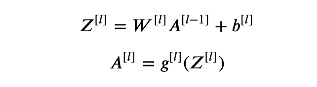
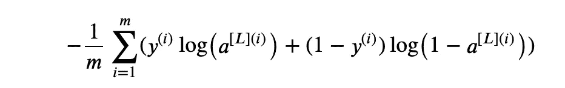
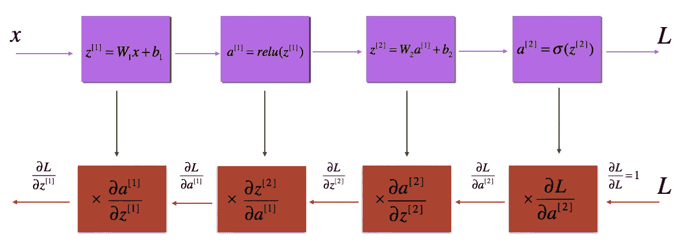
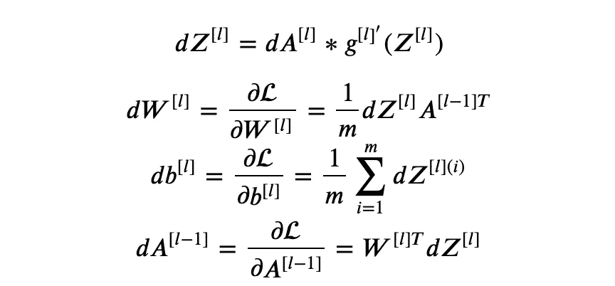
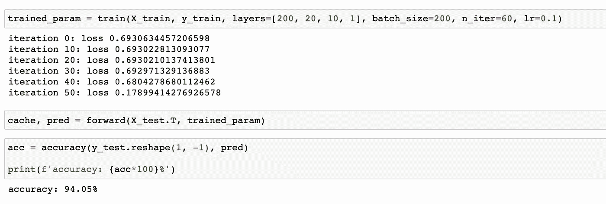

# 编写一个深度神经网络

> 原文：<https://towardsdatascience.com/code-a-deep-neural-network-a5fd26ec41c4?source=collection_archive---------28----------------------->

## [入门](https://towardsdatascience.com/tagged/getting-started)

## 用 Python 构建深度神经网络的实践操作


[timJ](https://unsplash.com/@the_roaming_platypus?utm_source=medium&utm_medium=referral) 在 [Unsplash](https://unsplash.com?utm_source=medium&utm_medium=referral) 上拍照

在上一篇[帖子](/building-a-shallow-neural-network-a4e2728441e0)中，我们用 python 构建了一个具有基本功能的单隐层神经网络。为了推广和增强我们的网络，在这篇文章中，我们将建立一个 n 层神经网络来执行二进制分类任务，其中 n 是可定制的(建议重温我上次对神经网络的介绍，因为这里不会重复理论的基础)。

> 所有图片都是我自己创作的，引用的图片都是添加的。

# 权重初始化

首先，需要为不同的层初始化权重。请注意，通常情况下，输入不被视为图层，但输出被视为图层。

(详细的培训和测试流程，请点击[这里](https://github.com/MJeremy2017/deep-learning/tree/main/deep-neural-network)

我们了解到，对于`lth`层:



其中 n^[0]等于数字输入特征。

考虑下面的神经网络:



在这种情况下，第一个 W^[1 会有形状`(4, 2)`，第二个 W^[2 会有形状`(1, 4)`。

如果输入要求是一个列表，对于上面的情况，输入层应该是

```
[2, 4, 1]
```

并且我们的初始化权重需要足够小，以便在反向传播过程中梯度会很大，并且学习会更快。

# 正向传播

转发过程将是直截了当的，如下所示:



其中`l`是`lth`层，而`g(x)`是激活函数。这里我们将使用 2 个不同激活函数:

以上所有函数都适用于矩阵。

正向传播将遵循上面的等式。注意，在我们的实现中，除了最后一层我们使用`sigmoid`激活，其余的我们使用`relu`激活函数。

# 价值函数

我们仍然认为这是一个二元分类，一批的成本是:



其中`a`为预测值，`y`为实际值。

# 反向传播

既然我们的正向过程已经完成，为了让我们的模型通过迭代得到改进，让我们来看看反向传播的关键。



[ **来源**:https://github.com/enggen/Deep-Learning-Coursera]

可以以递归方式计算反向梯度:



首先，需要实现`sigmoid`和`relu`的导数。

出于对称的原因，这里两个函数具有相同的输入，尽管这不是必需的。

根据上面的等式，我们实现了反向传播。注意，除了最后一层使用了`sigmoid`函数，其余的我们都应用`relu`导数来得到梯度。

现在给定梯度，我们的权重更新如下:


# 应用于数据集

让我们将我们的模型应用于创建的包含 200 个要素的数据集。

现在让我们训练我们的模型。

这里我们有一个有 200 个输入特征的 3 层神经网络。



要了解详细的训练过程，请查看我的 [github](https://github.com/MJeremy2017/deep-learning/tree/main/deep-neural-network) 。