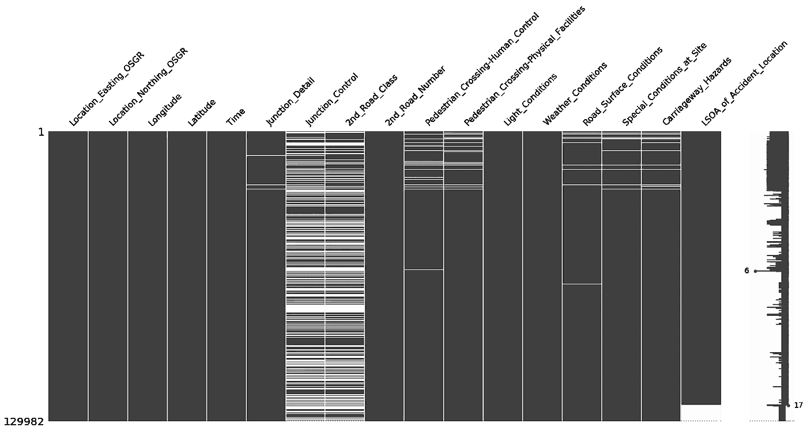
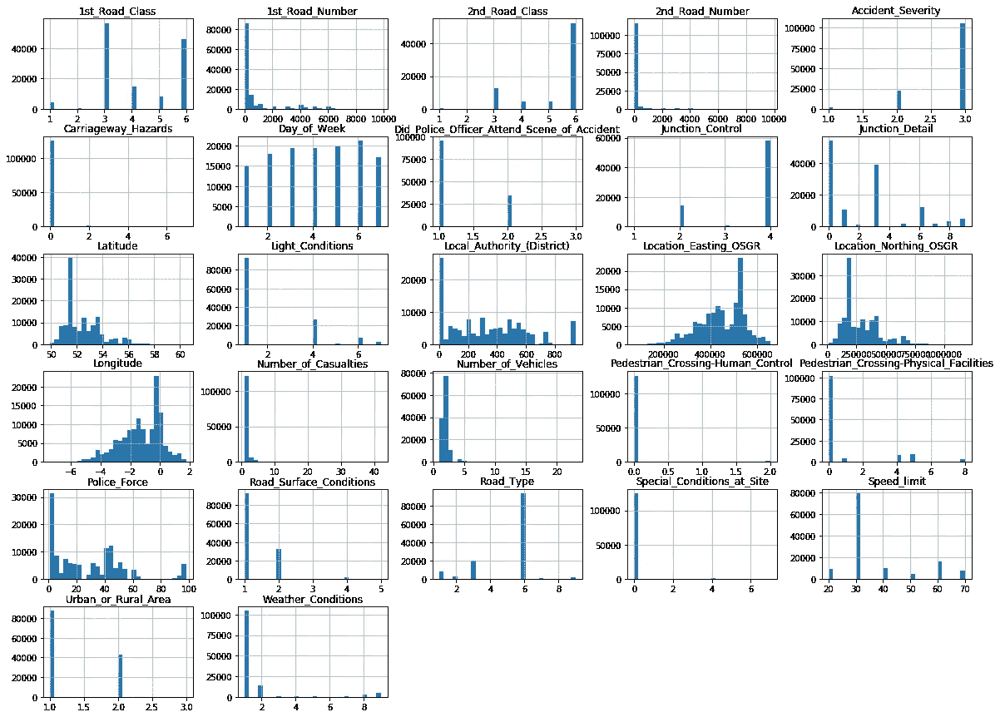
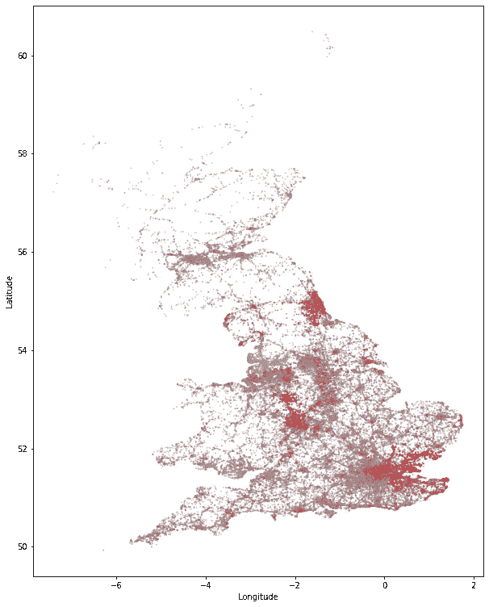
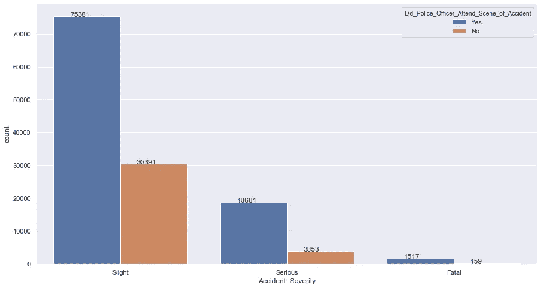
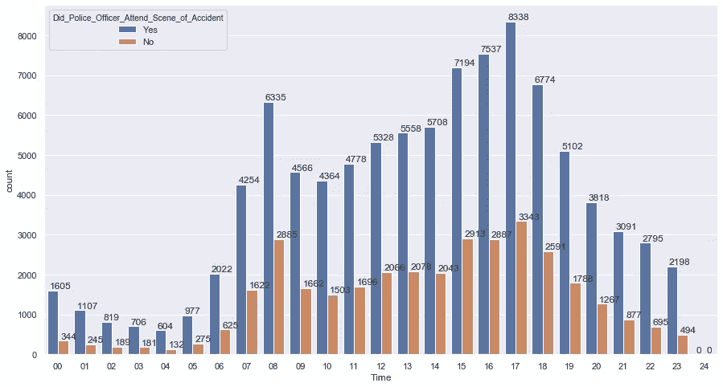
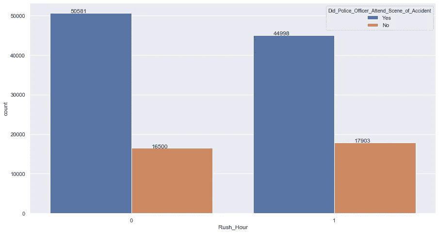
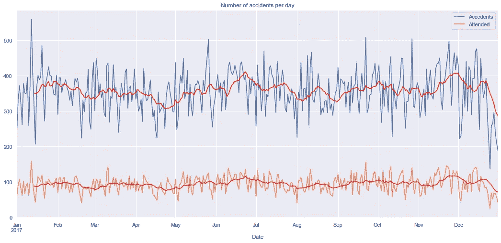
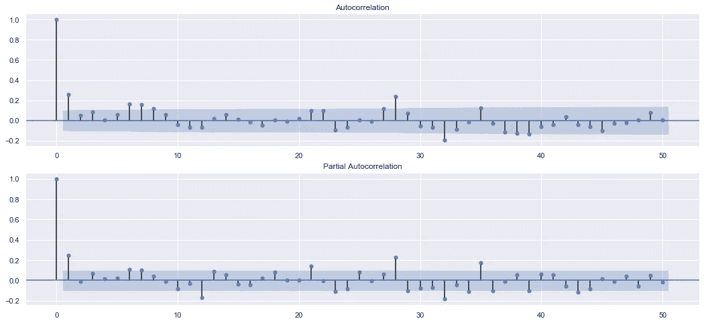
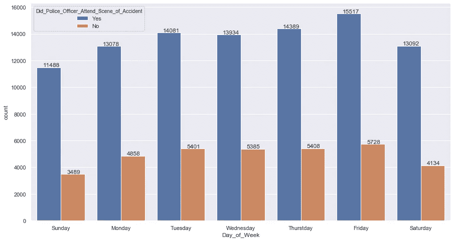
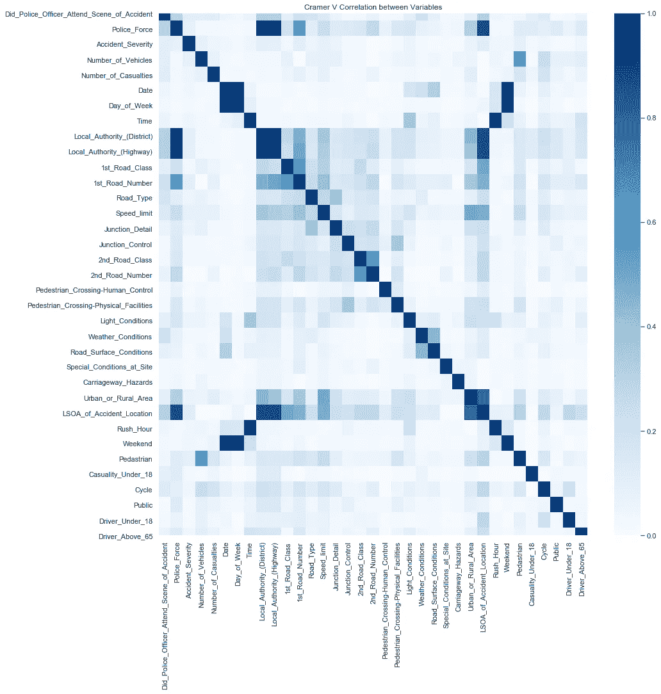

# 探索性数据分析的代码和技术

> 原文：<https://towardsdatascience.com/code-and-techniques-for-exploratory-data-analysis-a44c50953502?source=collection_archive---------25----------------------->

## 探索性数据分析框架

## 如何分析数据，测试假设，并为您的客户创造洞察力

*免责声明:您正在阅读第 1 部分“探索性数据分析框架”。* [*第 2 部分*](https://medium.com/@tatianasennikova/how-to-build-a-baseline-model-be6ce42389fc) *展示了如何基于下面的分析见解构建基线模型。*

# 介绍

当您需要通过生成见解和构建第一个基线模型来向客户展示数据的价值时，这是一种非常常见的情况。作为一名数据科学顾问，您可能每周都会收到这样的请求。因此，建立一个探索性数据分析的基本框架是有意义的，它可以帮助您评估数据质量，并向客户展示第一手见解。在本文中，我描述了我在分析新数据集时使用的探索性数据分析框架。该框架包括:

数据质量评估

数据分布概述

分析不同类型的数据(地理位置、时间序列、名义数据等)。)

关联(或相关)分析

构建基线模型(在分析的[第 2 部分](https://medium.com/@tatianasennikova/how-to-build-a-baseline-model-be6ce42389fc)中描述)

拟议的框架并非详尽无遗，但涵盖了广泛的案例，可作为制定更详尽框架的起点。在我们着手任何复杂的建模之前，它作为第一个健全检查。完整的笔记本可以在 [GitHub](https://github.com/tsennikova/road-accidents-analysis/blob/master/road_accidents_analysis.ipynb) 上找到。

在这个例子中，我使用了在[data.gov.uk](https://data.gov.uk/dataset/cb7ae6f0-4be6-4935-9277-47e5ce24a11f/road-safety-data)发现的道路事故安全数据。该数据集包含不同类型的数据:地理、时间序列、分类和连续变量，这些变量非常接近真实世界的情况，其中数据来自多个来源，并且可能属于不同的类型。

图片由 Icons8 团队/unsplash.com 提供

# 问题陈述

最终目标是开发一个模型来预测警察参与事故的概率。我们还应该评估我们所掌握的数据的质量，并展示哪些因素对模型的决策有最大的影响。

# 数据质量评估

首先，我导入了探索性数据分析所需的包。

将数据读入熊猫数据框

除了像 pandas、numpy 和 matplotlib 这样的标准包，我还导入了 [missingno](https://pypi.org/project/missingno/) ，这是一个 pandas 兼容的库，用于可视化缺失值。

由于我不希望事故数据帧在数据探索阶段被改变，数据被复制到一个单独的变量中。数据分析的所有后续步骤都将在副本上执行，一旦进入建模阶段，我将返回原始数据集(在[第二部分](https://medium.com/@tatianasennikova/how-to-build-a-baseline-model-be6ce42389fc))。

将数据集复制到单独的变量中

数据集包含 32 个变量，其中大部分是分类变量。我们可以在[变量查找](http://data.dft.gov.uk/road-accidents-safety-data/variable%20lookup.xls)中检查每个变量的含义及其值。首先，我们需要评估变量数据类型，因为其中一些可能需要类型转换。

事故数据框架中的变量类型

事故数据集中的大多数变量都是数字。还有一个变量是我在读取时显式设置为 datetime 对象的，我们还有四个对象变量:

*   *事故指数* —事故指数
*   *时间* —格式为 HH:mm 的时间
*   *Local _ Authority _(Highway)*，*LSOA _ 事故 _ 地点* —包含事故地点信息的分类变量。

在我们对数据集中的变量进行更深入的分析之前，让我们先了解一下缺失值的概况。

## 缺失值分析

如前所述，为了快速了解缺失值的模式，我使用了 missingno 包，因为它提供了数据集的图形化表示。它允许我们快速检测缺失数据的模式，然后判断数据是否是随机缺失的。基于此，我们需要制定一个策略来处理缺失的值。

在事故数据集中，缺失值用值“-1”表示。首先，我们需要用一个 NaN 值来替换它，这样我们就可以得到一个缺失观测值模式的概述。

绘制缺失值图表

缺失值评估

因为我只对包含缺失值的变量感兴趣，所以我只可视化包含 NaN 值的列。该图显示了每一列中缺失的观察值，右边的栏显示了每一行的数据完整性。

正如我们所看到的，有几列似乎与缺失值相关联:

*   *路口 _ 控制*与*第二 _ 道路 _ 等级*
*   *人行横道* - *人控*与*人行横道* - *物理设施*
*   *道路 _ 路面 _ 状况*与*特殊 _ 状况 _ 现场*和*行车道 _ 危险*

这意味着值不是随机丢失的，我们在处理丢失值的策略时需要记住这一点。

此外，一些变量如 *Junction_Control* 也会对响应变量产生重大影响。因此，在将来，缺失的值应该是完整的，例如通过车辆传感器数据。

为了更好地理解我们正在处理的数据，我将绘制每个数值的直方图。

# 数据分布概述

正如我们已经看到的，数据集包含不同类型的数据:地理的、分类的、时间序列的。所有类型的数据都应单独处理和分析。

绘制事故数据的直方图

事故数据集中每个变量的直方图

大多数变量是基数较低的分类变量。我们还看到一些成对的特征，比如

*   *经度*和*位置 _ 东行 _OSGR*
*   *纬度*和*位置 _ 北向 _OSGR*

有非常相似的分布。他们很可能复制了信息。因此我们现在可以只集中分析*纬度*和*经度*，而忽略*位置 _ 东行 _OSGR* 和*位置 _ 北行 _OSGR* 。

让我们简单地看一下我们想要预测的变量，因为进一步的分析将在其上下文中执行。

响应变量概述

响应变量包含三个类。我将把第 2 类和第 3 类合并成一个负类，因为我只对预测警察参与事故的概率感兴趣。

响应变量类别份额

正如我们可以看到的，响应变量中的类是不平衡的，这是在训练模型时要记住的事情。

# 不同类型数据的分析

## 地理数据

由于描述事故地点的变量相当多，我将检查地点是否是预测警察是否会参与事故的重要因素。

绘制地理数据

道路事故英国 2017。红色—未出席；灰色—有人值守

红色—未出席

灰色—有人值守

该图显示，在一些区域，警察不太可能参与事故。当我们训练一个模型时，*经度*和*纬度*可能是具有高分辨能力的变量。

## 数据集中变量之间的关联

**假设检验**

在这一节中，我将测试一些关于数据集中变量之间关系的假设。检查变量之间关系的常用方法是计算相关性(如皮尔逊相关系数)。然而，事故数据集中的绝大多数变量都是分类变量。我们不能在数据集上使用相关性，因为相关性衡量两个定量变量之间的线性关系。因此，我使用[卡方检验](https://en.wikipedia.org/wiki/Chi-squared_test)来确定两个分类变量之间的显著关联。

在盯着这些数据看了一会儿后，我提出了一个假设，即对于一名警察来说，决定是否参与一起事故的最重要因素之一是事故的严重程度。那么我们要测试的第一个假设如下:

**H0:** 事故的严重程度对警察参与事故的概率没有影响。

*记住，零假设总是一个没有变化的假设，我们现在的工作是检查我们是否有足够的证据来拒绝它。*

绘制事故严重性和事故出勤率

事故严重程度和警察出勤率

我们可以观察到两组之间的差异，但我们需要量化这些关系。为此，我将在 5%的显著性水平上进行卡方检验。

为了进行卡方检验，我使用了 [researchpy](https://pypi.org/project/researchpy/) 包。Researchpy 生成熊猫数据框架，其中包含学术研究通常需要的相关统计测试信息。

假设检验。一名警官是否参加事故的概率取决于事故的严重程度

researchpy 运行的卡方检验为我们提供了三个值:

**皮尔逊卡方**——通过计算观察频率和预期频率之间的平方差总和(由预期频率归一化)来计算。它用于计算 p 值，这是卡方检验的另一个输出

**p 值**——假设 H0 正确的观测结果的概率

[**克莱姆的 V**](https://en.wikipedia.org/wiki/Cram%C3%A9r%27s_V)**——是一个量化两个分类变量之间关联的效应大小。我们可以使用 Pearson 卡方统计来量化这些关系，但是与协方差一样，它不是有界的，并且倾向于随着维度和样本的数量而增长。因此，要对不同大小的数据集的影响大小进行可比测量，我们需要通过将 Pearson 卡方统计除以样本大小和最小维度减 1 来对其进行归一化。它会给我们一个 0 到+1 之间的值，叫做克莱姆 v。**

**卡方检验的结果表明，有统计学意义的证据表明 H0 是错误的。鉴于证据和数据，我们拒绝 H0 的说法，即变量*事故严重性*和*Did _ 警察 _ 官员 _ 出席 _ 事故现场*之间没有关联，p 值<为 0.005，效应大小为 0.1。**

**既然我们知道这种联系是显著的，我们想测试变量水平之间的关系。为此，我们需要进行多次 2×2 卡方检验。然而，对同一个因变量进行多次测试会增加假阳性的机会，从而增加了偶然获得重要结果的可能性。为了考虑假阳性，我们需要通过校正其级别来调整正在执行的比较数量的重要性。该校正称为 [Bonferroni 校正](https://en.wikipedia.org/wiki/Bonferroni_correction)。为此，我将使用 scipy 的统计包，作为 researchpy 的替代方法。需要记住的是，scipy 不提供熊猫数据帧中的结果。**

**测试事故严重程度与警察参与事故的概率**

**使用 Bonferroni 调整的显著性水平=0.017 的卡方检验表明所有比较都是显著的。然而，对数据集中的每一对变量进行卡方检验是非常耗时的。因此，我将建立一个关联矩阵作为数据探索的最后一步。**

## **日期和时间**

**数据集中有*日期*和*时间*变量，检查时间相关模式并添加一些新变量来帮助我们的模型做出决策总是一个好主意。首先，我们来看一下*时间*变量。**

**绘制每小时事故数**

****

**每小时事故数及其出勤率**

**我们可以观察到两个最容易发生事故的高峰时段:上午 7-9 点和下午 15-18 点。我知道警察的数量在一段时间内是不变的，我会假设在高峰时间出勤率会更低，因为可能没有足够的警察来处理所有的事故。因此，我将创建一个表示高峰时间的变量，并测试它与警察发生事故的概率之间的关联。**

**绘制每个高峰时间的事故数量及其出勤率**

****

**每个高峰时间的事故数量及其出勤率**

**各组之间略有不同。为了量化这些关系，我将运行另一个卡方检验。**

****H0:** 高峰时间对一名警察参与事故的概率没有影响**

**卡方检验:高峰时间是否影响警察参与事故的概率**

**卡方检验的结果表明，有统计学意义的证据表明 H0 是错误的。鉴于证据和数据，我们拒绝 H0 的说法，即变量*高峰时间*和*Did _ 警察 _ 官员 _ 出席 _ 事故现场*之间没有关联，p 值<为 0.005，效应大小为 0.04。**

**事故数据集中的另一个时间相关变量是*日期*。我将绘制每天的事故总数，以分析随时间变化的趋势。**

**绘制每天的事故数量**

****

**每天的事故数量**

**该图显示了一种循环模式，这可能表明存在某种季节性。我将绘制 ACF 图和 PACF 图，以检查时间序列中是否有显著的季节性成分。**

**绘制每天事故数量的 ACF 和 PACF**

****

**ACF 和 PACF 每天事故数量图**

**ACF 图在滞后 1 处显示了显著的趋势分量，在滞后 6 和滞后 7 处显示了显著的季节分量，这可能指示周末。我将绘制出每个工作日的事故数量，以检查周末的行为是否有所不同。**

**绘制一周中每天的事故数量**

****

**每周事故数和警察出勤率**

**我们可以观察到整体事故和周末参与的事故略有下降。我将明确地对周末进行建模，然后检查一个新创建的变量是否与警察参与事故的概率有显著关联。**

**H0:周末对警察处理事故的概率没有影响。**

**卡方检验:周末是否影响警察参与事故的概率**

**卡方检验的结果表明，有统计学意义的证据表明 H0 是错误的。鉴于证据和数据，我们拒绝 H0 的说法，即变量*周末*和*Did _ Police _ Officer _ Attend _ Scene _ of _ Accident*之间没有关联，p 值<为 0.005，效应大小为 0.04。**

## **连接附加数据**

**我们已经测试了一些假设，并设计了两个新功能，高峰时间和周末。现在让我们加入在 data.gov.uk 得到的其他数据。首先，我将连接伤亡数据集中的数据。**

**加载伤亡数据集**

**伤亡数据集主要包含分类变量。从前三行我们可以看出，*事故指数*对于每一行都不是唯一的，因为一次事故可能导致多人伤亡。对我们来说，这意味着我们不能直接连接事故和伤亡数据表，而是需要做一些特征工程。对于第一次评估，让我们只加入伤亡数据集中的几个变量。**

**我将形成几个假设，并假设如果下列情况之一为真，警察更有可能参与事故:**

*   **伤亡者是行人**
*   **18 岁以下或 65 岁以上的人**
*   **司机年龄在 18 岁以下，或 65 岁以上**

**因此，我将创建新的二元变量，将它们加入事故数据集，并测试是否与响应变量有显著关联。**

**连接伤亡数据集中的新变量，并测试它们与响应变量的显著关联**

**卡方检验显示，在 0.05 的显著性水平上，新创建的变量与警察参与事故的概率之间存在显著关联，而 p 值【data.gov.uk】是涉及事故的车辆数据集。**

**加载车辆数据集**

**从前面几行中，我们可以看到*事故指数*对于每一行都不是唯一的，因为一次事故可能涉及几辆车。同样，我们需要进行特征工程来连接数据。**

**我将形成几个假设，并假设如果下列情况之一为真，警察更有可能参与事故:**

**自行车卷入了事故**

*   **出租车、货车或公共交通工具卷入事故**
*   **司机年龄在 18 岁以下，或 65 岁以上**
*   **与伤亡数据集中的情况一样，我将创建相关的二进制变量，将它们连接到事故数据集中，并测试是否与响应变量有显著关联。**

**连接车辆数据集中的新变量，并测试它们与响应变量的显著关联**

**卡方检验显示，在 0.05 的显著性水平上，新创建的变量与警察参与事故的概率之间存在显著关联。**

**毫无疑问，可以对这三个数据集执行更复杂的特征工程，包括构建分类嵌入。然而，我们的目标是建立第一个原型模型，并通过快速洞察和发现变量之间的有趣关系(例如，带有事故出席率、事故季节性等的地理数据)向客户展示数据的价值。).为了保持务实，我将暂时结束特性工程。在进入建模阶段之前，我想做的最后一件事是为分类变量建立一个关联矩阵，以总结已经完成的分析。我将通过计算跨类别关联的 Cramer V 统计量来构建关联矩阵，这是 researchpy 包提供的效果大小。如前所述，需要记住的一个重要细节是，Cramer 的 V 倾向于高估大样本和高维样本的关联强度。因此，我们需要实现一个偏差校正，这在维基百科的[中有描述。我使用了来自](https://en.wikipedia.org/wiki/Cram%C3%A9r%27s_V#Bias_correction) [Ziggy Eunicien](https://stackoverflow.com/a/39266194) 的一个非常好的偏差校正实现。**

**绘制关联矩阵**

**数据集中分类变量之间的关联**

****

**我们感兴趣预测的变量“*Did _ 警察 _ 官员 _ 出席 _ 事故现场*”位于矩阵的第一列(和第一行)。**

**不出所料，与时间相关的变量彼此紧密相关:*日期*、*星期几*和*周末*。**

**数据集中的位置相关变量，*警察部队*，*地方当局(地区)*，*地方当局(高速公路)*和 *LSOA(事故地点)*与警察参与事故的概率有很高的关联。这与根据地理数据分析得出的结论是一致的。**

**结论**

# **在探索性数据分析的第一部分，我分析了英国的道路交通事故安全数据。进行了数据质量保证，其结果是缺失数据中存在一种模式。应该使用传感器数据来提高预测的准确性。**

**对地理数据的分析表明，事故发生的地点与警察到场的可能性之间存在联系。这意味着有些地区(例如东伦敦)和地区需要更多的警察。这一点在高峰时间尤为重要，因为此时无人参与的事故比例会增加。**

**对伤亡人数和车辆数据的变量分析表明，如果行人和 18 岁以下或 65 岁以上的人是伤亡人员，警察更有可能参与事故。此外，特定类型的交通工具(自行车和公共交通工具)导致警察参与事故的可能性更高。对于预测分析来说，这是一个很有价值的见解。**

**在[第 2 部分](https://medium.com/@tatianasennikova/how-to-build-a-baseline-model-be6ce42389fc)中，我将展示如何基于我们在探索阶段学到的见解构建基线模型。**

**编写面试问题**

** [## 一个完整的平台，在这里我会教你找到下一份工作所需的一切，以及…

### 技术开发

skilled.dev](https://skilled.dev)**