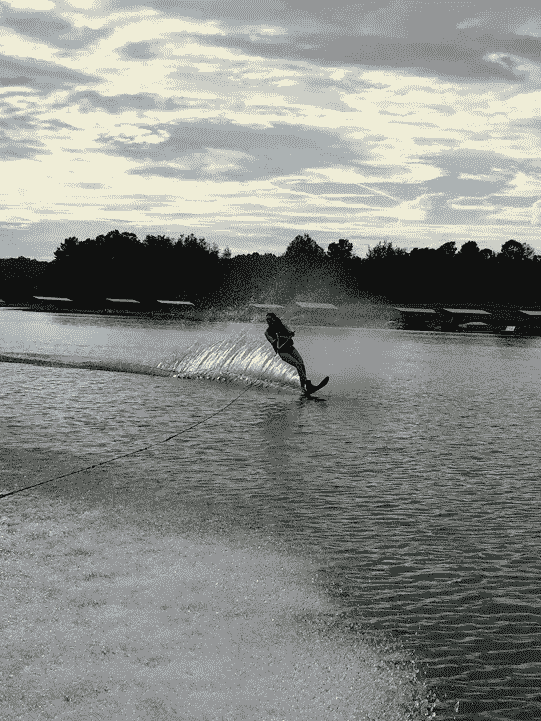
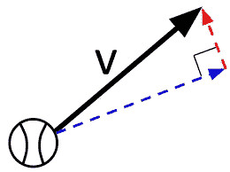
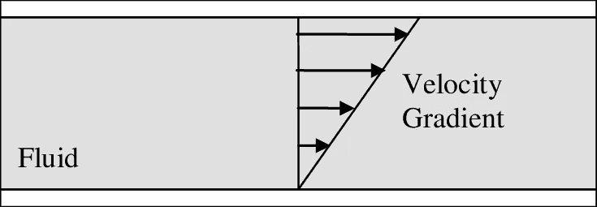
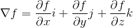
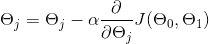
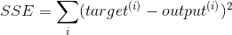
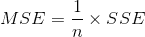
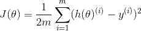
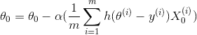
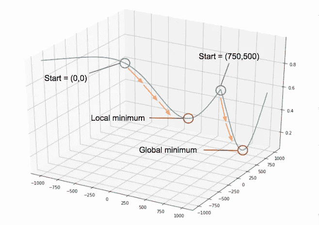

# 代码梯度下降从零开始字节和字节

> 原文：<https://towardsdatascience.com/code-gradient-descent-from-scratch-britts-bytes-e9f4a36a9955?source=collection_archive---------47----------------------->

## *如何用 python 从零开始编程梯度下降？那段时间你在面试中笨手笨脚。*

土壤中的物理和化学梯度很大程度上影响着稻田的生长和小气候

# 动机

这就是了。你已经通过向完全陌生的人发送大约 10 条 LinkedIn 信息，并通过总结你整个成年职业生涯的 30 分钟电话来吸引招聘人员，从而建立了人际关系网。他们给你送来了……敦敦敦……任务。他们说 4 个小时。短短 4 个小时。“4 个小时”，你对自己说“小菜一碟”。这封电子邮件附带了一个指向谷歌说明文档的链接。“就两个提示”你再想想，“完全没问题。打赌我会有时间。”你打开作业。那里。第一张谷歌表单上写着“请最小化这个未知函数”。你的大脑一片黑暗，你在考虑自己是否能通过五年级的数学考试。

# 提示

好吧，让我们重新看看面试官想让你做什么:

**已知:**您从类似 pickle 文件的东西中提取函数，因此您只知道输入(您指定的)和输出(由函数给出的)。

**问题:**通过计算每个给定点的梯度，找出使该函数输出最小的输入。例如，我们将使用 f(x1，x2)=y

# 背景

这是梯度下降。它只是被分解成几个部分。你知道的。你以前学过。有这么多关于梯度下降的文章，我不能证明为什么在这里广泛地写它会有价值。一些很好的资源是这篇[文章](/understanding-the-mathematics-behind-gradient-descent-dde5dc9be06e)用于快速回顾，经典的吴恩达[课程](https://www.coursera.org/lecture/machine-learning/gradient-descent-8SpIM)用于你想知道的一切。现在，我将提醒您完成这项挑战所需的基础知识。

**什么是渐变？**

书中定义:梯度是从一点到另一点的变化幅度和方向。

实际定义:在我转到数据科学之前，我学的是工程学，所以我关于梯度的最好的例子都源于力学和流体动力学。希望这个类比对一个人来说是绝对完美的，对其他人来说是可以忍受的。想象一个湖。通常很平静。

作者照片

好了，现在一艘船正拉着一位非凡的障碍滑雪运动员过来。水仍然有相同的水流吗？

作者照片

水很可能不再以相同的速度和方向流过整个表面，对吗？我们如何在这个湖的不同部分表现水的速度和方向？机械物理学会告诉你用速度矢量。像这样:

图片由可汗学院提供

这代表一种梯度。速度是从一点到另一点的距离(在特定方向上)相对于时间的变化。开始结合这些梯度，我们得到的东西看起来像这样:

大卫·切纳勒通过[研究之门](https://www.researchgate.net/figure/A-schematic-of-sliding-plate-rheometry-The-velocity-gradient-caused-by-the-shear-flow_fig1_2677https://www.researchgate.net/figure/A-schematic-of-sliding-plate-rheometry-The-velocity-gradient-caused-by-the-shear-flow_fig1_26771890818908)拍摄的图片

数学定义:梯度是在你评估的任何一点与曲线相切的直线的斜率。这意味着梯度是代表该点函数的偏导数分量的和。这让我们想到了这样的事情:

**我们在下降什么，为什么？**

在机器学习中，你通常试图找到预测器和一系列特征之间的某种关系。为了收敛，你优化了一个[成本函数](/coding-deep-learning-for-beginners-linear-regression-part-2-cost-function-49545303d29f)，以获得最小的误差。优化的方法是在误差最小的方向上采取步骤，并返回相应的梯度向量。一旦你达到一个阈值最小值，你的梯度向量揭示了优化这个成本函数的系数。

换句话说，也许你以前见过这个:

这是梯度下降方程，假设你有一些已知的成本函数 J(θ)和学习率(α)。例如，线性回归的常见成本函数是误差平方和:

在这个等式中，我们通过目标值(y_pred)和输出值(y_actual)计算平方误差。接下来，我们通过除以我们的观察次数(n)来计算误差平方的平均值。在线性回归的情况下，为了结合我们的两个方程，让我们用平方误差来表示我们的成本函数。

这里我们用 m 而不是 n 来表示这个步骤中的观察次数，我们除以 2 只是为了在计算梯度时更容易微分。h(theta)代表目标(y_pred)，y 代表产出(y_actual)。回到第一个等式，你会得到如下结果:

这里，α代表第一个等式中的学习速率，但是我们已经求解了梯度的偏导数。

让我们回到(成本)函数未知的面试问题。我们没有计算偏导数的奢侈。因此，我们必须使用猜测和检查的方法来寻找最大梯度。我将简单地指定一个步长，而不是计算梯度(如下所示)。我将使用这个步长来检查当前点周围的每个梯度。

这是相当蛮力的，但我会假设你的面试官正在测试你是否能潜入你的算法车辆的引擎盖下，进行一点手动维护。

# 解决方案编码

好吧，让我们开始吧。我做了两个函数来解决这个问题。第一个函数将简单地计算给定 x = (x1，x2)的最大梯度。我假设只有 2 个特征(x1，x2)由提示定义。第二个函数将使用第一个函数，通过遵循第一个函数中的梯度来最小化您的未知(给定)函数 f(x1，x2) = y。从我们的第一个函数开始:

这里发生的是，我抓住了我的给定点(x1，x2)周围的每个点和我的给定点+我实例化的步长(这里是 1)之间的差。然后，我将找到这 4 个差值的最大值，并返回相关的方向(x1+步长，x2+步长)和幅度(差值)。

让我们来看看最小化函数:

这里我使用梯度函数返回的最大值遍历梯度，每次都重新运行循环。一旦我到达一个接近于零的停止差，我就返回该点的坐标(x1，x2)。我还建议将它可视化(如果可能的话),感受一下您的解决方案。我的例子是这样的:

作者图片

如你所见，除了全局最小值之外，还有一个局部最小值。如果我只在(0，0)初始化 minimize()函数，我会陷入局部最小值。我通过在随机不同的起点初始化脚本来避免这个问题，以确保一个真正的最小值。一旦 minimize()函数从~(750，500)开始，我就能找到全局最小值。[动量](/stochastic-gradient-descent-with-momentum-a84097641a5d)是神经网络中的一个流行概念，它无需在随机点进行初始化就能完成这项任务(可以想象，如果有 100 多个特征，这可能会变得很乏味)。这有点超出了这篇文章的范围，但是可以研究一下达到全局最小值的可扩展方法。

# 最后

这个问题的某种形式对于机器学习面试来说是非常典型的。我也认为这是一个有趣的谜题，展示一些基本的 python 印章，因为你不需要任何花哨的包。下面是我用来解决这个问题的一些参考资料，我祝你在未来的面试中好运。愿你优雅地走下阶梯。

# 参考

*   [关于渐变的维基百科](https://en.wikipedia.org/wiki/Gradient)
*   [Python 中的渐变下降](/gradient-descent-in-python-a0d07285742f)
*   [梯度下降数学](/understanding-the-mathematics-behind-gradient-descent-dde5dc9be06e)
*   [梯度下降方程](https://www.geeksforgeeks.org/gradient-descent-in-linear-regression/)

*原载于 2020 年 4 月 1 日 https://brittanybowers.com**的* [*。*](https://brittanybowers.com/code-gradient-descent-from-scratch/)