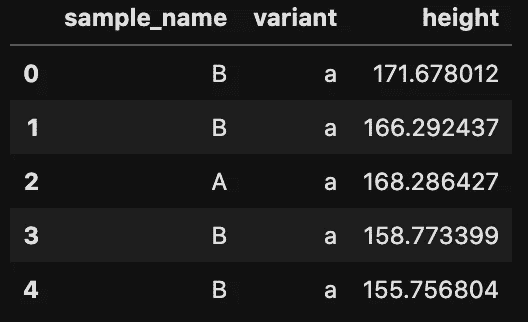

# 在 scikit-learn 中编写自定义输入程序

> 原文：<https://towardsdatascience.com/coding-a-custom-imputer-in-scikit-learn-31bd68e541de?source=collection_archive---------26----------------------->


Gabriel Crismariu 在 [Unsplash](https://unsplash.com/s/photos/puzzle?utm_source=unsplash&utm_medium=referral&utm_content=creditCopyText) 上拍摄的照片

## 了解如何创建自定义估算器，包括用于更高级用例的 groupby 聚合

处理缺失数据是大多数机器学习项目的固有部分。一个典型的方法是使用`scikit-learn`的`SimpleImputer`(或者来自`sklearn.impute`模块的另一个估算器)。然而，通常最简单的方法可能不是最好的，我们可以通过使用更复杂的方法获得一些额外的性能。

这就是为什么在这篇文章中，我想演示如何编写一个自定义的基于`scikit-learn`的估算器。为了使案例更有趣，估算者将根据各组的平均值/中位数来填充缺失值。

# **为什么要把自定义的 imputer 写成类？**

在直接进入编码之前，我想详细说明一下为什么编写一个定制的估算类(从`scikit-learn`继承)值得你花时间的几个潜在原因:

*   它可以帮助你发展编程技能——在编写继承自`scikit-learn`的估算器时，你可以了解一些贡献者已经使用的最佳实践。此外，通过继承，您可以使用一些已经准备好的方法。这样，您的代码将会更好/更干净，并且对于一些不可预见的问题可能会更健壮。
*   您的自定义类可以随着时间的推移进一步开发，并可能与其他用户共享(甚至可能集成到`scikit-learn`！)
*   更实际的是，通过使用`scikit-learn`框架创建估算器，你可以使它们与`scikit-learn`的`Pipelines`兼容，这使得项目的流程更加清晰，更容易复制/生产。另一个实际问题是`fit`和`transform`方法之间的明确区别，因此您不会意外引入**数据泄漏**——包括在确定用于输入的值的过程中的测试数据。

# 实现自定义估算器

在这一节中，我们将使用 Python 实现自定义估算器。

## 设置

首先，我们加载所有需要的库:

为了写这篇文章，我使用了`scikit-learn`版本 0.22.2。

## 生成样本数据

在这篇文章中，我们将使用一个玩具数据集。我们假设收集来自两个不同人群(样本`A`和`B`)的人的身高，因此数据会有一些变化。此外，第一个样品还有一个区别特征，称为`variant`(值为`a`和`b`)。这个命名结构背后是什么并不重要，目标是有两个不同级别的可能聚合。然后，我们根据`sample_name`用不同的比例和位置参数值从正态分布中采样高度(使用`numpy.random.normal`)。

通过使用`sample(frac=1)`，我们基本上重组了`DataFrame`，所以我们的数据集看起来不那么人工。下面你可以看到创建的`DataFrame`的预览。



生成数据的预览

然后，我们使用以下代码用 NaN 值替换 10 个随机高度:

现在，`DataFrame`已准备好插补。

## 对估算器进行编码

是时候对估算器进行编码了。您可以在下面找到该类的定义:

如前所述，通过使用从`sklearn.base`类(`BaseEstimator`，`TransformerMixin`)的继承，我们完成了很多工作，同时自定义的估算器类与`scikit-learn`的`Pipelines`兼容。

那么后台到底发生了什么呢？通过从`BaseEstimator`继承，我们自动得到`get_params`和`set_params`方法(所有的`scikit-learn`估算器都需要这些)。然后，从`TransformerMixin`继承提供了`fit_transform`方法。

> **注意:**还有其他种类的 Mixin 类可供继承。我们是否需要这样做取决于我们想要编码的估计器的类型。例如，`ClassifierMixin`和`RegressorMixin`让我们可以使用`score`方法来评估估计器的性能。

在`__init__`方法中，我们存储了输入参数:

*   `group_cols` —要聚合的列的列表，
*   `target` —插补的目标列(缺失值所在的列)，
*   `metric` —我们希望用于插补的指标，可以是组的平均值或中值。

此外，我们包含了一组断言来确保我们传入了正确的输入。

在`fit`方法中，我们计算`impute_map_`，它是一个`DataFrame`，其聚合指标用于输入。我们还检查用于聚合的列中是否没有缺失值。还有一点非常重要，那就是`fit`方法应该总是返回`self`！

最后，在`transform`方法中，我们用适当的值替换每个组中缺失的值(由`impute_map_`的行指示)。作为额外的预防措施，我们使用`check_is_fitted`来确保在使用`transform`方法之前我们已经拟合了估算对象。在实际转换数据之前，我们使用`copy`方法制作了一个副本，以确保不会修改原始的源数据。关于这个话题的更多信息，你可以参考我之前的一篇[文章](/explaining-the-settingwithcopywarning-in-pandas-ebc19d799d25)。

在`fit`和`transform`方法中，我们还在方法定义中指定了`y=None`，即使`GroupImputer`类不会使用数据集的`y`值(也称为目标，不要与表示插补目标的`target`参数混淆)。包含它的原因是为了确保与其他`scikit-learn`类的兼容性。

是时候看看自定义估算器的运行了！

运行代码会打印出以下内容:

```
df contains 10 missing values.
df_imp contains 0 missing values.
```

与`scikit-learn`中的所有估算器一样，我们首先创建对象的实例并指定参数。然后，我们使用`fit_transform`方法创建新对象，用通过`sample_name`和`variant`计算的平均值替换`height`列中缺失的值。

为了创建`df_imp`，我们实际上需要手动将转换的输出转换为`pd.DataFrame`，因为原始输出是一个`numpy`数组。`scikit-learn`中的所有估算器/变压器都是这种情况。

我们可以看到，估算器按照预期工作，并替换了我们的玩具`DataFrame`中所有缺失的值。

# 结论

在本文中，我展示了如何通过继承`scikit-learn`中的一些基类来快速创建一个自定义估算器。这样，编码更快，我们也确保估算器与整个`scikit-learn`框架兼容。

在进行机器学习项目时，创建自定义估算器/转换器肯定会派上用场。此外，我们总是可以为其他项目重用创建的类，因为我们首先试图使它尽可能灵活。

您可以在我的 [GitHub](https://github.com/erykml/medium_articles/blob/master/Machine%20Learning/custom_imputer.ipynb) 上找到本文使用的代码。一如既往，我们欢迎任何建设性的反馈。你可以在推特上或者评论里联系我。

# 参考

[1][https://github . com/sci kit-learn/sci kit-learn/blob/master/sk learn/impute/_ base . py](https://github.com/scikit-learn/scikit-learn/blob/master/sklearn/impute/_base.py)

[2][https://sci kit-learn . org/stable/modules/generated/sk learn . base . base estimator . html](https://scikit-learn.org/stable/modules/generated/sklearn.base.BaseEstimator.html)

[3][https://sci kit-learn . org/stable/modules/generated/sk learn . base . transformer mixin . html # sk learn . base . transformer mixin](https://scikit-learn.org/stable/modules/generated/sklearn.base.TransformerMixin.html#sklearn.base.TransformerMixin)