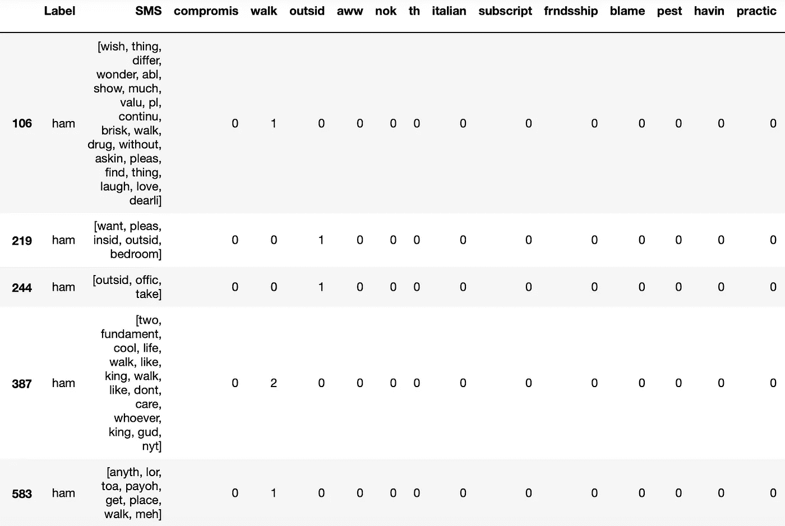

# 为垃圾邮件发送者编写“Kryptonite”📩~朴素贝叶斯过滤器

> 原文：<https://towardsdatascience.com/coding-a-kryptonite-for-spammers-the-naive-bayes-filter-e533e59a681f?source=collection_archive---------36----------------------->

## 如何使用 Python 制作一个过滤垃圾短信的应用程序

*“如果好得难以置信...很可能是诈骗。”罗恩·韦伯*


[cattu](https://pixabay.com/users/cattu-1462001/) 在 [Pixabay](https://pixabay.com/photos/spam-mail-email-mailbox-garbage-964521/) & [USGS](https://unsplash.com/@usgs?utm_source=unsplash&utm_medium=referral&utm_content=creditCopyText) 在 [Unsplash](https://unsplash.com/photos/X9fUNniobXQ) 上的照片

**垃圾邮件**通常定义为电子垃圾内容，来自各种通信渠道，如电子邮件、短信等。最常见的是，它来自于某种产品的广告，通过邮件列表甚至电话号码列表发送。

如今，真正的问题是双重的；垃圾邮件浪费了人们的*时间*，而它也“吞噬”了大量的网络*带宽*。因此，许多组织和个人采取持续和巨大的努力来反击。当然，数据科学也不能置身于战场之外…

这个项目的范围是展示数据科学的工具带如何应对反击垃圾邮件活动，并产生巨大的效果。在这个过程中，我们开发了一个监督 ML(机器学习)的案例研究，其中我们创建了一个**朴素贝叶斯分类**算法，该算法将消息(短信、电子邮件等)作为输入，检测并过滤掉垃圾邮件。

# 概念

这篇文章是上一篇文章的前传，在上一篇文章中，我们设法使用 Python 开发并改进了一个 [Spotify 播放列表(而且仅仅是！).为了更好地回忆这一概念，当时“数据公司”为其年轻客户举办了一场派对(*因此播放列表*)，以奖励他们在青年营销领域的销售额大幅上升。但是，这家公司是如何赢得这样一座奖杯的——这是它为了在如此苛刻的市场中茁壮成长而取得的成就？请想象以下场景…](/can-a-data-scientist-replace-a-dj-spotify-manipulation-with-python-fbbd4a45ffd5)

> Data Corp 董事会决定在“沟通”类别下推出一款新的手机应用，以提高年轻人市场的销量。为了击败竞争对手，一个潜在的竞争优势被仔细审查——**反垃圾邮件**。特别是，我所属的数据科学部门负责与工程团队联系，并为他们提供一种算法，该算法将用户的短信作为输入，并自动过滤掉垃圾短信。这种算法将被应用到新的应用程序中，并且应该达到至少 90%的准确率(竞争对手达到的标准)。

为了更好地交流结果，提出了一些假设:

#1:遵守 GDPR 义务，公司不利用任何客户的信息。相反，它只处理公共可用的数据集，特别是上传到 UCI 机器学习库[的垃圾短信收集。](https://archive.ics.uci.edu/ml/datasets/sms+spam+collection)

#2:我们将分析算法的“核心”,即过滤垃圾内容的机制。【*app 开发属于工程团队*】。

# 作案手法

为了完成我们的使命，必须遵循以下路线图:

1.  简要说明需要的**理论**，以便必要的方程表达和编码。
2.  **设置**执行代码所需的环境。
3.  探索并准备**数据集**。
4.  使用熊猫、Numpy、NLTK &和一些额外的 Python 库来开发**算法**。
5.  执行算法**分类**新消息并测量其**准确度**。

# 1.理论

朴素贝叶斯算法有几个变体，根据所做的数学和假设，我们区分以下 3 个最流行的版本:

*   多项式朴素贝叶斯
*   高斯朴素贝叶斯
*   伯努利朴素贝叶斯

这次我们将讨论**多项式**算法。计算机学习人类如何将消息分类为垃圾邮件/非垃圾邮件(从现在开始称为“ham”)，然后使用该知识来估计新(传入)消息的概率，并相应地对它们进行分类。

简而言之，当由`w1, w2, …, wn`个单词组成的新消息进来时，朴素贝叶斯算法试图通过利用集合#2 来估计和比较集合#1 的等式:


方程组#1


方程组#2


参数和变量的解释

如果`P(Spam|w1,w2,…wn)` > `P(Spam*c*|w1,w2,…wn)`，该算法将该消息分类为垃圾邮件，反之亦然。要彻底研究以上方程式，你可以参考这个[来源](https://scikit-learn.org/stable/modules/naive_bayes.html)。

⚠️限制:

#1:每个消息中的单词是有条件独立的，尽管它们经常处于依赖关系中。

#2:每当我们处理不属于词汇表的单词时(参见“特征提取”部分)，我们在计算概率时会忽略它们。

#3:如果单词(即“money”)只出现在一个类别(即垃圾邮件)中，那么补码概率 P(垃圾邮件*c*|“money”)总是 0。为了避免这种影响，我们应用了一种称为*加法平滑*的技术，通过增加一个平滑参数α。我们将使用拉普拉斯平滑，通过设置 a=1(在这里阅读更多)。

# 2.建立

为了开发和运行该算法，以下组件/库是必不可少的:

*   安装[Jupyter](https://jupyter.org/index.html)Notebook——一个开源网络应用程序，用于创建/共享包含实时代码、公式、可视化和叙述性文本的文档。你可以在这里按照步骤[进行](https://jupyter.org/install.html)。
*   安装[NLTK](https://www.nltk.org)——一个 Python 库，它提供了预处理和清理原始数据的有效模块(删除标点符号、标记等)。您可以使用 CLI(命令行界面)或 Jupyter 笔记本来运行以下命令:

install.py

*   下载[停用词](https://en.wikipedia.org/wiki/Stop_words)——一组常用词(“the”、“a”、“an”等)，它们在句子中频繁出现，但分量不大。
*   下载[Punkt](https://www.nltk.org/_modules/nltk/tokenize/punkt.html)——一个句子分词器，它将文本分成一系列句子。
*   下载[WordNet](https://wordnet.princeton.edu/download)——一个大型的英语词汇数据库，其结构使其成为计算语言学和 NLP(自然语言处理)的有用工具。

下载. py

*   导入必要的库:

import.py

# 3.数据集探索和分割

完整的数据集包括 5.572 条 SMS 消息(*已经被人类分类*)，这些消息分布在垃圾邮件和垃圾邮件类别中，分别占大约 87%和 13%。描绘它的[词云](https://github.com/amueller/word_cloud)，我们可以得到主导词的另一种反映:


原始数据集 Wordcloud

我们将其随机化，以便保留原始的垃圾邮件/火腿比例，然后将其分成两个子集，选择 80% — 20%的分割比例:

*   `training_set`:用于“训练”计算机如何对信息进行分类
*   `test_set`:用于最终测试垃圾邮件过滤器的好坏(准确性)

dataset_division.py


数据集的垃圾邮件分布

显然，最初的垃圾邮件/火腿比例被有效地保留了下来。

# 4.算法开发

在 NLP 中，我们的目标是教会计算机根据上下文理解和操作人类语言，尽管它们只处理数字形式的数据。因为，我们将首先应用一些**预处理**技术，以便数据集留下具有高有意义权重的伪影。然后，我们将把数据集的消息编码成数字向量(**特征提取**)【1】。为了更好地了解整个过程，您可以参考以下流程图:


算法流程图

## 文本预处理

一般来说，根据参考文献[2]，我们区分文本预处理的 3 个主要组成部分:规范化、标记化和替换。

**(a)正常化**

首先，文本需要规范化。这意味着采取一系列的行动，将文本中的单词放在同一个“基线”上，从而形成一个更加统一的过程。这一步包括删除标点符号，将单词转换成相同的大小写(大写/小写)等等。在我们的框架中，我们将通过 3 个不同的步骤来实现这一目标:

**1。引理化**:根据记号的引理获取其标准形式的过程，即*更好* → *好*。与词干提取相比，它更加复杂，通过考虑单词在句子中使用的上下文，它返回更有意义的单词。我们将利用 WordNet 的英语词汇数据库，它给出了显著的结果。

词条化. py

**2。词干化**:通过消除任何词缀(通常是带后缀的&前缀)，将“屈折”的单词减少到其词根(词干)的过程。比如*词干，词干→词干*。这样，我们只保留了相似单词的语义，同时也实现了标记(单词)数量的总体减少。后者确保减少词汇量，因此占用更少的计算资源。有几种词干模型，我们将使用波特模型。

词干. py

**3。自定义操作**:根据具体情况，为进一步清理文本数据而采取的一组操作。对于这一条短信，我们去掉了地址、数字和符号($)，去掉了标点(？！等等)，折叠空白并将所有标记转换为小写。此外，我们删除了在句子中频繁出现的、对整体意思没有显著贡献的停用词(如 the、for、is 等)。

custom_normalization.py

**(b)标记化**

将一长串文本分割成小块(段落分割成句子，句子分割成单词)的过程。即文本中使用的标记列表，也被称为*语料库*。幸运的是，Python 有一个名为 NLTK(自然语言工具包)的包，其中包含大量有用的操作文本的函数。我们将使用 nltk.word_tokenize。

tokenization.py

**(c)噪声去除**

这是一个更加针对特定任务的步骤，因为它细化了非常特殊的数据集。例如，被网络丢弃的文本，应该被 HTML、XML 和标记“脚印”清理掉。在我们的例子中，我们处理纯短信文本，最终跳过这一部分。

为了更好地感受上述技术的效果，让我们将它们全部应用于一个特定的 SMS，并获得最终结果:

```
# Original Message
I would but I’m still cozy. And exhausted from last night.nobody went to school or work. Everything is closed.# Normalization
would still cozy exhausted last went school work everything closed# Lemmatization
would still cozy exhaust last go school work everything close# Stemming
would still cozi exhaust last go school work everyth close# Tokenization
[would, still, cozi, exhaust, last, go, school, work, everyth, close]
```

⚠️:在每一个单独的案例中，应检查实施一种或多种上述技术[停用词、词干等]之间的权衡。例如，我们可能会跳过词汇化而支持词干化。

## **特征提取**

ML 算法不理解纯文本形式的文本，但是期望输入是数字形式的。因此，有必要将我们的最终记号编码成数字——也就是特征向量——这个过程被称为**矢量化**【3】。在可用的类型中，我们选择使用*计数矢量化*。这个函数创建了一个矩阵，其中包含每个数据集行(SMS)中每个惟一令牌的计数。

矢量化. py



`final_training_set`样品

提到普通的文学作品，你可能会想到 BoW 这个词。也就是说，本质上，在分类方法中通常使用的模型，其中每个标记的出现频率被用作训练分类器的特征[4]。

## 常数和参数计算

首先，我们为每个新消息(红色标记)计算方程组中具有常数值的`P(Spam)`、`P(Spam*c*)`、`NSpam`和`NVocabulary`:


从方程组#1 计算的常数


从方程组#2 计算的常数和参数

calc_constant.py

接下来，我们计算`P(wi|Spam)`和`P(wi|Spam*c*)`值(蓝色标记)。注意，由于它们依赖于不变的`training_set`，它们也保持不变。

calc_params.py

## 传入消息分类

计算完所有的参数和常数后，我们就可以创建垃圾邮件过滤器了。它可以很容易地被理解为一个函数，它接收一个新消息`(w1, w2, …, wn)`，计算`P(Spam|w1, w2, …, wn)`和`P(Spam*c*|w1, w2, …, wn)`，比较它们并且:

*   如果`P(Spam*c*|w1, w2, …, wn)` > `P(Spam|w1, w2, …, wn)`，则将消息分类为 ham
*   如果`P(Spam*c*|w1, w2, …, wn)` < `P(Spam|w1, w2, …, wn)`，则将该邮件归类为垃圾邮件
*   如果`P(Spam*c*|w1, w2, …, wn)` = `P(Spam|w1, w2, …, wn)`，请求人工帮助

classify_message.py

现在最令人愉快的部分来了；使用新的 SMS 文本测试算法，这些文本还没有在培训部分使用过。第一个来自广告内容，第二个来自私人谈话。

classify_spam_sms.py

```
# Output
P(Spam|message): 3.2268434039363386e-33
P(Ham|message): 3.3664743866615654e-34
Label: Spam
```

classify_ham_sms.py

```
# Output
P(Spam|message): 1.5519061681677179e-27
P(Ham|message): 7.759653287935314e-23
Label: Ham
```

幸运的是，两者都被成功标记！

# 5.算法实现和精度测量

最后，我们尝试通过对`test_set`的 1.114 条消息进行分类来确定过滤器的性能。该功能应用于每个新的 SMS，并将其标签注册到新列`sms_predicted`。

分类测试设置

```
Results 
-------
Valid: 1087
Invalid: 27
Accuracy: 0.9758
```

我们的垃圾邮件过滤器检查了 1.114 条未知消息(*在培训中未看到*)，并成功对 1.087 条进行了正确分类。几乎 97.6%的测量精度高于公司的目标(90%)，因此，我们的模型将被部署到生产中！

# 结论

沟通渠道不断受到欺诈机制的攻击，这些机制往往会从个人和组织那里“窃取”时间和金钱。也就是说，数据科学能够提供有价值的解决方案。早在 2015 年，谷歌就已经在阻止垃圾邮件到达收件箱方面达到了 99.9%的准确率[4]。最重要的是，通过使用它的“神经网络”[5]，它全速前进以消除剩下的 0.1%的误差！

然而，数据科学的卖点依赖于其提供有价值的解决方案的能力，即使是在业余用户的初级水平上。本文开发了这样一个初步的案例研究，并通过训练一个****分类模型**进行求解，最终达到了 97%的显著准确率。总而言之:**

****(a)** 我们处理了一组信息，并通过应用:**

**✔️ **文本** **预处理**【规范化、标记化】**

**✔️ **特征提取**【矢量化】**

**我们设法将它们转换成编码向量——对机器来说是小菜一碟，可以理解并从中推断出有意义的价值。**

****(b)** 我们**根据贝叶斯定理，通过计算各自的概率来训练**我们的模型。**

****(c)** 最后，通过在`test_set`上应用该算法，我们**评估了**该模型有效标记新消息的能力。**

**最终，尽管我们承认垃圾邮件结构的存在和活动以我们的时间和金钱为代价，但我们应该永远记住，数据科学已经对人类有利…**

****

**由 [Arian Darvishi](https://unsplash.com/@arianismmm?utm_source=unsplash&utm_medium=referral&utm_content=creditCopyText) 在 [Unsplash](https://unsplash.com/photos/wh-RPfR_3_M) 上拍摄的照片**

**此外，正如 Mokokoma Mokhonoana 恰当地引用的那样:**

**垃圾邮件浪费了接收者的时间，也浪费了发送者的乐观。”**

**感谢您的阅读！Jupyter [笔记本](https://github.com/makispl/SMS-Spam-Filter-Naive-Bayes.git)准备立即运行。如果有任何问题，请在下面留言。祝你度过愉快的一周，呆在家里，保持乐观，保证自己和你的`inbox`的安全！**

****参考文献****

**[1] H. Red，[使用自然语言处理构建短信垃圾邮件过滤器](https://inmachineswetrust.com/posts/sms-spam-filter/) (2017)，博客“在我们信任的机器中”**

**[2] M. Mayo，[文本数据预处理的一般方法](https://www.kdnuggets.com/2017/12/general-approach-preprocessing-text-data.html) (2017)，KDnuggets**

**[3] N. Kumar，NLP 中原始数据的预处理:标记化、词干化、词条化和矢量化(2019)，在线出版物“专业人士观点”**

**[4] G. Starr，[谷歌用人工智能对抗垃圾邮件](https://www.csmonitor.com/Technology/2015/0713/Google-fights-spam-with-artificial-intelligence) (2015)，独立国际新闻机构《基督教科学箴言报》**

**[5] A. Mordvintsev，C. Olah，M. Tyka，[概念主义:深入神经网络](http://ai.googleblog.com/2015/06/inceptionism-going-deeper-into-neural.html) (2015)，谷歌人工智能博客**