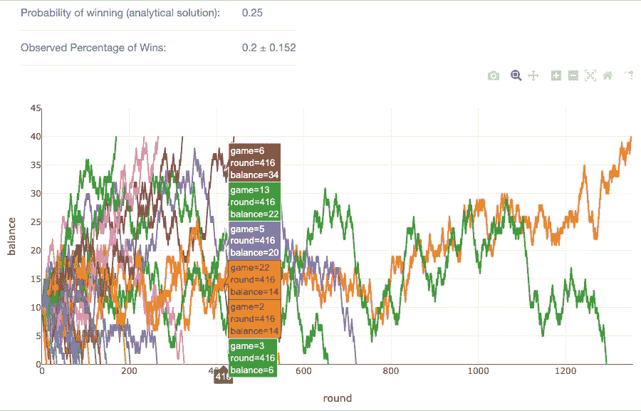

# 编写一个 Web 应用程序来模拟赌徒的破产问题

> 原文：<https://towardsdatascience.com/coding-a-web-app-to-simulate-the-gamblers-ruin-problem-1bc82660a878?source=collection_archive---------37----------------------->

## 如何使用 Plotly Dash 和 Heroku 编写和部署 Python Web 应用程序

我发现模拟是理解数学概念的一种有用的方式，所以我最近编写了一个程序来说明赌徒的破产问题。我做了一个 [web app](http://gamblers-ruin.herokuapp.com/) ，用 Python 模拟了一系列游戏及其结局。在这个 web app 中，用户定义一组参数(每轮成功的概率( *p)、*初始金额 *(i)、*目标金额( *N)* 和游戏数)，它将返回每场游戏的获胜概率以及每轮结束时的余额，如下所示。



p=0.5，i=10，N=50，n_games=30 的模拟结果

在本文中，我将介绍如何编写一个赌徒破产模拟 web 应用程序，分为 3 个步骤:I)用 Python 编写模拟程序，II)使用 Plotly Dash 可视化结果，III)在 Heroku 上部署 web 应用程序。

## 浅谈赌徒的破产问题

赌徒的破产是一个著名的统计概念，在现代金融中有实际应用，如股票期权和保险费的定价。其概念如下:

你带着最初的$ I，走进赌场，希望将你的财富增加到$ N。你选择一个赌博游戏，其中你每一轮的成功概率是 *p* ，我们假设每一轮都是独立同分布的。如果这一轮你成功了，一个单位会加到你的余额中。如果你输了那一轮，你的平衡中会减少一个单位。当您的余额为 0 美元或达到$N 美元时，游戏结束。您赢得/达到$N 美元目标的概率是多少？

## I)用 Python 编写模拟代码

我写了一个`GamblersRuin`类用于模拟目的。初始化对象时，以概率 *p、*初始量 *i* 和 *g* oal 量 *N* 为自变量。

初始化该类后，您可以调用`n_simulations`函数，在这里您可以指定模拟游戏的数量，如果没有，它将默认为 100。这个函数本质上是一个 for 循环，它玩预定义数量的游戏并调用`gamble`函数。它返回一个数据帧，显示每局游戏的每轮余额，稍后用于绘制结果。

至于上面提到的`gamble`函数，如果余额在 0 到 *N 之间，它会生成一个 0 到 1 之间的随机浮点数*如果这个随机数小于概率 *p* ，那么你的余额就会增加一个单位，否则你的余额就会减去一个单位。该函数返回一个数据帧，其中包含生成的随机浮点和每轮的余额。

## II)用虚线显示结果

在用 Python 编写了赌徒的破产类方法后，我们现在可以调用它并使用 Plotly Dash 可视化结果。这可以分为三个部分:a)启动 Dash 应用程序，b)设置应用程序的布局，c)指定回调函数，也就是要显示的输入和信息。

**II.a .)启动 Dash app**

Plotly Dash 应用程序使用 Flask 作为 web 框架。虽然您可以将自己的 flask 应用程序实例传递到 Dash 中，但我保持它的简单性，用`app.server`调用底层 Flask 应用程序。

```
external_stylesheets = ['https://codepen.io/chriddyp/pen/bWLwgP.css'] app = dash.Dash(__name__, external_stylesheets=external_stylesheets) server = app.server
```

**III.b .)设置布局**

为了编写 Dash 应用程序的布局，我使用了`dash-html-components`库，该库将 web 框架抽象为 Python 代码。这些组件在幕后被转换为 web 应用程序的 HTML，您也可以向类似`style`的 Python Dash 类添加 HTML 元素来定制您的布局。

除了使用`dash-html-components`定制我的应用布局，使用`dash-core-components (dcc)`库添加不同的组件也很容易。我使用`dcc.Markdown`格式化文本，`dcc.Input`将用户指定的输入作为我的`GamblersRuin`类的参数，使用`dcc.Graph`显示结果。

**III.c .)回调函数**

最后一步，我根据用户提交的输入指定了必要的回调。我还编写了`update_graph`函数来更新获胜计算的概率和要显示的图形，一个 Plotly 线图。

您现在可以在本地机器上测试 Dash 应用程序了！如果您运行 app.py 文件，Dash 应用程序现在应该在您的本地主机上运行。最后一步是将应用程序部署到服务器。

## IV)在 Heroku 上部署应用程序

使用 Heroku 的部署过程相对容易。查看这本[指南](https://devcenter.heroku.com/articles/getting-started-with-python)部署到 Heroku。

*   首先，你需要创建一个 [Heroku 账户](https://signup.heroku.com/dc)。
*   用运行 Dash 应用程序和 python 文件的包定义一个`requirements.txt`文件。
*   定义一个`Procfile`(repo 根目录下的文本文件)来指定启动应用程序的命令。

```
web: gunicorn app:server
```

*   指定要部署的 github repo 和分支。您可以使用 heroku CLI 或他们的 web 界面来实现这一点。
*   部署！

## 五)总结

在本教程中，我介绍了如何编码、可视化和部署一个赌徒破产模拟 web 应用程序。以下是这些步骤的简要总结:

1.  将 Python 中的模拟编码为一个类方法，该方法将 *p，I，N* 作为参数，并具有运行预定义数量的模拟的函数。
2.  使用 Plotly Dash 可视化模拟的结果和结局。
3.  在 Heroku 上部署 Dash 应用程序。

这个网络应用程序从开始到结束花了我大约 5 个小时。我希望这篇文章已经激发了你去思考你可以编码的模拟，请随时在下面评论你的想法！

## 参考

*   [赌徒的毁灭冲刺 App](http://gamblers-ruin.herokuapp.com/)
*   [Github 回购](https://github.com/claudian37/Gamblers_Ruin_Webapp)
*   [使用 Python 在 Heroku 上部署](https://devcenter.heroku.com/articles/getting-started-with-python)
*   [赌徒的破产问题](http://www.columbia.edu/~ks20/stochastic-I/stochastic-I-GRP.pdf)(卡尔·西格曼的笔记)