# 使用 MySQL 编码和实现关系数据库

> 原文：<https://towardsdatascience.com/coding-and-implementing-a-relational-database-using-mysql-d9bc69be90f5?source=collection_archive---------3----------------------->

## Craig Dickson 的 SQL 教程

## 学习使用 SQL 和免费开源软件创建、更新和查询您自己的全功能关系数据库——第 2 部分

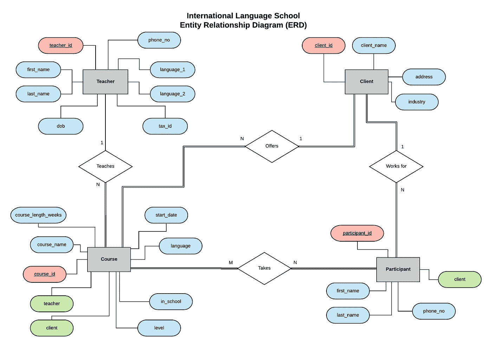

国际语言学校数据库的实体关系图(ERD)

这是一个由 3 部分组成的系列文章的第 2 部分，从零开始，带您了解设计、编码、实现和查询关系数据库的过程。参见第一部分( [*设计关系数据库并创建实体关系图*](https://medium.com/@thecraigdickson/designing-a-relational-database-and-creating-an-entity-relationship-diagram-89c1c19320b2) *)* [*此处*](https://medium.com/@thecraigdickson/designing-a-relational-database-and-creating-an-entity-relationship-diagram-89c1c19320b2) *，以及第三部分(*[*MySQL 中的数据分析—关系数据库中的运算符、联接及更多*](https://medium.com/@thecraigdickson/querying-a-relational-database-joins-unions-and-more-26c0a968e61e) *)* [*此处*](https://medium.com/@thecraigdickson/querying-a-relational-database-joins-unions-and-more-26c0a968e61e) *。*

*本教程的所有代码和信息都可以在相关的* [*GitHub 资源库*](https://github.com/thecraigd/SQL_School_Tutorial) *中找到。我使用了*[*lucid chart*](https://www.lucidchart.com/pages/)*来制作文章中显示的图表。*

在本系列的第 1 部分中，我们介绍了从数据库的概念到制定计划，最后创建一个实体关系图，列出我们需要使用 SQL 代码建模的关系。我们讲述了关系数据库理论的基础，讨论了主键、外键、基数和许多其他真正有用的材料。

在开始这篇文章之前，[阅读那篇](https://medium.com/@thecraigdickson/designing-a-relational-database-and-creating-an-entity-relationship-diagram-89c1c19320b2)是个好主意，但是如果你喜欢直接进入代码，你也可以阅读这篇文章。

# 构建数据库

好吧！现在我们要开始真正有趣的东西了，实际上是使用 SQL 创建和填充我们的数据库。

## 正在设置

在我们深入研究这个之前，我们需要在我们的系统上安装 [MySQL 社区服务器](https://dev.mysql.com/downloads/mysql/)，如果它还没有安装的话。安装比安装典型的应用程序稍微复杂一点(至少在 Windows 上是这样！)，但是我们可以处理。

首先进入[下载页面](https://dev.mysql.com/downloads/mysql/)，获取您系统的安装程序。如果你使用的是 Windows，[这个指南](https://www.youtube.com/watch?v=2HQC94la6go)将帮助你进行设置。这里也有针对 [Mac](https://www.youtube.com/watch?v=5BQ5GvjiAR4) 和 [Linux](https://www.youtube.com/watch?v=0o0tSaVQfV4) 用户的指南(尽管可能会因 Linux 发行版而异)。完整的演练超出了本文的范围，但是您可以这样做。我相信你！

一旦你设置好了，我们就可以在 MySQL 命令行客户端中做接下来的所有事情。

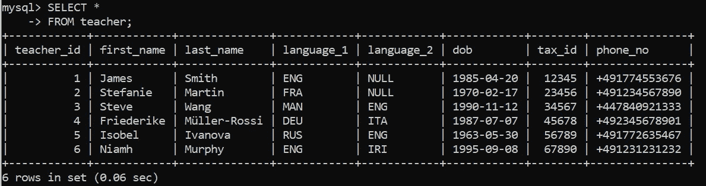

老派。强大。

命令行客户端非常强大，是学习的基础。然而，有时使用 GUI 客户端让我们的生活变得更简单也是件好事。

PopSQL 是 SQL 的一个很好的 [GUI](https://en.wikipedia.org/wiki/Graphical_user_interface) 应用程序，它使事情看起来更好，并且提供了非常有用的功能，比如在左侧导航窗口中查看数据库模式的能力，以及一些基本的数据可视化和方便的导出功能。

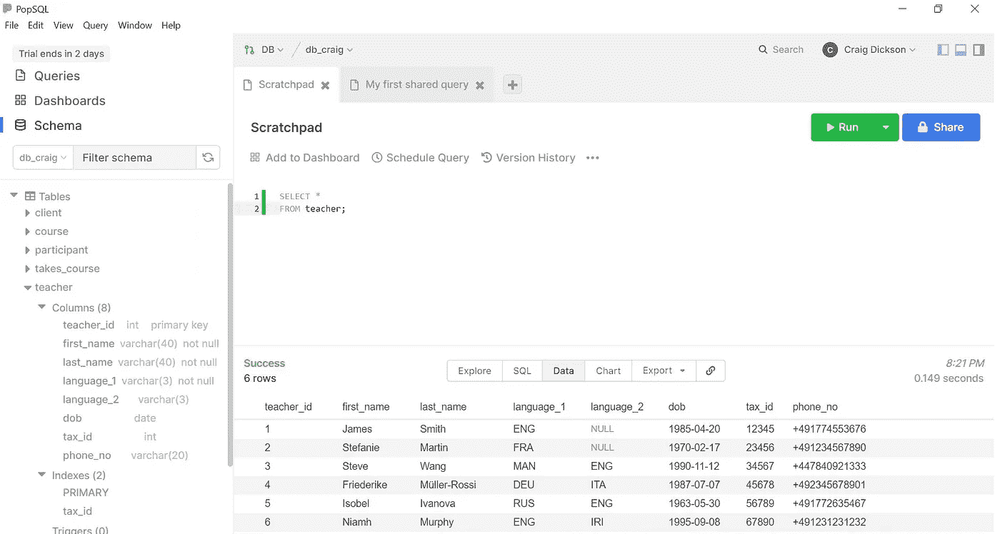

PopSQL 接口

对于专业用途是收费的，但也有一个免费层，对于学习和使用 SQL 肯定是足够的。还有许多[和其他](https://dbeaver.io/) GUI 选项，所以如果一个替代选项听起来很吸引人，就让他们试一试。然而，在本文的其余部分，我们将使用 PopSQL，所以截屏将来自这里。

要回答关于我们在这里使用的 SQL 语句的任何进一步的问题，最好的步骤是看一下 [MySQL 文档](https://dev.mysql.com/doc/)。这是由开发人员制作的官方资源，包含详细而全面的信息。虽然一开始看起来有点吓人，但是阅读文档是一个很好的习惯。只需搜索感兴趣的陈述或主题，看看会出现什么。就像所有与代码相关的事情一样，[谷歌(或者你选择的搜索引擎)是你的朋友](https://medium.com/better-programming/if-you-want-to-be-a-senior-developer-stop-focusing-on-syntax-d77b081cb10b)！

## 最后，一些代码！

设置好环境后，我们需要在 MySQL 服务器上创建一个数据库。这并不太复杂，我们只需使用 [CREATE DATABASE](https://dev.mysql.com/doc/refman/8.0/en/create-database.html) 语句即可。请注意，所有 SQL 语句都以分号“；”结束。这让客户端知道这是我们语句的结尾，这在编写更长更复杂的语句时特别有用，比如[嵌套查询、](https://www.w3resource.com/sql/subqueries/nested-subqueries.php)，但对于所有语句都是必不可少的(除了 USE 命令，我们接下来将看到它)。

```
CREATE DATABASE school;
```

不错！我们刚刚创建了一个名为`school`的数据库。难以置信的工作。

下次我们登录 MySQL 命令行客户端时，我们将需要输入我们的密码，然后选择我们想要使用的数据库。为此，我们使用[使用](https://dev.mysql.com/doc/refman/8.0/en/database-use.html)命令:

```
USE school
```


成功！

就这么简单。如果我们使用 GUI 软件，我们通常不必每次都执行这一步。

注意，按照惯例，我们将[关键字](https://dev.mysql.com/doc/refman/8.0/en/keywords.html)(如[选择](https://dev.mysql.com/doc/refman/8.0/en/select.html)，[删除](https://dev.mysql.com/doc/refman/8.0/en/delete.html)并创建数据库)放在大写字母中，其余代码放在小写字母中。SQL 实际上是不区分大小写的，所以代码完全以小写或大写形式运行(如果你真的需要，可以用[模仿海绵宝宝](https://knowyourmeme.com/memes/mocking-spongebob) meme 风格)。这个约定是为以后阅读您的代码的人准备的，强烈建议在编写任何风格的 SQL 时遵循这个惯例。

## 数据类型

我们已经完成了创建 ERD 和定义实体(将在数据库中以表的形式创建)及其关系的工作，这将极大地简化数据库的构建。在用 SQL 创建表之前，我们需要做的最后一步是计划每个属性需要的数据类型。这必须在创建表时声明，所以我们在采取这一步骤之前需要考虑一下。

MySQL 支持广泛的[数据类型，](https://dev.mysql.com/doc/refman/8.0/en/data-types.html)从简单的[整数](https://dev.mysql.com/doc/refman/8.0/en/integer-types.html)和[字符串](https://dev.mysql.com/doc/refman/8.0/en/string-types.html)到[blob](https://dev.mysql.com/doc/refman/8.0/en/blob.html)和[JSON](https://dev.mysql.com/doc/refman/8.0/en/json.html)。我们将在数据库中使用其中的一小部分。

我们将使用以下代码:

*   [INT](https://dev.mysql.com/doc/refman/8.0/en/integer-types.html) —这是一个整数，一个整数。我们主要将它用于我们的 ID 字段(这将是我们的主键)。
*   [VARCHAR](https://dev.mysql.com/doc/refman/8.0/en/char.html) —这是一个长度可变的字符串字段，我们将使用它来存储文本。我们需要告诉 RDBMS VARCHAR 有多长，因此我们可以定义 VARCHAR(20)或 VARCHAR(60)，前者最多存储 20 个字符，后者最多存储 60 个字符。更大的字符串允许我们存储更多的数据，但会占用更多的内存。
*   [日期](https://dev.mysql.com/doc/refman/8.0/en/datetime.html) —这是一个日期字段，以 YYYY-MM-DD 格式存储。
*   [BOOLEAN](https://dev.mysql.com/doc/refman/8.0/en/boolean-literals.html) —从技术上来说，MySQL 不存储布尔值(真/假)，但它允许使用它所谓的“ [boolean literals](https://dev.mysql.com/doc/refman/8.0/en/boolean-literals.html) ”来存储它们，对于真，它评估为 1，对于假，评估为 0。

## 定义表格

记住这一点，我们可以开始为我们的表定义适当的数据类型。

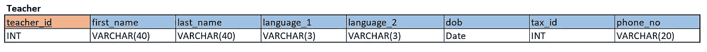

教师表的类型定义

这里我们已经定义了我们的 teacher_id 为 INT，first_name 和 last_name 为 VARCHAR(40)，language_1 和 language_2 为 VARCHAR(3)，dob 为 DATE，tax_id 为 INT，phone_no 为 VARCHAR(20)。完全可以选择不同的值，甚至不同的数据类型(也许您所在国家的 tax_id 包含文本字符？那么一个 INT 就不适合你)，这都是数据库设计艺术的一部分。

为了在我们的数据库中创建这个表，我们将使用下面的代码:

```
CREATE TABLE teacher (
  teacher_id INT PRIMARY KEY,
  first_name VARCHAR(40) NOT NULL,
  last_name VARCHAR(40) NOT NULL,
  language_1 VARCHAR(3) NOT NULL,
  language_2 VARCHAR(3),
  dob DATE,
  tax_id INT UNIQUE,
  phone_no VARCHAR(20)
  );
```

我们在这里使用的 SQL 语句就是 [CREATE TABLE](https://dev.mysql.com/doc/refman/8.0/en/create-table.html) 。接下来是我们要给表起的名字，然后是括号、属性名和相关的数据类型。

## 限制

我们还向表中的一些属性添加了一些[约束](https://www.w3schools.com/sql/sql_constraints.asp)。约束指定了表中数据的规则，并将约束 RDBMS 允许我们对该特定属性做什么。

我们已经将 [NOT NULL](https://www.w3schools.com/sql/sql_notnull.asp) 添加到 first_name、last_name 和 language_1 中，这意味着该表不接受其中任何属性设置为 NULL 的记录。这些属性要求每个记录都有一个非空值。这是有道理的，因为我们的老师会要求一个名字和一个姓氏，并且在语言学校教学，他们需要能够提供至少一种语言。

我们还将 tax_id 设置为唯一的。这意味着每个记录的这个属性必须有不同的值，这对于一个税号是有意义的，但是对于我们的 language_1 字段就没有意义了，例如，我们可能有多个教师提供相同的语言！

我们还将 teacher_id 字段设置为主键。实际上，这只是 NOT NULL 和 UNIQUE 的组合，但是为每个表定义一个主键(也可以是单个属性或不同属性的组合)是很重要的。

如果我们现在尝试使用一个`SELECT * FROM *table*`语句来查看我们的表中有什么数据(我们将在[第 3 部分](https://medium.com/@thecraigdickson/data-analysis-in-mysql-operators-joins-and-more-in-relational-databases-26c0a968e61e)中更详细地查看这个语句)，我们应该收到“空集”作为我们的响应(在 MySQL 命令行客户端中)或“没有找到结果”(在 PopSQL 中)。这表明我们的表存在(否则我们会收到一个错误)，但仍然是空的。正如我们所料！

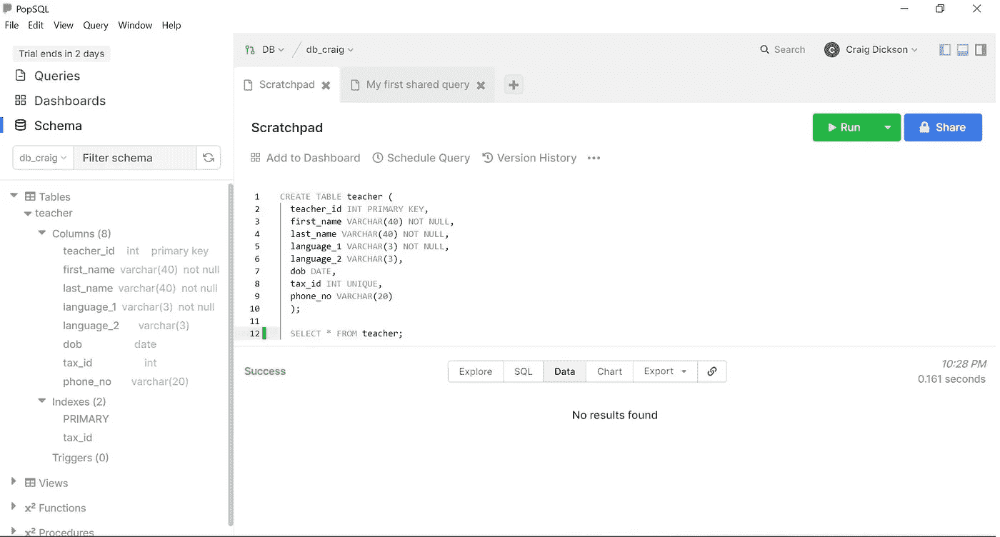

请注意左侧导航栏中关于该表的详细信息

## 删除表格

现在我们已经创建了我们的第一个表，让我们删除它！

对破坏的热情也是一种创造性的热情。理解在 MySQL 中删除某个东西是多么容易的一个好方法(以及为什么我过去如此担心会不小心这样做),就是继续去做。这也是克服这些顾虑的最佳方式，因为事实上这是相对难以做到的。

相关的 SQL 语句是 [DROP TABLE](https://dev.mysql.com/doc/refman/8.0/en/drop-table.html) 。

```
DROP TABLE teacher;
```

去吧，做吧！是解放！

请注意，没有有用的“您确定要这样做吗？”弹出的对话框。也没有撤销按钮，只有一个简单的“查询成功”或“成功”消息，表就不见了。当表包含数据时也是如此。所以 SQL 是一种非常强大的语言，但它也是不可原谅的。当你删除或更新表格时，确保你已经考虑清楚你在做什么！

在进入下一部分之前，不要忘记恢复教师表。

## 创建剩余的表

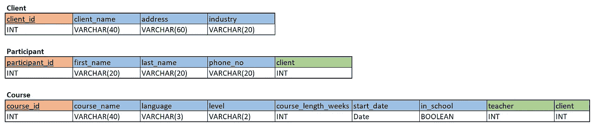

我们剩下的三个实体剩下的三个表

这里我们再次使用相同的数据类型，唯一的新数据类型是 in_school 的 BOOLEAN。如果课程在国际语言学校进行，则为真，如果在其他地方进行，即在客户的办公室进行，则为假。

创建这些表的代码如下:

```
CREATE TABLE client (
  client_id INT PRIMARY KEY,
  client_name VARCHAR(40) NOT NULL,
  address VARCHAR(60) NOT NULL,
  industry VARCHAR(20)
);CREATE TABLE participant (
  participant_id INT PRIMARY KEY,
  first_name VARCHAR(40) NOT NULL,
  last_name VARCHAR(40) NOT NULL,
  phone_no VARCHAR(20),
  client INT
);CREATE TABLE course (
  course_id INT PRIMARY KEY,
  course_name VARCHAR(40) NOT NULL,
  language VARCHAR(3) NOT NULL,
  level VARCHAR(2),
  course_length_weeks INT,
  start_date DATE,
  in_school BOOLEAN,
  teacher INT,
  client INT
);
```

现在我们每个实体都有一个表了，太好了！

下一步是通过设置外键来建立它们之间的关系。令人高兴的是，当[创建我们的 ERD](https://medium.com/@thecraigdickson/designing-a-relational-database-and-creating-an-entity-relationship-diagram-89c1c19320b2) 时，我们已经想到了这一点并计划好了这些方法，所以现在我们只需要将它们放入正确的语法中，并使用 [ALTER TABLE](https://dev.mysql.com/doc/refman/8.0/en/alter-table.html) 语句更新我们的表。

```
ALTER TABLE participant
ADD FOREIGN KEY(client)
REFERENCES client(client_id)
ON DELETE SET NULL;ALTER TABLE course
ADD FOREIGN KEY(teacher)
REFERENCES teacher(teacher_id)
ON DELETE SET NULL;ALTER TABLE course
ADD FOREIGN KEY(client)
REFERENCES client(client_id)
ON DELETE SET NULL;
```

注意，这些可以在 CREATE TABLE 步骤中添加，但是这需要对我们的语句顺序进行更好的规划，因为在创建两个表之前，我们不能在 MySQL 中的表之间创建关系。在初始表创建之后使用 ALTER TABLE 有助于我们将这些步骤分开，并且可以稍微宽容一些，但是了解这两种方法都是有用的。

让我们仔细看看第一个命令，看看我们在做什么:

```
ALTER TABLE participant
ADD FOREIGN KEY(client)
REFERENCES client(client_id)
ON DELETE SET NULL;
```

在这里，我们更新了参与者表，并创建了一个关系(`ADD FOREIGN KEY`)，其中参与者表上的属性/列*客户端*引用了客户端表上的*客户端 id* 属性/列，正如我们计划的一样[。这建立了这些表之间的关系，并使我们的数据库成为一个关系数据库。万岁！](https://medium.com/@thecraigdickson/designing-a-relational-database-and-creating-an-entity-relationship-diagram-89c1c19320b2)

我们在这里还有一个新的约束——删除集合 NULL 上的。这告诉 MySQL 当客户端表中的记录被删除时我们想要做什么——在这种情况下，该参与者的*客户端*属性的值将被设置为 NULL，但是该记录将保留在参与者表中。另一个选项是删除级联上的[。如果我们在这里使用它，那么当从客户机表中删除一个记录时，通过这个外键关系链接到该客户机的所有参与者也将被删除。](https://dev.mysql.com/doc/refman/8.0/en/create-table-foreign-keys.html#foreign-key-referential-actions)

在这里，ON DELETE SET NULL 是更保守的选择，但是在许多情况下，有很好的理由使用 ON DELETE CASCADE。同样，这是数据库设计的一部分，考虑到这种类型的决策对数据库的影响。当我们处理更大的数据库时，这些决策也会影响数据库的性能，这也是我们在决策时需要考虑的因素。

## 我们的 N 对 M 关系表

如果您还记得，早在[第 1 部分](https://medium.com/@thecraigdickson/designing-a-relational-database-and-creating-an-entity-relationship-diagram-89c1c19320b2)中，当我们设计数据库和创建 ERD 时，我们关注的最后一点是参与者和课程之间的多对多关系。这种关系不同于我们到目前为止遇到的 1 对 N 关系，因此需要在我们的数据库中进行不同的处理。

在 1 对 N 的关系中，比如我们的教师和课程表之间的关系，在关系的 N 端的实体中添加一个外键就足够了。我们在上面这样做了，我们将课程表的*教师*列引用到教师表上的*教师 id* 列。

```
ALTER TABLE course
ADD FOREIGN KEY(teacher)
REFERENCES teacher(teacher_id)
ON DELETE SET NULL;
```

这意味着任何课程只能由一个老师教，但一个老师可能会教很多课程。外键很好地使我们能够在数据库中捕获这种关系。

然而，就参与者和课程而言，这是行不通的。一门课程可以由多名参与者参加，一名参与者也可以参加多门课程。如果不创建记录的多个副本，向这些表中的一个或两个表添加外键将无法捕获这些表之间的所有关联。

为了捕获关系数据库中的 N-to-M 关系，我们必须创建另一个表，该表连接关系中涉及的实体的主键，以及存储在此处有意义的任何其他有用信息。

对于我们的例子，我们将创建一个名为 takes_course 的新表:

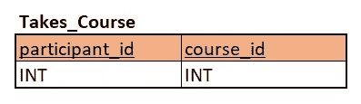

这是我们的第一个组合键！我们将两列 participant_id 和 course_id 一起设置为该表的主键，因为只有这种组合是唯一的。请注意，其中每个都是各自表中的主键。我们在这个表中使用的属性必须唯一地标识各个表中的记录，因此主键列通常是最好的选择。

我们只使用这两列，因为我们没有任何额外的数据存储在这里。情况可能并不总是如此，例如，我们可能有一个客户表和一个销售人员表，我们可能希望将每个销售人员对每个客户的总销售额存储在捕获他们关系的表中。这将是完全有效和可能的，但在我们的例子中，我们感兴趣的是参与者参加课程的事实，关于参与者和课程的所有其他细节更符合逻辑地存储在它们各自的表中。

让我们创建表格！这一次我们将同时添加约束，因为我们所有的其他表都已经存在。

```
CREATE TABLE takes_course (
  participant_id INT,
  course_id INT,
  PRIMARY KEY(participant_id, course_id),
  FOREIGN KEY(participant_id) REFERENCES participant(participant_id) ON DELETE CASCADE,
  FOREIGN KEY(course_id) REFERENCES course(course_id) ON DELETE CASCADE
);
```

在这里，我们将两列`participant_id`和`course_id`作为主键，用圆括号括起来，用逗号隔开。这就是我们如何在 MySQL 中创建一个组合键。

还要注意，这次我们使用了 ON DELETE CASCADE。这在这里是有意义的，就好像从数据库中删除了一个参与者，我们不需要继续存储他们正在学习的课程，同样，如果一个课程被删除，我们也不再需要存储参加该课程的参与者。

现在，我们已经在一个全功能的关系数据库中创建了所有的表。非常棒的作品。

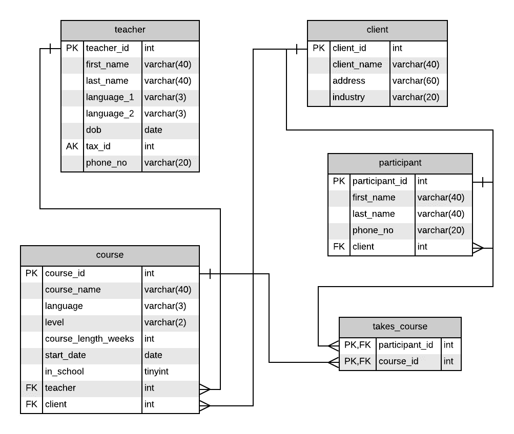

ERD 的另一种格式，显示我们的表和我们用 SQL 编码的各种关系

# 填充数据库

现在我们已经准备好了数据库，定义了关系，就等着开始行动了。我们只需要添加教师、课程、客户和参与者，我们就拥有了一个全功能的关系数据库，这是我们从头开始构建的！

为了用数据填充我们的表，我们需要使用 [INSERT INTO](https://dev.mysql.com/doc/refman/8.0/en/insert.html) 语句，后跟我们希望插入括号中的数据。例如，要填充教师表的第一行，我们将使用以下语句:

```
INSERT INTO teacher VALUES
(1,  'James', 'Smith', 'ENG', NULL, '1985-04-20', 12345, '+491774553676');
```

它给出了以下输出:

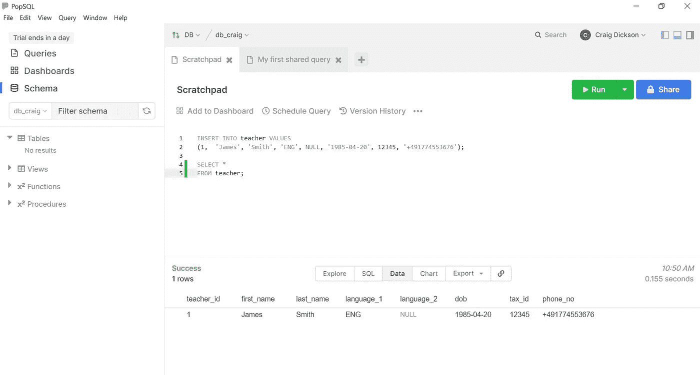

我们的第一个记录，填充！

这里语法是插入到*表的*值中(我们要插入的*数据，用逗号*隔开)。记录的每个属性(表中的每一列)都必须有一个值(或空值),否则 MySQL 会给我们一个错误。它们还需要与表中的列顺序相同，并遵循我们对列设置的任何约束(即，在设置为 NOT NULL 的列中没有 NULL 值，在设置为 UNIQUE 的列中没有重复)。

我们可以通过在列表中包含值来插入多条记录，用逗号分隔，如下所示:

```
INSERT INTO teacher VALUES
(1,  'James', 'Smith', 'ENG', NULL, '1985-04-20', 12345, '+491774553676'),
(2, 'Stefanie',  'Martin',  'FRA', NULL,  '1970-02-17', 23456, '+491234567890'), 
(3, 'Steve', 'Wang',  'MAN', 'ENG', '1990-11-12', 34567, '+447840921333');
```

也可以通过指定我们希望填充的列来执行[部分插入](https://www.w3schools.com/sql/sql_insert.asp)，如下所示:

```
INSERT INTO teacher (teacher_id, first_name, last_name, language_1)VALUES (2, 'Stefanie',  'Martin',  'FRA');
```

运行这条语句会得到:

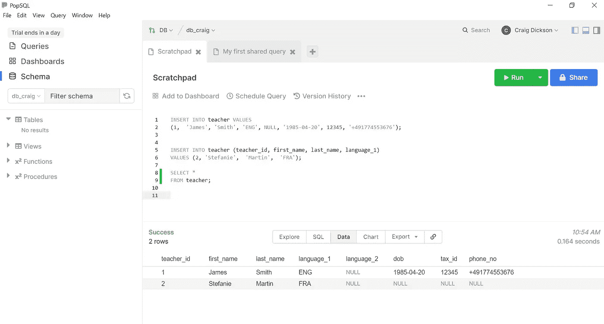

现在我们有两个记录，一个完整，一个部分。

注意，我们使用了 [SELECT](https://www.w3schools.com/sql/sql_select.asp) 语句来检索表的内容。这是 SQL 中最重要的语句之一，我们会一直使用它，任何时候我们都想从数据库中检索数据。

这里的格式是:

```
SELECT *FROM teacher;
```

在这种情况下，`SELECT *`表示“选择所有列”。例如，如果我们只对检索那些列感兴趣，我们也可以输入`SELECT teacher_id, last_name, tax_id`。

## 删除记录

在填充其余数据之前，让我们看看如何从表中删除记录。我们使用从语句中删除[来实现这一点。这里我们需要非常小心，就像我们没有在 DELETE FROM 语句中包含条件子句(使用](https://www.w3schools.com/sql/sql_delete.asp) [WHERE](https://www.w3schools.com/sql/sql_where.asp) )一样，我们可以删除表中的所有数据。

```
DELETE FROM teacher WHERE teacher_id = 2;
```

这将删除所有满足条件“teacher_id = 2”的记录，因此只删除我们刚才为斯蒂芬妮·马丁创建的记录。果然:


再见，斯蒂芬妮！

这是我们第一次看到 [WHERE](https://www.w3schools.com/sql/sql_where.asp) 子句。当我们使用 SQL 时，我们会发现在 SELECT 语句以及 DELETE 和 UPDATE 语句中会有越来越多的使用。我们将在本指南的[第 3 部分](https://medium.com/@thecraigdickson/data-analysis-in-mysql-operators-joins-and-more-in-relational-databases-26c0a968e61e)中对此进行更深入的探讨。

## 更新记录

我们还可以使用 [UPDATE](https://www.w3schools.com/sql/sql_update.asp) 子句对记录进行修改。这使用了语法更新*表* SET *column_1 = value_1，column_2 = value_2* ，其中*条件。*

在我们这一桌，也许詹姆斯·史密斯结婚了，想跟他妻子姓。我们可以在 MySQL 中使用以下语句来进行更改:

```
UPDATE teacher
SET last_name = 'Jones'
WHERE teacher_id = 1;
```

记住 WHERE 子句，否则我们会将表中的所有姓氏都改为 Jones！运行该语句将为我们提供:

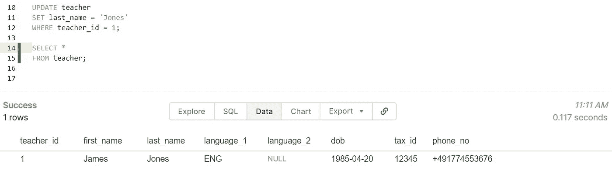

祝贺你，琼斯先生！

现在我们已经介绍了每一个 [CRUD](https://en.wikipedia.org/wiki/Create,_read,_update_and_delete) 功能——创建、读取、更新和删除。我们正在朝着能够对数据库做任何我们需要做的事情的方向前进！

## 让我们开始填充

既然我们已经看到了如何插入、删除和更新记录，那么让我们继续将剩余的数据放入数据库。你可以在这个 [GitHub 库](https://github.com/thecraigd/SQL_School_Tutorial)中看到我们将以 [Excel 格式](https://github.com/thecraigd/SQL_School_Tutorial/blob/master/Tables.xlsx)导入的数据集，以及我们在[中使用过的所有 SQL 代码(加上一点我们没有使用过的代码)。SQL](https://github.com/thecraigd/SQL_School_Tutorial/blob/master/ILS_DB_code.sql) 文件在那里。

下面是用值填充数据库所需的 MySQL 代码(记得首先删除教师表中詹姆斯·琼思的条目！):

```
INSERT INTO teacher VALUES
(1,  'James', 'Smith', 'ENG', NULL, '1985-04-20', 12345, '+491774553676'),
(2, 'Stefanie',  'Martin',  'FRA', NULL,  '1970-02-17', 23456, '+491234567890'), 
(3, 'Steve', 'Wang',  'MAN', 'ENG', '1990-11-12', 34567, '+447840921333'),
(4, 'Friederike',  'Müller-Rossi', 'DEU', 'ITA', '1987-07-07',  45678, '+492345678901'),
(5, 'Isobel', 'Ivanova', 'RUS', 'ENG', '1963-05-30',  56789, '+491772635467'),
(6, 'Niamh', 'Murphy', 'ENG', 'IRI', '1995-09-08',  67890, '+491231231232');INSERT INTO client VALUES
(101, 'Big Business Federation', '123 Falschungstraße, 10999 Berlin', 'NGO'),
(102, 'eCommerce GmbH', '27 Ersatz Allee, 10317 Berlin', 'Retail'),
(103, 'AutoMaker AG',  '20 Künstlichstraße, 10023 Berlin', 'Auto'),
(104, 'Banko Bank',  '12 Betrugstraße, 12345 Berlin', 'Banking'),
(105, 'WeMoveIt GmbH', '138 Arglistweg, 10065 Berlin', 'Logistics');INSERT INTO participant VALUES
(101, 'Marina', 'Berg','491635558182', 101),
(102, 'Andrea', 'Duerr', '49159555740', 101),
(103, 'Philipp', 'Probst',  '49155555692', 102),
(104, 'René',  'Brandt',  '4916355546',  102),
(105, 'Susanne', 'Shuster', '49155555779', 102),
(106, 'Christian', 'Schreiner', '49162555375', 101),
(107, 'Harry', 'Kim', '49177555633', 101),
(108, 'Jan', 'Nowak', '49151555824', 101),
(109, 'Pablo', 'Garcia',  '49162555176', 101),
(110, 'Melanie', 'Dreschler', '49151555527', 103),
(111, 'Dieter', 'Durr',  '49178555311', 103),
(112, 'Max', 'Mustermann', '49152555195', 104),
(113, 'Maxine', 'Mustermann', '49177555355', 104),
(114, 'Heiko', 'Fleischer', '49155555581', 105);INSERT INTO course VALUES
(12, 'English for Logistics', 'ENG', 'A1', 10, '2020-02-01', TRUE,  1, 105),
(13, 'Beginner English', 'ENG', 'A2', 40, '2019-11-12',  FALSE, 6, 101),
(14, 'Intermediate English', 'ENG', 'B2', 40, '2019-11-12', FALSE, 6, 101),
(15, 'Advanced English', 'ENG', 'C1', 40, '2019-11-12', FALSE, 6, 101),
(16, 'Mandarin für Autoindustrie', 'MAN', 'B1', 15, '2020-01-15', TRUE, 3, 103),
(17, 'Français intermédiaire', 'FRA', 'B1',  18, '2020-04-03', FALSE, 2, 101),
(18, 'Deutsch für Anfänger', 'DEU', 'A2', 8, '2020-02-14', TRUE, 4, 102),
(19, 'Intermediate English', 'ENG', 'B2', 10, '2020-03-29', FALSE, 1, 104),
(20, 'Fortgeschrittenes Russisch', 'RUS', 'C1',  4, '2020-04-08',  FALSE, 5, 103);INSERT INTO takes_course VALUES
(101, 15),
(101, 17),
(102, 17),
(103, 18),
(104, 18),
(105, 18),
(106, 13),
(107, 13),
(108, 13),
(109, 14),
(109, 15),
(110, 16),
(110, 20),
(111, 16),
(114, 12),
(112, 19),
(113, 19);
```

不错！现在，我们所有的表都已经填充了数据，定义并实现了数据之间的所有关系，所有的属性都有适当的数据类型和约束，数据库已经准备好可以使用了。出色的工作！

在本文中，我们已经从 ERD 准备就绪的数据库计划，发展到在 MySQL 中完全实现和填充数据库。我们已经选择了数据类型，定义了所有字段，创建了表，并使用 MySQL 代码定义了它们之间的关系。

下一步是开始分析这些数据。请继续关注本指南的第三部分—[*MySQL 中的数据分析——关系数据库中的操作符、连接和更多内容*](https://medium.com/@thecraigdickson/data-analysis-in-mysql-operators-joins-and-more-in-relational-databases-26c0a968e61e) *—* ，查看 MySQL 中功能强大的工具，以提取、操作和更新我们新创建的数据库中的数据。

非常感谢您抽出时间陪我踏上这段旅程。我随时欢迎您的反馈——请通过[我的网站](https://www.craigdoesdata.de/contact.html)与我联系，让我知道我该如何更有效地做这件事！我总是乐于接受建设性的批评，或者你的任何意见。

下次见！


更像这样？访问[craigdoedata . de](https://www.craigdoesdata.de/)