# 从头开始计算变异系数和协方差

> 原文：<https://towardsdatascience.com/coefficient-of-variation-cv-covariance-cov-from-the-scratch-52600656147f?source=collection_archive---------8----------------------->

## 永远消除困惑！

阿德里安·斯旺卡在 [Unsplash](https://unsplash.com?utm_source=medium&utm_medium=referral) 上拍摄的照片

> **什么是“变异系数”,为什么我们需要它作为一种统计方法？**

到目前为止(直到我的前几篇博客),我们是基于两个数字的总结来总结数据集的——*集中趋势和扩散*。我想让你思考一下，如果我们想要比较两个或更多数据集的波动性，现在用两个数字的汇总方法来做是否可行？

答案是，如果不在可比较的范围内(标准化)，我们无法对它们进行比较。这就是为什么需要一个变异系数(CV)来确定哪个数据集相对来说更不稳定。

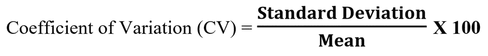

**变异系数没有单位。*

给定数据集围绕中心趋势的分布与另一个数据集的分布度量不可比，因为后者是参考其自身的中心趋势计算的。为了将它们放在同一个比较尺度上，进行了除以它们的中心趋势，乘以 100 将测量值转换成百分比形式。我们将看到一个适当的例子，说明标准偏差测量本身是如何具有欺骗性的。

数据集:03 家公司的每周股价走势:

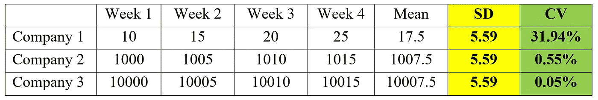

公司 1 的股价波动最大，CV 为 31.94 %，其次是公司 2 和公司 3。

*单独看三家公司的标准差并进行比较，显然会导致错误解读。我希望现在你已经意识到在比较不同数据集之间的波动性时 CV 及其可靠性的重要性。*

> **什么是“协方差”,为什么我们需要它作为统计指标？**

每当数据中有一些信息是我们无法用之前讨论过的方法获取的，我们就会讨论一种新的方法来获取这些信息。根据相同的方法，我们将首先查看与之前讨论的测量方法看起来相同的数据集，但是在可视化时，我们将遇到一些模式，这些模式将使用额外的统计测量方法来捕获。然而，这一措施将导致统计的双变量领域，其中两个变量相互作用，并显示一些模式。到目前为止，我们只处理了一个变量的描述性统计(目标变量，即高度、股票价格)，但现在我们将有额外的变量来尝试解释目标变量中存在的变化。协方差的需求和定义将在下面用一个适当的例子来说明:

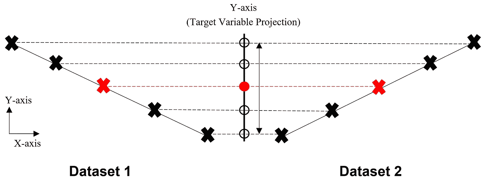

(图片由作者提供)

如果我们试图获得上述两个数据集的目标变量(Y 轴)或预测变量(X 轴)的 2 个数总和，它们将具有相同的(相同的平均值和标准偏差),但很明显，它们都是不同的数据集。当一个变量相对于另一个变量作图时，斜率因子开始起作用，可见的斜率反映了两个变量递增时的**共同运动**。

让我们将目标变量作为两个数据集的权重(Y 轴),

预测变量-数据集 1 的慢跑速度(X 轴)和数据集 2 的身高(X 轴)。

重量(Y 轴)= 70，80，90，100(千克)

设置 1 —点动速度(X 轴)= 170，180，190，200(单位为厘米/秒)

集合 2 —高度(X 轴)= 170，180，190，200(单位为厘米)

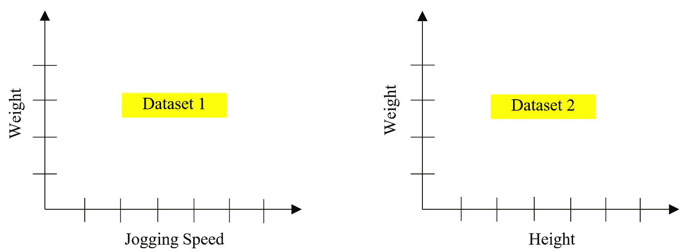

(图片由作者提供)

是时候看看这三个变量的 2 位数总结了:

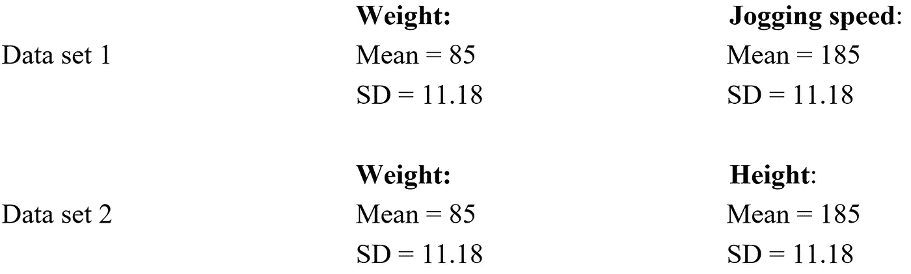

仅仅通过看上面的总结，人们可能会认为这两套是完全相同的，但事实并非如此。协方差度量的时间投入，它将再次解释图形。

假设 4 个人有 3 个属性(体重、慢跑速度和身高):

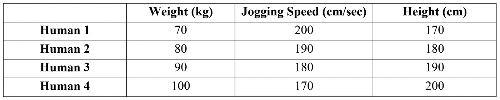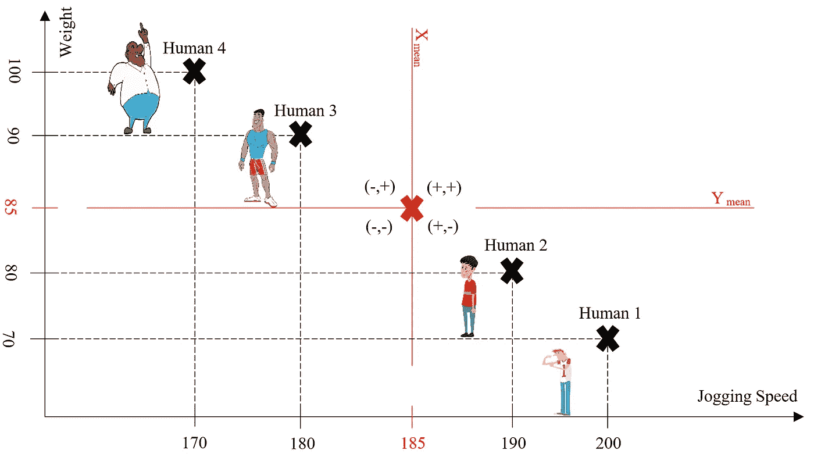

(图片由作者提供)

剧情的基本解读:

-右上象限的点的 X 和 Y 值将大于 X 平均值和 Y 平均值

-左上象限的点的 X 值小于 X 平均值，Y 值大于 Y 平均值

-左下象限的点的 X 和 Y 值将小于 X 平均值和 Y 平均值

-右下象限的点的 X 值大于 X 平均值，Y 值小于 Y 平均值

这意味着，如果我们在将距离计算的参考从原点更改为各自的平均值后乘以一个点的 X 和 Y 坐标，右上象限中的所有点将具有正值(+、+)，左上象限将具有负值(-、+)，左下象限将具有正值(-、-)，右下象限将具有负值(+、-)。

现在我们将对数据集 1 进行同样的计算:

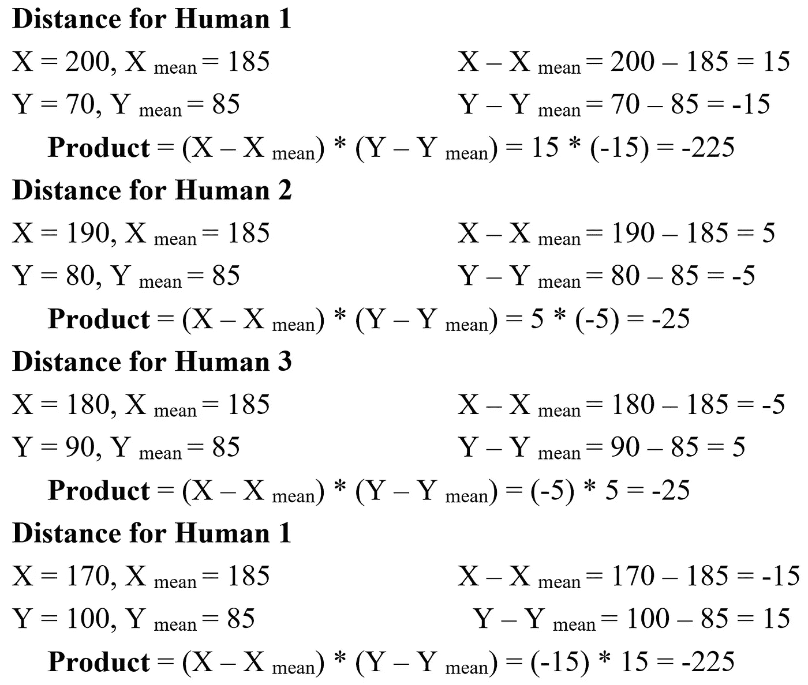

将所有乘积求和= -225 + (-25) + (-25) + (-225) = -500

到目前为止，您可能已经了解了为什么这种方法有助于确定共同运动的方向(产品价值的负和—向下，产品价值的正和—向上)。我们现在也将计算数据集 2 的产品价值，以使事情变得非常清楚:

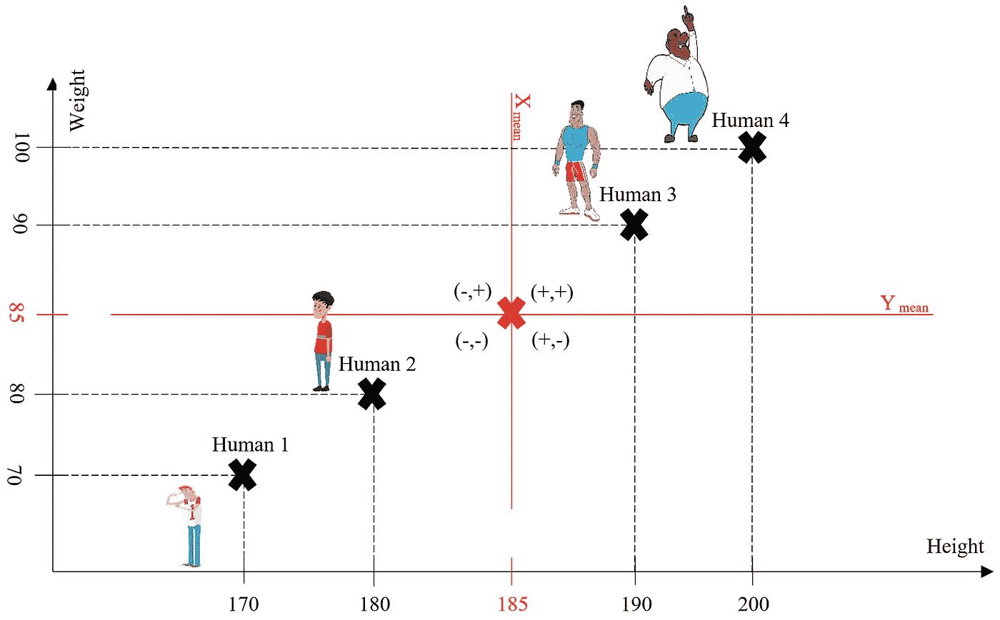

(图片由作者提供)

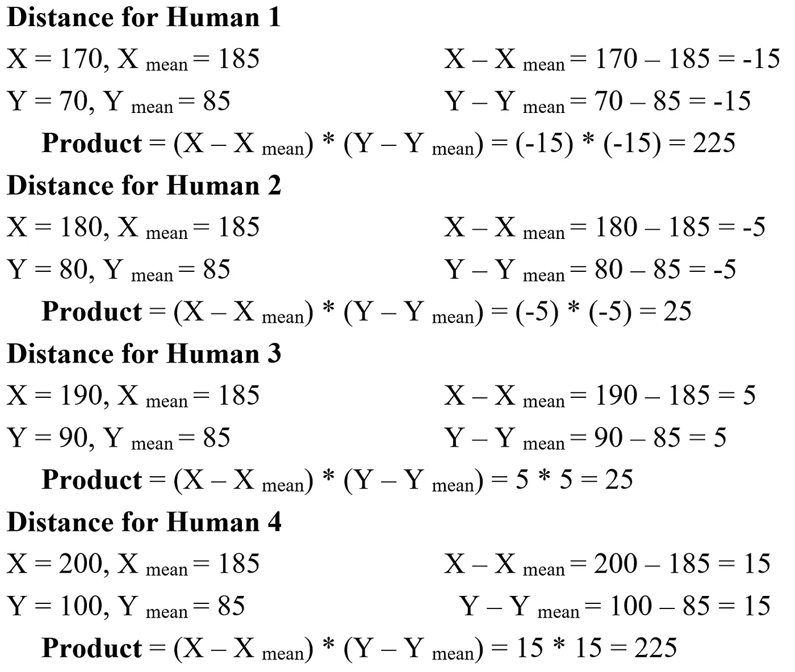

所有乘积相加= 225 + 25 + 25 + 225 = 500(正数表示向上的共同运动)

在我们可以正式地将这个度量称为协方差之前，我们需要通过将乘积输出的和除以数据点的数量(本例中 N = 4，假设为总体)来取其平均值。这也意味着你不能计算两个数据点计数不同的变量之间的协方差。协方差单位(Cov)是 X & Y 变量单位的乘积。

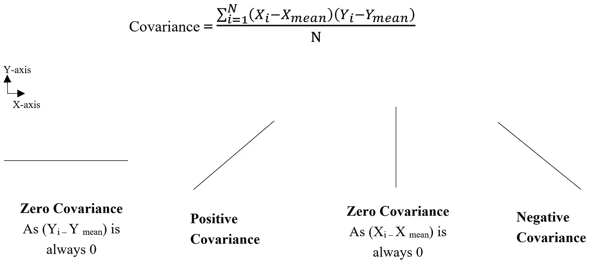

(图片由作者提供)

> 注意—上面完成的所有计算都假设数据集为群体集。讨论和辩论最多的话题与这种测量的分母有关，即为什么样本是 N-1，为什么人口是 N，将在未来的博客中全面解释。

最后，当人们使用它们的简短形式来引用这些统计度量时，最大的困惑出现了，最终混淆了“变异系数”的“Cov”和“协方差”的“CV”。克服这一点的最好方法是记住协方差的简短形式是它的词干版本:

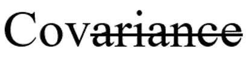

这样你就永远不会混淆这两种不同的统计方法。

我的博客到此结束，希望预期的信息已经传达，与这两项措施相关的困惑已经永远消除。

谢谢！！！