# 咖啡豆脱气

> 原文：<https://towardsdatascience.com/coffee-bean-degassing-d747c8a9d4c9?source=collection_archive---------24----------------------->

## 一些精彩的咖啡研究综述

2020 年 7 月，我开始更多地思考脱气和咖啡。我一直在尝试让我的咖啡烘焙品在使用前休息 3 或 4 周，我注意到味道和提取水平有所改善。我怀疑部分提取是由于二氧化碳的减少。

所以我开始了一个实验，看看我是否能使用真空罐更快地给豆子脱气，希望能更快地使用它们。在这个过程中，我开始了解外面有什么研究，我偶然看到了萨莫·斯默克和其他人关于这项研究的[伟大论文](https://pubs.acs.org/doi/10.1021/acs.jafc.7b03310)和[视频演示](https://www.youtube.com/watch?v=LhsLtIIxNTo)。

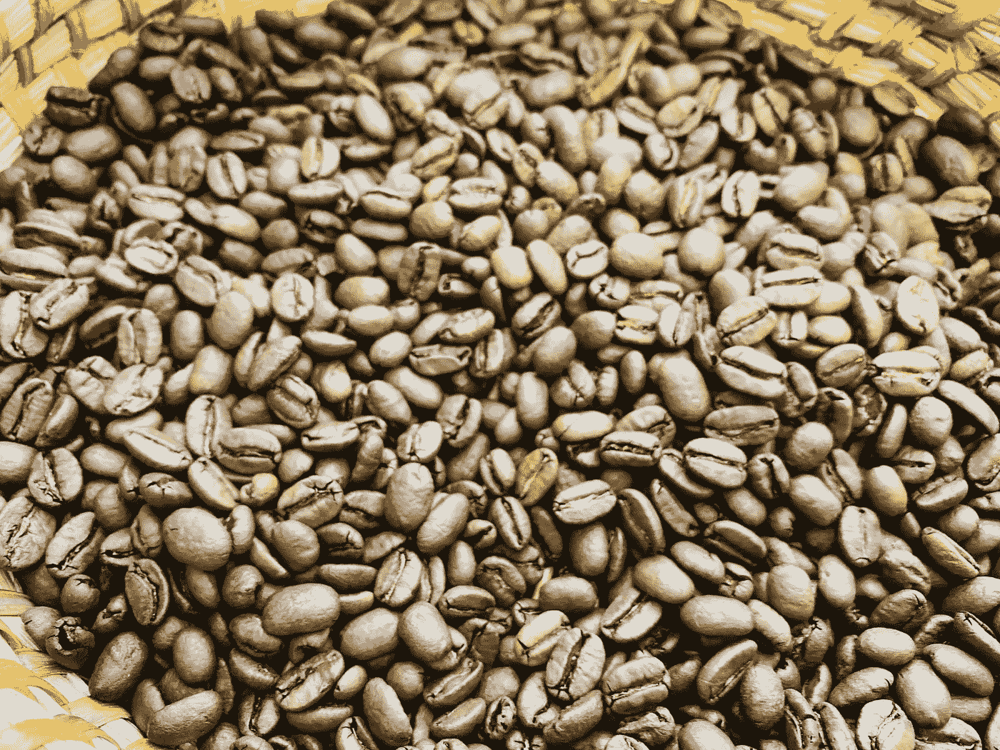

作者图片

我太激动了，我想在这里回顾一下这些信息。通常，我认为研究仅限于做研究的人，不做研究的人无法接触到。这些工作都不是我的。我的希望是，也许我可以展示最有趣的作品和一些图表，以不同的方式来看待数据，以帮助他人理解。你总是可以看视频或者读报纸，但是也许你只是想要图表。

对于演示文稿中的每个情节，我都编写了一个脚本来从原始情节中提取数据，以便我可以重新绘制它。我添加了一个额外的图表，显示脱气占总量的百分比，我发现这是一个有用的标准化。所有这些图表都包含原始数据，但有时，我会将 x 轴刻度改为我认为更有意义的位置，或者混合一些以前没有混合的数据。

# 不同的豆子

不同的豆子以不同的速率脱气。对于浓缩咖啡来说，这一点尤为重要，因为残留在咖啡豆中的气体量关系到一杯咖啡的流量。我怀疑这意味着不同的咖啡豆应该在不同的时间窗口使用，而不是像浓缩咖啡那样在 2 到 4 周内使用。

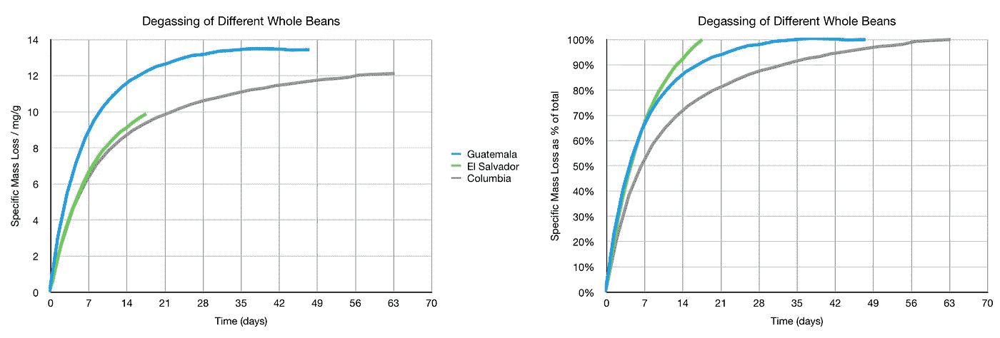

# 烘烤水平

烤得越黑，产生的气体就越多！这个数据的有趣之处在于，作为一个百分比，大多数烘焙水平都有相似的速率和模式。正如这项研究的作者指出的，大多数脱气(70%)发生在最初的 24 小时内。

# 烘烤程度与烘烤速度

他们观察了三种速度下的暗烤、中烤和亮烤。就百分比而言，无论速度如何，它们都遵循相似的趋势。

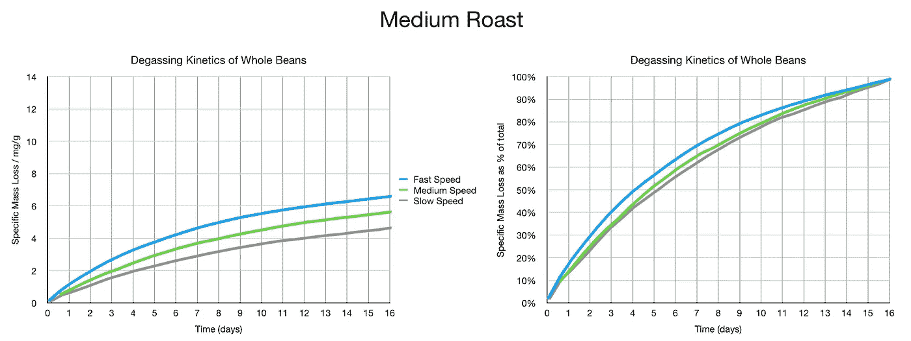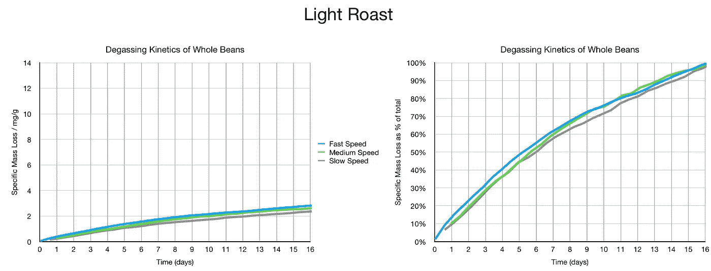

我混合了一些快速和慢速，给出了三个烘烤级别的概念。

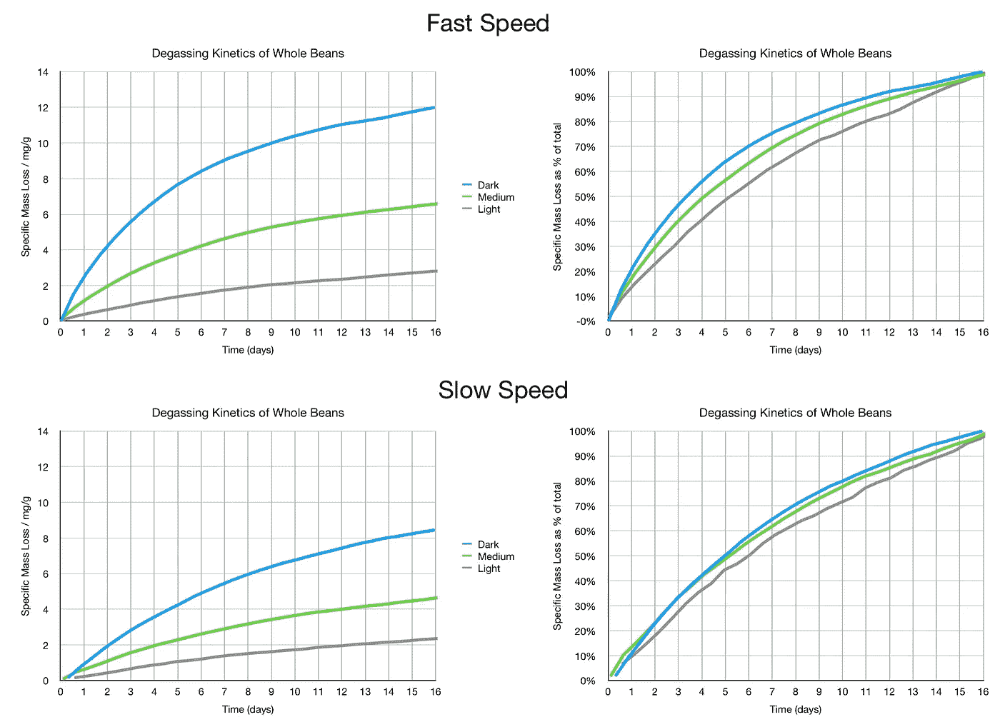

同样，就百分比而言，无论烘焙程度或速度如何，它们都有相似的脱气模式。

# 烘烤速度

这项研究还关注了烘焙速度，烘焙速度越快，咖啡豆中释放的气体越多。

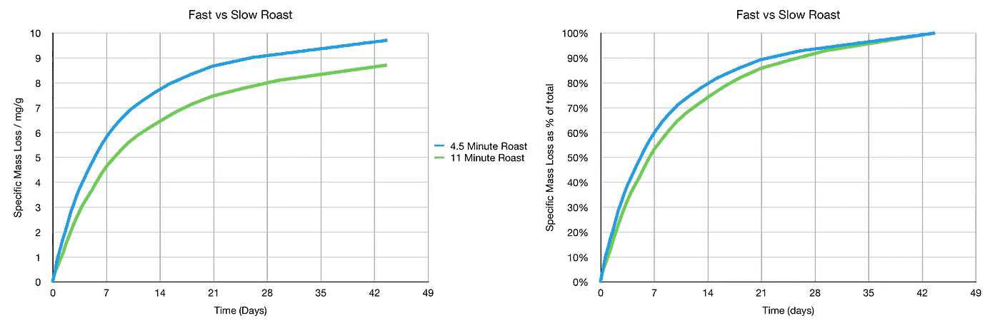

# 全豆 vs 烘焙研磨(R&G)

由于研磨过程中气体的损失，焙烧后立即研磨会显著改变气体的释放。

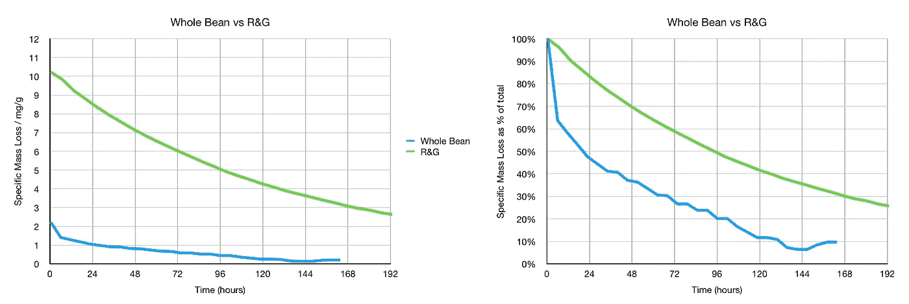

# 研磨枣 vs 烘烤

他们观察了一段时间内的两次烘烤，并每隔一段时间对烘烤进行取样研磨。他们发现的最有趣的事情是，在第四周，咖啡研磨后产生的气体比整颗咖啡豆产生的气体还多。他们推测这是由于一些气体被截留在咖啡中，这可以解释为什么几个月前的咖啡在煮浓缩咖啡时仍然有一些克莉玛。

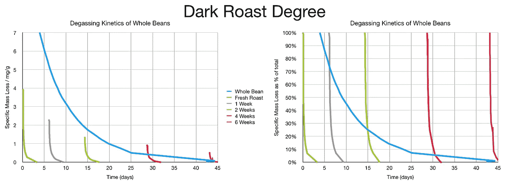

不出所料，轻度烘焙的咖啡豆和磨粉在各个阶段的气体含量较低。

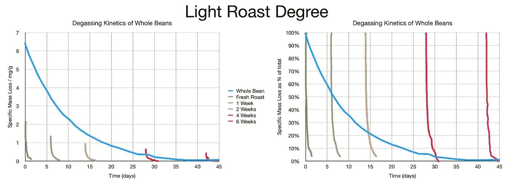

我们可以把烘焙后不同的几周排在一起，看着地面脱气是多么的有趣。

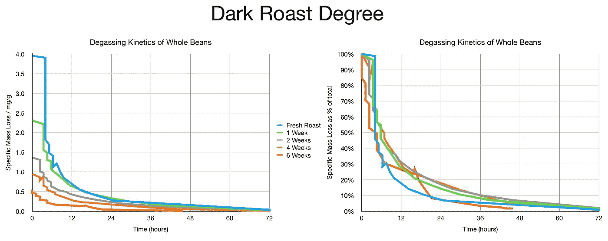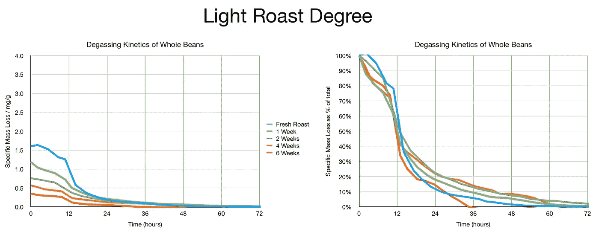

# 冻豆！

他们的研究非常有助于理解冷冻咖啡时会发生什么。演示文稿中的作者指出，他们不认为这个过程是冷冻咖啡豆，因为大多数烘焙咖啡豆中的水分很少。所以他们认为咖啡豆被冷却会减缓脱气。因此，冷冻是延长货架期的有效方法。你也可以冷冻和再冷冻豆子，而你通常不能冷冻其他食物。

他们观察了烘烤过的咖啡豆，并将其分为新鲜的、冷冻 1 周的和冷冻 2 周的。它们在指定的时间研磨，所有三种的脱气量遵循相同的模式，与新鲜相比略微下降 2 周。

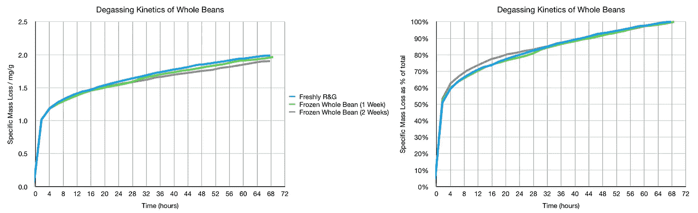

他们在冰箱里观察了 70 天，他们发现冷冻的豆子和新鲜的豆子几乎完全一样，只是有一点偏差。

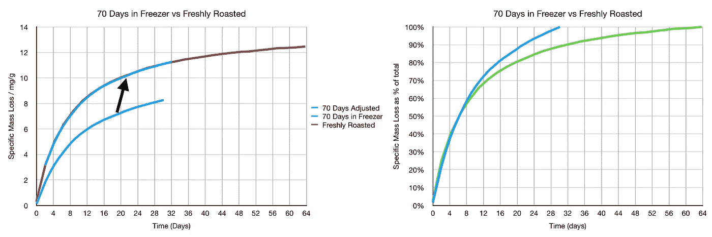

# 额外奖励:咖啡香味

为了观察咖啡的新鲜度，萨莫还对咖啡豆散发出的不同香味做了一些研究。具体的化学物质有以下几种味道。每一种都有不同的味道成分，因为香味是复杂的。

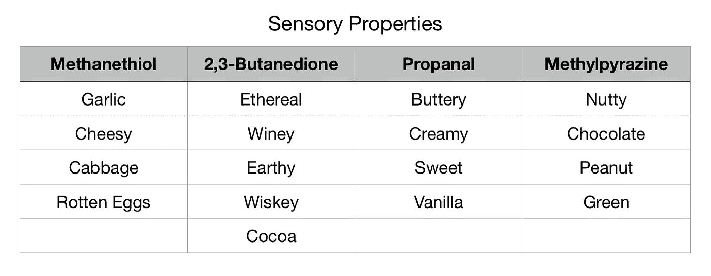

原来的图显示了下降，我把 X 轴调整为一周间隔。我的目标是得到一个图表和一些表格，帮助清楚地显示一周内还剩下多少香气。所以我也重新归一化了数据的最大值和最小值。

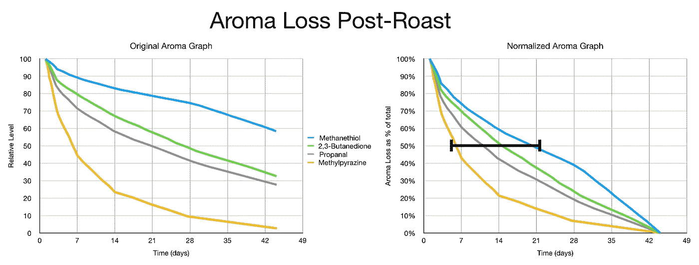

这张图表遗漏了二氧化碳。所以我从上面标题为“烘焙水平与烘焙速度”的章节中选取了一条脱气曲线我用的是中速烤。

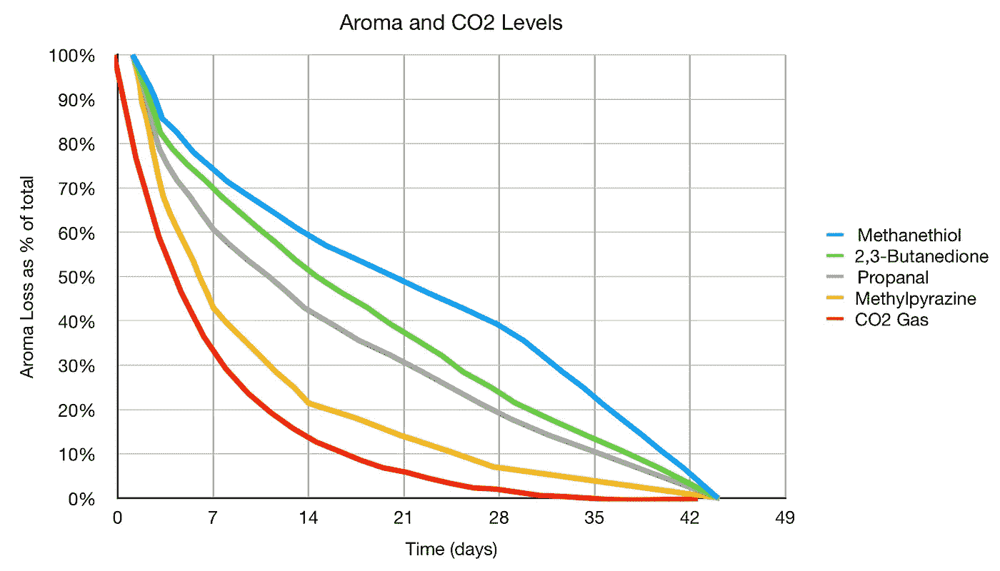

相对于香气来说，二氧化碳脱气非常快，这可能解释了为什么制作浓缩咖啡的最佳时间是烘焙后的 7 到 21 天。我已经达到了 21 到 35 天的范围，因为我可以获得更高的提取水平(约 22%的提取率)。

这里有一些表格，带来更简洁的总结。在第一个例子中，你可以看到二氧化碳消耗最快，而甲硫醇消耗最慢。如果你看第二张表，这是每周的数据。2 周后，4 个香气参数中的 3 个仍接近起始点的 50%，而 CO2 非常低。6 周后，这些香味大多处于最低点。这并不意味着它们消失了，因为它们是相对于最大值的归一化值。

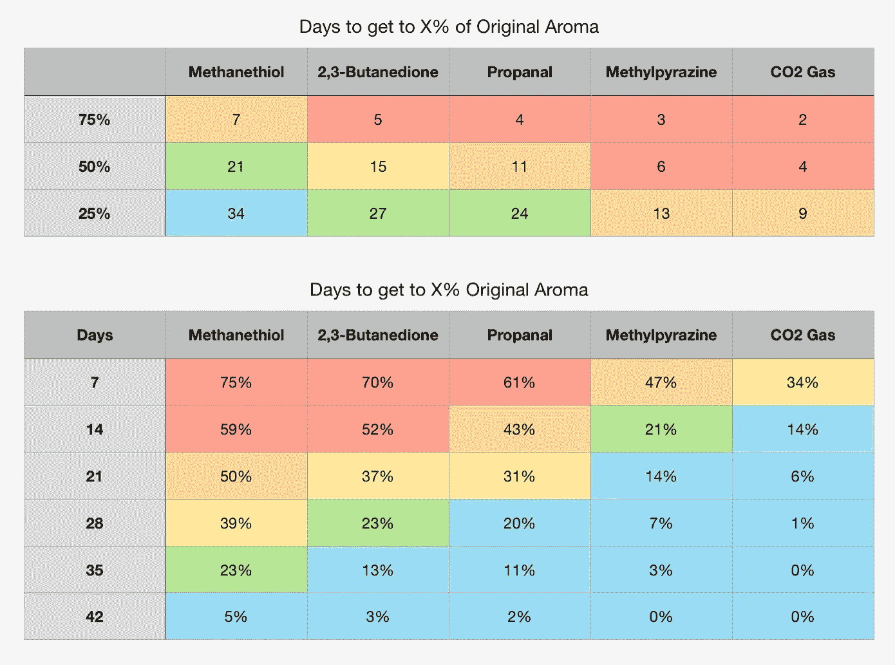

总的来说，我非常惊讶地发现了这项研究，我非常兴奋地摆弄着这些数据。这不会改变我对浓缩咖啡的看法，但它确实有助于对我用精确到 0.03 克的天平测量的排气量提供额外的解释。

我希望进一步的研究将有助于改进我烘焙和储存咖啡豆的方式。当然，这一领域的问题在于咖啡豆、烘焙机和冲泡方法的多样性。

如果你愿意，可以在 Twitter 和 YouTube 上关注我，我会在那里发布不同机器上的浓缩咖啡视频和浓缩咖啡相关的东西。你也可以在 [LinkedIn](https://www.linkedin.com/in/robert-mckeon-aloe-01581595?source=post_page---------------------------) 上找到我。

# 我的进一步阅读:

[解构咖啡:分割烘焙、研磨、分层以获得更好的浓缩咖啡](/deconstructed-coffee-split-roasting-grinding-and-layering-for-better-espresso-fd408c1ac535)

[浓缩咖啡的预浸:更好的浓缩咖啡的视觉提示](/pre-infusion-for-espresso-visual-cues-for-better-espresso-c23b2542152e)

[咖啡的形状](/the-shape-of-coffee-fa87d3a67752)

[搅拌还是旋转:更好的浓缩咖啡体验](https://towardsdatascience.com/p/8cf623ea27ef)

[香辣浓缩咖啡:热磨，冷捣以获得更好的咖啡](/spicy-espresso-grind-hot-tamp-cold-36bb547211ef)

[断续浓缩咖啡:提升浓缩咖啡](https://medium.com/overthinking-life/staccato-espresso-leveling-up-espresso-70b68144f94)

[用纸质过滤器改进浓缩咖啡](/the-impact-of-paper-filters-on-espresso-cfaf6e047456)

[浓缩咖啡中咖啡溶解度的初步研究](/coffee-solubility-in-espresso-an-initial-study-88f78a432e2c)

[断奏捣固:不用筛子改进浓缩咖啡](/staccato-tamping-improving-espresso-without-a-sifter-b22de5db28f6)

[浓缩咖啡模拟:计算机模型的第一步](https://towardsdatascience.com/@rmckeon/espresso-simulation-first-steps-in-computer-models-56e06fc9a13c)

[压力脉动带来更好的浓缩咖啡](/pressure-pulsing-for-better-espresso-62f09362211d)

[咖啡数据表](https://towardsdatascience.com/@rmckeon/coffee-data-sheet-d95fd241e7f6)

[工匠咖啡价格过高](https://towardsdatascience.com/overthinking-life/artisan-coffee-is-overpriced-81410a429aaa)

[被盗浓缩咖啡机的故事](https://towardsdatascience.com/overthinking-life/the-tale-of-a-stolen-espresso-machine-6cc24d2d21a3)

[浓缩咖啡过滤器分析](/espresso-filters-an-analysis-7672899ce4c0)

[便携式浓缩咖啡:指南](https://towardsdatascience.com/overthinking-life/portable-espresso-a-guide-5fb32185621)

[克鲁夫筛:一项分析](https://towardsdatascience.com/overthinking-life/kruve-coffee-sifter-an-analysis-c6bd4f843124)