# 咖啡豆储存:真空与密封容器

> 原文：<https://towardsdatascience.com/coffee-bean-storage-vacuum-vs-sealed-containers-c5d6a2b6f1b0?source=collection_archive---------21----------------------->

## 咖啡数据科学

## 通过 espresso 数据解封

当我开始在家里制作浓缩咖啡时，我最好的储存方式是在袋子上放一个夹子。随着时间的推移，我最终使用塑料袋，塑料容器和密封的梅森罐。我真的更喜欢梅森罐，因为它们看起来很好，而且摸起来很结实。然而，我不确定他们是否是储存咖啡的最佳选择，因为大多数咖啡都是用真空密封的袋子运输的。

我设计了一个简单的实验，在这个实验中，我会烘烤咖啡豆，并将烘烤的咖啡豆分别放在密封的梅森罐和真空密封的梅森罐中。然后我会磨出两个镜头，我这样做了几次烧烤的生活。对于每一个镜头，我都专注于味道和提取率(EY)。这对 EY 甚至拍摄时间没有太大的影响，但使用真空罐比密封罐味道肯定会有所改善。

从大部分咖啡用真空密封袋装运的方面来看，这并不是一个新的结论。然而，一旦人们打开袋子，咖啡豆通常不会保存在真空中。虽然我主张他们应该是因为味道更好。

# 真空罐

已经有一些专门用于咖啡的真空罐，但在调查之前，我决定买一个用于腌制食物的 T2 真空罐。它们是有真空盖的广口瓶，你把空气抽出来。它们既不优雅也不圆滑，当然也不适合垂直堆叠。

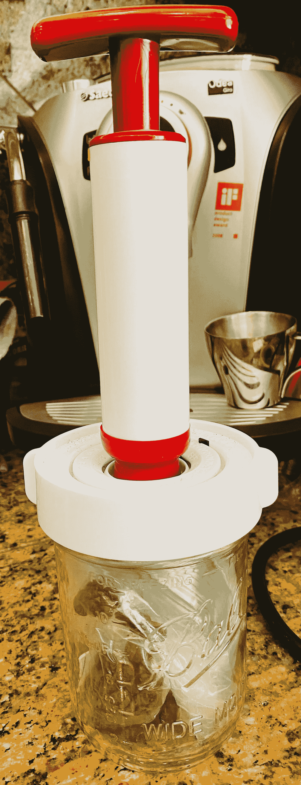

所有图片由作者提供；容器有多个塑料袋装的咖啡。

然而，它们工作了，我把它们平放起来，这样我就可以看到密封是否被破坏了。由于二氧化碳的释放，在烘烤后的前两三天，罐子必须每天重新密封一次。

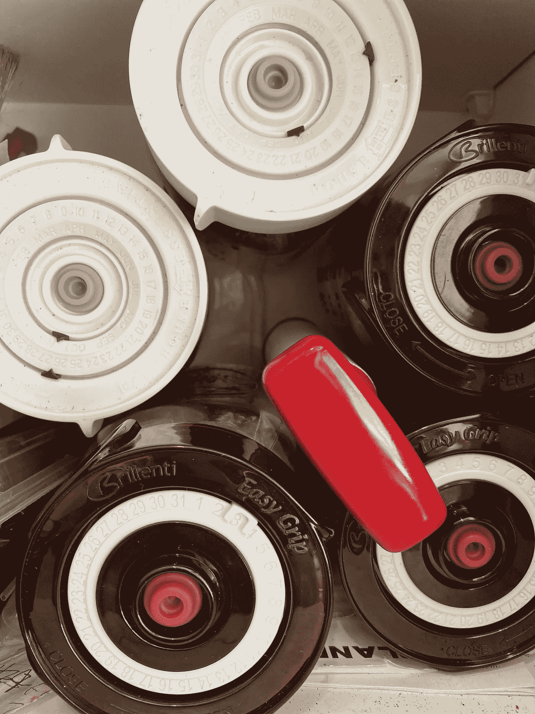

# 性能指标

我使用了两个指标来评估镜头之间的差异:[最终得分](https://link.medium.com/uzbzVt7Db7)和[咖啡萃取](https://link.medium.com/EhlakB9Db7)。

最终得分是 7 个指标(强烈、浓郁、糖浆、甜味、酸味、苦味和余味)记分卡的平均值。当然，这些分数是主观的，但它们符合我的口味，帮助我提高了我的拍摄水平。分数有一些变化。我的目标是保持每个指标的一致性，但有时粒度很难，会影响最终得分。

使用折射仪测量总溶解固体(TDS ),该数字用于确定提取到杯中的咖啡的百分比，并结合一杯咖啡的输出重量和咖啡的输入重量，称为提取率(EY)。

# 数据

我收集了 40 对样本，它们具有相同的咖啡豆、夯实压力、预浸泡、纸质过滤器等参数。这使我能够同时进行一些其他实验，同时仍然能够采集各种成对的样本。

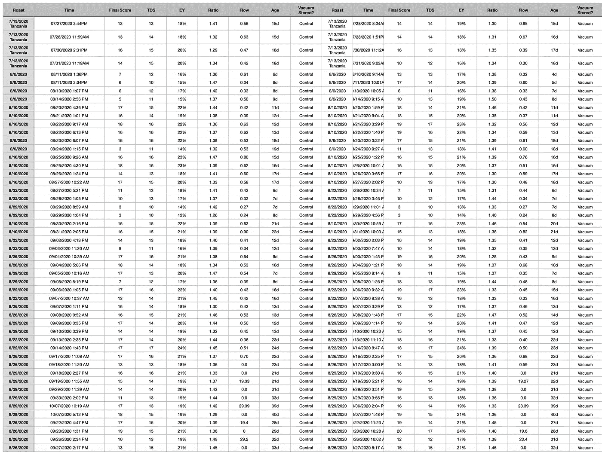

# 数据分析

查看这些数据的第一种方法是使用配对数据来绘制散点图。对角线代表密封注射与真空注射相同的时间。

图表中使用的存储罐术语:

1.  真空密封梅森瓶:真空
2.  密封梅森瓶:密封(也称为控制)

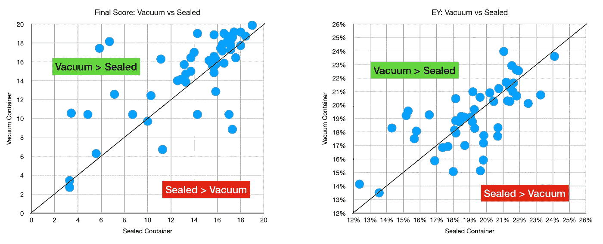

总的来说，真空密封有更好的口味评分，但 EY 是两者差不多。我们可以根据烘焙来细分这些比较，并没有特别的趋势表明一种烘焙做得更好或更差。

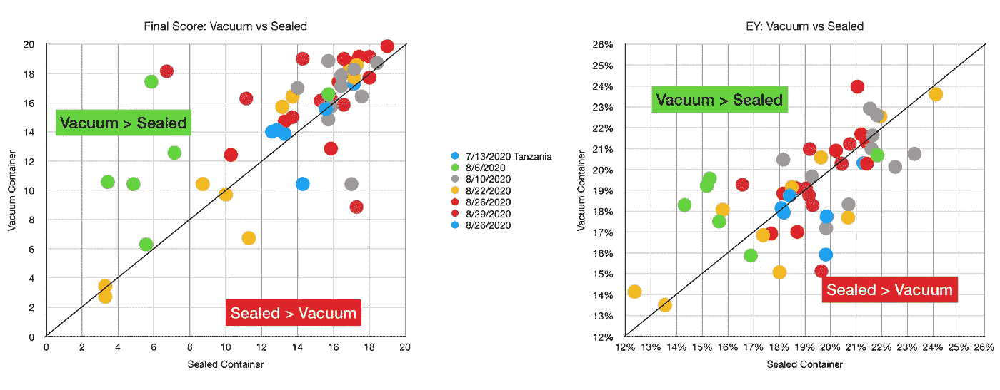

让我们只关注更高的分数。许多较低的分数是在咖啡烘焙非常新鲜的时候，这意味着萃取率有点低且不均匀。

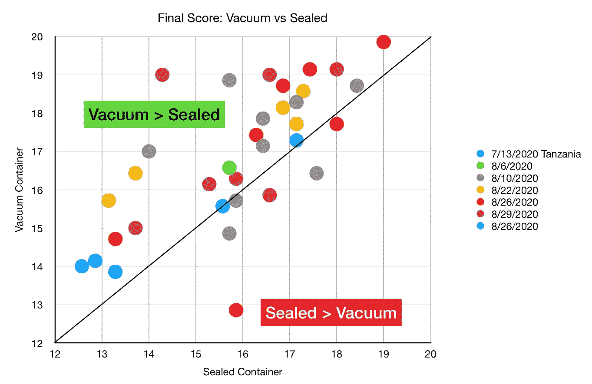

从这张图表中，模式变得非常清楚。通过烘烤和日期来看更多的数据，我们可以看到一些真空罐在最初几个镜头中表现不佳的地方。这里是按密封分数排序的照片，左边是分开的，右边是一起的。

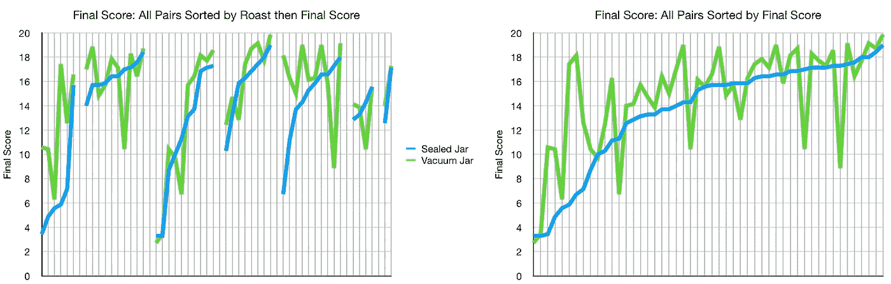

我们还可以查看总溶解固体(TDS)与 EY 的关系，以此进行验证。看起来大多数照片都是用相似的值拍摄的，这意味着实验对变量的控制相当不错。

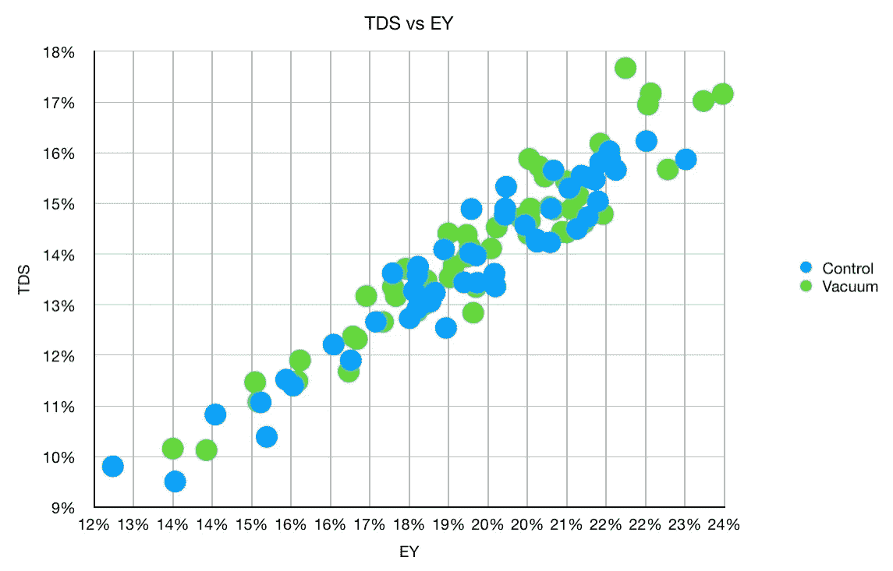

将最终得分与 EY 和 TDS 进行比较，有一个明显的趋势。味道很大程度上取决于高 EY 和 TDS，因为这是我喜欢的。但即使在这些图表中，真空数据点仍然比对照或密封瓶结果高一点。

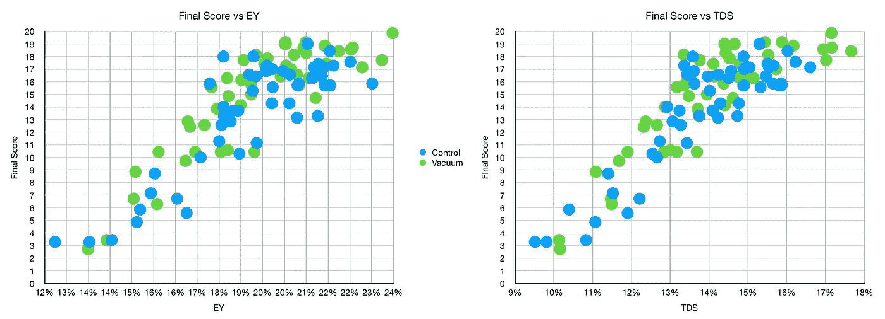

将所有数据绘制在一起，我们可以对这些点使用多项式最佳拟合函数，它具有相当高的 R^2 度量。

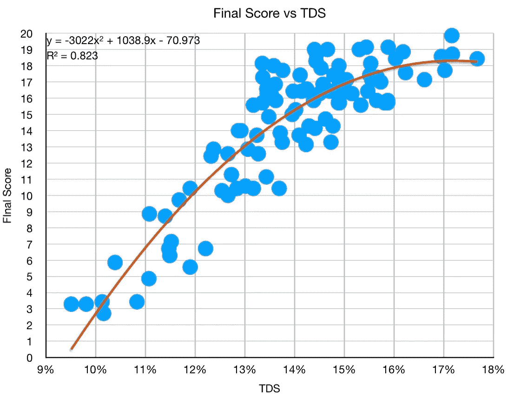

我使用平均和最大味道分数进一步总结了结果:

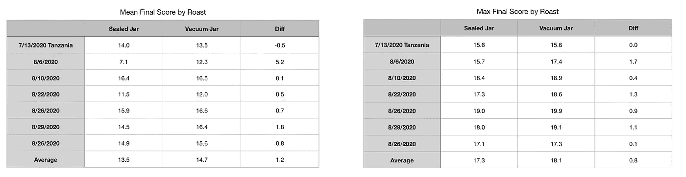

在最高水平，从密封分数有统计学意义的分数偏移，但是在 EY 的差异没有统计学意义。

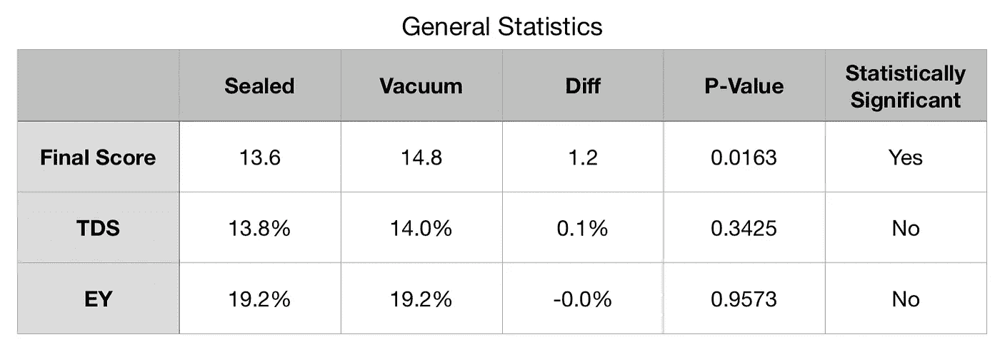

# 老化分析

衰老似乎很重要，所以我想删掉一部分关于衰老的内容。从散点图来看，除了味道(最终得分)更好之外，似乎没有什么别的了。

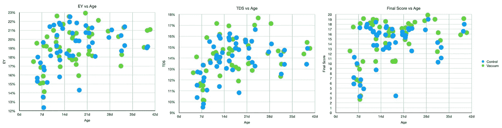

但是，当我们备份到统计级别时，我们会看到一些有趣的内容。基于年龄的不同，口味的差异也不同。EY 变化不大。

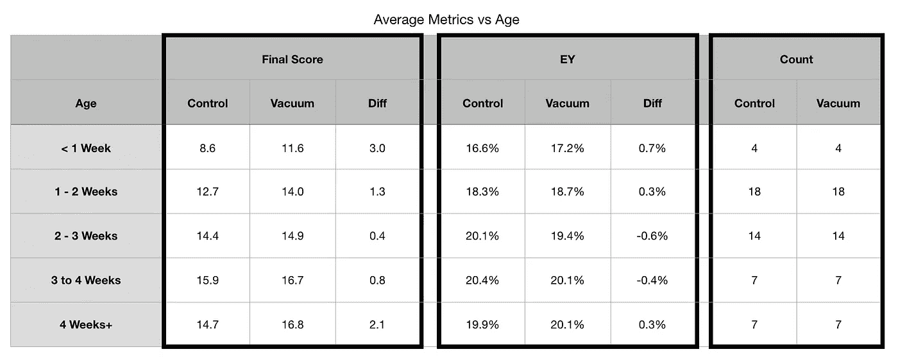

# 真空密封的咖啡渣

我还研究了在冰箱中使用真空密封来储存粉末。我以前发现储存在冰箱里的咖啡渣在几天后不会很快变坏，我怀疑真空罐会有帮助。

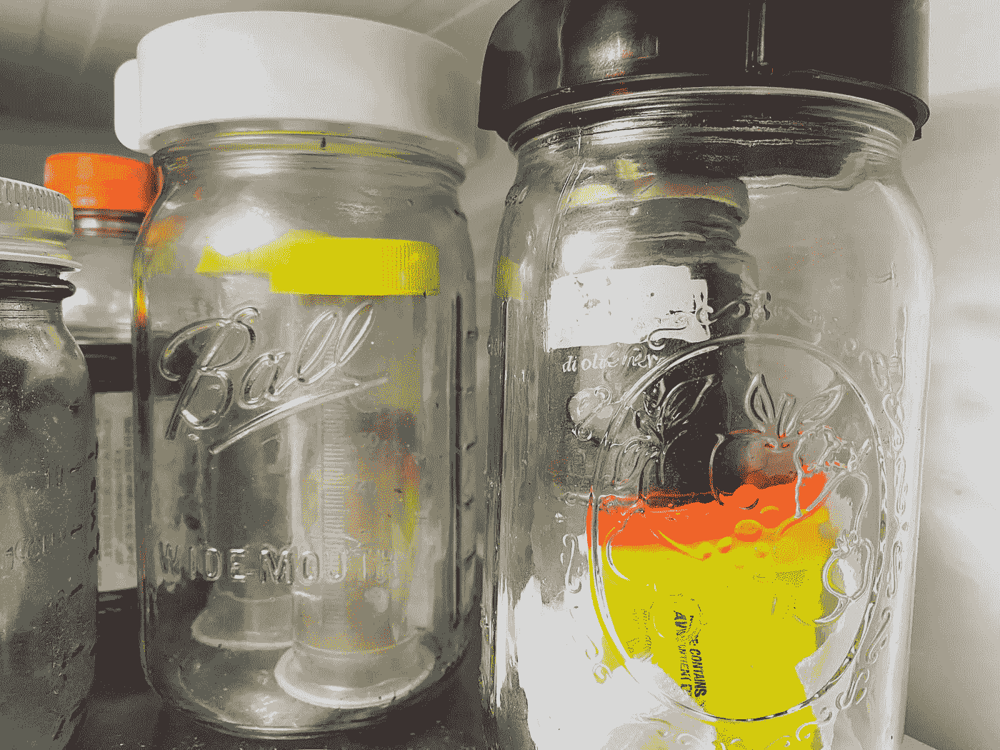

真空密封研磨料的主要挑战是，如果研磨料被吸入密封中，密封将无法正确关闭。所以我把它们储存在一个有裂缝盖子的容器里，这样空气就可以进出那个小容器，然后把它放进真空容器里。

我发现味道略有改善，EY 的味道有所下降。我的样本更少了，但继续以这种方式储存地面的后勤挑战使我想继续进行其他实验，而不是在接下来的 2 到 3 周内建立一个更大的数据库。

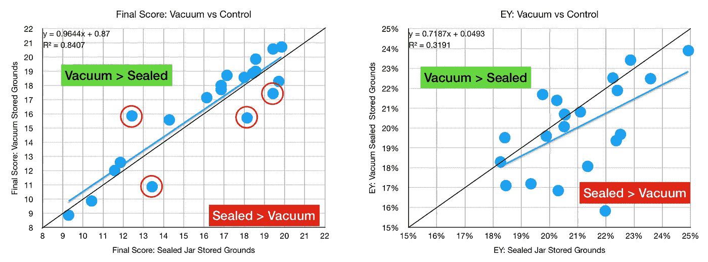

一些异常值是红色的，我在下面一点的一般统计表中把它们去掉了。

我将样本分类，绘制成下面的线条。

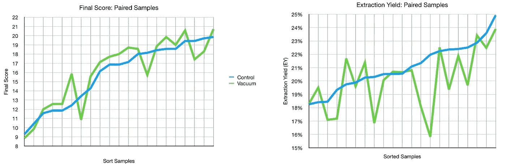

以下是包含所有数据的一般统计数据，以及一些被剔除的数据点。根据所有数据，最终得分的变化在统计上并不显著，但 EY 的变化是显著的。通过取出四个数据点来翻转。

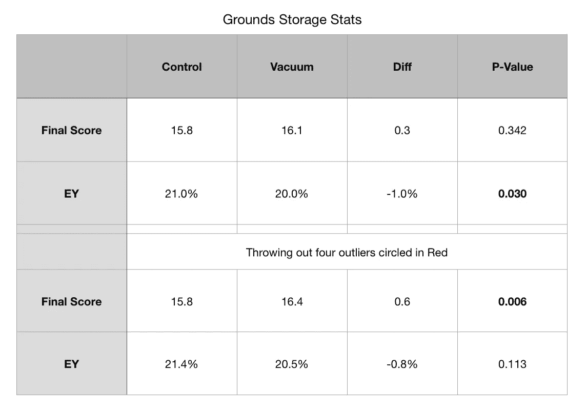

总的来说，真空罐比普通的密封罐味道更好。咖啡的储存有很多选择，困难在于如何确定一种方法是否比另一种更好。

[詹姆斯·霍夫曼确实制作了一个关于多个容器的视频](https://www.youtube.com/watch?v=K0JWuhE8a-w)，他并没有发现密封容器和真空密封容器有太大的区别。我怀疑咖啡拔罐和浓缩咖啡或其他冲泡方法之间有一些差异，但我想把数据放在我使用的储存方法上。

如果你愿意，可以在 [Twitter](https://mobile.twitter.com/espressofun?source=post_page---------------------------) 和 [YouTube](https://m.youtube.com/channel/UClgcmAtBMTmVVGANjtntXTw?source=post_page---------------------------) 上关注我，我会在那里发布不同机器上的浓缩咖啡照片和浓缩咖啡相关的视频。你也可以在 [LinkedIn](https://www.linkedin.com/in/robert-mckeon-aloe-01581595?source=post_page---------------------------) 上找到我。

# 我的进一步阅读:

[按地区、工艺、等级和价格分类的咖啡](/coffees-by-region-process-grade-and-price-7e17c3c44baf)

[家庭烘焙咖啡的经济学](/the-economics-of-home-roasting-coffee-93003ea31ee8)

[咖啡豆脱气](/coffee-bean-degassing-d747c8a9d4c9)

[解构咖啡:分割烘焙、研磨和分层以获得更好的浓缩咖啡](/deconstructed-coffee-split-roasting-grinding-and-layering-for-better-espresso-fd408c1ac535)

[浓缩咖啡的预浸:更好的浓缩咖啡的视觉提示](/pre-infusion-for-espresso-visual-cues-for-better-espresso-c23b2542152e)

[咖啡的形状](/the-shape-of-coffee-fa87d3a67752)

[搅拌还是旋转:更好的浓缩咖啡体验](https://towardsdatascience.com/p/8cf623ea27ef)

[香辣浓缩咖啡:热磨，冷捣以获得更好的咖啡](/spicy-espresso-grind-hot-tamp-cold-36bb547211ef)

[断续浓缩咖啡:提升浓缩咖啡](https://towardsdatascience.com/overthinking-life/staccato-espresso-leveling-up-espresso-70b68144f94)

[用纸质过滤器改进浓缩咖啡](/the-impact-of-paper-filters-on-espresso-cfaf6e047456)

[浓缩咖啡中咖啡的溶解度:初步研究](/coffee-solubility-in-espresso-an-initial-study-88f78a432e2c)

[断奏捣固:不用筛子改进浓缩咖啡](/staccato-tamping-improving-espresso-without-a-sifter-b22de5db28f6)

[浓缩咖啡模拟:计算机模型的第一步](https://towardsdatascience.com/@rmckeon/espresso-simulation-first-steps-in-computer-models-56e06fc9a13c)

[更好的浓缩咖啡压力脉动](/pressure-pulsing-for-better-espresso-62f09362211d)

[咖啡数据表](https://towardsdatascience.com/@rmckeon/coffee-data-sheet-d95fd241e7f6)