# 按地区、工艺、等级和价格分类的咖啡

> 原文：<https://towardsdatascience.com/coffees-by-region-process-grade-and-price-7e17c3c44baf?source=collection_archive---------36----------------------->

## 300+有等级和价格的豆子

我喜欢从甜甜的玛丽亚店里买青豆。我已经烤了 6 年了，我大部分的青豆都是从那里买的。不过，我很好奇 Q 分数与成本的趋势如何，所以我调出了他们所有的数据，做了一些简单的分析。简而言之，我发现一个总的趋势是成本，所以你必须支付更多的钱来获得更高得分的豆子，这应该是更高的质量。我还发现，某些功能与成本的关联比其他功能更大。

主要的警告是，这些豆子是基于甜蜜玛丽亚的采购，这在一定程度上是基于他们的客户群。因此，由于他们的策展，任何分析都不能超越甜蜜的玛丽亚。在多个卖家之间进行这种类型的分析会非常有趣，但他们的数据不像 Sweet Maria 的那样容易获取。

# q 分数

Sweet Maria 的[与 SCA 标准](https://library.sweetmarias.com/the-evolution-of-sweet-marias-cupping-descriptions/)略有不同，总结如下:

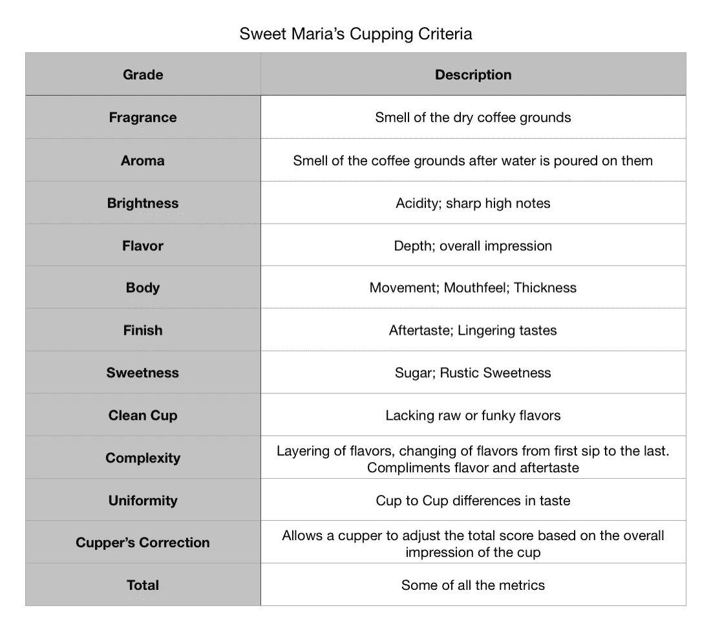

# 原始数据

从甜甜的玛丽亚那里提取数据并不容易。他们没有数据库可以提取，但是他们有 300 多种豆子的档案。所以我同时观察它们，然后选择每一颗豆子进行比较。这给了我一个初始表，但我没有分数。

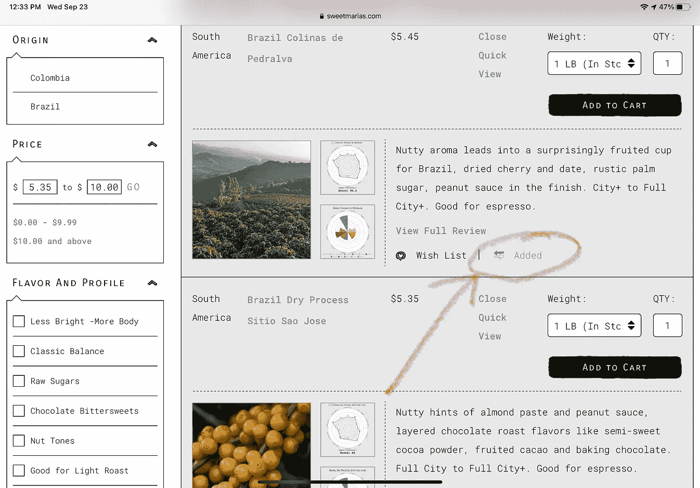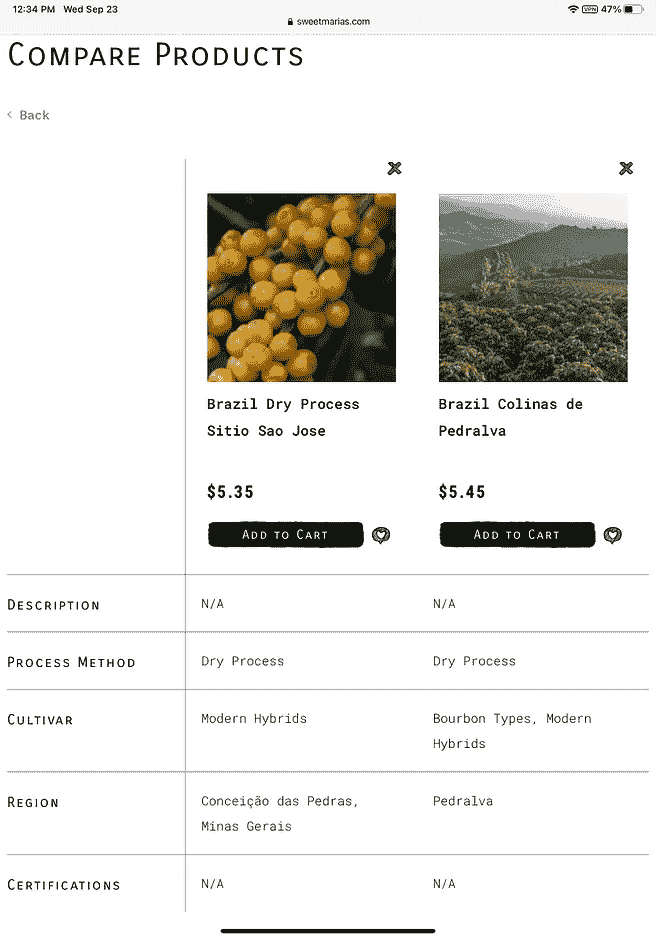

经 Sweet Maria's 许可分享的截图

对于 Q 分数，我点击图像进行评分，我对所有 300+的豆子都这样做了。

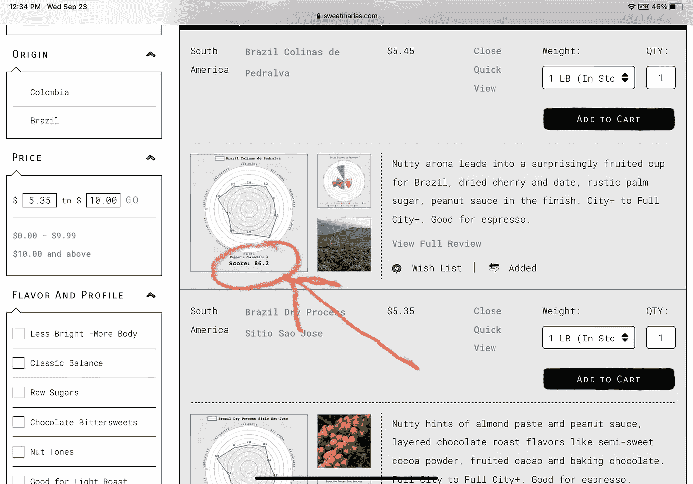

经 Sweet Maria's 许可分享的截图

从这里，我选择一切，并将其保存到数据表。

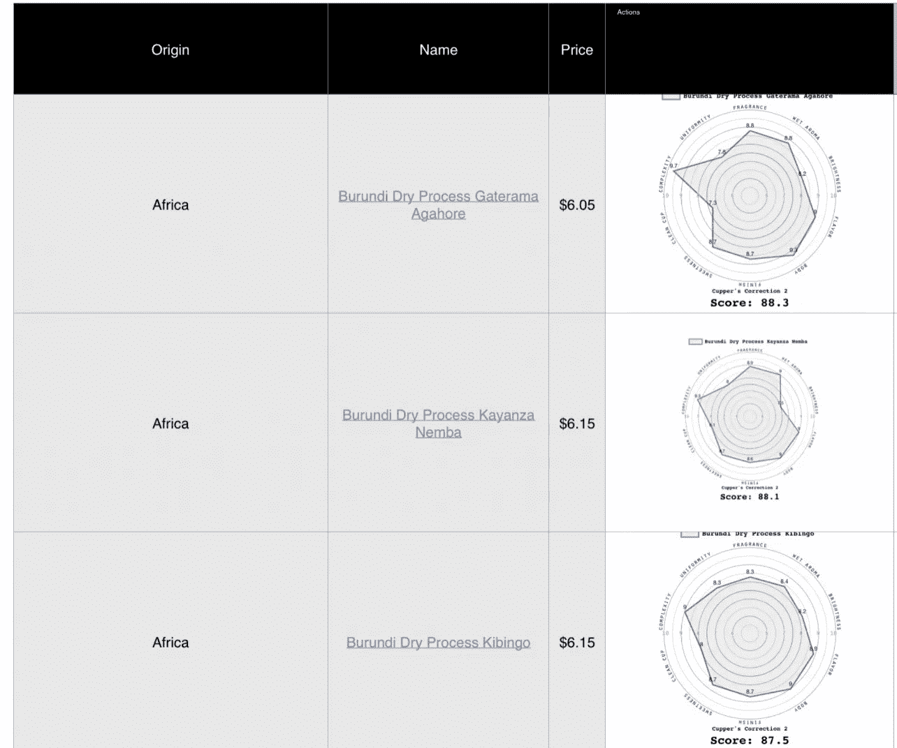

蜘蛛图的图像经 Sweet Maria 的许可共享

我使用这些数据将分数手动输入到一个新列中。我有机会看看其他数据，但我主要关心的是分数。这让我有了很好的干净的数据，但它确实需要一些时间和注意力。

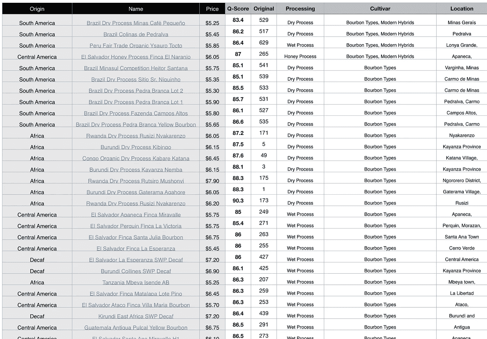

作者图片

# 成本与质量分析

总的来说，我发现了 Q 值和价格之间的趋势，但并不总是这样。我观察了每个地区，非洲咖啡豆在 Q 值中明显占主导地位，但与成本和质量关系更密切的南美咖啡豆相比，它们的成本趋势更宽松。

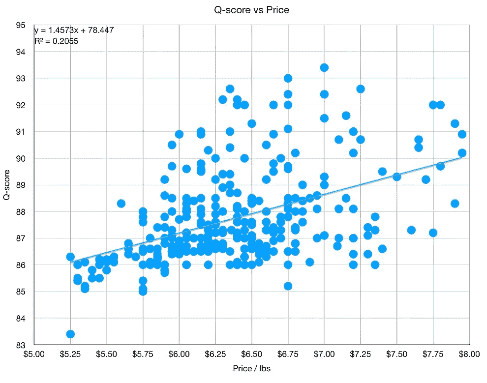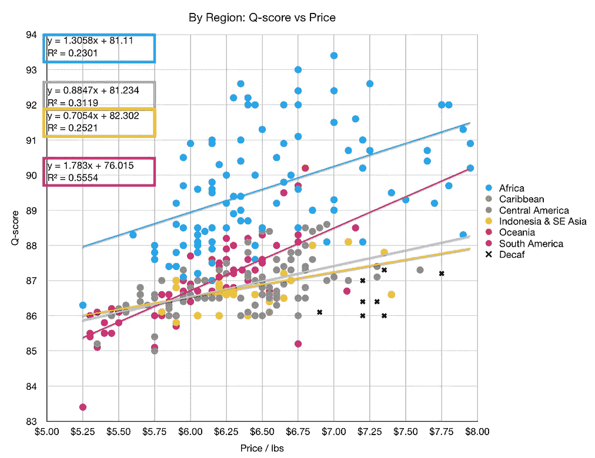

我还研究了加工和品种类型。这里的主要趋势是干法加工的成本比湿法加工的成本有更强的相关性。波旁威士忌的种类也与价格有很大的关系。

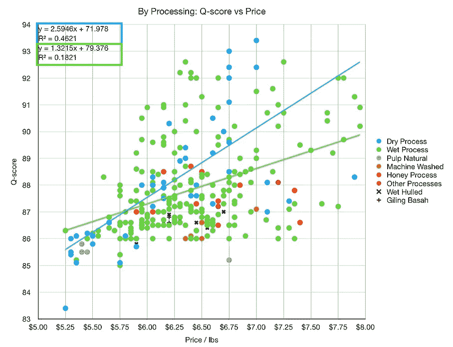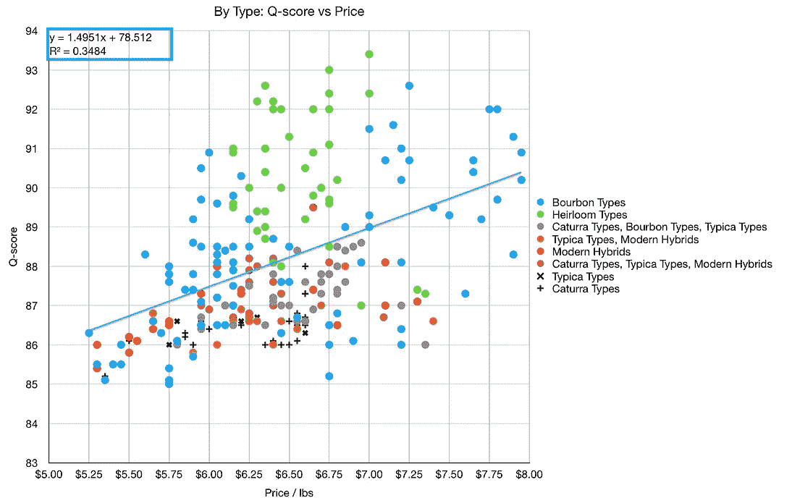

最后，我查看了这些指标中成本和质量之间的相关性。相关性是一种理解两个变量有多么不同以及它们彼此趋势如何的方法。相关性可以是正的(成比例相关)，也可以是负的(成反比相关)。

从地区来看，无咖啡因咖啡豆与价格呈负相关，但样本量很小。南美豆的质量和价格的相关性最高。

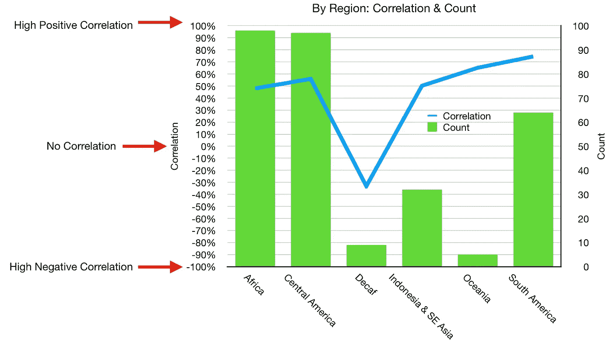

看看加工和类型，干加工比湿加工在质量和价格之间有更高的相关性，虽然其他一些数字在反弹，但他们几乎没有样本。

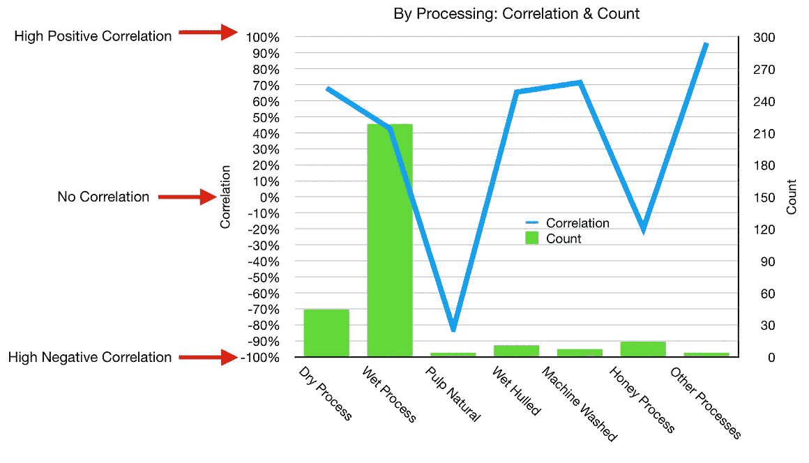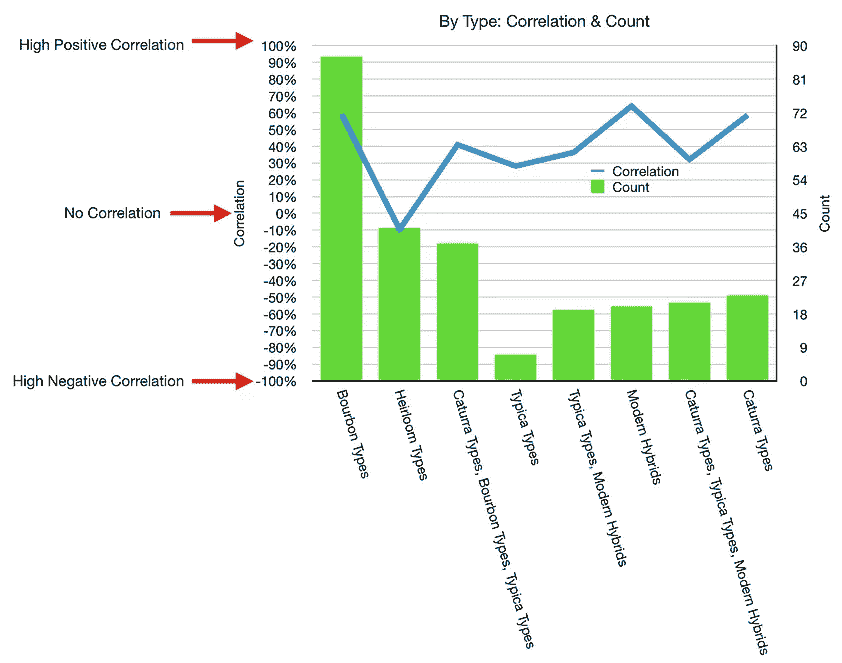

对于类型，波旁威士忌符合我们在图中看到的，这种传家宝在质量和价格之间没有相关性。

我查看了甜甜玛丽亚的咖啡库存，发现了等级和价格之间的一般关联。某些地区和加工类型的价格比其他地区高，但我很高兴地发现，当我花费更多时，我通常会获得更多的质量。

如果你愿意，可以在 Twitter 和 YouTube 上关注我，我会在那里发布不同机器上的浓缩咖啡视频和浓缩咖啡相关的东西。你也可以在 [LinkedIn](https://www.linkedin.com/in/robert-mckeon-aloe-01581595?source=post_page---------------------------) 上找到我。

# 我的进一步阅读:

家庭烘焙咖啡的经济效益

[咖啡豆脱气](/coffee-bean-degassing-d747c8a9d4c9)

[解构咖啡:分割烘焙、研磨和分层以获得更好的浓缩咖啡](/deconstructed-coffee-split-roasting-grinding-and-layering-for-better-espresso-fd408c1ac535)

[浓缩咖啡的预浸:更好的浓缩咖啡的视觉提示](/pre-infusion-for-espresso-visual-cues-for-better-espresso-c23b2542152e)

[咖啡的形状](/the-shape-of-coffee-fa87d3a67752)

[搅拌还是旋转:更好的浓缩咖啡体验](https://towardsdatascience.com/p/8cf623ea27ef)

[香辣浓缩咖啡:热磨，冷捣以获得更好的咖啡](/spicy-espresso-grind-hot-tamp-cold-36bb547211ef)

[断续浓缩咖啡:提升浓缩咖啡](https://towardsdatascience.com/overthinking-life/staccato-espresso-leveling-up-espresso-70b68144f94)

[用纸质过滤器改进浓缩咖啡](/the-impact-of-paper-filters-on-espresso-cfaf6e047456)

[浓缩咖啡中咖啡溶解度的初步研究](/coffee-solubility-in-espresso-an-initial-study-88f78a432e2c)

[断奏捣固:不用筛子改进浓缩咖啡](/staccato-tamping-improving-espresso-without-a-sifter-b22de5db28f6)

[浓缩咖啡模拟:计算机模型的第一步](https://towardsdatascience.com/@rmckeon/espresso-simulation-first-steps-in-computer-models-56e06fc9a13c)

[更好的浓缩咖啡压力脉动](/pressure-pulsing-for-better-espresso-62f09362211d)

[咖啡数据表](https://towardsdatascience.com/@rmckeon/coffee-data-sheet-d95fd241e7f6)

[浓缩咖啡过滤器分析](/espresso-filters-an-analysis-7672899ce4c0)