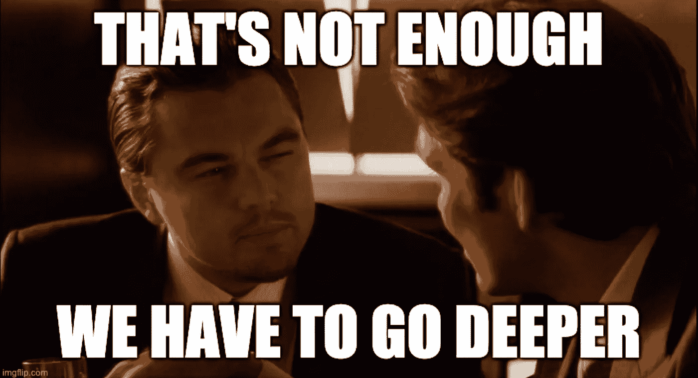

# 数据科学家面临的 8 种认知偏见

> 原文：<https://towardsdatascience.com/cognitive-biases-facing-data-scientists-86489e99dea8?source=collection_archive---------27----------------------->

## 通过放弃不合理的思维模式来提高你的效率

由来自[像素](https://www.pexels.com/photo/portrait-photo-of-woman-in-yellow-t-shirt-doing-the-shh-sign-while-standing-in-front-of-blue-background-3761018/?utm_content=attributionCopyText&utm_medium=referral&utm_source=pexels)的上的[声音拍摄](https://www.pexels.com/@sound-on?utm_content=attributionCopyText&utm_medium=referral&utm_source=pexels)

作为数据科学家，我们帮助公司做出最佳决策。

但是认知偏差，潜意识的非理性思维模式，会导致我们自己做出糟糕的决定。

我将分享我在作为软件工程和数据科学家的职业生涯中遇到的 8 个认知偏见和例子。

# 1.承诺升级

经济学中称之为**【沉没成本谬误】**。

> **承诺升级**是一种人类行为模式，在这种模式下，个人或团体面对因[决策](https://en.wikipedia.org/wiki/Decision-making)、行动或投资而产生的越来越多的负面结果时，仍然会继续这种行为，而不是改变方向。
> - [维基百科](https://en.wikipedia.org/wiki/Escalation_of_commitment)

这是一种趋势，即尽管有证据表明剩余成本大于收益，但仍继续向现有项目投资资源，因为已经投入了大量资源。

> 一不做，二不休。

在对一个新的 NLP 管道工作了一个月之后，我了解到它只会比现有的模型稍微好一点。

新模型还需要一周才能完成，而且还有其他项目需要我的技能。尽管如此，我有强烈的愿望去完成当前的项目，因为我已经投入了这么多时间。这是“承诺升级”。

照片由 [Miles Iwes](https://www.pexels.com/@miles-iwes-1059733?utm_content=attributionCopyText&utm_medium=referral&utm_source=pexels) 从 [Pexels](https://www.pexels.com/photo/aerial-view-of-blue-and-brown-ship-3208343/?utm_content=attributionCopyText&utm_medium=referral&utm_source=pexels) 拍摄

从逻辑上讲，如果从事其他工作的边际收益更高，你应该去做。

也就是说，这种认知偏见可能在一个组织中根深蒂固，以至于你别无选择，只能完成当前的项目，即使只是为了光学(又名。这样就不难看了)。

# 2.规划谬误

低估一个项目需要多长时间才能完成。

> **计划谬误**是一种现象，在这种现象中，对完成未来任务所需时间的预测显示出一种[乐观偏见](https://en.wikipedia.org/wiki/Optimism_bias)并低估了所需时间。
> - [维基百科](https://en.wikipedia.org/wiki/Planning_fallacy)

众所周知，软件工程师和数据科学家大大低估了构建东西所需的时间。

来自 [Pexels](https://www.pexels.com/photo/ideas-whiteboard-person-working-7369/?utm_content=attributionCopyText&utm_medium=referral&utm_source=pexels) 的[启动股票照片](https://www.pexels.com/@startup-stock-photos?utm_content=attributionCopyText&utm_medium=referral&utm_source=pexels)

我的技术人员在我的公司工作期间低估了完成每一个功能的时间。尽管在一对一的会议上，我明确地告诉他们要加倍他们的估计(但没有用),这样他们就不会在管理层看来很糟糕。

我个人的经验是将我的项目时间表延长两倍。有趣的是，这更接近实际需要的时间。

# 3.确认偏差

> **确认偏好**是指以确认或强化个人先前的[信念](https://en.wikipedia.org/wiki/Belief)或价值观的方式搜索、解释、偏好和回忆信息的倾向。
> - [维基百科](https://en.wikipedia.org/wiki/Confirmation_bias)

确认偏差是无意中挑选与给定假设一致的信息。

我有几个同事被一位经理告知要找到更好的证据来支持一个特定的论点(而不是采取适当的样本)。虽然这个方向可能来自高层，但它也可能在你寻找证据来支持/否定你想要构建的新特性时下意识地显现出来。

根据我的经验，避免确认偏差的最好方法是在开始工作之前决定如何评估一个实验/特征。

# 4.知识的诅咒

> 知识的诅咒是一种认知偏差，当一个人与其他人交流时，不知不觉地认为其他人有理解的背景，这种偏差就会发生。
> - [维基百科](https://en.wikipedia.org/wiki/Curse_of_knowledge)

在某个领域有很强能力的人可能很难向缺乏技术背景的人解释相关概念。

来自 [Pexels](https://www.pexels.com/photo/engineers-in-workshop-3862618/?utm_content=attributionCopyText&utm_medium=referral&utm_source=pexels) 的 [ThisIsEngineering](https://www.pexels.com/@thisisengineering?utm_content=attributionCopyText&utm_medium=referral&utm_source=pexels) 摄影

我曾经遇到过一个非常好奇的非技术主管，他会突然问我一些技术问题。单词嵌入是如何工作的？波斯特格雷的 XYZ 指数是什么？

作为那种说话前需要思考的人，我经常笨手笨脚地试图找出如何向没有背景的人解释。这是知识的诅咒。

我最初开始在媒体上写作是为了帮助我理清思路，提高我的解释能力。

# 5.盲点偏差

> **偏见盲点**就是[认知偏见](https://en.wikipedia.org/wiki/Cognitive_bias)认识到偏见对他人判断的影响，而看不到偏见对自己判断的影响。

我们认识到其他人的偏见，但不是我们自己。

在多次失败的实验中，我对无监督学习产生了强烈的厌恶，因为它没有解决给定的问题。

当偏见导致我在头脑风暴会议期间否决无监督学习解决方案而没有真正考虑它们的优点时，这就成了问题。

过去的经验不应该妨碍正确的分析，否则会错过宝贵的机会。看到自己的偏见需要大量的自省(或真正诚实的同事)。

# 6.集体思考

> **群体思维**是一种心理[现象](https://en.wikipedia.org/wiki/Phenomenon)，发生在一个[人群](https://en.wikipedia.org/wiki/Social_group)中，群体中对和谐[或](https://en.wikipedia.org/wiki/Conformity)从众的渴望导致了一个非理性或功能失调的[决策](https://en.wikipedia.org/wiki/Decision-making)结果。
> - [维基百科](https://en.wikipedia.org/wiki/Groupthink)

潜意识中对达成一致的渴望压倒了理性的决策。

从包括 Techstars 在内的多个创业加速器毕业后，我得出的结论是，这是创业公司内部的常态。

在之前的一家公司，联合创始人(包括我自己)经历了一波自我强化的乐观主义，最终走向了失败。作为一个团队，我们低估了开发的复杂性，高估了客户的接受度。

许多有趣的研究和文章都是关于群体思维的，包括美国宇航局的挑战者号灾难。

# 7.票据法律

> 被称为**乐器定律**的概念，或者被称为**锤子定律**、[【1】](https://en.wikipedia.org/wiki/Law_of_the_instrument#cite_note-1)**马斯洛的锤子**(或木槌)或**金锤子**、[【a】](https://en.wikipedia.org/wiki/Law_of_the_instrument#cite_note-2)是一种[认知偏差](https://en.wikipedia.org/wiki/Cognitive_bias)，涉及到对一种熟悉工具的过度依赖。
> - [维基百科](https://en.wikipedia.org/wiki/Law_of_the_instrument)

偏向于使用熟悉的工具，即使它们对某项任务来说可能不是最佳的。

> 如果你只有一把锤子，所有的东西看起来都像钉子。—亚伯拉罕·马斯洛

当我第一次进入机器学习的时候，我唯一感到舒服的库是 sklearn。所以每次有新任务出现，我就琢磨怎么用 sklearn 解决。

在我深入研究 NLP 之前，这种方法一直工作得很好，因为 NLP 有许多更合适的包。当我试图用我所知道的破解解决方案而不是探索更好的选择时，时间被浪费了。

现在，我试图在每个问题上从头开始，评估现有的工具，以及研究新的工具。

# 8.从众情绪

> 跟风效应是一种现象，在这种现象中，信仰、想法、[时尚和趋势被他人采纳的速度越快。
> -](https://en.wikipedia.org/wiki/Fads_and_trends) [维基百科](https://en.wikipedia.org/wiki/Bandwagon_effect)

以某种方式做某事是因为你反复听到别人这么做，而不是自己进行客观的评估。

> 我们把它扔给神经网络吧。

我听说过在太多情况下使用神经网络的建议，当时一个不太复杂的模型就足够了。我把这归咎于跟风效应和人们不断在新闻中听到神经网络。

有趣的是，我猜想大多数“人工智能驱动”的产品都不是由深度学习驱动的。但是阅读《麻省理工科技评论》或《T2 科技危机》时，你会得到相反的印象。

[Imgflip](https://imgflip.com/memegenerator)

# 结论

我们生活在一个极其复杂的世界里，不可能分析每一条信息。我假设我们发展了这些偏见来减少与日常活动相关的精神负担。

一些启发是有帮助的。有些不是。但是根据定义，如果我们能够减少这些经过充分研究的负面偏见对我们自己的影响，我们就能够成为组织中更有效的决策者。