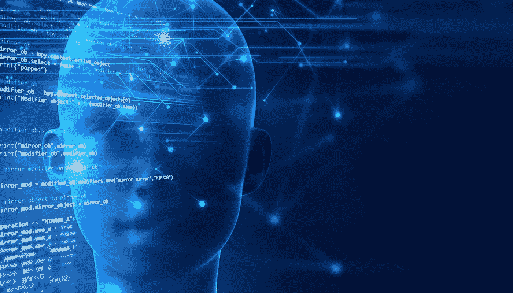

# 认知计算。它能用来做什么？

> 原文：<https://towardsdatascience.com/cognitive-computing-what-can-it-be-used-for-8af4721928f5?source=collection_archive---------30----------------------->

## 计算机还会以任何方式让我们吃惊吗？一些令人惊讶的潜力可能存在于认知计算中——一套被广泛认为是人工智能最重要的表现的技能。

早在我的大学时代，后来在我职业生涯的开始，我写软件。我挣了作为程序员的第一份薪水。我经常熬夜，甚至通宵纠正无尽的代码错误。有时候，我写的代码终于开始做我想让它做的事情，服务于它的预期目的。随着时间的推移，这样的时刻变得越来越频繁。我经常想程序员是否会被取代。但是怎么做，用什么做？我喜欢的科幻文学充斥着机器人、人工智能和自学技术的故事，它们超越了自己的界限，开始违反规则、程序和算法。这些技术设法从错误中学习并积累经验。那时候都是科幻小说。一个除了程序员分配给它的任务之外还能做任何事情的计算机程序？真是错觉。但是后来我又碰到了其他概念，比如自学习机器，神经网络。

事实证明，一个计算机程序可以积累经验，并用它来修改自己的行为。实际上，机器从经验中学习，这些经验要么是它们自己直接获得的，要么是植入它们记忆中的。我了解了模拟人脑的算法。他们在寻找特定问题的最佳解决方案时进行自我调整。我了解了认知计算，我想在这篇文章中分享我对这个主题的思考。

## 当电脑处理数字时，它会观察我的脸

所有现有的认知计算定义都有一些共同的特征。一般来说，这个术语指的是主要来自对人脑功能的研究的技术集合。它描述了各种人工智能和信号处理的结合。两者都是机器意识发展的关键。它们体现了先进的工具，如机器的自我学习和推理，这些机器可以得出自己的结论，处理自然语言，产生语音，与人类互动等等。这些都是人机协作的方面。简而言之，认知计算一词指的是一种模仿人脑处理信息的方式并增强人类决策的技术。

## **认知计算。它能用来做什么？**

认知计算模仿人类思维。它增加了使用它的设备，同时增强了用户自身的能力。认知机器可以主动理解这种语言，并对从自然语言交互中提取的信息做出反应。它们还能识别物体，包括人脸。它们的复杂程度是人类历史上任何产品都无法比拟的。

## 诺贝特，该吃点心了

本质上，认知计算是一组使机器变得更加智能，同时也更加人性化的特性和属性。认知计算可以被视为技术游戏规则的改变者，以及连接人和他们操作的机器的一种新的、微妙的方式。虽然它既不是情感的也不是精神的，但这种联系肯定不仅仅是主体和客体之间的关系。

由于这一特性，Siri(苹果公司)等电脑助手必然会逐渐变得更像人类。开发这些功能的努力将集中在计算机技术开发者面临的最大挑战上。这是为了让机器准确理解人类，即不仅理解人们提出的问题，还理解他们的潜在意图和来自用户的有意义的暗示，这些用户正在处理给定的问题。换句话说，机器应该考虑人类行为的概念和社会背景。一个例子？向电脑助手提出一个关于一天中的时间的简单问题，可能很快就会得到一个就事论事的回答，然后是一个真诚的建议:“现在是下午 1:30。休息一下，吃点点心怎么样？你说呢，诺贝特？”

## **亲爱的机器——请给我建议**

我想在这里停一会儿，让读者参考我以前的[机器学习](https://norbertbiedrzycki.pl/en/machine-learning-computers-coming-of-age/)文章。在这篇文章中，我说机器技术使计算机能够学习，从而更有效地分析数据。机器学习增加了计算机的整体“经验”，它通过执行任务来积累这些经验。例如， [IBM 的沃森](https://norbertbiedrzycki.pl/en/what-a-machine-will-think-when-it-looks-us-in-the-eye/)，我在许多场合提到过的计算机，理解自然语言问题。为了回答这些问题，它搜索了各种各样的大型数据库，无论是商业、数学还是医学数据库。随着每一个连续的问题(任务)，计算机磨练它的技能。它吸收的数据越多，接受的任务越多，它的分析和认知能力就越强。

[机器学习](https://norbertbiedrzycki.pl/en/machine-learning-computers-coming-of-age/)已经是一项复杂的、尽管非常基础的机器技能，其[与人脑](https://norbertbiedrzycki.pl/en/how-machines-think-2/)相似。它允许基于经验的各种自我改进。然而，直到认知计算进入画面，用户才能真正享受与实际智能技术的交互。该机器不仅提供结构化信息的访问，还能自主编写算法并提出问题的解决方案。例如，一名医生可能希望 IBM 的沃森不仅要筛选数十亿条信息([大数据](https://norbertbiedrzycki.pl/en/big-data-new-player-in-sports-2/))并使用它来得出正确的结论，还要为解决手头的问题提供思路。

在这一点上，我想提供一个来自日常经验的例子。车载汽车导航系统依赖于大量的地形数据，它分析这些数据以生成地图。然后显示地图，包括从所请求的 A 点到 B 点的路线，并适当考虑用户的旅行偏好和先前的路线选择。这依赖于机器学习。然而，直到机载机器建议了一条避开繁忙交通的特定路线，同时融入了我们的习惯，它才开始接近认知计算。

## **数字运算并不代表一切**

所有这些都很好，但是今天的工程师们是从哪里得到这样的想法，计算机不应该只是快速处理数字？IBM 阿尔马登研究中心(Almaden Research Center)的负责人杰弗里·韦尔泽(Jeffrey Welser)花了近 50 年的时间开发人工智能，他给出了这个简单的答案:“人类的大脑不能很好地处理数字，但它可以很好地处理其他事情，如玩游戏、策略、理解谜语和自然语言，以及识别人脸。所以我们研究了如何让计算机做到这一点”。

使用算法和自我学习来开发一台帮助人类决策的机器的努力已经产生了惊人的效果。在设计沃森的过程中，IBM 显著提高了技术世界的标准。

## **我们现在如何应用它？**

对人脑的研究已经成为推进信息技术的跳板，毫无疑问，它将对我们的生活产生更广泛的影响，影响到商业、安全、安保、营销、科学、医学和工业等领域。“看到”理解自然语言和识别物体的计算机可以帮助每个人，从普通的学校教师到寻找癌症治疗方法的科学家。在商业领域，随着时间的推移，这项技术应该有助于更有效地利用人力资源，找到获得新能力的更好方法，并最终放松因坚持传统管理模式而导致的僵化的公司规则。在医学领域，已经有很多关于医生对优秀分析工具——IBM 的 Watson——的希望的文章。在医疗保健领域，Watson 将即时浏览患者的病史，帮助诊断健康状况，并使医生能够即时访问以前无法在要求的时间范围内检索到的信息。这可能成为诊断和治疗尚不能治愈的疾病的重大突破。

沃森已经引起了肿瘤学界的极大兴趣，其成员对计算机快速搜索巨型癌症数据库(这对癌症治疗至关重要)并为医生提供重要提示的能力寄予厚望。

与[量子计算](https://norbertbiedrzycki.pl/en/only-god-can-count-that-fast-the-world-of-quantum-computing/)相结合，这将成为解决复杂技术问题的强大工具。即使在今天，营销专家也认识到认知计算系统的价值，它在自动化、客户关系和服务个性化方面发挥着越来越重要的作用。数据处理、战略规划和建模非常重要的人类活动的每个领域，最终都将受益于这些技术突破。

## **第三个机器时代**

有些人甚至宣称认知计算将开启第三个 IT 时代。20 世纪早期，计算机仅仅被视为计数机器。从 20 世纪 50 年代开始，他们开始依赖庞大的数据库。在 21 世纪，计算机学会了看、听和思考。由于人类思维是一个复杂的过程，其结果往往是不可预测的，也许我们可以假设，人类和机器的认知联盟将很快导致现在难以预见的发展。

未来的机器必须改变人们获取和拓宽知识的方式，以实现“认知”加速。然而，不管未来会带来什么，今天，随着其更有效的思维，计算机正变得越来越令人兴奋。

相关文章:

- [只有上帝才能数得那么快——量子计算的世界](https://norbertbiedrzycki.pl/en/only-god-can-count-that-fast-the-world-of-quantum-computing/)

——[机器学习。计算机时代的到来](https://norbertbiedrzycki.pl/en/machine-learning-computers-coming-of-age/)

- [根据我们的电脑…你不存在](https://norbertbiedrzycki.pl/en/according-our-computers-you-dont-exist/)

图片来源:Shutterstock