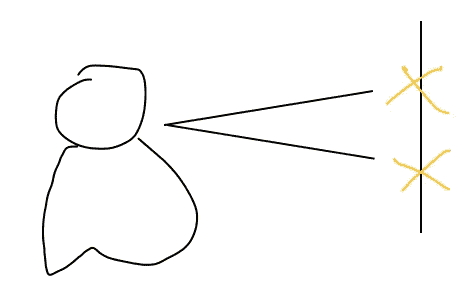
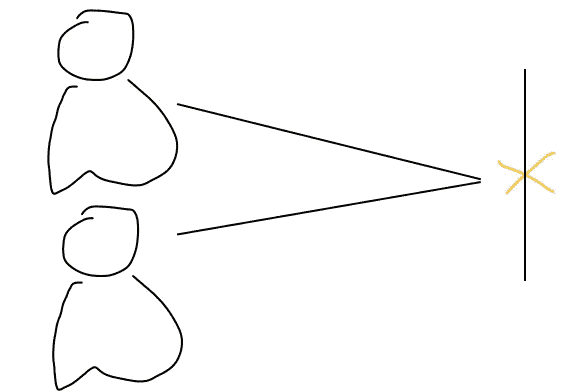

# 科恩的卡帕

> 原文：<https://towardsdatascience.com/cohens-kappa-9786ceceab58?source=collection_archive---------1----------------------->

## 理解科恩的卡帕系数

我第一次在 Kaggle 上看到 Cohen 的 kappa 是在[数据科学碗](https://www.kaggle.com/c/data-science-bowl-2019)比赛期间——尽管我没有积极参加比赛，而且指标是二次加权 Kappa，但我还是用一个内核来试验这个指标，看看它是如何工作的，因为我以前从未见过它。利物浦[大学离子交换](https://www.kaggle.com/c/liverpool-ion-switching/overview/description)竞赛的启动为我提供了另一个更好地理解这一指标的机会，尽管这一次我将积极参赛，因为这是我告诉自己今年将做得更多的事情。既然我已经让自己对公众负责，让我们来打破科恩的卡帕。

对于那些关注我的帖子的人，你会知道我喜欢把我的帖子分成更小的部分来理解，然后把它们连接起来。这篇文章也不例外，到最后，你将能够:

*   区分信度和效度
*   解释科恩的卡帕
*   评估科恩的卡帕

**效度和信度**

在进入科恩的 Kappa 之前，我想先奠定一个关于有效性和可靠性的重要基础。当我们谈论有效性时，我们关心的是测试在多大程度上测量了它声称要测量的东西，或者换句话说，测试有多准确。另一方面，可靠性更关心的是测试在一致的条件下产生相似结果的程度，或者换句话说，测试的精确度。

利用离子转换竞争问题，我将把这两种测量方法放在一起看，这样我们就知道如何区分它们。

利物浦大学的问题是，当离子通道打开时，现有的检测方法既慢又费力，因此他们希望数据科学家采用机器学习技术来快速自动检测原始数据中的离子通道当前事件，因此他们为我们提供了激动人心的[离子切换](https://www.kaggle.com/c/liverpool-ion-switching/overview/description)比赛。有效性将测量所获得的分数是否代表离子通道是否打开，可靠性将测量所获得的分数在识别通道打开或关闭时是否一致。

图 1:*可靠性*和有效性的飞镖靶示例。《研究方法知识库》，第二版。互联网 WWW 页面，网址:【https://www.socialresearchmethods.net/kb/ (截至 2020 年 1 月 30 日的最新版本)。

为了使实验结果有用，实验的观察者必须对其解释达成一致，否则观察者的主观解释就会起作用，因此良好的可靠性是很重要的。然而，信度可以分为不同的类型，**评分者内信度**和**评分者间信度。**

评分者内部的可靠性与同一个人所做的不同测量之间的一致程度有关。

图 2:评分者内部信度示意图

评分者之间的可靠性与两个或更多评分者之间的一致程度有关。

图 3:评分者间信度示意图

**什么是科恩的 Kappa？**

> Cohen 的 kappa 测量两个评分者之间的一致程度，他们将 *N* 个项目分成 *C* 个互斥的类别。

一个简单的想法是，科恩的 Kappa 是对评价同一事物的两个评价者的可靠性的定量测量，根据评价者偶然同意的频率进行了校正。

**评估科恩的 Kappa**

kappa 的值可以小于 0(负值)。0 分意味着评分者之间随机达成一致，而 1 分意味着评分者之间完全一致。因此，小于 0 的分数意味着一致性小于随机机会。下面，我将向你展示解决这个问题的公式，但重要的是，你要熟悉图 4，以便有更好的理解。

图 4:用于解释评定者结果的 N×N 网格

我突出显示两个网格的原因将在一会儿变得清楚，但是现在，让我分解每个网格。

**A** = >两位评分者都说正确的例子总数。评分者们意见一致。

**B** = >评定者 2 认为不正确，但评定者 1 认为正确的实例总数。这是一个分歧。

**C** = >评定者 1 认为不正确，但评定者 2 认为正确的实例总数。这也是一个分歧。

两个评分者都说不正确的情况总数。评分者都同意。

为了计算出 kappa 值，我们首先需要知道一致的概率(这解释了为什么我突出了一致对角线)。这个公式是通过将评分者同意的测试次数相加，然后除以测试总数得出的。使用图 4 中的例子，这意味着(A + D)/(A + B+ C+ D)。

图 5:达成一致的可能性

完美！下一步是计算出随机一致的概率。使用*图 4* 作为指导，期望值是评价人 1 说正确的总次数除以实例总数，乘以评价人 2 说正确的总次数除以实例总数，加上评价人 1 说不正确的总次数乘以评价人 2 说不正确的总次数。这需要考虑很多信息，所以在图 6 中，我用上面的网格列出了这个等式。

图 6:推导随机一致概率的公式

最后，Cohen 的 Kappa 公式是一致概率去掉随机一致概率除以 1 减去随机一致概率。

图 7:科恩的卡帕系数公式。

太好了！你现在能够区分可靠性和有效性，解释科恩的 kappa 并对其进行评估。这个统计非常有用，尽管自从我理解了它是如何工作的，我现在相信当优化算法到一个特定的度量时，它可能没有被充分利用。此外，科恩的 kappa 也很好地衡量了多类别和不平衡的类别问题。

**附言**如果你想让我报道一些与数据科学有关的事情，你可以直接在 Twitter 上给我发消息 [@KurtisPykes](https://twitter.com/KurtisPykes) 或者回复这个帖子。

维基百科定义。科恩的卡帕头。[https://en.wikipedia.org/wiki/Cohen%27s_kappa](https://en.wikipedia.org/wiki/Cohen%27s_kappa)

薄荷 TMS 教程由基督教霍尔曼。(2015 年 4 月 5 日)。*卡帕系数。*[https://www.youtube.com/watch?v=fOR_8gkU3UE](https://www.youtube.com/watch?v=fOR_8gkU3UE)

查尔斯·赞恩茨。*科恩的卡帕。*[http://www . real-statistics . com/reliability/inter rater-reliability/cohens-kappa/](http://www.real-statistics.com/reliability/interrater-reliability/cohens-kappa/)