# 科恩的卡帕:它是什么，什么时候使用它，以及如何避免它的陷阱

> 原文：<https://towardsdatascience.com/cohens-kappa-what-it-is-when-to-use-it-and-how-to-avoid-its-pitfalls-e42447962bbc?source=collection_archive---------33----------------------->

## *当整体准确性有偏差时的替代方案，但不要盲目相信统计数据*

*由*[马瑞特威德曼](https://www.linkedin.com/in/maarit-widmann-02641a170/)

# 介绍

科恩的 kappa 是一个常用于评估两个评分者之间的一致程度的指标。它还可以用来评估分类模型的性能。

例如，如果我们有两个银行家，我们要求他们将 100 名客户分为两类进行信用评级，即*好*和*坏*，基于他们的信用价值，我们可以通过科恩的 kappa 来衡量他们的同意程度。

类似地，在分类模型的背景下，我们可以使用 Cohen 的 kappa 来比较机器学习模型预测和人工建立的信用评级。

像许多其他评估指标一样，科恩的 kappa 是基于混淆矩阵计算的。然而，与计算整体准确性相反，科恩的 kappa 考虑了类别分布的不平衡，因此解释起来可能更复杂。

在本文中，我们将指导您计算和解释 Cohen 的 Kappa 值，特别是与总体精度值进行比较。我们将表明，在由于类别分布的巨大不平衡而导致整体准确性失败的情况下，Cohen 的 kappa 可能会提供对模型性能的更客观的描述。一路上，我们还将介绍几个在解读科恩的 kappa 价值观时需要牢记的小技巧！

# 衡量不平衡数据集上的性能改进

让我们使用由 [UCI 机器学习库](https://archive.ics.uci.edu/ml/datasets/statlog+(german+credit+data))提供的德国信用数据来关注银行贷款的分类任务。在该数据集中，根据银行的标准，银行客户被分配了“坏”信用评级(30%)或“好”信用评级(70%)。出于本文的目的，我们通过 bootstrapping 夸大了目标类信用评级的不平衡，给出了 10%的“坏”信用评级和 90%的“好”信用评级:这是一个高度不平衡的数据集。夸大不平衡有助于我们在这篇文章中更清楚地区分“整体准确性”和“科恩的 kappa”。

让我们在目标列上使用分层抽样将数据划分为训练集(70%)和测试集(30%)，然后训练一个简单的模型，例如决策树。鉴于这两个阶层之间的高度不平衡，该模型的表现不会太好。然而，让我们将它的性能作为本次研究的基准。

图 1 显示了这个基线模型的混淆矩阵和准确性统计。该模型的总体精度相当高(87%)，暗示该模型的性能是可接受的。然而，在混淆矩阵中，我们可以看到，该模型在 30 个信用评级不佳的信用客户中，只能正确地对 9 个进行分类。这也可以从“坏”类的低敏感度值(仅为 30%)看出。基本上，决策树对大多数“好”客户进行了正确分类，而忽略了少数“坏”客户的必要表现。类别先验概率中的不平衡补偿了分类中的这种草率。现在让我们注意一下，Cohen 的 kappa 值仅为 0.244，在其范围[-1，+1]内。

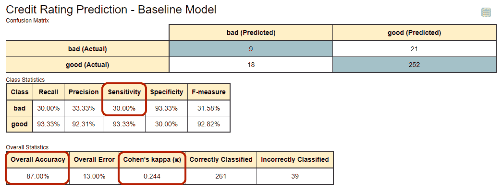

图 1:基线模型的混淆矩阵和准确性统计，即在高度不平衡的训练集上训练的决策树模型。总体准确率相对较高(87%)，尽管该模型只检测到少数信用评级不佳的客户(敏感度仅为 30%)。

让我们通过强迫模型承认少数类的存在来改善模型性能。我们这次在训练集上训练相同的模型，其中少数类已经使用 [SMOTE](https://en.wikipedia.org/wiki/Oversampling_and_undersampling_in_data_analysis#SMOTE) 技术过采样，两个类的类比例都达到 50%。

为了提供关于该模型的混淆矩阵的更多细节，具有“坏”信用评级的 30 个客户中的 18 个被该模型检测到，导致新的敏感度值为 60%,而不是之前的 30%。对于该模型，Cohen 的 kappa 统计值现在是 0.452，与之前的值 0.244 相比有显著的增加。但是整体的准确性呢？对于第二个模型，它是 89%，与之前的值 87%没有太大区别。

当总结时，我们得到两个非常不同的图片。从整体精度来看，模型性能根本没有太大变化。然而，根据科恩的 kappa 很多都变了！哪种说法是正确的？

*图 2:改进模型的混淆矩阵和准确性统计。决策树模型在更平衡的训练集上训练，其中少数类已被过采样。总体准确性几乎与基线模型相同(89%对 87%)。然而，Cohen 的 kappa 值显示出从 0.244 到 0.452 的显著增加。*

从混淆矩阵中的数字来看，似乎 Cohen 的 kappa 对模型在使用不平衡数据时的表现有更现实的看法。为什么科恩的 kappa 更关注少数民族阶层？实际是如何计算的？我们来看看吧！

# 科恩的卡帕

Cohen 的 kappa 通过以下公式计算[1]:

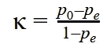

其中，p_0 是模型的总体精度，而 p_e 是模型预测和实际类值之间的一致性的度量，就好像是偶然发生的一样。

在像我们这样的二元分类问题中，p_e 是 p_e1 和 p_e2 的和，p _ E1 是预测值偶然与第 1 类(“好”)的实际值一致的概率，p _ E2 是预测值偶然与第 2 类(“坏”)的实际值一致的概率。假设两个分类器(模型预测和实际类值)是独立的，这些概率 p _ e2 和 p_e2 是通过乘以实际类的比例和预测类的比例来计算的。

将“坏”视为阳性类别，基线模型(图 1)将 9%的记录(假阳性加真阳性)归入“坏”类别，将 91%的记录(真阴性加假阴性)归入“好”类别。因此 p_e 为:

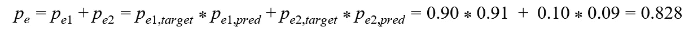

因此科恩的 kappa 统计数据:

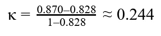

该值与图 1 中报告的值相同。

实际上，科恩的 kappa 排除了分类器和随机猜测一致的可能性，并测量了它做出的无法用随机猜测解释的预测的数量。此外，Cohen 的 kappa 试图通过考虑随机猜测的正确分类来纠正评估偏差。

# 科恩卡帕的痛点

在这一点上，我们知道 Cohen 的 kappa 在处理不平衡数据时是一个有用的评估指标。然而，科恩的卡帕也有一些缺点。让我们一个一个来看看。

# 全范围[-1，+1]，但不相等

如果目标阶层分布均衡，则更容易达到更高的科恩卡帕值。

对于基线模型(图 1)，预测类的分布紧密跟随目标类的分布:27 个预测为“差”对 273 个预测为“好”，30 个实际为“差”对 270 个实际为“好”。

对于改进的模型(图 2)，两个类别分布之间的差异更大:40 预测为“差”对 260 预测为“好”，30 实际为“差”对 270 实际为“好”。

如最大 Cohen kappa 的公式所示，预测和实际目标类别的分布差异越大，最大可达 Cohen kappa 值越低。最大 Cohen kappa 值表示混淆矩阵中假阴性或假阳性的数量为零的边缘情况，即所有具有良好信用评级的客户，或者所有具有不良信用评级的客户都被正确预测。

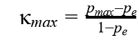

其中，p_max 是给定目标类和预测类的分布时，模型可达到的最大总精度:

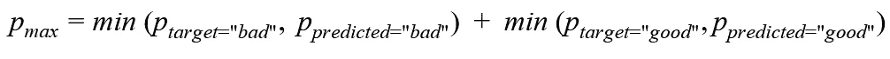

对于基线模型，我们得到 p_max 的以下值:

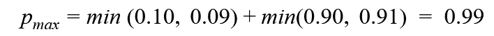

而对于改进的模型，它是:

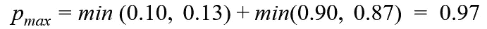

Cohen kappa 的最大值是基线模型的:

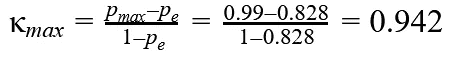

对于改进的模型，它是:

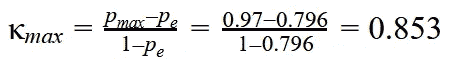

结果表明，实际目标类别和预测目标类别之间的分布差异较大的改进模型只能达到高达 0.853 的 Cohen kappa 值。而基线模型可以达到值 0.942，尽管性能更差。

# 对于平衡的数据，Cohen 的 kappa 更高

当我们计算 Cohen 的 kappa 时，我们强烈假设目标类和预测类的分布是独立的，并且目标类不影响正确预测的概率。在我们的例子中，这意味着具有良好信用评级的信用客户与具有不良信用评级的信用客户获得正确预测的机会相等。然而，因为我们知道我们的基线模型偏向于大多数“好”类，所以违反了这个假设。

如果这个假设没有被违反，就像在目标类平衡的改进模型中一样，我们可以达到更高的 Cohen kappa 值。这是为什么呢？我们可以把 Cohen 的 kappa 公式改写为正类概率的函数，当正类概率为 0.5 时函数达到最大值[1]。我们通过将相同的改进模型(图 2)应用于不同的测试集来测试这一点，其中积极的“坏”类的比例在 5%和 95%之间变化。我们通过引导原始测试数据为每个类分布创建 100 个不同的测试集，并根据结果计算平均 Cohen kappa 值。

图 3 显示了平均 Cohen 的 kappa 值与正类概率的对比——是的！当模型应用于平衡数据时，Cohen 的 kappa 确实达到了最大值！

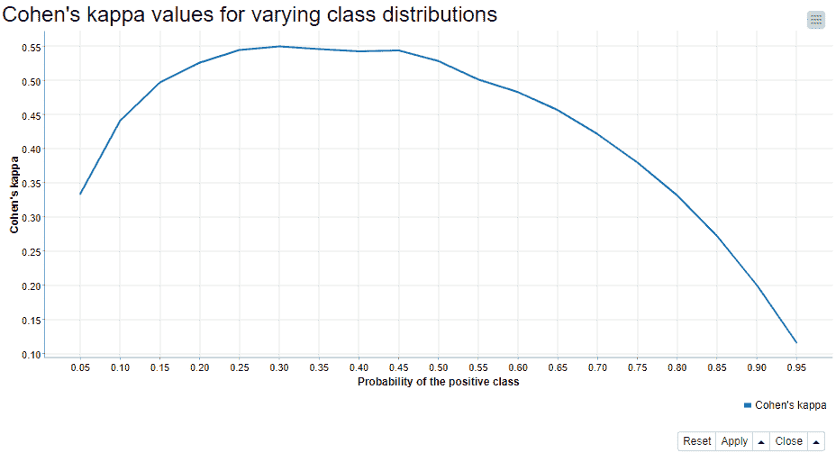

图 3。Cohen 的 kappa 值(在 y 轴上)是在测试数据(在 x 轴上)中具有不同正类概率的相同模型中获得的。y 轴上的 Cohen kappa 值被计算为所有 Cohen kappa 的平均值，该平均值是通过对固定类别分布的原始测试集进行 100 次自举而获得的。该模型是在平衡数据上训练的决策树模型，在文章开始时介绍过(图 2)。

科恩的 kappa 很少提到预期的预测准确性。

Cohen 的 kappa 的分子，(p_0 - p_e)，讲的是模型的观测整体精度和偶然可以得到的整体精度的差别。公式的分母(1- p_e)表示这个差值的最大值。

对于一个好的模型，观测差和最大差接近，Cohen 的 kappa 接近 1。对于一个随机模型来说，整体的精度都是因为随机的偶然性，分子是 0，科恩的 kappa 是 0。科恩的 kappa 理论上也可能是负数。那么，模型的整体准确性将会比通过随机猜测获得的更低。

鉴于上面的解释，科恩的 kappa 不容易按照预期的准确性来解释，并且通常不建议遵循任何口头类别作为解释。例如，如果您有 100 个客户和一个总体准确率为 87 %的模型，那么您可以预期正确预测 87 个客户的信用评级。科恩的 kappa 值 0.244 并没有给你提供这么容易的解读。

# 摘要

在本文中，我们解释了如何使用和解释 Cohen 的 kappa 来评估分类模型的性能。虽然 Cohen 的 kappa 可以在处理不平衡数据时纠正整体准确性的偏差，但它有一些缺点。因此，下次您查看模型的评分标准时，请记住:

1.  在处理不平衡数据时，Cohen 的 kappa 比整体准确性更能提供信息。在比较或优化分类模型时，请记住这一点！
2.  看看混淆矩阵中的行和列的总数。目标/预测类的分布相似吗？如果不是，最大可达 Cohen kappa 值将会更低。
3.  同一个模型对于不平衡的测试数据会给出比平衡的测试数据更低的 Cohen kappa 值。
4.  科恩的 kappa 很少提到单个预测的预期准确性

这项研究使用的工作流程如图 4 所示。在工作流程中，我们训练、应用和评估两个决策树模型，这两个模型预测信用客户的信用价值。在顶部分支中，我们训练基线模型，而在底部分支中，我们使用 SMOTE 技术在自举训练集上训练模型。该工作流程可从 KNIME Hub 上的 [Cohen 的 Kappa 评估分类模型](https://hub.knime.com/knime/spaces/Examples/latest/04_Analytics/10_Scoring/05_Cohen's_Kappa_for_Evaluating_Classification_Models)页面下载。

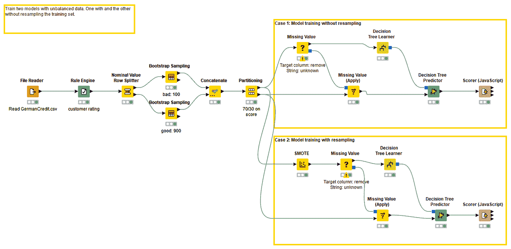

*图 4:这个 KNIME 工作流训练了两个决策树来预测客户的信用评分。在顶部分支中，基线模型根据不平衡的训练数据进行训练(90%“好”对 10%“坏”的类记录)。在底部分支中，在新的训练数据集上训练改进的模型，其中少数类已经过采样(SMOTE)。用于评估分类模型的工作流 Cohen's Kappa 可在 KNIME Hub 上获得。*

# 参考

[1]布兰德，马丁。"科恩的卡帕"*约克大学健康科学系*[*https://www-users . York . AC . uk/~ mb55/MSC/clin met/week 4/kappa _ text . pdf*](https://www-users.york.ac.uk/~mb55/msc/clinimet/week4/kappa_text.pdf)*。【2020 年 5 月 29 日访问】* (2008)。

*如最初发表于* [*的《新闻报》*](https://thenewstack.io/cohens-kappa-what-it-is-when-to-use-it-and-how-to-avoid-its-pitfalls/) *。*