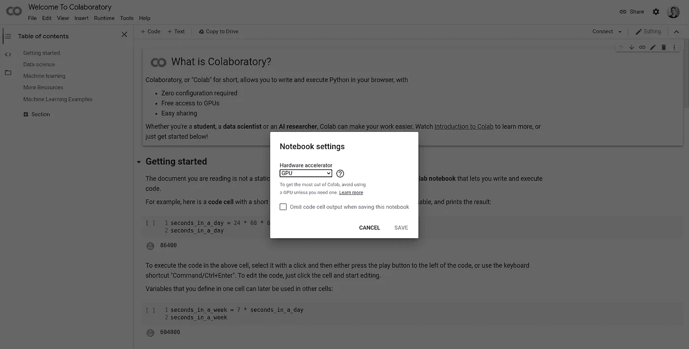
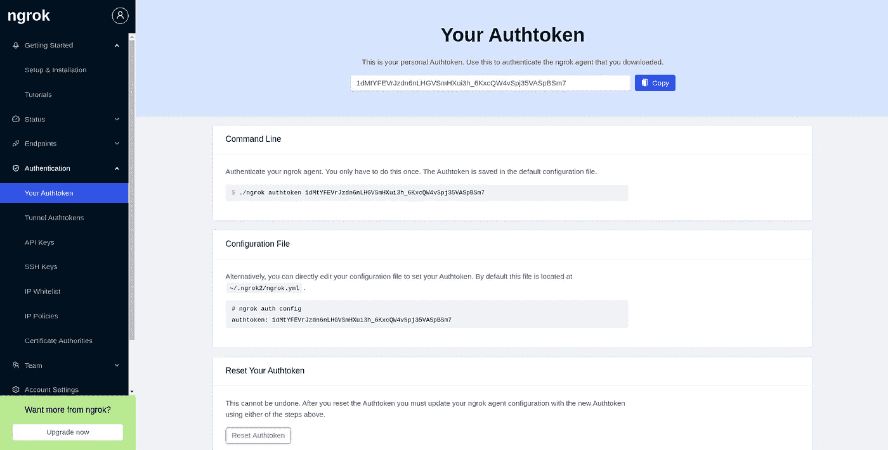
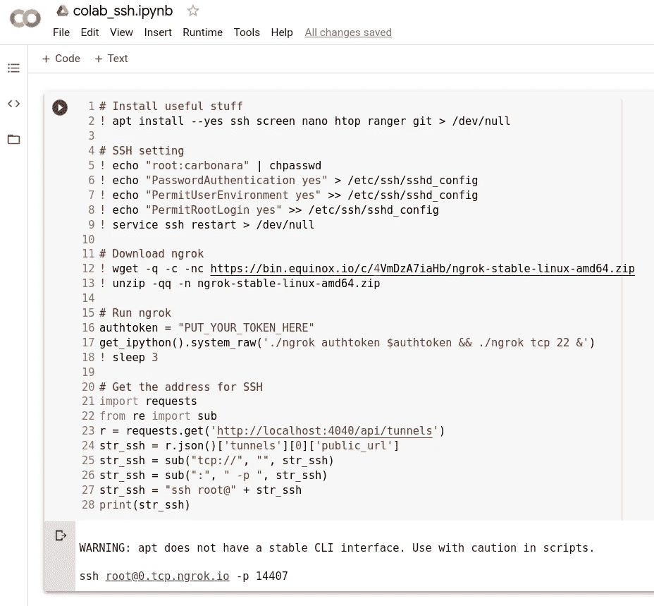
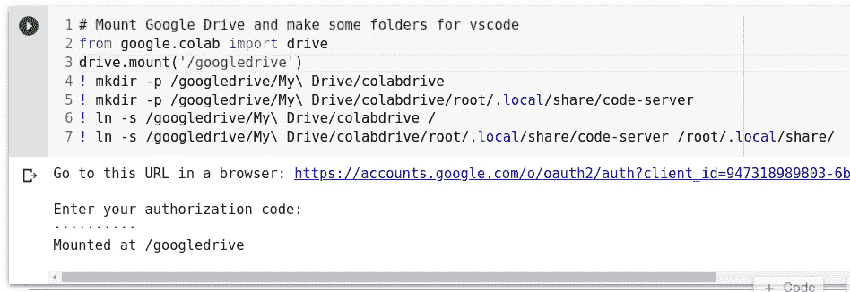
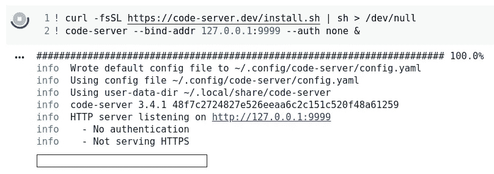

# 类固醇上的 Colab:带 SSH 访问和 Visual Studio 代码服务器的免费 GPU 实例

> 原文：<https://towardsdatascience.com/colab-free-gpu-ssh-visual-studio-code-server-36fe1d3c5243?source=collection_archive---------17----------------------->

## 一步一步地引导 SSH 进入 Google Colab 提供的免费 GPU 实例，并安装 Visual Studio Code Server。

正如你们大多数人已经知道的，谷歌研究提供了免费的 Jupyter 笔记本环境实例，带有 T2 图形处理器和 TPU，完全在云中运行。该平台名为[](https://colab.research.google.com/notebooks/intro.ipynb)**(简称“Colab”)，当你想进行快速实验或构建新的机器学习模型时，它是一个很好的资源，因为不需要设置:你需要的只是一个浏览器！**

****

**图片作者。与 GPU 的 Colab 会话**

**然而，当事情变得棘手时，一个简单的 Jupyter 笔记本界面可能会相当有限:我们可能需要有一个 **SSH** 会话！我们开始吧！**

## **第一步。从 ngrok 获取令牌**

**在 [ngrok](https://ngrok.com/) 上免费注册，从左侧的认证设置中获取一个 Authtoken。**

****

**图片作者。从 ngrok 获取免费令牌。**

## **第二步。在 Colab 上安装并运行 ngrok**

**在 Colab 的一个笔记本单元格内，复制并粘贴下面的代码，插入来自 ngrok 的令牌并运行单元格。**

```
# Install useful stuff
! apt install --yes ssh screen nano htop ranger git > /dev/null# SSH setting
! echo "root:carbonara" | chpasswd
! echo "PasswordAuthentication yes" > /etc/ssh/sshd_config
! echo "PermitUserEnvironment yes" >> /etc/ssh/sshd_config
! echo "PermitRootLogin yes" >> /etc/ssh/sshd_config
! service ssh restart > /dev/null# Download ngrok
! wget -q -c -nc [https://bin.equinox.io/c/4VmDzA7iaHb/ngrok-stable-linux-amd64.zip](https://bin.equinox.io/c/4VmDzA7iaHb/ngrok-stable-linux-amd64.zip)
! unzip -qq -n ngrok-stable-linux-amd64.zip# Run ngrok
authtoken = "PUT_YOUR_TOKEN_HERE"
get_ipython().system_raw('./ngrok authtoken $authtoken && ./ngrok tcp 22 &')
! sleep 3# Get the address for SSH
import requests
from re import sub
r = requests.get('[http://localhost:4040/api/tunnels'](http://localhost:4040/api/tunnels'))
str_ssh = r.json()['tunnels'][0]['public_url']
str_ssh = sub("tcp://", "", str_ssh)
str_ssh = sub(":", " -p ", str_ssh)
str_ssh = "ssh root@" + str_ssh
print(str_ssh)
```

****

**图片作者。用 ngrok 在 Colab 中启动一个 SSH 会话。**

**作为输出，您应该会收到如下内容(地址和端口可能不同):**

```
ssh [root@0.tcp.ngrok.io](mailto:root@0.tcp.ngrok.io) -p 14407
```

**将它复制并粘贴到您喜欢的终端模拟器中，当需要密码时插入 **carbonara** 并享受您的 SSH 会话！当然，你可以随心所欲地修改密码！**

****

**图片作者。SSH 会话:在 Colab 实例内部**

**不习惯 Linux 命令行？查看这篇文章:[每个数据科学家都应该知道的基本 Linux 控制台命令](/linux-console-commands-data-scientist-566744ef1fb0)。**

## **第三步。运行 Visual Studio 代码服务器**

**SSH 很好，但是直接在浏览器中拥有一个完整的代码编辑器更好！现在让我们看看如何在 Colab 实例中安装 **Visual Studio 代码**。**

**首先，我们需要安装我们的 Google Drive。**

```
# Mount Google Drive and make some folders for vscode
from google.colab import drive
drive.mount('/googledrive')
! mkdir -p /googledrive/My\ Drive/colabdrive
! mkdir -p /googledrive/My\ Drive/colabdrive/root/.local/share/code-server
! ln -s /googledrive/My\ Drive/colabdrive /
! ln -s /googledrive/My\ Drive/colabdrive/root/.local/share/code-server /root/.local/share/
```

**系统将提示您通过插入在第二个页面上生成的令牌来授权访问。**

****

**图片作者。在 Colab 上安装 Google Drive**

**现在，让我们下载、安装并运行 Visual Studio 代码的服务器版本。**

```
! curl -fsSL [https://code-server.dev/install.sh](https://code-server.dev/install.sh) | sh > /dev/null
! code-server --bind-addr 127.0.0.1:9999 --auth none &
```

****

**图片作者。在 Colab 上下载并安装 Visual Studio 代码服务器**

**让我们用端口转发启动另一个 SSH 会话(用您的地址和端口替换 ngrok 地址和端口):**

```
ssh -L 9999:localhost:9999 [root@0.tcp.ngrok.io](mailto:root@0.tcp.ngrok.io) -p 14407
```

**然后在[打开浏览器 http://127.0.0.1:9999](http://127.0.0.1:9999)**

****

**图片作者。运行在 Colab 上的 Visual Studio 代码服务器**

**由于我们之前已经安装了 Google Drive，设置、Visual Studio 代码的扩展和项目文件(如果保存在/colabdrive 下)将通过会话保持不变。**

**享受 Colab 中的 Visual Studio 代码！**

## **参考**

*   **[https://gist . github . com/yashkumaratri/204755 a 85977586 cebb 58 DC 971496 da](https://gist.github.com/yashkumaratri/204755a85977586cebbb58dc971496da)**
*   **[https://stack overflow . com/questions/48459804/how-can-I-ssh-to-Google-co laboratory-VM](https://stackoverflow.com/questions/48459804/how-can-i-ssh-to-google-colaboratory-vm)**
*   **[https://medium . com/@ meet _ Patel/how-to-ssh-into-Google-colab-and-run-scripts-from-terminal-notebook-3931 f 2674258](https://medium.com/@meet_patel/how-to-ssh-into-google-colab-and-run-scripts-from-terminal-instead-of-jupyter-notebook-3931f2674258)**

**联系人: [LinkedIn](https://www.linkedin.com/in/shuyiyang/) | [Twitter](https://twitter.com/deltarule)**