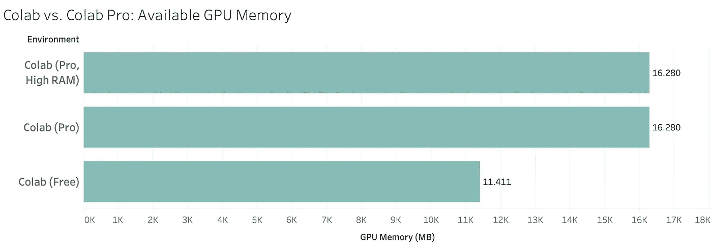
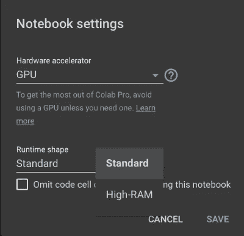
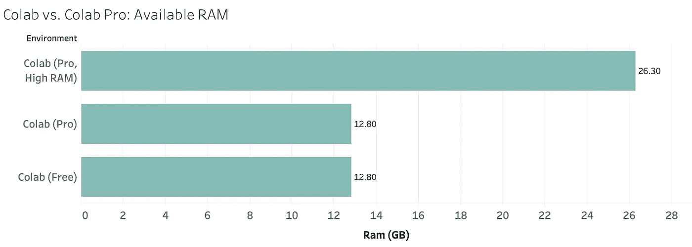
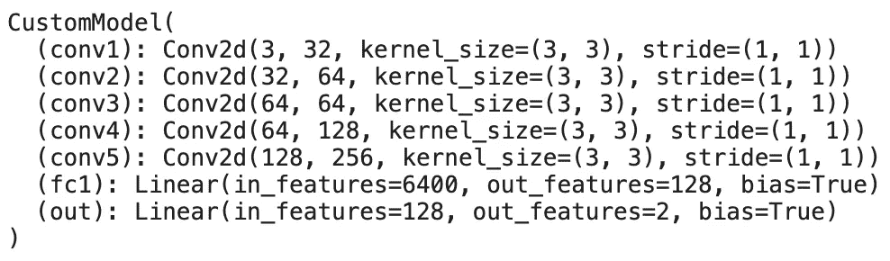
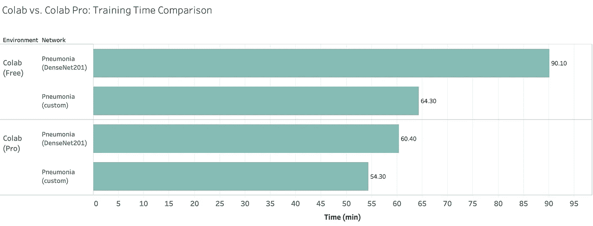

# Colab Pro:物有所值吗？

> 原文：<https://towardsdatascience.com/colab-pro-is-it-worth-the-money-32a1744f42a8?source=collection_archive---------0----------------------->

## 10 美元有多大作用？我们做了测试。你做阅读。

Google Colab 已经推出有一段时间了，但最近我们有一个升级到 Pro 版本的选项，这可能会让你获得更快的 GPU、更长的运行时间和更多的 RAM。但是差别有多大呢？值 10 美元/月吗？让我们找出答案。

我们已经写了关于 Google Colab(免费版)的文章，所以如果你还没有:

 [## Google Colab:它与支持 GPU 的笔记本电脑相比如何？

### Colab 简介、运行时、性能比较…以及疑难解答

towardsdatascience.com](/google-colab-how-does-it-compare-to-a-gpu-enabled-laptop-851c1e0a2ca9) 

为了进行测试，我们使用了免费版和专业版的服务，在[肺炎数据集](https://www.kaggle.com/paultimothymooney/chest-xray-pneumonia)上执行深度学习任务。数据集由大约**5000 张肺部 x 光图像**组成，非常适合这类任务。

这篇文章的结构如下:

1.  一般差异
2.  GPU 比较
3.  RAM 比较
4.  案例:模型训练时间比较
5.  判决

所以事不宜迟，让我们开始吧！

# 一般差异

本节的目标是讨论免费版和专业版服务之间的一般差异，如 CPU、可用磁盘空间和运行时。我不认为这 3 个**会对你的购买决定产生太大影响(也许最后一个除外)，因为我在免费版中没有遇到过这些问题。**

话虽如此，以下是 CPU 之间的比较:

*   **Colab(免费)** —英特尔至强 CPU @ 2.20GHz
*   **Colab (Pro)** —英特尔至强 CPU @ 2.30GHz

所以在这里没有太大的区别——但是再一次，你可能没有使用 Colab 作为它的 CPU，所以这部分真的没有那么重要。

至于磁盘大小，我在两者上都获得了相同的 34GB 可用内存——这有点奇怪——但这对于 99.99%的用户来说已经足够了。**运行时间**可能会让你吃惊。以下是谷歌的官方声明:

> 使用 Colab Pro，您的笔记本电脑可以保持连接长达 24 小时，空闲超时相对宽松。尽管不能保证持续时间，但空闲超时有时可能会有所不同。[1]

对于免费版本，我们最多有 12 个小时的运行时间，空闲超时更严格。尽管有避免这种情况的方法，本文中描述了一种可能的解决方案。

好了，我们现在知道了一些基本的区别。在接下来的部分中，我们将探索 RAM 和 GPU 的不同之处，之后，我们还将在真实数据集上比较训练持续时间。

# GPU 比较

Google Colab 最重要的一个方面是 GPU。无论您的笔记本电脑有多强大，您都可以使用现代化的强大 GPU。下面是您可以在免费层和专业层使用的 GPU:

*   **Colab(免费)** —特斯拉 K80
*   **Colab (Pro)** —特斯拉 P100-PCIE-16GB

如果你不知道这些 GPU 之间有什么不同，那也没关系。这就是为什么我们准备了一张图表来比较可用的 GPU 内存:

不要担心高 RAM 运行时，这将在下一节讨论。从这一点上，你可以看到，使用 Pro 层，你可以获得大约 **5GB** 更多的 GPU 内存，这在理论上意味着神经网络训练过程应该更快(我们会看到这一点)。

# RAM 比较

Colab 的 Pro 版本将让您访问一个**高 RAM** 运行时环境。理论上，这个运行时应该给我们更多的内存，以防标准的 12GB 不够用。我的大部分深度学习工作都是在“玩具”例子上，数据集只有几个 GB 大小，所以我从来没有遇到过 RAM 问题。

如果您需要更多的工作内存，您可以转到**运行时—更改运行时类型:**来更改运行时

***但是 Pro 版默认给你的 RAM 多吗？***

我很高兴你问了。让我们看看下一个可视化:

在启用高 RAM 环境之前，Pro 和免费版本完全相同。在你的项目中请记住这一点，但我发现 12.8GB 对于大多数情况来说已经足够了。

# 案例:模型训练时间比较

现在是你期待已久的时候了。在这里，我们将最后比较谷歌 Colab 的免费和专业层的培训时间的差异。如前所述，该模型是在[肺炎数据集](https://www.kaggle.com/paultimothymooney/chest-xray-pneumonia)上训练的。

为同一个数据集准备了两种架构，第一种是自定义 CNN 架构，第二种是 **DenseNet201** 预训练网络，最后一层修改为输出两个类。您可以在下面看到自定义架构:

此外，以下是一些您可能会觉得有用的附加规范:

*   **图像尺寸:** 224x224
*   **批量大小:** 32
*   **学习率:** 0.001
*   **历元:** 20
*   优化器:亚当
*   **标准:**斜视

所以这里的一切都很标准，但我想分享这些信息，以防你想复制结果。

在训练期间，我记录了训练持续时间，该信息显示在下图中:

正如你所看到的，在免费版本中， **DenseNet201** 架构的培训过程持续了 50%的时间，而定制架构的培训时间减少并不显著。请记住这一点，因为您将在大多数时间使用预先训练的架构。

我想现在你已经有了做决定所需的所有信息。下一节我来说说我的看法。

# 判决

我们看到，在免费版本中，预构建架构的培训过程持续时间延长了 50%。 ***但这对你真的有意义吗？***

请记住，即使是专业版，您最多只能运行 24 小时。对于一些企业来说，24 小时仍然不够，因为培训过程要持续几天甚至几周。

如果你是一个仍在学习数据科学和深度学习的人，那么我认为专业版没有实际好处，因为免费版将处理你会遇到的所有数据集。专业版将提供速度改进，但对大多数用户来说并不显著。

如果你绝对需要提高速度，那就去做吧——每月只需 10 美元。如果没有，把钱存起来做别的事情——你不会错过任何特别的事情。

***你有什么想法？你们国家的 Pro 版速度快吗？*** 通知我。

*喜欢这篇文章吗？成为* [*中等会员*](https://medium.com/@radecicdario/membership) *继续无限制学习。如果你使用下面的链接，我会收到你的一部分会员费，不需要你额外付费。*

 [## 通过我的推荐链接加入 Medium-Dario rade ci

### 作为一个媒体会员，你的会员费的一部分会给你阅读的作家，你可以完全接触到每一个故事…

medium.com](https://medium.com/@radecicdario/membership) 

# 参考

[1][https://colab.research.google.com/signup#](https://colab.research.google.com/signup#)