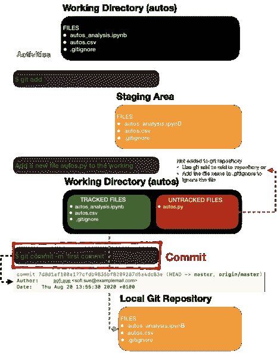
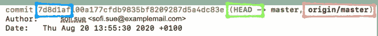
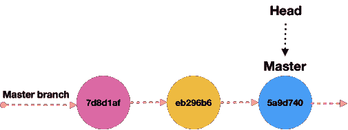
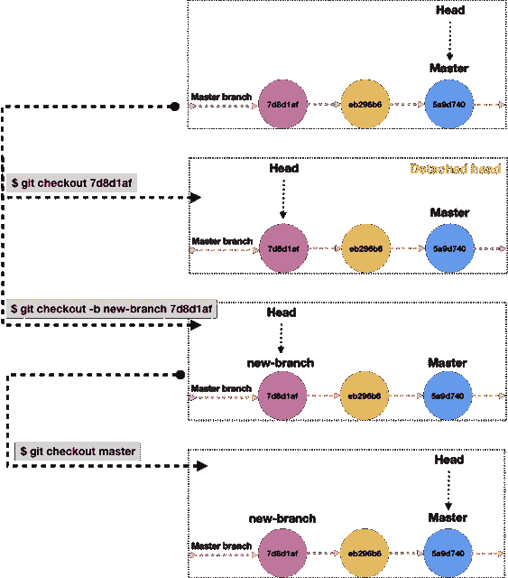

# 数据科学家 GitHub:提交

> 原文：<https://towardsdatascience.com/collaborate-on-github-like-a-pro-commit-d832e613b109?source=collection_archive---------65----------------------->

## GitHub 的权威指南:提交

## 了解提交的组成部分、提交、重置或删除提交。


路易斯·尤西比奥([https://unsplash.com/@lceusebio](https://unsplash.com/@lceusebio))的照片

本文是 GitHub 协作后续系列的一部分。本文将尝试详细理解提交，比如提交的组成部分，在推送之前和之后删除提交，或者重置提交。

对于初学者来说，强烈推荐快速阅读这篇文章，像 Pro: **Part1** 一样在 GitHub 上协作。

这个系列，像 pro 一样在 GitHub 上协作，关注特定的主题:

1.  **GitHub 入门** : [像 Pro 一样在 GitHub 上协作: **Part1**](https://medium.com/@snehal.1409/collaborate-on-github-like-a-pro-part1-8d11ccf12084)
2.  **分支:** [像 Pro 一样在 GitHub 上协作: **Part2**](https://medium.com/@snehal.1409/collaborate-on-github-like-pro-part2-26a6790e8f93)
3.  **提交:**像 Pro 一样在 GitHub 上协作:**提交**

# 什么是提交？

提交是用 **git commit** 命令创建的，用于捕获项目的状态。Git 存储一个提交对象，该对象指向快照暂存内容(已索引)。请参见下面红框中突出显示的提交阶段。



提交流程图

# 提交的组成部分:

让我们看一下提交对象，如下所示。提交中的三个主要组件包括**哈希**、**头、**和**分支**(主)，如下所述。



提交对象

**散列**:每次提交都会为各自的提交创建一个唯一的散列。稍后使用这些散列恢复到以前的版本，或者查找有关提交的详细信息。只需要前七个字符来查找各自的提交。

**头**:显示当前工作分支。在上图中，头指向主分支，这意味着当前的工作分支在主分支上。

**分支:**默认情况下，开发的第一行(分支)命名为主。不同分支上的所有先前的工作被合并到 master。

要进一步理解这个概念，请参考这篇博客[的帖子](https://git-scm.com/book/en/v2/Git-Branching-Branches-in-a-Nutshell)。



三次提交后主分支

# 切换到特定提交

基于用例，有多种方法可以检验特定的提交，比如进行临时或永久的切换，后退几步添加一个特性。

## 临时开关

要临时切换到第一次提交(7d8d1af)并从特定提交进行少量提交，请运行以下命令。

```
$ cd autos/ (git project root)
$ git checkout 7d8d1af (Use hash if you know it, else)
$ git checkout HEAD~3 (Use number of commits to go back, our case 3)$ git checkout -b new-branch 7d8d1af (create new branch on the commit)
$ git checkout branch_name (to go back to respective branch)
```

当签出提交时，头被分离。**分离的头**意味着该头没有指向最近的提交；相反，它指向签出时的提交。



临时提交签出流程

## 永久开关

要永久删除提交，使用 **Git reset** 。Git 复位主要有五种模式:**软、混合、合并、硬、保持**。有关详细信息和不同的解决方案，请参考[堆栈溢出](https://stackoverflow.com/questions/4114095/how-do-i-revert-a-git-repository-to-a-previous-commit/4114122#4114122)。

*   **Git reset — hard** 将更改磁头、索引(阶段)和工作目录。记得运行 **git status 来**检查工作树是否干净，否则所有未提交的更改都将丢失。
*   **Git 复位—软**将改变磁头，不改变索引(阶段)或工作目录。这是最安全的选择。

例如，我们希望重置到第一次提交(7d8d1af)。处理这种情况有两种方法。

1.  **提交未推送到远程**

总是运行 git status 来检查工作树是否干净。要仅删除当前提交，但保留文件并对其进行索引，请使用 soft。

```
$ cd autos/ (git project root)
$ git reset --soft HEAD~3
```

“工作树是干净的”意味着没有你可以失去的未提交的工作。在这种情况下，安全地使用**硬**。

```
$ cd autos/ (git project root)
$ git reset --hard 7d8d1af (Use hash if you know it, else)
$ git reset HEAD~3 (Use number of commits to go back, our case 3)
```

在“工作树是**而不是**干净的”的情况下，你知道如果你直接使用 hard 可能会丢失一些未提交的工作，在命令 hard 之前运行“stash”来保存你的本地更改。

```
$ cd autos/ (git project root)
$ git stash
$ git reset --hard 7d8d1af
$ git stash pop
```

**2。提交推送到远程**

```
$ git revert --no-commit 7d8d1af HEAD
$ git commit
$ git push# To abort the above steps
git revert --abort
```

要了解更多关于 git 重置/恢复和返回到 Git 中先前状态的信息，请参考这篇写得很好的[博客](https://opensource.com/article/18/6/git-reset-revert-rebase-commands)，有关代码，请参考 [GitHub 库](https://github.com/snehalnair/collaborate-github)。

## 参考:

[https://stack overflow . com/questions/4114095/how-do-I-revert-a-git-repository-to-a-previous-commit/4114122 # 4114122](https://stackoverflow.com/questions/4114095/how-do-i-revert-a-git-repository-to-a-previous-commit/4114122#4114122)