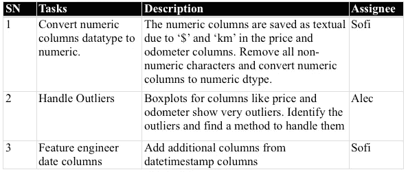
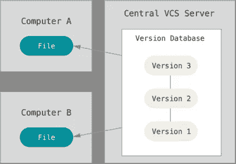
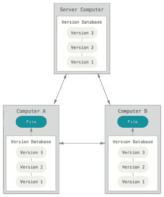
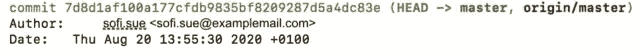
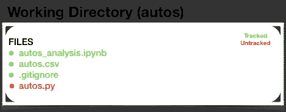
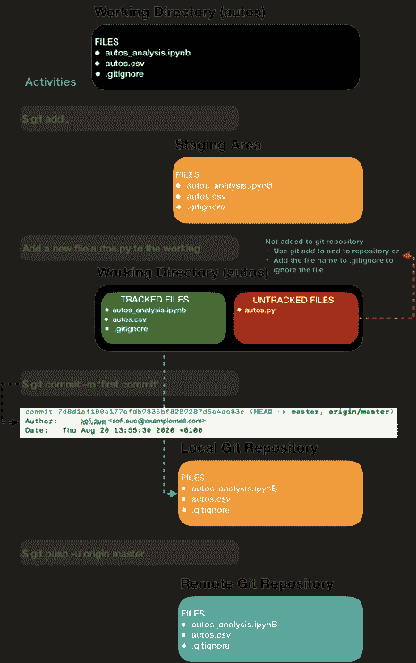
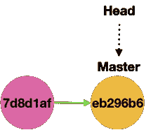
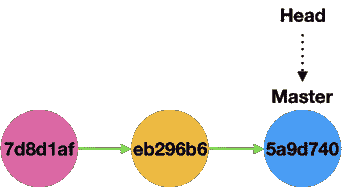
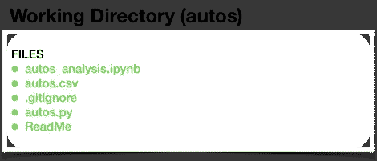

# 面向数据科学家的 GitHub:第 1 部分

> 原文：<https://towardsdatascience.com/collaborate-on-github-like-a-pro-part1-8d11ccf12084?source=collection_archive---------53----------------------->

## 权威 GitHub 指南:Git 添加— Git 提交— Git 推送

## 了解版本控制、git 配置、创建和克隆存储库以及提交。


本文是 GitHub 协作后续系列的第一部分。本文旨在解释两个或更多的人如何在 GitHub 上为数据科学项目协作、版本控制和校对他们的代码。

我们将讨论特定主题，如:

1.  **GitHub 入门**:像 Pro 一样在 GitHub 上协作: **Part1**
2.  **分支:** [像 Pro 一样在 GitHub 上协作: **Part2**](https://medium.com/@snehal.1409/collaborate-on-github-like-pro-part2-26a6790e8f93)
3.  **提交:** [像 Pro 一样在 GitHub 上协作:**提交**](https://medium.com/@snehal.1409/collaborate-on-github-like-a-pro-commit-d832e613b109)

在这些文章中，我们将有两个人在 GitHub 上合作。让我们给他们取两个假名，Sofi 和 Alec。

# 目录:

1.  [什么是版本控制](#92ea)
2.  [首次 Git 配置](#7844)
3.  [创建一个本地知识库](#38dd)
4.  [克隆现有存储库](#58df)
5.  [Git 拉取—添加—提交—推送](#a4f1)

# 计划的任务

由于这不是一篇关于数据清理的文章，我们将重点写几个函数来看看协作和版本控制是如何工作的。我们将使用二手车数据集。点击从[下载数据集。](https://www.kaggle.com/piumiu/used-cars-database-50000-data-points)

```
**Sofi and Alec**: *are working on a data cleaning project named “autos“. Sofi takes the initiative of gathering data, creating required .py, .ipynb  files for the project.*
```

这篇文章展示了该项目的 EDA。这个项目的任务是基于 EDA 报告构建的。在本文中，我们将只看三个任务。



Sofi 创建一个项目文件夹(…/autos)，其中包含两个文件:auto.csv 和 autos_analysis.ipynb。


**现阶段 Sofi 的工作目录**

```
**Sofi and Alec**: *Before starting the project, they browse through the different version control systems to find the one suitable for their project.*
```

# 版本控制系统(VCS)

> *在* [*软件工程*](https://en.wikipedia.org/wiki/Software_engineering) *，* ***版本控制*** *(也称为* ***修订控制*** *，* ***源代码控制*** *，或* ***源代码管理*** *)是一类负责管理变更的系统版本控制是* [*软件配置管理*](https://en.wikipedia.org/wiki/Software_configuration_management) *的一个组件。*

有许多版本控制系统。通常它们被分为两类:“集中式”和“分布式”。

## [](https://www.atlassian.com/blog/software-teams/version-control-centralized-dvcs)****【CVCS】****

**CVCS 基于这样的想法，即在某个地方(可能在服务器上)有一个项目的单一“中心”副本，程序员将他们的更改“提交”到这个中心副本。最受欢迎的 CVCS 是颠覆。**

****

**中央版本控制系统**

## **[](https://www.atlassian.com/blog/software-teams/version-control-centralized-dvcs)****【DVCS】******

****DVCS 不一定依赖中央服务器来存储项目文件的所有版本。相反，每个开发人员都“克隆”一个存储库的副本，并在他们自己的硬盘上拥有该项目的完整历史。这个副本(或“克隆”)具有原始副本的所有元数据。Git 和 Mercurial 是最流行的 DVCS。****

********

****分布式版本控制系统****

```
****Sofi and Alec**: They decide to go *ahead with the popular distributed version control system GitHub. With the distributed system, branching and merging are much easier to achieve, and connecting to the network is not required.***
```

# ****开源代码库****

> ****GitHub 的核心是 Git，这是一个由 Linux 创建者 Linus Torvalds 发起的开源项目。GitHub 是一个 Git 存储库托管服务，但是它增加了许多特性。虽然 Git 是一个命令行工具，但 GitHub 提供了一个基于 Web 的图形界面。它还提供了访问控制和一些协作功能，例如 wikis 和每个项目的基本任务管理工具。****

********

```
****Sofi and Alec**: They configured Git following the below steps. Sofi created a git repository for Alec to clone.** 
```

# ******首次 Git 配置遵循以下步骤******

```
**$ git config --global user.name "Sofi Sue"
$ git config --global user.email "sofi.sue@examplemail.com"
$ git config --global color.ui auto
$ git config --global core.editor VimAfter configuring git check settings:
$ git config --list**
```

## ****Sofi:创建本地 git 存储库****

```
**Add below files in the project folder (../autos/)1) **'.gitignore'** with the list of file names of the files to be ignored
2) **'ReadMe'** file as plain text or Markdown describing the project**
```

****运行以下命令。****

```
**$ cd autos/
$ git init
$ git add . *(adds all the files except the ones listed in .gitignore)*
$ *git commit — m ‘add a comment’***
```

****如果没有要忽略的文件，则保留。git 忽略文件空白，随着项目的进展添加文件名。****

********

******现阶段 Sofi 的工作目录******

****恭喜你完成了你的第一次承诺！****

# ****犯罪****

****提交是用 **git commit** 命令创建的，用于捕获项目的状态。当您提交时，Git 存储提交对象，该对象包含指向您暂存的内容快照的指针。在上面的提交对象映像中，我们可以看到三个主要组件，hash、master 和 head。****

********

****提交对象****

******Hash** :每次提交都会为各自的提交创建一个惟一的 Hash。在后面的阶段使用这七个字符作为这些散列，以恢复到该版本并找到提交的详细信息。****

******Master:** 默认情况下，开发第一线(分支)的名称为 Master。不同分支上的所有先前的工作被合并到 master。****

******头**:显示当前工作分支。上面的图像头指向主分支，这意味着当前的工作分支是主分支。****

****要进一步理解这个概念，请参考这篇博客[帖子](https://git-scm.com/book/en/v2/Git-Branching-Branches-in-a-Nutshell)。****

********

******第一次提交后。Alphanum 是第一次提交的哈希的前 7 个字符。******

****在这个阶段，Sofi 决定将另一个文件 autos.py 添加到她的工作目录中。请注意，此文件不会被暂存，将显示为未跟踪的文件。要将它添加到存储库中，运行 git add autos.py。****

********

******现阶段 Sofi 的工作目录******

## ****Sofi:将本地 git 存储库连接到 GitHub****

****按照此处[给出的说明](https://docs.github.com/en/github/getting-started-with-github/create-a-repo)在 GitHub 帐户中创建一个存储库。不要创建。gitignore”或“ReadMe”文件，因为我们已经在项目文件夹中创建了它。将链接复制到 git repo，然后返回到终端，用下面的命令将您的本地存储库连接到 Github。在这里找到 GitHub 库[。](https://github.com/snehalnair/collaborate-github.git)****

```
**$ git remote add origin [https://github.com/snehalnair/collaborate-github.git](https://github.com/snehalnair/collaborate-github.git)
$ git push -u origin master**
```

****恭喜你，你第一次推送了远程 GitHub 服务器！****

## ****添加→提交→推送****

****下面的流程图总结了项目到目前为止所遵循的步骤****

********

## ****git-log —显示提交日志****

****每次提交后，根据用例检查提交细节。例如，要查看所有提交摘要，运行 git log-online。下面提到的是一些有用的 git 命令，它们可以在您或合作者每次提交后方便地检查细节。这里给出了详细的解释[。](https://git-scm.com/docs/git-log)****

```
**$ git show
$ git log
$ git log —oneline
$ git log —stat
$ git log -p
$ git log -p --stat
$ git log --decorate**
```

## ****Alec:将 git 存储库克隆到他的本地机器上****

****要获得现有 Git 存储库的副本，请在终端中运行下面的命令。****

```
**$ git clone [https://github.com/snehalnair/collaborate-github.git](https://github.com/snehalnair/collaborate-github.git) autos
$ git pull**
```

****该命令创建一个名为…/autos 的目录，在其中初始化一个. gitdirectory，从该存储库的最新版本中提取所有数据。导航到文件夹…/autos，查找存储库中的所有文件。****

********

****亚历克克隆的工作目录。注意，Alec 的工作目录只包含被跟踪的文件。autos.py 文件不是 Alec 目录的一部分，因为 Sofi 没有添加、提交和推送该文件。****

```
****Sofi to Alec**: I forgot to add autos.py and the ReadMe file. Let me push autos.py file to the server first and then create a ReadMe file**Alec to Sofi**: I have worked on the ReadMe file already. Let me add it to the folder and push, and you can push autos.py in the after.**
```

******Alec** :运行以下命令创建并提交自述文件****

```
**$ cd autos/
$ touch ReadMe
$ git pull
$ git add ReadMe
$ git commit -m ‘add ReadMe file’$ git push -u origin master**
```

********

****在第二次提交后****

******Sofi** :运行以下命令提交并推送 autos.py 文件****

```
**$ cd autos/
$ git pull
$ git add autos.py
$ git commit -m ‘add autos.py file’$ git push -u origin master**
```

********

****第三次提交后****

## ****工作目录****

****上述活动显示了在添加和推送文件之前运行 **git pull** 的重要性。Git pull 确保您拥有最新的存储库。这是 Sofi 和 Alec 当前的工作目录。****

********

```
****Sofi and Alec**: The repository is ready for us to work. But we need to isolate our work, else we will start overwriting each others work/codes. Lets learn about branches before we proceed.**
```

****对于接下来的步骤，请参考本文的下一部分，Sofi 和 Alec 将创建分支，并为他们的项目选择合适的分支工作流。参考 [GitHub 库](https://github.com/snehalnair/collaborate-github)获取代码。****

****要了解更多关于 GitHub 的信息，请阅读这个博客。****

## ****参考:****

****[https://www . atlassian . com/blog/software-teams/version-control-centralized-DVC](https://www.atlassian.com/blog/software-teams/version-control-centralized-dvcs)s****

****https://en.wikipedia.org/wiki/Software_engineerin[克](https://en.wikipedia.org/wiki/Software_engineering)****