# 面向数据科学家的 GitHub:第 2 部分

> 原文：<https://towardsdatascience.com/collaborate-on-github-like-pro-part2-26a6790e8f93?source=collection_archive---------57----------------------->

## 了解分支，使用 git 的不同分支工作流。


照片由诺亚·罗森菲尔德([https://unsplash.com/s/photos/noah-rosenfield](https://unsplash.com/s/photos/noah-rosenfield))拍摄

这是 GitHub 协作后续系列的第二部分。在《T2》第一部中，两个同事 Sofi 和 Alec 开始着手一个数据清理项目，他们在彼此之间分配任务，创建和克隆存储库，并首次提交。

我们将讨论特定主题，如:

1.  **GitHub 入门** : [像 Pro 一样在 GitHub 上协作: **Part1**](https://medium.com/@snehal.1409/collaborate-on-github-like-a-pro-part1-8d11ccf12084)
2.  **Git 分支:**像 Pro 一样在 GitHub 上协作: **Part2**
3.  **提交 Git:** [像 Pro 一样在 GitHub 上协作:**提交**](https://medium.com/@snehal.1409/collaborate-on-github-like-a-pro-commit-d832e613b109)

在这些文章中，我们将有两个人在 GitHub 上合作。我们给他们取两个假名吧，Sofi 和 Alec。

# 目录:

1.  [分枝](#dc04)
2.  [Git 上不同的分支工作流](#a718)
3.  [拉动请求](#2af2)
4.  [合并冲突](#559d)

```
**Sofi and Alec**: The repository is ready for us to work. But we need to isolate our work, else we will start overwriting each others work/codes. Lets learn about branches before we proceed.
```

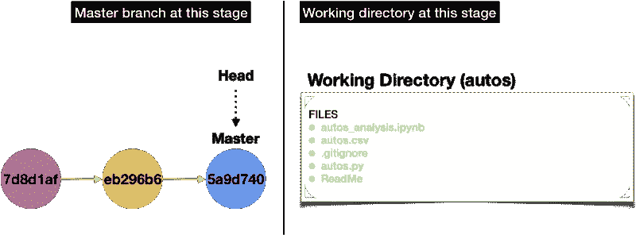

# 分支

在进入分支工作流之前，让我们试着理解分支的概念。分支获取它所分支的提交的最新版本的副本。因此，您可以在一个隔离的环境中处理您的任务，而无需直接在主分支中进行更改。一旦任务完成，这个分支就可以合并到主分支中。让我们创建一个分支来更好地理解这个概念。

## 创建分支

要创建一个新的分支(test-branch ),运行下面的命令。

```
$ git branch test-branch
```

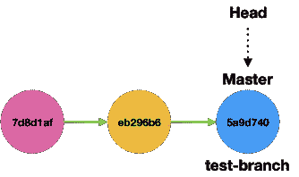

git 分支测试-分支命令增加了一个新的分支测试-分支

## 结账处

运行上面的命令添加了一个新的分支，但是，要移动到该分支，也就是说，要将头指向该分支，您必须运行 checkout git 命令。

```
$ git checkout test-branch
```

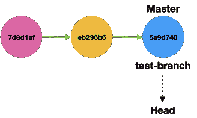

头指向测试分支

在一个命令中创建和检出新分支。

```
git checkout -b test-branch
```

## 强制删除分支

让我们删除这个分支，因为它们只是为了我们的理解。除非运行如下所示的强制删除命令，否则不能删除标题所指向的分支。

```
$ git branch -D test-branch
```

## 签出并删除分支

要删除一个分支而不强制删除，请签出到其他分支并运行 delete 命令。

```
$ git checkout master
$ git branch -d test-branch
```

```
**Sofi and Alec**: Now that we have a better understanding of branching technique. Lets find out if there is a suitable branching workflow that we can use.
```

# Git 的分支工作流

对于 Git 用户来说，有许多流行的分支工作流适合他们各自的开发周期。

以下是最受欢迎的工作流程:

1.  Git 流
2.  GitHub 流
3.  GitLab 流程
4.  一个流程

要了解更多关于这些分支工作流的信息，请阅读这篇[博客文章](http://4 branching workflows for Git)。

## GitHub 流

这是最适合我们用例的分支工作流。GitHub flow 是一个轻量级的、基于分支的工作流，支持定期进行部署的团队和项目。要了解有关这一特定工作流程的更多信息，请参考此[链接](https://githubflow.github.io)。

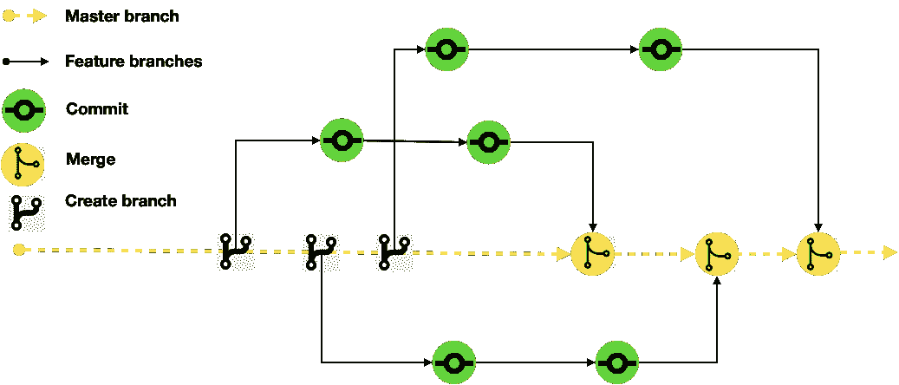

**GitHub 流程**:所有的提交都在特性分支上进行，并合并到主分支上。主分支总是可部署的。

**那么它是如何工作的呢？**

*   `master`分支中的任何东西都是可部署的
*   为了做一些新的事情，创建一个描述性命名的`master`分支(例如:`new-oauth2-scopes`)
*   在本地提交到那个分支，并定期将您的工作推送到服务器上相同的命名分支
*   当您需要反馈或帮助时，或者您认为该分支机构已经准备好进行合并时，打开一个[拉动请求](http://help.github.com/send-pull-requests/)
*   在其他人已经审查并签署了该特性之后，您可以将它合并到 master 中(git merge master)
*   一旦它被合并并被推送到“主节点”，你可以并且*应该*立即部署(git push -u origin master)

# 使用 GitHub Flow 工作流开始协作

概述项目状态:Sofi 和 Alec *正在进行一个名为“autos”的数据清理项目。基于初步的分析，他们之间分配了以下任务。*

```
**Sofi and Alec**: Lets create task based branches based on the GitHub Flow workflow instructions.
```

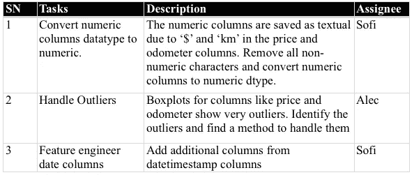

```
Sofi runs the below command in her computer
$ git checkout -b numcols-2-numdtypeAlec runs the below command in his computer
$ git checkout -b find-outliers
```

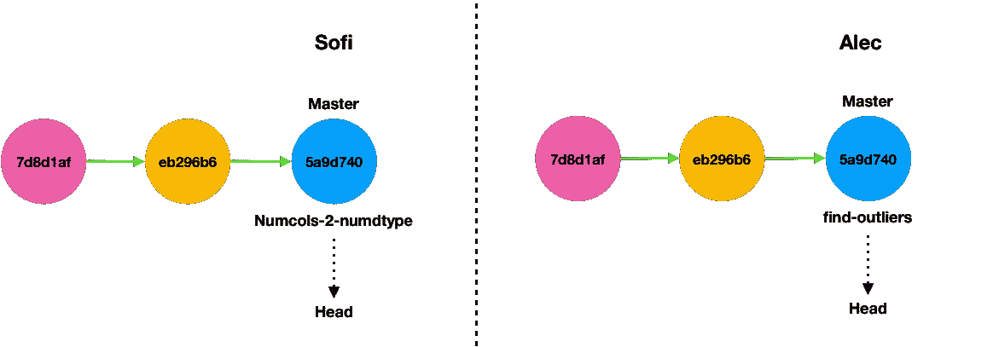

这就是分支在现阶段 Sofi 和 Alec 的电脑上的样子。它们看不到彼此的分支，因为它们尚未推送至服务器。

**Sofi** :在 autos.py 文件中输入以下功能

```
def numcol2numdtype(data, cols):
    for col in cols:
         data[col].str.replace('[^0-9]', '').astype('float')
    return data
```

在更新了 autos.py 文件之后，是时候提交并提出一个**拉请求**了。**注意:**提交前和推送前总是运行 **git pull** 将最新版本的文件推送到存储库中。

```
$ git pull
$ git commit -m 'remove non-numeric from numCol, convert to num dtype'
$ git pull
$ git push --set-upstream origin numcols-2-numdtype
```

您只需要在第一次从新分支推送时添加参数`---set-upstream origin my-branch`。

# 拉取请求

将更改推送到新分支后，您可以在 GitHub 页面上看到分支和 compare & pull 请求，如下所示。点击“比较和提取请求”,这将带您到另一个页面，写评论，如果有的话，然后点击“提取请求”。

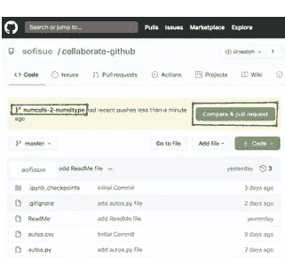

请求将发送给 repo 维护者或所有者进行代码审查，在我们的例子中，repo 维护者或所有者可以在 Sofi 和 Alec 之间交替进行代码审查。回购维护者或所有者将审查代码，并将其合并到主分支，在我们的例子中是主分支。

将出现 Alec 的 pull 请求，这可以在下面的步骤中处理。

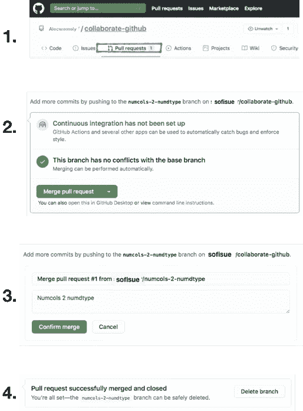

**Alec** :在 autos.py 文件中输入以下函数

```
def outliers_IQR(data, col):
    lower_quartile = data[col].quantile(0.25)
    upper_quartile = data[col].quantile(0.75)
    IQR = upper_quartile - lower_quartile
    outlier_thresh = 1.5 * IQR
    return data[data[col].between((lower_quartile - outlier_thresh), (upper_quartile + outlier_thresh))]
```

完成上述步骤后，运行以下命令。

```
$ git add autos.py
$ git commit -m 'remove outliers based on IQR technique'
$ git pull
$ git push --set-upstream origin find-outliers
```

**创建一个拉取请求**:由于 Sofi 和 Alec 正在处理同一个文件，他们已经覆盖了彼此的代码，产生了合并冲突(如突出显示的)。

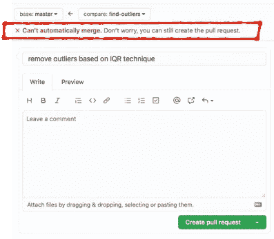

# **合并冲突**

将出现 sofi 的拉取请求。因为存在合并冲突，所以需要在合并之前解决它。

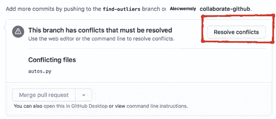

要解决冲突，请单击上面突出显示的解决冲突，这将带您进入解决页面。

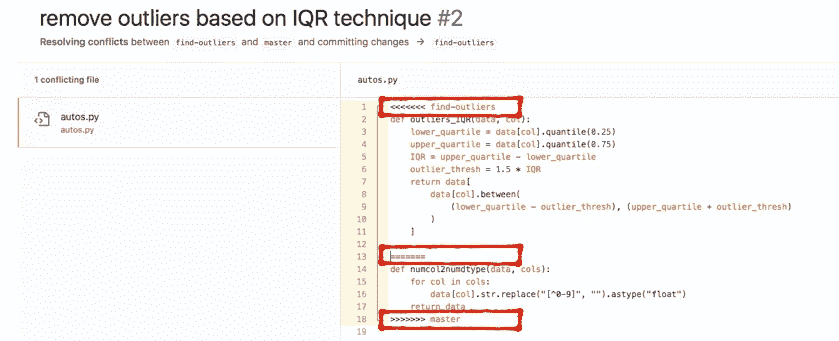

## 合并冲突指示器说明

编辑器具有以下合并冲突指示器:

*   `<<<<<<< find-outliers`从这条指示线到下一条指示线显示当前分支上的代码
*   `=======`是原始行的结尾，随后的所有内容(直到下一个指示器)是正在合并的分支上的内容
*   `>>>>>>> master`是正在被合并的分支(在本例中是`master`分支)的结束指示器

## 解决合并冲突

检查代码，修复冲突，删除合并冲突指示器，点击“已解决”，然后点击“提交合并”。

我会推荐你像 Pro:**part 1****f**一样阅读 [Collaborate on GitHub 或者更好的理解这个练习。代码可以在](https://medium.com/@snehal.1409/collaborate-on-github-like-a-pro-part1-8d11ccf12084) [GitHub 库](https://github.com/snehalnair/collaborate-github)中找到。

要了解更多关于 GitHub 的信息，请点击[这里](https://guides.github.com)。

## **参考文献**

[http://help.github.com/send-pull-requests/](http://help.github.com/send-pull-requests/)