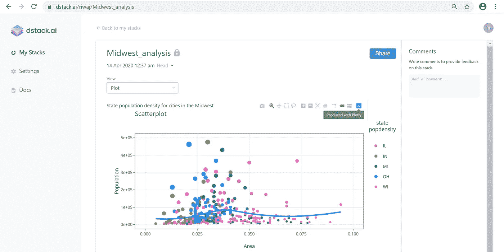
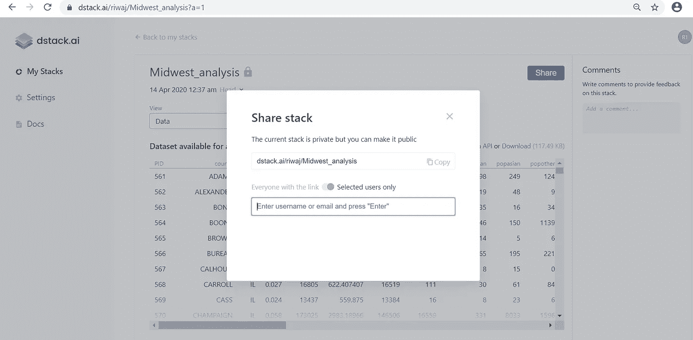
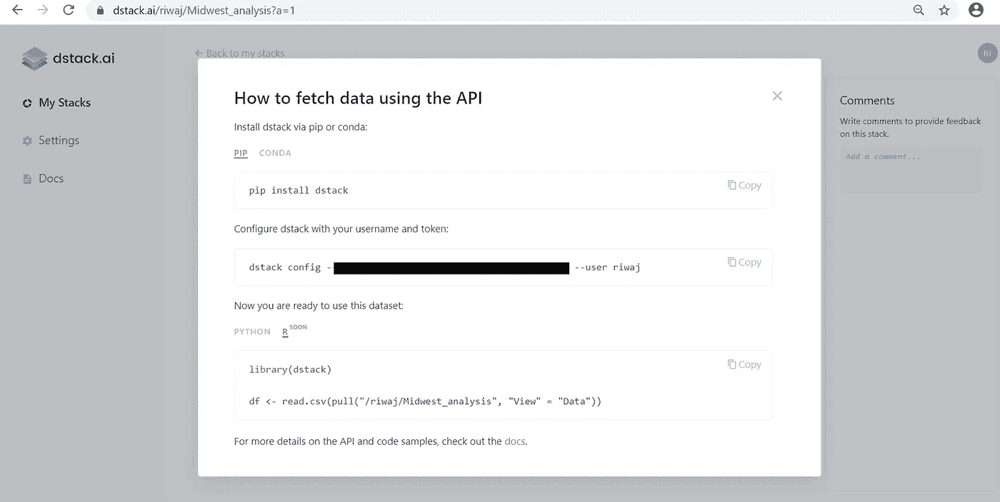
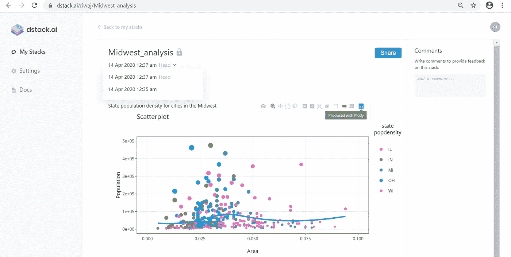
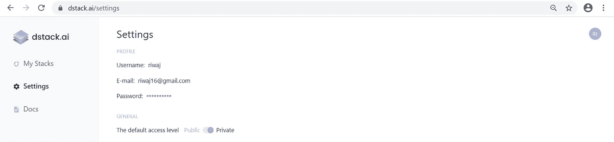
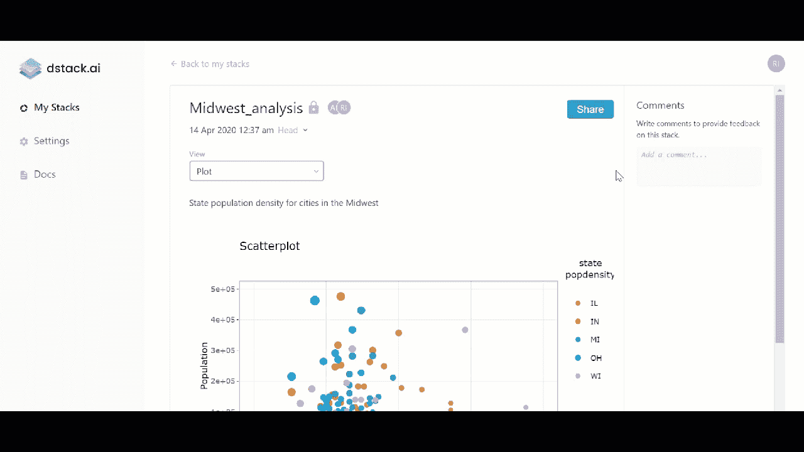
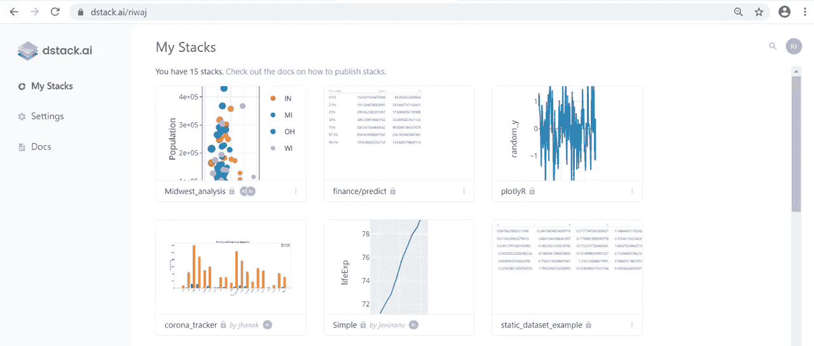

# 无需 web 开发技能，就可在 R 生成的结果上进行协作

> 原文：<https://towardsdatascience.com/collaborate-on-r-generated-results-without-web-development-skills-62a510316f14?source=collection_archive---------44----------------------->

## 介绍 dstack，一种发布、跟踪和共享数据的工具

对于统计计算来说，r 是一种漂亮的编程语言。它支持一组扩展的库，这些库支持允许用户探索特定领域数据分析的统计算法。r 还提供了广泛的图形工具，允许用户构建丰富的动态可视化。出于这些原因以及更多原因，R 是统计学家、分析师和数据科学家的热门选择，尤其是在构建统计模型和仪表板的原型时。

然而，当涉及到与组织或客户的其余部分共享和协作结果时，R 用户仍然面临许多问题。为了让非技术用户参与到数据中来，许多用户依赖于使用本地网络驱动器或电子邮件来分享他们的结果的繁琐过程。即使有了 Shiny 之类的 R 包，用户仍然需要熟悉 CSS 主题、HTML 小部件和 JS 动作。此外，组织必须承担额外的成本来维护支持应用程序的后端基础设施，如果您不熟悉 r，这将更加繁琐。

dstack 提供的解决方案正是为了解决这些问题。在这篇博文中，我们将展示 R 的用户如何使用 dstack.ai 的特性在 R 生成的数据可视化和数据集的结果上进行协作

1.  发布和共享数据可视化和数据集
2.  跟踪已发布数据的修订
3.  协作处理您发布的数据

# 入门指南

让我们从建立一个档案开始。这需要您在 [https://dstack.ai.](https://dstack.ai.) 创建一个帐户。一旦您有了帐户，您就可以登录并从设置中复制您的令牌。令牌和您的 dstack 用户名用于通过命令行实用程序配置您的配置文件。

您可以通过使用 install.packages()函数从 [CRAN](https://cran.r-project.org/web/packages/dstack/index.html) 访问 dstack 包。

```
install.packages("dstack")
```

一旦您安装了软件包，您应该配置您的配置文件。这可以通过包中的`configure`函数来完成:

```
dstack::configure(user = "<USER>", token = "<TOKEN>", persist = "global")
```

现在可以使用数据堆栈库了。

# 与其他人共享您的交互式可视化和数据集

一旦您准备好代码，dstack 提供 API 来发布您的结果，这些结果可以方便地共享，也可以对每个修订进行跟踪。一般来说，你会

1.  使用 dstack APIs 发布结果。
2.  使用 [dstack UI](http://www.dstack.ai) 分享结果。

这些 API 支持 R 中最流行的库，包括 tidyverse、ggplot2 和 Plotly。这些 API 也可以在任何地方使用——笔记本、脚本或应用程序。通过这种方式，您不需要将您的报告嵌入到 HTML 报告中以通过电子邮件共享，或者自己承担学习服务器端脚本的麻烦。

假设您有一个数据集，在这种情况下，是美国中西部各县的人口统计数据，您希望分析人口密度，并以数据可视化的形式与他人共享您的结果。

您可以在 [docs.dstack.ai](http://docs.dstack.ai/) 了解更多关于使用其他可视化库的信息

注意，在这个例子中，您使用了 dstack 库中的三个方法。

*   *create_frame* 定义一个值“中西部 _ 分析”
*   *提交*，它包含可视化数据所需的参数
*   *按下*，将可视化推至 dstack UI

可以通过 URL 访问发布的图表

```
[https://dstack.ai/<username>/](https://dstack.ai/riwaj/plotlyR)Midwest_analysis
```



请注意缩放、滚动等功能是如何巧妙实现的。也可以在可视化中使用

注意 URL 和函数 create *_frame* 都包含一个值“Midwest_analysis”，我们称之为堆栈。

本质上，

*   堆栈是一种独特的数据流，它可以有许多帧，但指向被推送到发布的最新帧。
*   框架是对已发布数据的修订，可以由一系列附件组成。
*   附件可以是绘图、图表或图形，甚至可以是具有自己的参数集的数据框。

现在，如果您还想与他人共享数据集，以实现刚刚共享的数据可视化，该怎么办呢？

堆栈、框架和附件等 dstack 抽象结构使您能够以发布数据可视化的相同方式提交数据集。

添加参数(View="Data ")允许您在同一堆栈中的数据集和可视化之间切换

这样，您可以在同一个堆栈中获得交互式数据集和可视化。

您可以在[dstack.ai/riwaj/Midwest_analysis?a=1](https://dstack.ai/riwaj/Midwest_analysis?a=1)查看发布的堆栈

发布堆栈后，现在您可以使用 URL、用户名或通过电子邮件地址发送邀请，与您的同行和客户共享堆栈。



任何人都可以通过链接查看公共堆栈

# 使用其他人的数据集

设想一个场景，您希望使用由其他人托管在 dstack 上并可供您使用的数据集。在这种情况下，您有两种选择来获取数据集以使用它。

1.  从 dstack UI 下载数据集作为 CSV 文件
2.  使用 dstack API 将数据集作为数据框提取



登录 dstack web 应用程序，通过 dstack API 下载或获取数据集

作为一名 R 用户，您可能会发现简单地使用 dstack API 来获取数据集很方便。下面是一个使用 pull API 获取 dstack 上托管的数据集的代码片段。

# 跟踪结果的修订

现在这里有一个很酷的部分！可以使用 dstack web 应用程序上的一个按钮来获取已发布堆栈的每个修订版及其所有参数。通过这种方式，您可以获得您的堆栈在工作过程中如何发展的历史记录，而不管它是可视化还是数据集。

本质上，这就是它的工作方式。

*   使用 dstack APIs 将栈的每个新版本推送到同一个栈。
*   登录到 dstack web 应用程序，并转到您的堆栈的 URL 地址。
*   在堆栈名称的下方，例如 Midwest_analysis，您会看到小部件。
*   点击它可以找到数据集的所有版本，以及最新的一个，称为 *Head。*



每个修订历史由时间戳表示

# 协作处理您的结果

dstack 是为协作数据探索而构建的。

发布的数据集和可视化可以通过 URL 与其他人轻松共享，即，即使非技术用户也可以使用 web 浏览器在 dstack.ai 托管的前端应用程序上查看和访问发布的堆栈。发布不存在多租户问题，即多个并发用户可以在同一时间就您发布的报表进行交互和协作，而不需要修改代码。

评论功能可以让你参与讨论(想想脸书的 Instagram)。要添加注释，您必须登录到您的 dstack.ai 帐户，并拥有在 dstack 中发布数据集的人在堆栈上进行协作的权限。

在 dstack 中，共享和评论权限的管理方式如下。

1.  每个用户都可以使用设置菜单来选择默认情况下是将一个新堆栈设为私有还是公共。



2.发布堆栈后，发布者可以选择共享堆栈的对象。或者，即使默认设置被选择为私有，堆栈也可以被公开。



您不需要 dstack 帐户来查看公共共享的堆栈，但是您需要一个帐户来进行注释

如果您登录 dstack，您将会看到自己创建的堆栈和其他人共享给您的堆栈。



数据堆栈帐户中堆栈的概述，包括自己创建的堆栈和他人共享的堆栈

所有的服务也可以从移动电话上获得，以方便地查看更新的堆栈。

# 立即尝试！

dstack.ai 可以在您的笔记本、脚本、工作甚至应用程序中使用，我们免费提供上述所有服务。

你认为我们错过了一些用例和特性吗？这是我们的产品路线图，您可以投票选出您希望在未来看到的功能。

https://trello.com/b/CJOnEjrr/public-roadmap

请[注册](https://dstack.ai/auth/signup)并给我们反馈和建议。我们很想听听你的想法。

谢谢您们。

反馈调查:【https://forms.gle/6MSLAGaHJFvvpB5Q6 

报名:【https://dstack.ai/auth/signup 

了解更多 [https://dstack.ai](https://dstack.ai/)

文档: [docs.dstack.ai](https://docs.dstack.ai/)

反馈邮件: [team@dstack.ai](http://team@dstack.ai/)

# 免责声明和限制:

1.  **数据集管理功能处于测试版，欢迎早期用户尝试。**
2.  除非法律要求，否则我们不会与第三方共享数据。
3.  我们不强制检查数据的真实性和来源，而是依赖用户。如果您发现侵权案件，请向我们报告。
4.  如果我们发现数据结果的共享损害了任何一方或违反了任何法律，我们将有义务立即删除这些数据。
5.  您可以保护对数据的访问，例如，通过更改堆栈设置或更改帐户设置的默认值，将数据限制为选定的用户。