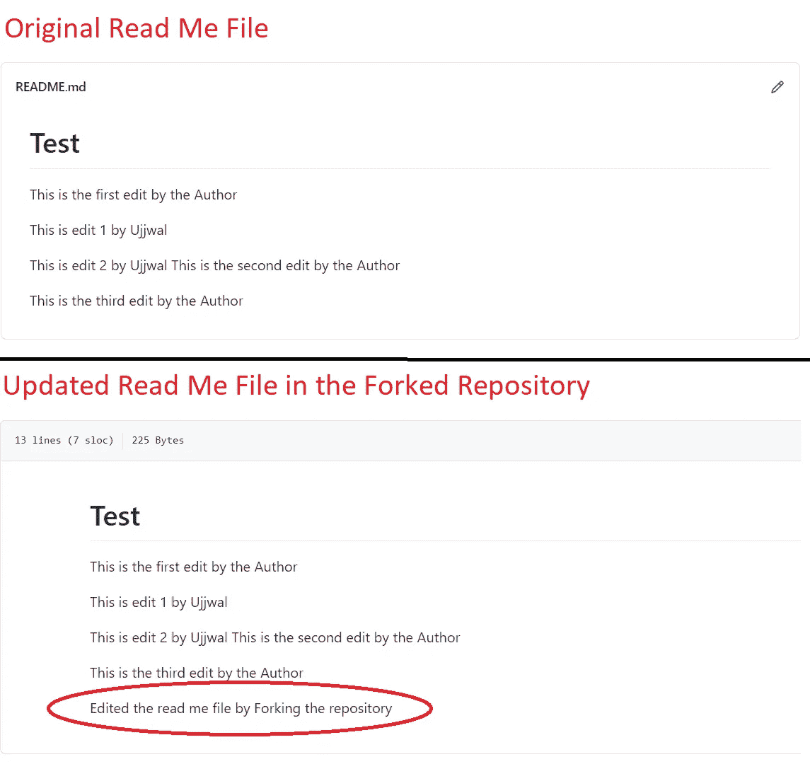
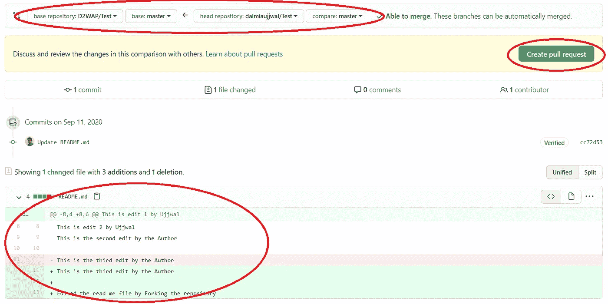

# 在 GitHub 上合作

> 原文：<https://towardsdatascience.com/collaborating-on-github-68f8dd953bb8?source=collection_archive---------46----------------------->

## 数据科学家必须了解的工具

照片由 [Richy Great](https://unsplash.com/@richygreat?utm_source=medium&utm_medium=referral) 在 [Unsplash](https://unsplash.com?utm_source=medium&utm_medium=referral) 上拍摄

在[的最后一个教程](https://medium.com/@Ujjwal_Dalmia/must-know-tools-for-data-scientists-114d0b52b0a9)中，我们学习了 GitHub 的基础知识。在本教程中，所有这些基础知识将汇集在一起，我们将体验 GitHub 的真正力量，它来自于协作。请注意，在本教程中，我们将频繁使用像克隆，推，拉，分支，大师等词。因此，如果你对这些都不清楚，请先通读[上一篇教程](https://medium.com/@Ujjwal_Dalmia/must-know-tools-for-data-scientists-114d0b52b0a9)。

# 定义协作

要理解解决方案，重要的是理解问题。通读以下内容，理解 GitHub 可以派上用场的场景。

你是一名首席数据科学家，与一组初级数据科学家一起从事机器学习项目。由于您是项目所有者，因此您负责维护项目代码的“ ***主*”版本**。

在您的团队中，每个数据科学家都在独立工作，以改进模型预测。因此，他们创建了自己的本地版本或*主*版本的**备用分支。**

让我们假设**你已经对你的代码的"*"版本做了一些编辑****，并且**你的团队中的一个成员拿出了他自己的编辑版本**，并且声称他已经极大地改进了模型预测。这个场景的视觉效果如下:*

**

*示例场景(图片由作者提供)*

*你现在想更新" ***master*** "版本的代码，但是可能会出现一些冲突。下面举几个例子:*

*   *您对"***" master "***版本所做的编辑可能不在您的团队成员的分支版本中*
*   *与“ ***【主】*** 代码相比，分支版本可能有一些不同的变量处理*

*这意味着**简单地用代码的分支版本覆盖***主代码可能**不符合项目**的最佳利益。为了解决这样的冲突，GitHub 派上了用场**

# **求解时间**

**我确信上面的场景一定让你意识到了眼前的问题。问题是，GitHub 将如何提供帮助？**

## **重要的事情先来**

**在我们开始讨论解决方案之前，让我们先了解一些我们将在本教程中使用的基本术语:**

*   ****合作者**——被**正式添加到项目存储库**并被授予**推送访问权限**(修改存储库内容的访问权限)的开发人员被称为贡献者或合作者**
*   ****Fork —** 在 GitHub 中 Forking 就像**把别人的库**复制到你的账户中。一般来说，当你想使用某个其他开发者创建的开源项目**并且**你不是贡献者**时，你**派生**它并获得对他们的库的访问权。****
*   ****分支** —通常开发者**使用不同的分支来维护**项目的不同模块。另一个允许使用分支的常见场景是当团队的多个成员想要处理同一段代码时。这时每个人都可以有自己的分支。默认情况下，**每个新创建的存储库都有一个名为 ***主*** 分支的中央分支**。**
*   ****拉取请求**——创建一个拉取请求**，将一个分支与“*主*”分支**合并。请求直接发送给项目所有者，他/她可以与分支贡献者一起接受/拒绝编辑。**

## **情节**

**为了解决上面定义的问题，我们将介绍两个场景，您在 GitHub 上积极协作时会遇到这两个场景:**

*   **在第一个场景中，我们假设您想要对一个存储库(项目)做出贡献，而**您没有被添加**为贡献者。在这个场景中，我们将假设在您分叉了项目之后，没有对**主分支进行任何编辑(在上面显示的示例场景图中，版本 2 和 3 **的黄色框不存在**)。****
*   **第二个场景假设您是项目组的一部分，并且**作为贡献者**被添加到项目存储库中。在这个场景中，我们将假设**在您创建了自己的分支之后，对“*主*”分支**进行了编辑(在上面显示的示例场景图中，版本 2 和 3 的黄色框**存在**)。**

**让我们来看看上述场景的工作流程。**

## ****情景 1 —不是贡献者****

**当你**不是一个库的贡献者**时，你**不被允许从你的本地系统推送编辑**到 GitHub。在这种情况下进行协作的工作流程步骤如下:**

*   ****派生存储库—** 因为我们不是存储库的合作者，我们将**首先派生存储库**。要派生存储库，请登录您的帐户并搜索您感兴趣的存储库。进入资源库 GitHub 页面，点击 ***叉按钮*** ，如下图所示:**

****

**分叉(作者图片)**

**在上面的 4 张截图中，我们正在**搜索资源库** (D2WAP/Test)。我们转到**存储库页面，并按下右上角的叉按钮**。分叉过程发生了，我们的账户中的**库被分叉**。**

*   ****克隆存储库—** 完成后，您可以**克隆分叉的存储库，使其内容在您的系统**上可用。这一过程在[上一个教程](https://medium.com/@Ujjwal_Dalmia/must-know-tools-for-data-scientists-114d0b52b0a9)中有解释。由于分叉库是你的帐户的一部分，你将有推送权限，你可以将你的编辑推送到分叉库。请注意，在这种情况下，**克隆应该在分叉**之后完成，因为如果在分叉之前完成，您的本地克隆库将指向**其他开发者的帐户**，在那里您将没有**推送访问权限**。**
*   ****修改代码**，**提交并推送** —下一步是**编辑克隆库**中的代码，**提交更改，**和**将它们推送到您的分叉库**。假设你有一个分支，你**可以直接将编辑推送到“主”分支**或者**也可以创建一个新分支**。建议我们**只在新的分支**中进行编辑，但是为了简化这个场景，我们将编辑直接推送到“ ***主*** ”分支**。**我们将在场景 2 中查看新分支的创建。为了演示这个过程，我编辑了分叉库的 ***read me* *文件*** 。从下面的截图可以看出分叉的存储库和原始存储库之间的区别:**

****

**编辑自述文件(图片由作者提供)**

*   ****创建新的拉取请求—** 现在您已经对代码进行了必要的编辑( ***read me file* 在我们的例子中**)，是时候创建一个拉取请求了。**点击*拉动请求*选项**，进入拉动请求屏幕。在屏幕右上方点击 ***新拉取请求*。****

****

**创建新的拉取请求(作者图片)**

*   ****选择基地和头库** —点击 ***新拉取请求*** ，将进入**选择基地和头库**以及**对应分支**的页面。将 base 视为目的存储库，将 head 视为分叉存储库。由于我们已经直接对分叉存储库的“*”主分支进行了编辑，因此对于头分支和基础分支都选择“*”。一旦做出选择，GitHub 将向您展示您试图合并的两个版本之间的**比较。再次点击 ***创建拉式请求***。******

****

**选择源和目标存储库(按作者排列的图片)**

*   ****添加注释** —一旦您点击了“ ***创建拉式请求*** ，您将到达**注释页面**，在这里您可以为源代码库开发人员添加**适当的注释**。再次**点击*创建拉取请求***，你的拉取请求将被发送给源开发者。**注意来自 GitHub 的消息说没有冲突**。这验证了我们的假设，即在我们分叉存储库之后，没有在源代码中进行任何编辑。**

****

**评论部分(作者图片)**

*   ****按作者合并** —一旦您提交了拉请求，作者就会收到，如果没有冲突，他/她可以立即批准。要合并，作者将转到“拉请求”选项卡，并单击“ ***合并拉请求*”**。就这样，您已经成功地对源存储库做出了贡献**

****

**合并审批流程(作者图片)**

## **场景 2 —你是一名贡献者**

**因为在这个场景中，我们假设您被存储库所有者添加为贡献者，所以您将拥有将编辑内容直接推送到源存储库的访问权限。基于这一假设，我们来看一下工作流程:**

*   ****克隆**——因为你现在可以直接将编辑推送到主存储库，所以**不需要分叉**。继续克隆存储库。这个过程在[上一个教程](https://medium.com/@Ujjwal_Dalmia/must-know-tools-for-data-scientists-114d0b52b0a9)中有解释**
*   ****源文件被编辑** —参考下面的截图，查看对源文件和分支文件的编辑。出于演示目的，我们正在修改 ***自述文件*** 。**

****

**编辑自述文件(图片由作者提供)**

*   ****拖拽&放下** —假设你已经做了必要的编辑，你可以到 GitHub 上的原始存储库页面，拖拽&放下页面上编辑过的文件。添加截图供您参考:**

****

**拖放(作者图片)**

*   ****创建新分支** —一旦您将编辑过的文件放到存储库页面上，您将获得直接编辑“ ***主*** ”分支或创建新分支的选项。在这个场景中，我们将按照推荐的方法创建一个新的分支。当相应的单选按钮将被选中时，GitHub 将要求您命名分支。一旦命名，点击 ***提出修改*** 。每当你想备份或版本控制你的工作，你可以做这一步。只要确保如果您在生成 pull 请求之前继续对编辑进行版本控制(在下一步中解释)，您是在同一个分支上进行的。截图补充如下，供大家参考:**

****

**创建新分支(作者图片)**

*   ****创建新的拉式请求**——一旦您提出了变更，您就可以像场景 1 中解释的那样创建一个拉式请求。请注意，因为我们已经直接对源存储库进行了编辑，所以您不需要选择基本存储库和主存储库，而只需要选择要合并的分支。此外，由于这两个分支在合并时被并行编辑，GitHub 引发了冲突。添加截图供您参考:**

****

**有冲突的拉取请求(图片由作者提供)**

*   ****解决冲突** —这是存储库所有者和分支协作者可以进行讨论并一起解决冲突的地方。在 GitHub 上，这可以通过点击“ ***解决冲突*** 来完成，并且可以由存储库所有者或分支所有者发起。在下面的截图中，请注意导致冲突的编辑。哪些编辑要保留，哪些要拒绝，可以通过相互讨论来解决。编辑完成后，点击屏幕右上角的***标记为已解决***。添加截图以供参考:**

****

**解决冲突(作者图片)**

*   ****合并拉取请求** —冲突解决后，您将进入拉取请求屏幕，冲突消息将被合并拉取请求所取代。点击" ***【合并拉取请求】*** ，然后点击" ***【确认合并*** 】以及任何想要记录的信息。就这样，你的编辑被合并到“ ***主*** ”分支中。添加截图供您参考:**

****

**合并拉取请求(作者图片)**

*   ****重新检查"*主*"分支**-一旦合并，您将看到"*"分支随着分支的编辑而更新。***

# ***结束语***

***git & GitHub 还有很多其他相关的功能，但那是以后的事了。***

***有了这些知识，与你的项目团队合作，把版本控制的烦恼留给 GitHub。希望这篇教程对你有所帮助，并且你学到了一些新的东西。***

***会在以后的教程中尝试并带来更多有趣的话题。***

***快乐学习！！！***