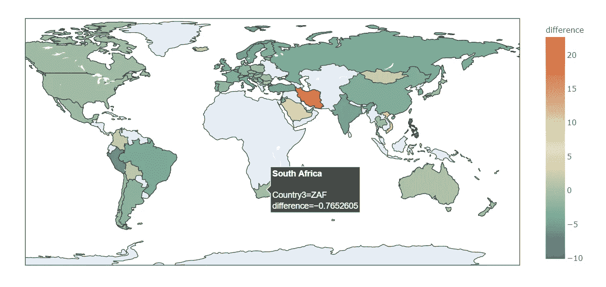
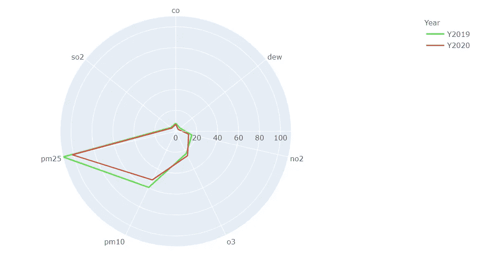

# 利用 dstack.ai 探索新冠肺炎对空气质量的影响

> 原文：<https://towardsdatascience.com/collaborative-exploration-of-covid-19-effect-on-air-quality-with-dstack-ai-2094ef8c83bd?source=collection_archive---------59----------------------->


来源[https://unsplash.com/photos/3LsocYqXWpM](https://unsplash.com/photos/3LsocYqXWpM)

作为一名被禁闭的数据科学家，我决定花一些时间进行数据探索和尝试新事物。我想知道格里塔·图恩伯格和其他人是否会感谢冠状病毒通过让人们呆在家里来清洁我们的空气。

我想做得又快又脏，看看实际的趋势，并轻松地与人们分享。以下是我得到的信息:

[https://dstack . ai/oti pita/d/2710328 b-393 a-456 a-907 a-0595761 af 188](https://dstack.ai/otipita/d/2710328b-393a-456a-907a-0595761af188)

一开始有两个问题——用什么数据来评估空气状况，用什么工具来可视化。大家来翻翻我的回答和整体开发流程。

**数据收集**

我一直在寻找有关空气状况的“实时”信息，以便以一种良好的格式轻松获取数据，几乎可以随时进行分析。世界上有十几个数据库，每个国家都有不同的信息，但大多数数据库获取和整合数据的时间都有很大的延迟。通常情况下，他们会在第二年的第一季度发布上一年的信息，这不是我想要的。所以当我发现 https://waqi.info/的时候我很开心。该网站有许多国家的信息，这些信息一天更新几次，涵盖广泛的指标。尽管他们有一个可用的 API，但也发布了为可能的新冠肺炎分析提取的历史数据。一个只需要电子邮件验证，就可以获得从 2015 年到目前为止 22 个指标的国家每日数据。虽然少数国家报告了一些指标，但几乎所有国家都有 10 项指标。我们列出了一氧化碳、露水、二氧化氮、臭氧、PM10、PM25、二氧化硫的测量指标，并删除了温度、湿度和压力等其他指标。

**技术堆栈**

我通常使用 Python、Excel、Power BI 或 Tableau 进行数据可视化。在这个分析中，我选择了 Python，因为我想要一个完全开放的堆栈。所以我用 pandas 进行数据收集和处理，Plotly 进行可视化。

分析数据后的最后步骤是:

*   将我的所有视觉效果合并到一个仪表板中
*   在线发布仪表板并共享它
*   组织反馈以进一步改进仪表板

我想知道如何又快又容易地做这件事。最近，我了解到一个新工具可以如何帮助我的视觉效果组合、部署、共享和进一步协作。我决定试一试。

**发展**

dstack.ai 仪表板由两部分组成:滤镜面板和视觉效果(堆栈)。数据预处理和转换见 [Jupyter 笔记本](https://github.com/otipita/covid-19-air-dstack)。

我们可以将数据按国家分组，以检查 2019 年 1-5 月、2020 年 1-5 月的中值指标衡量，以及这两个时期的实际差异。所以我从 2020 年和 2019 年的 NO2 差异图开始绘制。



2020 年 1 月至 5 月空气中二氧化氮日均值与 2019 年的差异

```
def map_plot(data, kpi, year, title):
    data = data[(data["Specie"]==kpi)]
    fig = px.choropleth(data, locations="Country3",
                  color=year,
                  hover_name="CountryName",
                  color_continuous_scale=px.colors.diverging.Geyser)
    return figfig = map_plot(data_grouped, 'o3', 'difference', 'World map')
fig.show()
```

一旦我绘制出了想要的可视化效果，dstack.ai 的使用比 GitHub 更容易。为了将可视化发布到 dstack 前端，它提供了三种方法，即创建-提交-推送。

```
# Creation of map stack
frame = create_frame("world_map")for kpi in kpis:
    for year in ['median2020', 'median2019', 'difference']:
        frame.commit(map_plot(data_grouped, kpi, year, 'Air Indicator Map'), f"World map colored by {kpi}", {"Air Indicator": kpi, "Measure": year})frame.push()
```

另一种观察空气质量的方法是在雷达图上一次标出特定国家的所有指标。我第一次尝试是在中国。2020 年与 2019 年相比没有太大变化，除了 PM25 和 PM10 指标。



```
def radar_plot(data, country):
    data = data[(data["CountryName"]==country)]
    fig = px.line_polar(data, r="median", theta="Specie",
               color="Year", line_close=True,
               hover_name="CountryName",
               color_discrete_sequence=["#3deb34","#eb4034"])
    return figfig = radar_plot(data_grouped_time, 'China')
fig.show()
```

要创建带有国家参数的堆栈，我们需要重复帧创建-提交-推送操作:

```
# Creation of radar stack
frame = create_frame("radar_chart")for country in data_grouped_time['CountryName'].sort_values().unique():
    frame.commit(radar_plot(data_grouped_time, country),
    f"Air quality measure for {country}", {"Country": country})frame.push()
```

我还创建了一个折线图来查看 2020 年与 2019 年的每日动态，以及一个条形图，显示指标下降的主要国家。你可以在 [GitHub](https://github.com/otipita/covid-19-air-dstack) 查看完整代码。

用 dstack 将视觉效果组合成一个仪表板非常容易。您只需选择要添加到仪表板中的堆栈，对它们重新排序，然后选择所需的布局/标题。瞧，动态仪表板几分钟后就准备好了。

对我来说，最大的惊喜是在单个可视化上设置的参数/过滤器会在需要时自动组合(没有重复)。此外，一旦我在单个堆栈中做了一些更改，它们就会随着最新的更新出现在仪表盘上。此外，每个堆栈可以最大化为全屏视图。

在协作特性方面，我发现任何被允许在 dstack 前端查看图表的人都可以留下他们对图表的反馈。我喜欢这种直观的协作方式。我必须说，现在没有太多花哨的功能，但它非常适合我的需要，并以一种方便的方式加快了我“准备就绪”的时间，以获取其他人的想法。

**结果**

经过几个小时的工作，我能够与我的朋友和同事分享我的仪表板，并开始探索仪表板。有一些有趣的发现，肯定需要进一步探索，以了解原因。

与 2019 年相比，除沙特阿拉伯和伊朗外，大多数国家 2020 年 1 月至 5 月的所有指标都略有下降。

一些国家如丹麦、瑞典、挪威、斯洛伐克在减少空气中二氧化硫和二氧化氮方面名列前茅，没有在疫情期间引入严格的封锁。

查看你所在的[国家](https://dstack.ai/otipita/d/2710328b-393a-456a-907a-0595761af188)的空气状况，保持健康，并通过 dstack.ai 轻松分享可视化效果。