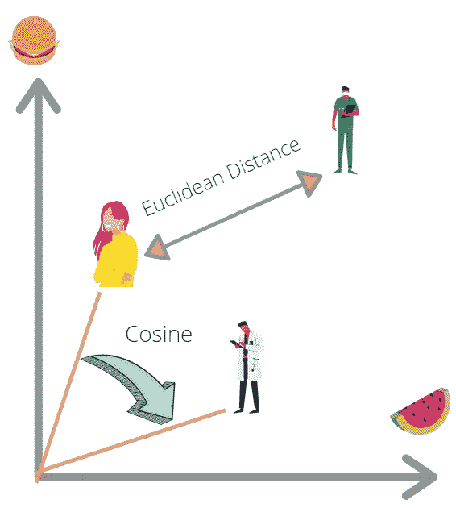
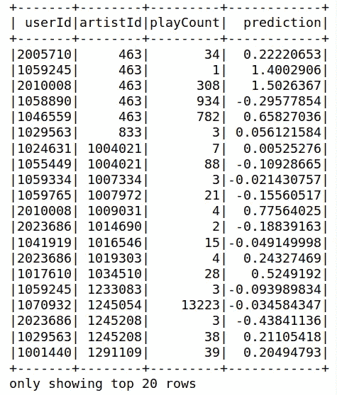
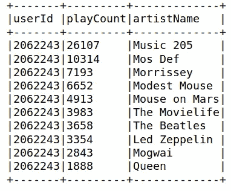

# Pyspark 中的协同过滤

> 原文：<https://towardsdatascience.com/collaborative-filtering-in-pyspark-52617dd91194?source=collection_archive---------27----------------------->

## [入门](https://towardsdatascience.com/tagged/getting-started)

## 基于交替最小二乘(ALS)算法的协同过滤及其在 Pyspark 中的实现


[诺贝特·布杜茨基](https://unsplash.com/@buduczki?utm_source=medium&utm_medium=referral)在 [Unsplash](https://unsplash.com?utm_source=medium&utm_medium=referral) 上的照片

你有没有想过 Spotify 是如何每周在“发现周刊”上发布一个歌曲列表，而你最终因为喜欢这些歌曲而将其中一些添加到你的播放列表中的？因为你昨天看了一个特别的节目，网飞推荐给你的那些节目怎么样？这些科技巨头怎么这么聪明？答案是推荐系统。

推荐系统基于用户的历史行为，如观看、搜索或购买历史，进行预测。推荐系统的两种常见方法是**基于内容的** 和**协同过滤**，本文将深入探讨后者。

# 什么是协同过滤？

协作过滤是一种数学方法，用于根据其他相似用户的评级来预测用户如何对特定项目进行评级。典型的协同过滤包括 4 个不同的阶段:

1.  数据收集—收集用户行为和相关数据项
2.  数据处理—处理收集的数据
3.  建议计算—根据处理的数据计算推荐
4.  结果推导-提取相似性并返回前 N 个结果

# 显性和隐性反馈

那么，在协同过滤的第一阶段，收集的是什么类型的数据呢？有两种不同类别的数据(称为反馈)，可以是**显性**或**隐性**。

显式反馈的一个例子是用户给出的评级，网飞收集这些评级是为了在客户对他们观看的电影进行评级后向他们提供建议。隐式反馈不那么直接，因为它基于用户与平台的互动，包括点击、观看、喜欢和购买。Spotify 利用隐式反馈来实现它的推荐系统。

# 计算相似度

一旦收集和处理了数据，就需要一些数学公式来进行相似性计算。两种最常见的方法是:

1.  欧几里德距离——两个用户之间偏好的距离。如果距离小，则两个用户之间的相似性高
2.  皮尔逊相关-如果两个用户之间的余弦值(入射角)一致，则两个用户之间的相似性很高



作者图片—余弦和欧几里德距离向量空间

# Pyspark 中的实现

库包 *spark.ml* 目前支持基于模型的协同过滤，其中用户和产品由一小组潜在因素描述，这些因素可用于进行预测。它使用[交替最小二乘(ALS)算法](https://www.quora.com/What-is-the-Alternating-Least-Squares-method-in-recommendation-systems-And-why-does-this-algorithm-work-intuition-behind-this)来学习这些潜在因素。

我们将使用来自 https://www.last.fm/api/[的数据集，其中包含 3 个文件:](https://www.last.fm/api/)

*   **user_artist_data.txt** 3 列:userid artistid playcount
*   artistid artist_name
*   **artist_alias.txt** 2 列:badid，goodid[已知拼写错误的艺术家和正确的艺术家 id]

首先，我们用下面的代码设置 Spark。

```
# import librariesfrom pyspark import SparkContext
from pyspark.ml.recommendation import ALS
from pyspark.sql import SparkSession ,RowappName="Collaborative Filtering with PySpark"
# initialize the spark session
spark = SparkSession.builder.appName(appName).getOrCreate()
# get sparkcontext from the sparksession
sc = spark.sparkContext
```

然后，我们定义数据结构并将弹性分布式数据帧转换成数据帧。

```
from pyspark.sql.types import StructType,StructField,IntegerType,StringType,LongType
from pyspark.sql.functions import col#Define the schema for the datasets
schema_artist = StructType([StructField("artistId",StringType(),True),StructField("artistName",StringType(),True)])schema_user_artist = StructType([StructField("userId",StringType(),True),StructField("artistId",StringType(),True),StructField("playCount",StringType(),True)])schema_alias = StructType([StructField("badId",StringType(),True),StructField("goodId",StringType(),True)])#Convert RDDs into Dataframes
artistRDD = rawArtistData.map(lambda k: k.split("\t"))artist_df = spark.createDataFrame(artistRDD,schema_artist,['artistId','artistName'])userArtistRDD = rawUserArtistData.map(lambda k: k.split())user_artist_df = spark.createDataFrame(userArtistRDD,['userId','artistId','playCount'])aliasRDD = rawArtistAlias.map(lambda k: k.split())alias_df = spark.createDataFrame(aliasRDD,['badId', 'goodId'])#First for convenience, we can create aliases for each dataframes
ua = user_artist_df.alias('ua')
ub = artist_df.alias('ub')
```

一旦数据集被处理，我们可以继续训练我们的 ALS 模型。在此之前，我们应该将数据集分成训练和测试数据，这样我们就可以知道我们的模型执行得有多好。

```
# dataset split into training and testing set
(training, test) = ua.randomSplit([0.8, 0.2])# training the model
als = ALS(maxIter=5, implicitPrefs=True,userCol="userId", itemCol="artistId", ratingCol="playCount",coldStartStrategy="drop")
model = als.fit(training)# predict using the testing datatset
predictions = model.transform(test)
predictions.show()
```



作者图片—测试预测的 Pyspark 输出

我们可以尝试使用该模型来找到为每个用户推荐的顶级艺术家。我们可以使用 ALS 模型中的[***recommended for allusers***](https://spark.apache.org/docs/2.2.0/api/python/pyspark.ml.html#pyspark.ml.recommendation.ALS)函数来获取每个用户的首选推荐列表。

下面的函数将 *userId* 和 limit 作为输入。对于给定的*用户 Id* ，它获得当前最受欢迎艺术家的列表(基于*播放计数*)。让我们尝试为用户(2062243)显示最喜欢的艺术家。

```
def currentLikes(ua,ub,userId,limit):
 df = ua.join(ub,ua.artistId==ub.artistId)\
 .filter(ua.userId==userId)\
 .sort(ua.playCount.desc())\
 .select(ua.userId,ua.playCount,ub.artistName)\
 .limit(limit)
 return df# display top 10 liked artists for user 2062243
currentLikes(ua,ub,2062243,10).show(truncate=False)
```



按作者分类的图片 Pyspark 为用户 2062243 输出的最受欢迎的艺术家

然后，下面的函数使用该模型为每个用户给出艺术家的最佳推荐。我们试着为同一个用户(2062243)显示推荐的艺术家。

```
def recommendedArtists(userId,limit):
 test =  model.recommendForAllUsers(limit).filter(col('userId')==userId).select("recommendations").collect()
 topArtists = []
 for item in test[0][0]:
  topArtists.append(item.artistId)

schema = StructType([StructField("artistId",IntegerType(),True)])
artists = spark.createDataFrame(topArtists,IntegerType())
final=artists.join(ub,artists.value==ub.artistId).select(ub.artistId,ub.artistName)
return final# display top 10 recommended artists for user 2062243
recommendedArtists(2062243,10).show(truncate=False)
```


按作者分类的图片-为用户 2062243 推荐的艺术家的 Pyspark 输出

# 摘要

在这篇文章中，我们介绍了什么是协同过滤，以及它的 4 个不同阶段。协同过滤收集的两类数据，主要是**隐式**和**显式反馈**，使用**欧氏距离**或**皮尔逊系数**计算相似度。最后，简要介绍了使用 spark 中内置的**交替最小二乘(ALS)算法**在 Pyspark 中实现协同过滤的过程。希望你们对推荐系统的工作原理有一个简单的了解，下次在网上冲浪和使用 Spotify/Amazon 时，看到好的推荐，不要感到惊讶，干杯！

[](https://www.buymeacoffee.com/tankahwang)