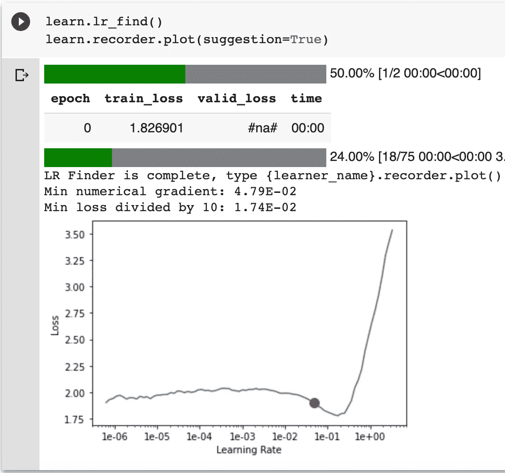
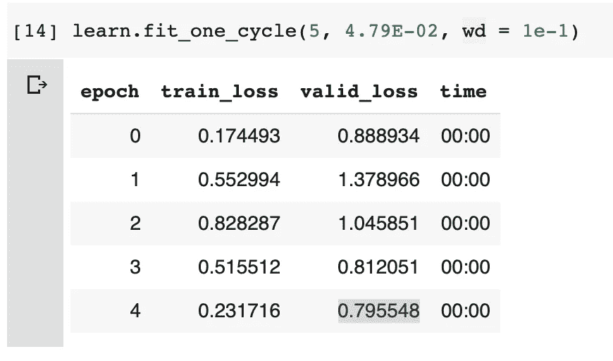
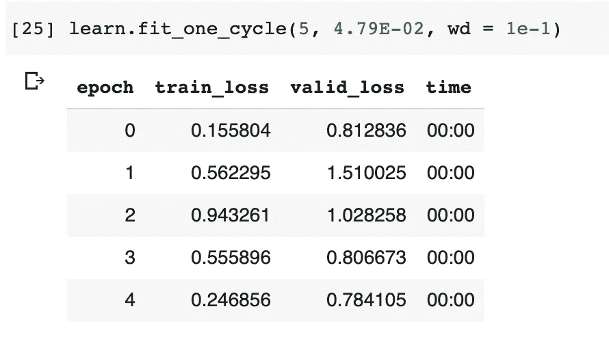
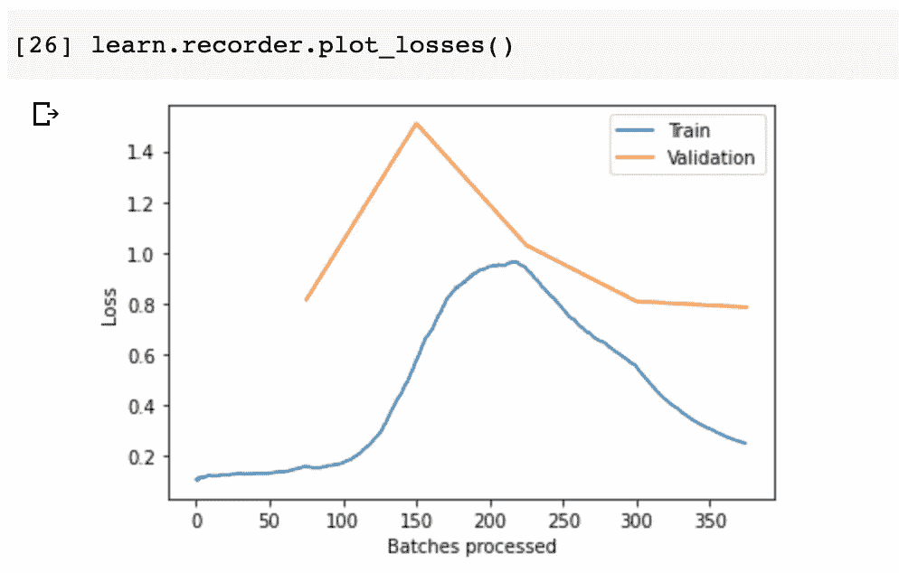

# Pytorch 中的协同过滤

> 原文：<https://towardsdatascience.com/collaborative-filtering-in-pytorch-6e50515f01ae?source=collection_archive---------30----------------------->

## 构建用于电影推荐的嵌入神经网络


图片由[亨利&公司](https://unsplash.com/@hngstrm)在 [Unsplash](http://unsplash.com/) 拍摄

协同过滤是公司越来越多地使用的工具。网飞用它来推荐节目给你看。脸书用它来推荐你应该和谁交朋友。 [Spotify](https://medium.com/s/story/spotifys-discover-weekly-how-machine-learning-finds-your-new-music-19a41ab76efe) 用它来推荐播放列表和歌曲。它在向顾客推荐产品时非常有用。

在这篇文章中，我构建了一个嵌入的协同过滤神经网络来理解用户对某些电影的感受。由此可以推荐电影给他们看。

数据集取自此处的。这段代码大致基于 [fastai 笔记本](https://github.com/fastai/course-v3/blob/master/nbs/dl1/lesson4-collab.ipynb)。

首先，让我们去掉烦人的复杂用户 id。我们可以用普通的旧整数来凑合。它们更容易处理。

```
import pandas as pd
ratings = pd.read_csv('ratings.csv')
movies = pd.read_csv('movies.csv')
```

然后我们将对电影 id 做同样的事情。

```
u_uniq = ratings.userId.unique()
user2idx = {o:i for i,o in enumerate(u_uniq)}
ratings.userId = ratings.userId.apply(lambda x: user2idx[x])
```

我们需要获得用户数量和电影数量。

```
n_users=int(ratings.userId.nunique())
n_movies=int(ratings.movieId.nunique())
```

首先，让我们创建一些随机权重。我们需要打电话。这允许我们避免显式调用基类。这使得代码更易于维护。

这些权重将在 0 和 0.05 之间均匀分布。`uniform_`末尾的`_`操作符表示在位操作。

接下来，我们添加我们的嵌入矩阵和潜在因素。

我们正在为我们的用户 id 和电影 id 创建一个嵌入矩阵。嵌入基本上是一种数组查找。当我们将我们的一次性编码用户 id 乘以我们的权重时，大多数计算都取消了`0` `(0 * number = 0)`。我们只剩下权重矩阵中的某一行。这基本上就是[一个数组查找](https://youtu.be/CJKnDu2dxOE?t=1625)。

所以我们不需要矩阵乘法，也不需要独热编码数组。相反，我们可以只做一个数组查找。这[减少了内存使用](https://arxiv.org/pdf/1604.06737)并加速了神经网络。它还揭示了分类变量的内在属性。这个想法在最近的一次 [Kaggle 比赛](https://www.kaggle.com/c/rossmann-store-sales)中得到了应用[获得了第三名](https://www.kaggle.com/c/rossmann-store-sales/discussion/17974)。

这些嵌入矩阵的大小将由 n 个因子决定。这些因素决定了数据集中潜在因素的数量。

潜在因素在我们的网络中非常有用。它们减少了对特征工程的需求。比如`User_id` `554`喜欢`Tom cruise``Tom cruise`出现在一部电影里。用户`554`可能会喜欢这部电影。出现在电影中会是一个潜在的特征。我们在培训前没有具体说明。它就这么出现了。我们很高兴它做到了。

最后，我们需要添加我们的`forward`函数。

正如这个类的名字所暗示的，我们正在做嵌入矩阵的点积。

给我们一个用户和电影的小批量。我们只看嵌入的分类变量。`conts`指连续变量。

这个小批量大小将由您设置的批量大小决定。根据这篇文章，大批量实际上会损害模型的质量。但是根据这篇论文，大批量增加了模型的质量。目前还没有达成共识。许多人都在报道[矛盾的结果](https://stats.stackexchange.com/questions/436878/choosing-optimal-batch-size-contradicting-results)。所以你可以随意选择批量大小进行实验。

从这个迷你批处理中，我们想要在我们的嵌入矩阵中进行数组查找。

允许我们进行数组查找。这种查找比一位热码编码矩阵和加权矩阵矩阵乘法计算量小。

`(u*m).sum(1).view(-1, 1)`是用户和电影嵌入的叉积，返回一个数字。这是那部电影的预测分级。

接下来，我们需要创建一个`ColumnarModelData`对象

那我就设置一个乐观器。对此我将使用随机梯度下降法。`optim.SGD`实现[随机梯度下降](https://pytorch.org/docs/stable/optim.html#torch.optim.SGD)。随机梯度下降在计算上不如梯度下降密集。这是因为当[选择数据点](/stochastic-gradient-descent-clearly-explained-53d239905d31)计算导数时，我们引入了随机性。

我们也可以使用`optim.Adam`。实现 [rmsprop](https://www.cs.toronto.edu/~tijmen/csc321/slides/lecture_slides_lec6.pdf) 和[动量](https://www.youtube.com/watch?v=YU_W8PFkY2U)。反过来，这导致了自适应的学习速率。但是[这篇](https://arxiv.org/abs/1705.08292)论文表明从 SGD 得到的解比从 Adam 得到的解更一般化。另外，反正训练也不需要那么长时间，所以 SGD 也不是个坏选择。

然后我们适合一个`3`时代。

```
fit(model, data, 3, opt, F.mse_loss)
```

MSE 损失就是简单的均方误差损失。这是自动计算的。

Fastai 在幕后自动创建一个神经网络。您可以调用一个`[collab_learner](https://docs.fast.ai/collab.html#collab_learner)`，它会自动创建一个用于协同过滤的神经网络。Fastai 还可以通过这个协作学习器引入[偏差](https://dev.fast.ai/tutorial.collab#Movie-bias)和[辍学](https://www.cs.toronto.edu/~hinton/absps/JMLRdropout.pdf)。

偏见是很有用的。我们需要找到用户偏见和电影偏见。用户偏见可以解释那些对每部电影都给予高评价的人。电影偏见可以解释那些倾向于给某类电影高评级的人。Fastai 自动添加偏差。

使用 fastai，我们可以轻松创建协作学习者:

偏见是很有用的。我们需要找到用户偏见和电影偏见。用户偏见可以解释那些对每部电影都给予高评价的人。电影偏见可以解释那些倾向于给某类电影高评级的人。Fastai 自动添加偏差。

有趣的是，fastai 指出你应该稍微增加`y_range`。 [sigmoid 函数](https://en.wikipedia.org/wiki/Sigmoid_function)用于确保最终输出在`y_range`中指定的数字之间。问题是一个 sigmoid 函数似乎。所以我们需要稍微增加我们的`y_range`。Fastai 建议增加`0.5`。


图片来自 [ResearchGate](https://www.researchgate.net/profile/Knut_Kvaal/publication/239269767/figure/fig2/AS:643520205430784@1530438581076/An-illustration-of-the-signal-processing-in-a-sigmoid-function.png)



作者图片

我这里用的是建议的学习率，有少量的重量衰减。这是我发现非常有效的组合。



作者图片

我们可以多训练一些



作者图片



作者图片

我们终于得到了一个`0.784105`的 MSE。但这是一段非常颠簸的旅程。我们的损失上下波动很大。也就是说`0.784105`实际上比 [LibRec 系统](https://www.librec.net/release/v1.3/example.html)的协同过滤得分更高。他们得到了 MSE。

它实际上也比 fastai 在他们的[协作过滤课程](https://github.com/fastai/course-v3/blob/master/nbs/dl1/lesson4-collab.ipynb)中创建的模型略好。他们越来越小。

# 丰富

1.  我们可以通过发送一个名为`emb_szs`的字典来调整嵌入的大小。这可能是一个需要调整的有用参数。
2.  基于内容的推荐。协同过滤只是建立推荐系统的一种方法。其他方法可能更有用。基于内容的系统是我一直铭记在心的。它可以查看演员、工作人员、流派和导演等元数据来做出推荐。我认为某种[混合](https://www.kaggle.com/rounakbanik/movie-recommender-systems#Movies-Recommender-System)解决方案将是最佳的。这将结合基于内容的推荐系统和协作过滤系统。
3.  协同过滤在很大程度上被[冷启动问题](https://www.kdnuggets.com/2019/01/data-scientist-dilemma-cold-start-machine-learning.html)所破坏。为了克服这个问题，我们可能会查看用户元数据。例如，我们可以查看诸如:性别、年龄、城市、他们访问网站的时间等。只是他们在报名表上输入的所有内容。在这些数据的基础上建立一个模型可能会很棘手，但是如果效果好的话，它可能会很有用。

*原载于 2020 年 7 月 12 日*[*https://spiyer 99 . github . io*](https://spiyer99.github.io/Recommendation-System-in-Pytorch/)*。*