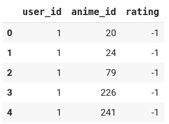
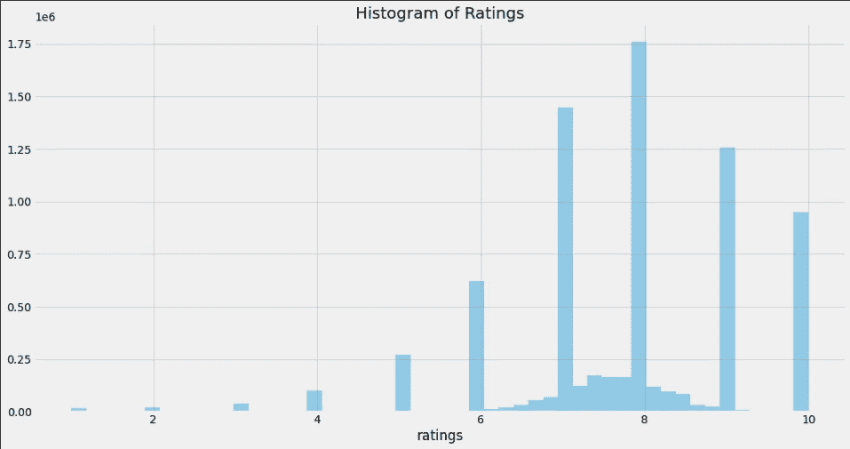
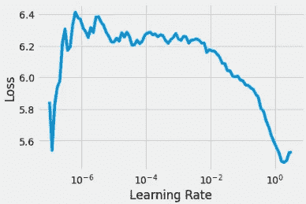
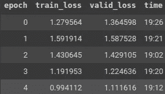
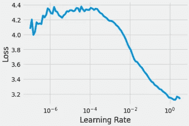
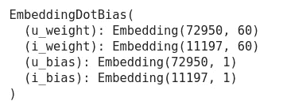
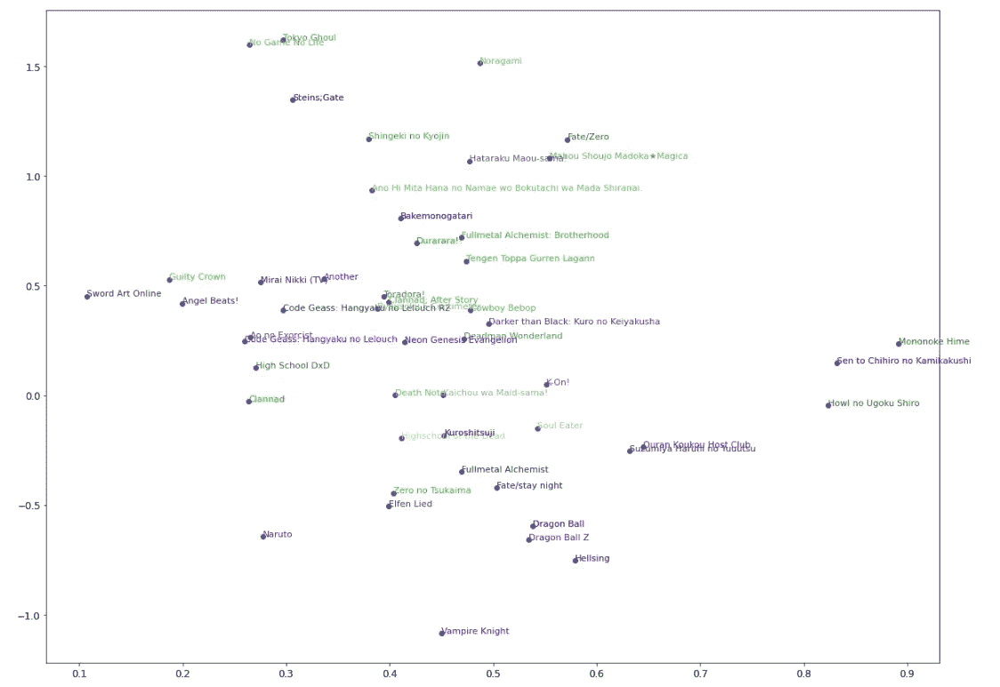

# 基于 fastai2 的动漫数据集协同过滤

> 原文：<https://towardsdatascience.com/collaborative-filtering-on-anime-dataset-using-fastai2-130ae32fe433?source=collection_archive---------46----------------------->

## 去看或去看什么

这篇文章旨在描述什么是协同过滤(在整篇文章中简称为 CF ),并随后阐述如何使用 fastai2 构建一个模型来执行这项任务。本帖涵盖的主题如下

*   [简介](#8f66)
*   [CF 背后的基本直觉](#50b2)
*   [CF in fastai2](#bfe0)
    -嵌入点偏差模型
    -神经网络模型
*   [模型解读&提出建议](#a6fc)
*   [参考文献](#a132)

单击主题，导航到相应的部分。


查尔斯·德鲁维奥在 [Unsplash](https://unsplash.com?utm_source=medium&utm_medium=referral) 上拍摄的照片

# 介绍

> *在当今世界，数据就是石油，利用数据的一种方式是为个人执行建议/推荐任务。在这个快节奏的世界里，内容以惊人的速度被创造出来，观众喜欢看到与他们以前看过的内容相似的内容。*

为了做到这一点，选择，喜欢，口味等。以评级或分数的形式记录用户，通常限定在一个有限的范围内(最常见的是 0-5 或 0-10)，其中 0 表示用户非常不喜欢该内容，5 或 10 表示用户认为该内容非常有趣并符合他的喜好。

使用这些数据来找出下一步向用户建议什么是协同过滤的全部内容。*代替用户动画或用户电影的可以是任何东西，比如消费产品或用户新闻文章或用户社交媒体帖子等等。*

从用户那里获得的反馈越多，建议就变得越相关，因为算法能够更好地理解个人的口味。

有几种方法来执行协同过滤，今天，我们将讨论其中的两种。我们将使用 [fastai2](https://course19.fast.ai/index.html) ，这是一个由西尔万·古格和杰瑞米·霍华德构建的库，这是一个基于 PyTorch 构建的令人敬畏的界面，用于执行深度学习实验。所以，事不宜迟，我们先从理解 CF 背后的直觉开始。

# 协同过滤背后的基本直觉

为了执行协同过滤，用户/订户/消费者和项目/物品/产品都被表示为矩阵。(这里的术语是特定于应用程序的，但是因为我们处理的是动画数据，所以我们将分别把用户称为查看者，把项目称为动画。)

更准确地说，每个用户都被表示为一个数值向量，每个动画也是如此。这些值由算法学习以最小化损失函数，该损失函数通常是均方误差损失(MSE)。

为用户和动画向量学习的值对应于抽象的 n 维空间，实际上没有人类解释的意义。但是为了理解到底发生了什么，我们可以这样想。考虑我们正在处理的数据集，即观众-动画数据集。


罗曼·杰尼申科在 [Unsplash](https://unsplash.com?utm_source=medium&utm_medium=referral) 上拍摄的照片

假设每部动漫都由 5 个部分组成——爱情、喜剧、生活片段、后宫和动作。那么动画可以在 5 维的向量空间中表示，每个维度是上述维度之一。

在那个五维世界里，Oregairu 和 Hyouka 会离得更近，而东京食尸鬼会离他们相对远一些。因此，这种方法创建了一个 n 维空间，其中所有具有相似组件的动画将比具有不同组件的动画更接近地分组。

现在，想想观众。另一方面，观众向量将表示每个维度中用户所重视的部分。假设用户是浪漫和生活切片的粉丝，那么该用户的向量表示将沿着那些维度具有高数值，并且沿着剩余维度具有较小的数值。

为了整合来自观众和动画的信息，我们求助于使用点积，这是沿着各自的向量维度的简单乘法，然后是聚合。让我用上面我们挑剔的这三部动漫的例子来解释一下。


图片由 Vinayak 提供

这些列表示动画的名称，并且它们中的每一个都被表示为一个 5 维向量，每个分量/维度表示一个特定的类型，如上所示。

正如我们所看到的，Hyouka 和 Oregairu 在所有维度上都有相似的值，而东京食尸鬼在所有维度上都有非常不同的值。


图片由 Vinayak 提供

观众 1 更喜欢动作和生活片段，而不是其他部分，所以，让我们计算观众 1 与所有三部动画的点积。我将在下面手动演示一次计算，您可以类似地计算其他点积。


图片由 Vinayak 提供

我们取两个向量 Oregairu 和观众 1，并将各自的分量相乘，如上面的快照中所示，即，将 Oregairu 的浪漫维度与观众 1 的浪漫维度相乘，将 Oregairu 的喜剧维度与观众 1 的喜剧维度相乘，等等。最后，通过求和将这些乘积聚合成一个值。

一旦我们对所有三部动画都这样做，我们观察到观众 1 的点积分别是 29.2、26 和 31.8。这意味着观众 1 最喜欢东京食尸鬼，这确实是高行动。

另一方面，观众 2 喜欢浪漫和后宫。他和这三部动漫的点积分别是 47.5，35.5，22.5，这意味着他最喜欢《俄勒冈》这部青少年爱情喜剧！由纪之下，汤滨，伊希基，甚至他的老师静香，似乎都对八幡很感兴趣；你敢告诉我你在这部动漫里忽略了后宫…

在宅男话题之后，回到手头的主题，我们可以看到如何将观众和动漫表示为一个向量，这可以证明有助于确定观众对所有动漫的喜欢程度或哪些用户会喜欢特定的动漫，这是网飞等流媒体公司正在利用的非常有价值的洞察力。

对于观众和动画载体来说，还有一个额外的因素叫做偏见。它是一个量，用来分别表示特定用户或特定动漫的唯一信息。因此，如果有一个用户平均给所有动漫都打了高分，或者有一部动漫是所有/大多数观众最喜欢的，而不管他们通常的口味如何，这样的信息就被称为偏见。所以，每一个观众和每一部动画都用一个 n 维向量和一个偏差项来表示。

# fastai2 中的协同过滤

fastai2 提供了一个包含 CF 可以利用的函数的子包`fastai.collab`，在你的系统上安装 fastai2 之后(这里的[指令](https://course19.fast.ai/index.html)，你可以按照下面的步骤进行操作。



图片由 Vinayak 提供

大多数情况下，数据是以这种方式存储或表示的。虽然这不是一种非常直观的方式，但它是一种非常有效的存储数据的方式。这是因为大部分观众没看过大部分动漫。

在这种情况下，如果我们试图将其存储为观众 v/s 动画的矩阵，将会有很多零。这样的矩阵称为稀疏矩阵。也有有效的方法来存储这样的矩阵，但是我们暂时让它过去。让我们现在专注于手头的任务。

这里的-1 代表用户看过动漫但没有评价。这是一个常见的场景，主要是因为在现实中，那些看动画的人并不一定会给动画评分。有数据总是比估算好，但是因为我们现在没有数据，我们可以删除有这种评级的行或者估算相同的值。有两种方法可以进行插补:

*   用用户的平均评分估算评分。
*   用动漫的平均评分来估算评分。

两者都有不同的解读。当我们根据一个用户的平均评分进行估算时，我们没有注意到该动漫与特定用户看过的其他动漫相比的相对特征，同样，当我们根据该动漫的平均评分进行估算时，我们忽略了该用户相对于其他用户的相对评分。这可能会在我们的观察中引入轻微的偏差，但我们会接受，因为评级有回归均值的趋势。如果我们选择忽略这些条目，我们最终会丢弃大量对分析有害的数据。

我们将选择估算动漫的平均评分，而不是观众，因为我们已经在 anime.csv 文件中获得了每部动漫的平均评分。这是收视率的最终分布情况



维纳亚克动漫的用户评分

我们可以看到，平均而言，人们倾向于慷慨地为动漫提供评级。他们中的大多数人给出了 7 分或更高的评分，这给我们留下了一个左偏分布，如上图所示。

现在，我们需要加载特定格式的数据，以便将其输入神经网络。fastai 的`collab`子包包含一个名为`CollabDataLoaders`的模块，我们可以使用它来加载数据。

特别是因为我们正在从 pandas dataframe 加载数据，我们将使用`from_df`工厂方法来加载数据。

所以我们在上面创建了一个数据加载器。因为列的名称可能是特定于应用程序的，所以我们需要分别指定用户、项目和评级列的名称。

参数 valid_pct 代表验证数据百分比。一旦我们建立了一个模型，它的实际神圣性是由它在这些数据上的表现来衡量的。我们的模型将使用 90%的可用数据进行训练，并在这 10%的从未见过的验证数据上进行测试。只有当我们的模型在训练集和验证集上都表现良好时，我们才能说我们已经做得很好了。

有了这个`dloader`物体，我们可以看到它所包含的一切。


Vinayak 的图像查看器数据加载器的统计数据

在数据集中有许多动漫只有很少甚至没有人给它们评分。不包括这些动漫是有道理的，因为它们弊大于利。这是因为它们已经非常稀疏，这意味着相对于它们的更新非常少，因此学习也很少。很自然地，为这样的动画生成的嵌入将是不合标准的，因此保存它们没有任何意义。

# 嵌入点偏差模型

这个模型是一个简单的模型，就像我们在上面的`The basis`部分讨论的一样。观众和动画都被表示为向量，我们得到相同的矩阵，因为有许多观众和动画。接下来，我们对它们进行点积，并使用我们旨在减少的损失函数均方误差，将它们与我们的实际观众评级进行比较。最终，这个模型将变得善于在这个 n 维空间中表现观众和动画。

让我们创建一个简单的嵌入点偏差模型并训练它。



Vinayak 的学习率查找器

fastai2 的学习者对象的`lr_find`方法真的很方便。我们可以使用它来计算出我们应该在培训中使用的学习率。它与元组的含义相同。第一个值是最小 lr，这将确保进行一些训练，第二个值是 LR，即损失下降最大的地方。在建议的 lr 中选择一个最接近 lr_min 的 lr 是很好的，最好稍微低一点以保守(个人观察)。



Vinayak 的培训总结

在训练模型之后，我们应该看到每次迭代的损失都在减少。如果遇到过度拟合的迹象，我们可以求助于早期停止(这里可能有一个，因为在第五个时期，训练损失增加了)，所以保持时期的初始数量较小是好的。一旦你看到了训练和验证失败的趋势，你就可以决定是继续训练还是结束训练。

# 神经网络模型

在嵌入点偏差模型的基础上，我们可以通过添加完全连接的层来构建 MLP，以提高模型的复杂性。基本上，用户和电影向量被连接在一起，并在获得最终点积之前通过一系列神经网络。虽然在大多数情况下，前者表现得相当好，但这种神经网络模型在一些其他情况下也确实工作得很好。

这是一个执行试验和寻找最佳执行网络评估验证数据的问题，我们可以得出哪个模型执行得更好的结论。让我们也使用神经网络建立一个模型，并测试它的性能。



Vinayak 的学习率查找器

学习率查找器返回有些类似的结果，但是由于我们增加了深度，我们可以看到所需的 min_lr 已经下降。根据我的经验，当我们增加网络的深度时，可以观察到建议的 lr_min 降低。对于更深的网络，我们通常必须更加保守，因为收敛更容易受到学习速率值的影响。


Vinayak 的培训总结。

培训日志放在一边。似乎在最后添加两个 FC 层真的没有什么不同，因为与嵌入点偏差模型相比，损耗进一步增加了。

# 模型解释和提出建议

现在我们已经有了一个模型，让我们试着解释它，使用它，并提出一些建议/推荐。

## 理解动漫偏见和权重/嵌入

让我们试着理解嵌入点偏差模型的动画嵌入。首先，让我们看看模型中的所有层是什么。

```
learn.model
```



图片由 Vinayak 提供

如前所述，观众和动画分别有两个分量，一个是矢量，另一个是偏差项。

让我们按排名最高的动画排序(不是排名很高，而是排名最高，即观众观看并评价了动画)。


图片由 Vinayak 提供

让我们检查这些动画的偏见，并与这些动画的评级进行比较。同样，让我们检查评分最低的动画的偏见，并将它们与相同的评分进行比较。为了便于理解，我们来比较一下这其中排名前 5 位和后 5 位的情况，看看结果。

```
bias_rating_data.sort_values(by = ["Ratings"], ascending = False).head()bias_rating_data.sort_values(by = ["Ratings"], ascending = True).head()
```


Vinayak 评出的“收视率最高的动漫”

评价高的动漫通常有很高的偏见。这与上面的观点是一致的，即所有观众都喜欢动漫，而不管他们的品味如何。


Vinayak 的“评价最低的动画”

评级低的动漫一般偏向性很低。这与上面的观点是一致的，即对于所有观众都不喜欢的动画，不管他们的品味如何，这种偏见是很小的。

接下来，正如我们所讨论的，权重只不过是模型学习到的向量。让我们找出前 100 名动画的权重，对它们应用主成分分析以减少它们的维度，然后在二维图上进行视觉比较。PCA 是一种用于压缩向量/矩阵的降维技术，特别是当我们必须可视化大规模数据时，或者当我们面临具有大量特征或列的数据集中的维数灾难问题时，通常会用到它。



用主成分绘制动画

可以看出，像《东京食尸鬼》和《攻击泰坦》这样动作性很强的动漫高于 y=0.5 线，而像《Clannad》、《K-On》、《Ouran Host Club》这样的爱情/生活片段动漫则低于 y = 0.5 线，尽管有一些例外。

此外，沿着 x 轴向右，浪漫和生活片段似乎越来越占主导地位，例如，Clannad After Story 位于 Clannad 和 K-on 的右侧，Ouran Host Club 位于右侧。

这是数据的压缩版本，因此这里没有描述大量丢失的信息。我们已经将嵌入向量的维数从 60 减少到 2，但是我们仍然可以看到数据的一些结构，这是非常棒的。由于人类只能感知三维的物质世界，我们无法想象 60 维的嵌入空间，因此有了这个近似值。

现在我们已经收到了所有动漫的嵌入(真嵌入)，让我们来比较一下 Oregairu，东京食尸鬼和 Hyouka 之间的距离。


维纳亚克的《东京食尸鬼》、《兵库》与《奥雷盖鲁》之比较

我们可以确认，正如我们之前讨论的，Hyouka 和 Oregairu 确实彼此更接近，因为它们的点积在三者中是最高的。此外，Hyouka 和 Oregairu 与东京食尸鬼的点积距离几乎相等。这意味着该算法做了一件相当不错的工作，尽管它并不真正知道现实中的三部动画属于哪种类型。

## 了解用户权重/嵌入

为了理解用户权重，我们将从我们的集合中随机抽样一个用户，然后在剩余的语料库中，根据称为余弦相似性的特定距离度量，挑选一个离这个随机抽样的用户最近的用户和一个最远的用户。

基本上，我们将在整个用户语料库的跨度中取那个用户、离他近的用户和离他最远的用户的点积，然后查看各自的动画以查看差异。


维纳亚克的《比较用户》

我们发现，我们随机抽样的用户喜欢动作和虚构成分高的动漫，并涉及一些戏剧/爱情/生活片段的元素。最相似的用户也喜欢高度动作和虚构的类型。

可以看出，最相似的用户选择了几乎所有的动漫，这些动漫与那个随机的家伙喜欢的动漫相同，而最不同的动漫具有更高程度的剧情/生活片段。

## CF 的一个缺点&潜在的解决方案

现在，我们看了数据库中已经存在的用户推荐。如果我们有一个新用户进来，我们没有任何建议给他，因为他没有评价任何动画/电影。

这就是通常所说的冷启动问题。

为了解决这个问题，新用户被问了几个问题，这些问题与他对我们目录中的动漫的喜欢和不喜欢有关。这使得系统推荐一些动漫，并且随着用户更频繁地参与平台并给出反馈，推荐变得越来越精炼，以适合观众的口味和喜欢。

协作过滤或推荐系统已经存在，并帮助观众/用户/消费者/订户获得适合他们喜好和品味的内容。希望这篇文章能帮助你快速了解快乐学习！如果你想深入研究，我在参考资料部分推荐了一些文章。

# 参考资料和进一步阅读

1.  [fastai 中的协同过滤](https://docs.fast.ai/collab.html)
2.  [推荐系统深度指南](https://builtin.com/data-science/recommender-systems)
3.  [Github 回购本文使用的所有代码](https://github.com/ElisonSherton/Collaborative-Filtering-On-Anime-Dataset)
4.  [Kaggle 上的动漫推荐数据集](https://www.kaggle.com/CooperUnion/anime-recommendations-database)
5.  [杰瑞米·霍华德在 Youtube 上解释协同过滤](https://www.youtube.com/watch?v=cX30jxMNBUw&t=5263s)