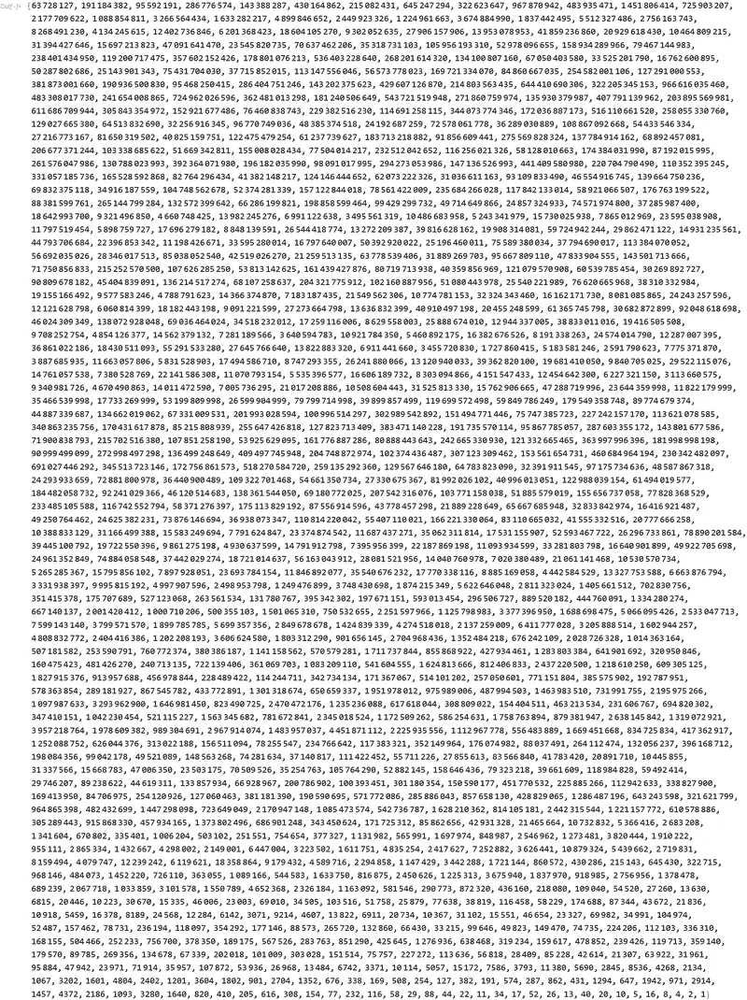
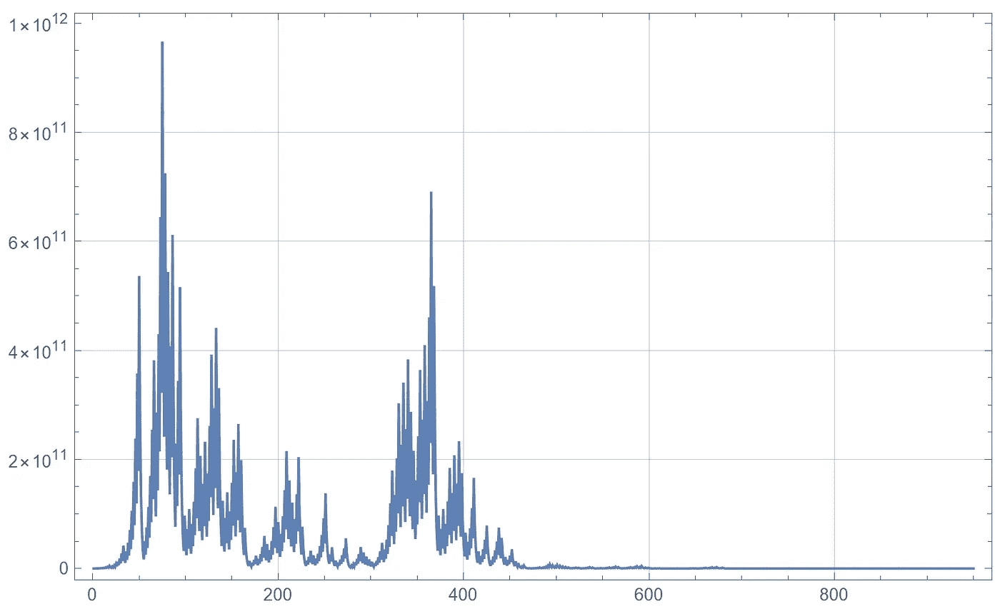
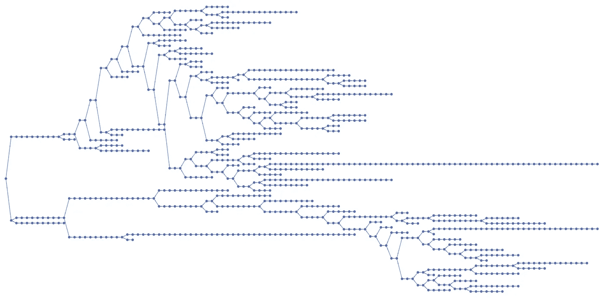

# collatz——你不完全理解的最简单的程序

> 原文：<https://towardsdatascience.com/collatz-the-simplest-program-that-you-dont-fully-understand-30b223c6fd8c?source=collection_archive---------32----------------------->

## 用 Wolfram 语言进行计算探索


大约 10 分钟后，一个人看着 Collatz 程序的照片，由 [Unsplash](https://unsplash.com/s/photos/problem?utm_source=unsplash&utm_medium=referral&utm_content=creditCopyText) 上的 [Sebastian Herrmann](https://unsplash.com/@officestock?utm_source=unsplash&utm_medium=referral&utm_content=creditCopyText) 拍摄

我喜欢认为自己无所不知，尤其是在编程方面。而且，很长一段时间以来，我认为如果我观察一段代码足够长的时间，我就能够完全理解它的行为。只需逐行阅读代码，并仔细考虑 if 语句和 for 循环的可能情况。只要有足够的时间和耐心，所有代码都是完全可以理解的。

然而，我写的代码并没有像预期的那样运行。事实上，这种情况发生了很多。通常情况下，我写一段新代码的前十次尝试中，有九次都是谦逊编码的经历。但是，我仍然把这归因于输入错误、编写不完整的代码，以及在输入实际代码之前不耐烦和没有充分考虑事情。

有一天，有人向我展示了一段实现了 Collatz 算法的 [Wolfram 语言](https://www.wolfram.com/language/)代码，这一切都改变了。这个想法非常简单:编写一个接受正整数作为唯一参数的函数。如果数字是 1，就完成了，从函数中返回 1。如果数字大于 1，则有两个分支:如果数字是偶数，则除以 2 并返回该数字。如果数字是奇数，则返回该数字的三倍加 1。

```
collatz[1] = 1
collatz[n_Integer /; n>1 ] := If[ EvenQ[n], n/2, 3n+1 ]
```

到目前为止，一切顺利。你可以用不同的整数试一下，一切都很好:

```
collatz[5] --> 16
collatz[8] --> 4
```

但是当你写一个程序来计算下面的序列时，曲线球就出现了:

```
collatz[16] --> 8
collatz[8] --> 4
collatz[4] --> 2
collatz[1] --> 1 (* done! *)
```

在 Wolfram 语言中实现这一点的一个简单方法是使用 [NestWhileList](https://reference.wolfram.com/language/ref/NestWhileList.html) :

```
collatzSequence[n_Integer /; n > 0] := 
 NestWhileList[collatz, n, # != 1 &]
```

n=16 的例子给出:

```
collatzSequence[16] --> {16, 8, 4, 2, 1}
```

这看起来很简单，但是有一个小问题:当你遇到一个奇数的时候，下一个数字将会大三倍(加一)。下一个数字也将是偶数，这意味着之后的数字将再次减半。这里有一个例子，当你从一个奇数开始:

```
collatzSequence[17] --> {17, 52, 26, 13, 40, 20, 10, 5, 16, 8, 4, 2, 1}
```

数字序列首先上升到 52，但随后又迅速回落到 1。显然，这最终会发生在每一个数字上？不幸的是，我们不得不考虑这样一种可能性，即有些数字产生的序列永远不会达到 1。例如，可能有一个序列，其中的数字随着时间的推移慢慢反弹，变得越来越大。阅读代码在这里没有太大帮助。下面是一个起始数的示例，其中序列不会快速变为 1:

```
collatzSequence[63728127]
```



(图片由作者提供)

这是这个数列的图表:



(图片由作者提供)

尽管我们可以阅读代码并理解任何数字的每一步会发生什么，但我们无法知道程序是否会终止(甚至不知道给定数字的序列长度)。仔细研究过这个问题的人推测(但没有证明)每个数字都有一个以 1 结尾的序列。这个猜想被称为[科勒兹猜想](https://en.wikipedia.org/wiki/Collatz_conjecture)以第一个提出这个问题的[洛萨科勒兹](https://en.wikipedia.org/wiki/Lothar_Collatz)命名。

对于这个问题，人们已经有了很多有趣的发现和可视化，而没有实际解决猜想本身。[一个非常有趣的视觉效果](https://community.wolfram.com/groups/-/m/t/558256)是一个由许多起点以及这些序列如何最终相遇并融合在一起的图:


(图片由作者提供)

或者[一个更简单的图形](https://mathematica.stackexchange.com/questions/85718/trying-to-visualize-the-collatz-conjecture)显示不同的 Collatz 序列如何合并并最终在数字 1 处相遇:



(图片由作者提供)

我得到的教训是，即使是最简单的程序也不一定能理解。因此，当我看到一个文档记录很差的巨大的源代码文件时，我也不会感觉很糟糕。在许多情况下，你所能做的最好的事情就是运行一个有许多不同输入的程序来开发直觉和推测，并使用它来迭代你的代码到一个点，在这个点上它的行为大部分是你所期望的。也许有一天，有人会为 Collatz 序列找到一个不以零结尾的起始数。但我觉得这就是那种可能永远解不开的编程难题！