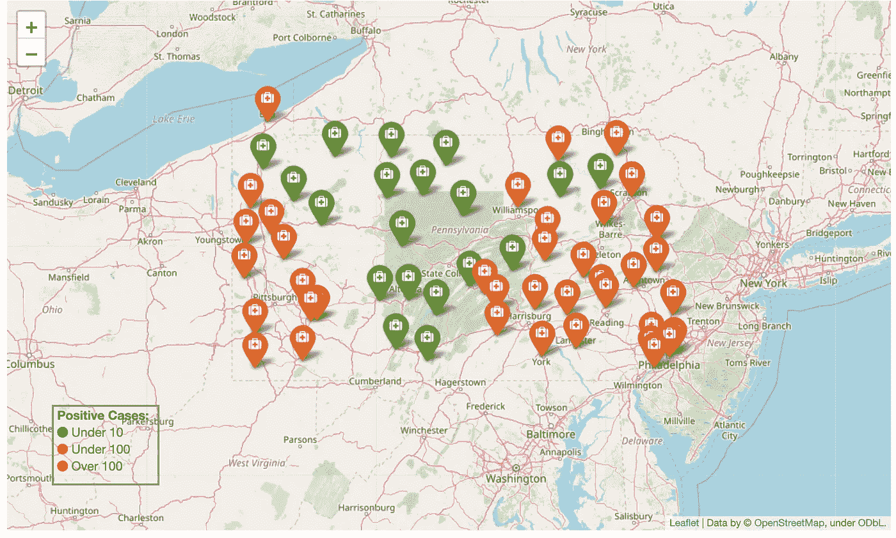

# 收集和可视化新冠肺炎数据

> 原文：<https://towardsdatascience.com/collect-and-visualize-covid-19-data-336e4dc9ead?source=collection_archive---------39----------------------->

## *网络抓取和探索性数据分析初学者指南*


不用说，每个人都很清楚新冠肺炎对整个世界的毁灭性影响。有数不清的数据集可用于捕捉这种病毒在全球传播的趋势。

就我个人而言，我更感兴趣的是分析我的家乡宾夕法尼亚州(美国)的新冠肺炎案例。我偶然发现了[宾夕法尼亚州卫生部网站](https://www.health.pa.gov/topics/disease/coronavirus/Pages/Cases.aspx)，该网站公布了宾夕法尼亚州按县分列的每日新冠肺炎病例。不幸的是，每天的更新都以 HTML 表格的形式呈现在单独的部分中。当我们浏览这个网页时，很难在脑海中形成每日趋势的图像。因此，我决定接受挑战来解决这个问题。我开始了一个周末迷你项目来实施解决以下问题的方法:

*   从网页中提取数据
*   执行数据分析
*   创建数据可视化

结果显示在我的 [GitHub Repo](https://github.com/bchan01/covid-19-data-analysis) 中的 [Jupyter 笔记本](https://github.com/bchan01/covid-19-data-analysis/blob/master/data-analysis.ipynb)中。不幸的是，GitHub 无法渲染交互式数据图，如果您希望查看，请访问 [Jupyter NBViewer](https://nbviewer.jupyter.org/github/bchan01/covid-19-data-analysis/blob/master/data-analysis.ipynb) 。

> 事不宜迟，我们开始吧！我将向你详细介绍我的学习历程。

我们将从如何将 html 表格转换成数据集开始，然后是数据操作、绘图和图表。最后，我们将创建一个交互式地图，按县显示确诊病例。

# **通过网络抓取提取数据**

我想简单介绍一下我是如何从每天更新的 [PA 卫生部](https://www.health.pa.gov/topics/disease/coronavirus/Pages/Archives.aspx)网页中提取数据集的。当您滚动页面时，您会注意到每个每日部分都以日期标题开始(例如:2020 年 4 月 8 日)。我对汇总以下两个表中的数据感兴趣，即*总计数表*和*按县的总计数表*。

**总计数表:**显示迄今为止的阴性、阳性病例和死亡总数。


**County Total Counts by County 表:**显示宾夕法尼亚州各县迄今为止的阳性病例和死亡总数。


下面是网络抓取策略的概要，完整的源代码可以在我的 GitHub 库中找到。


您需要安装这些依赖项:

```
pip install beautifulsoup4
pip install lxml
```

**第一步。**提取< h4 >标题之间的日期并存储一个列表。

**第二步。**提取每个*总计数表*中的数据，并将其与步骤 1 中的日期匹配。输出文件的示例如下所示。

```
**pa_summary.csv:** Date,Negative,Positive,Deaths
2020–04–08,82299,16239,309
2020–04–07,76719,14559,240
```

**第三步。** 提取各县总计数表中的数据，并将其与步骤 1 中的日期进行匹配。输出文件的示例如下所示。

```
**pa_county.csv:** Date,County,Cases,Deaths
2020–04–08,Adams,33,0
2020–04–08,Allegheny,720,1
```

**第四步。**调用 [MapQuest 地理编码 API](https://developer.mapquest.com/documentation/geocoding-api/) 获取各县的纬度和经度。你可以建立一个每月 15K 交易的免费账户。从 MapQuest 获取 API 密钥，并更新 [data_extractor_pa.py](https://github.com/bchan01/covid-19-data-analysis/blob/master/data_extractor_pa.py) 中的 API_KEY 值。输出文件的示例如下所示:

```
**pa_county_geolocation.csv**
County,Latitude,Longitude
Bradford,41.774669,-76.526461
Butler,40.861021,-79.895225
```

**第五步(可选)。**如果您希望获得最新数据，请运行提取程序重新生成 CSV 文件。

```
python data_extractor_pa.py
```

# **进行探索性数据分析**

有了这三个数据集，让我们启动 [Jupyter 笔记本](https://github.com/bchan01/covid-19-data-analysis/blob/master/data-analysis.ipynb)。

首先，导入这些依赖项:

```
import datetime as dt
import matplotlib.pyplot as plt
from matplotlib import style
import pandas as pd
```

将汇总数据集加载到 Panda 数据框架中:

```
df = pd.read_csv("pa_summary.csv")
df.head(5)
```


计算测试总数和阴性/阳性/死亡百分比:

```
df['Tested'] = df['Positive'] + df['Negative']
# Percentages
df['Positive_Percent'] = round(100*df['Positive']/df['Tested'], 1)
df['Negative_Percent'] = round(100*df['Negative']/ df['Tested'], 1)
df['Death_Percent'] = round(100*df['Deaths']/ df['Tested'], 3)
# sort by date
df = df.sort_values('Date', ascending = True)
df.head(5)
```


绘制迄今为止的总测试数、阳性数、阴性数和死亡数:

[**源代码**](https://gist.github.com/bchan01/b58461940fd24ed85ed4dac6f0082ed7)


> 测试人群中阳性与阴性的百分比是多少？

[**源代码**](https://gist.github.com/bchan01/c089d1b573d7face1540ae1256272be7)


> 也许观察每天的变化更有意义。

以下代码片段显示了如何利用 panda 中可用的 *diff 函数*来计算案例的每日变化。注意，我们需要在第一行填入 *0* 以避免得到 *NaN。*

[**源代码**](https://gist.github.com/bchan01/5f703befa735130272391191fcd0f033)


# **看着县细目**

```
df_counties = pd.read_csv("pa_county.csv")
df_counties.head()
```


> 费城的确诊病例趋势如何？

```
# Filter Data for a County
county_name = 'Philadelphia'
df_county = df_counties[df_counties['County']== county_name]
df_county = df_county.sort_values('Date', ascending = True)# Line Plot
style.use('ggplot')
ax = plt.gca()
df_county.plot(kind='line',x='Date',y='Cases', color='green', ax=ax, figsize=(20,10))
plt.title('Number of Cases In ' + county_name +' County')
plt.xlabel('Date')
plt.ylabel('Cases')
plt.show()
```


# 创建交互式数据地图

让我们开始准备一个数据框架，以便在交互式地图中按县显示确诊病例。

> 我们如何在地图上指出每个县？

首先，加载包含每个县的纬度/经度对的县地理定位数据集

```
df_geo = pd.read_csv("pa_county_geolocation.csv")
df_geo.head()
```


执行左外连接，将 lat/long 列添加到 county 数据框架中。

```
df_county_with_geo = df_counties.merge(df_geo, how='left', on=['County'])
df_county_with_geo.head()
```


最后，我们只想保留最新日期的记录。

```
df_latest_county = df_county_with_geo[df_county_with_geo['Date'] == df_county_with_geo['Date'].max()]# drop unnecessary columns
del df_latest_county['Date']
del df_latest_county['Deaths']df_latest_county.head()
```


> 我们已经准备好创建一个交互式地图

我选的是 Folium，它有丰富的渲染交互式地图的功能。这不是一个关于叶子的教程。请访问[这里](https://python-visualization.github.io/folium/index.html)了解更多信息。

在继续之前，您需要安装 need。

```
pip install folium
```

> 只需几行代码，我们就可以构建一个非常棒的交互式数据地图，显示宾夕法尼亚州各县的新冠肺炎确诊病例。

[**源代码**](https://gist.github.com/bchan01/525bab3e5dec3b3a0968457069b53ec7)

让我们走一遍我们正在做的事情

*   将地图置于某个位置的中心，以便在查看区域内可以看到大多数数据点。
*   函数 get_icon_color()根据正例的值确定在地图上显示的图标的颜色。
*   创建一个具有中心点和适当缩放级别的地图。
*   将每个县的数据点装饰成彩色编码的图标和弹出文本，以显示计数和县的名称。
*   创建图例部分以显示颜色的含义。这篇关于如何给叶子地图添加图例的博客文章值得称赞。



> **那都是乡亲们！！**

这篇文章的代码可以在 [GitHub](https://github.com/bchan01/covid-19-data-analysis) 上找到。我希望这能激励你走出你的舒适区去学习新的东西。直到下一次，继续学习，每天都变得更好。

# 资源:

*   [熊猫数据框架 API 参考](https://pandas.pydata.org/docs/reference/frame.html)
*   [Matplotlib 文档](https://matplotlib.org/3.2.1/contents.html)
*   [Beautifulsoup 文档](https://www.crummy.com/software/BeautifulSoup/bs4/doc/#)
*   [树叶文档](https://python-visualization.github.io/folium/)
*   [为树叶地图创建一个图例](https://medium.com/@bobhaffner/creating-a-legend-for-a-folium-map-c1e0ffc34373)
*   [Map Quest 地理编码 API](https://developer.mapquest.com/documentation/geocoding-api/)