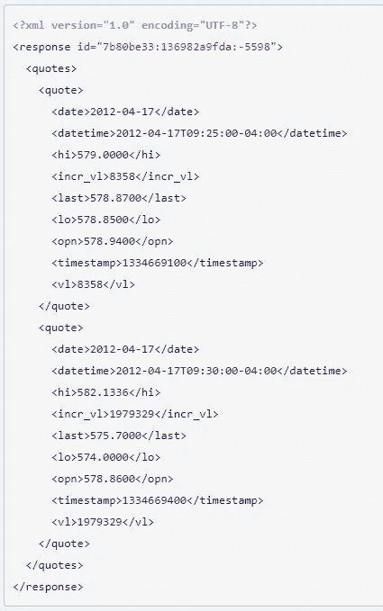
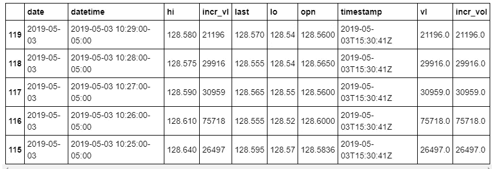
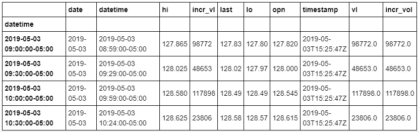
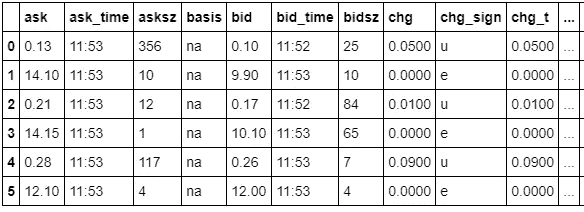
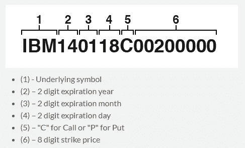
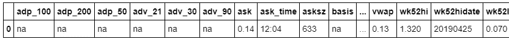

# 使用 Python 和 Ally Financial API 轻松收集股票和期权数据— 3 个示例查询

> 原文：<https://towardsdatascience.com/collect-stock-and-options-data-easily-using-python-and-ally-financial-api-3-example-queries-45d162e4f055?source=collection_archive---------15----------------------->

## 简短的备忘单


由 pikrepo 提供

# 尝试交易

在我生命中的一段时间里，我痴迷于金融市场，想成为一名日间交易者。我晚上工作，所以早上很容易被电脑显示器包围，显示器上显示着从股票、期权、新闻到交易聊天室的一切。剧透…我放弃了日内交易，但没有放弃投资。最终，我知道我喜欢分析数据胜过交易，然后[我让自己走上了学习数据分析和进入数据科学的道路](/enter-analytics-from-boot-camp-to-working-in-data-science-8a5a6f563d7d)。

当我在探索[收集股票和期权数据的方法时，](https://www.kaggle.com/bendgame/options-market-trades)我查看了我的一个经纪人 Ally Financial 提供的 API。它可以免费使用并且易于编码。这是我为使用 Ally Financial API 收集以下信息而整理的备忘单:

*   股票的时间和销售
*   期权市场深度
*   选项扩展报价

如果你不熟悉 API，[看看这些资源](https://www.google.com/search?q=What+is+an+API&oq=What+is+an+API)。通过它们的 API 实现交易自动化是可能的，但我从未深入研究过。探索文档中的所有功能。

[](https://www.ally.com/api/invest/documentation/getting-started/) [## Ally Invest API 文档

### 构建您的应用程序，连接到我们的投资平台和与之相连的 250，000 名交易者…

www.ally.com](https://www.ally.com/api/invest/documentation/getting-started/) 

你可以在文章底部或者我的 GitHub 上找到完整的备忘单！

[](https://github.com/bendgame/Ally-API-Cheat-Sheet) [## bend game/Ally-API-备忘单

### Ally Financial API 入门。通过创建一个帐户，为 bendgame/Ally-API-Cheat-Sheet 开发做出贡献…

github.com](https://github.com/bendgame/Ally-API-Cheat-Sheet) 

继续编码！

# 导入依赖项

连接到 API 使用 **OAuth1** 。你可以在 OAuth 网站[这里](http://oauth.net/code/)找到 OAuth 客户列表。我使用 OAuth 库 **requests_oauthlib** 。根据需要使用 *pip 安装请求-oauthlib* 。

```
import requests
from requests_oauthlib import OAuth1
from config import (api_key, secret, oath_token, oath_secret)

import pandas as pd
import sqlalchemy
import numpy as np

import sqlite3
from sqlite3 import Error

import matplotlib.pyplot as plt
import datetime as dt
```

注意，我使用一个配置文件来导入 *api_key、secret、oath_token、oath_secret* 。这样，我就不需要在代码中包含那些个人令牌。

```
*#authentication* 
auth = OAuth1(api_key, secret, oath_token, oath_secret)
```

我把进口令牌递给***oauth 1*。这将在我们向 API 发出请求时使用。**

# 股票的时间和销售示例

这个 API 调用将根据作为查询参数传递的符号返回时间和销售报价数据。有关所有查询参数的列表，请查阅文档。示例 URL 由 ***基础 url*** 、 ***api 路由*** 和 ***查询*** 组成。

**基础网址**:[https://api.tradeking.com/](https://api.tradeking.com/)
**路线**:v1/market/timesales . JSON
**查询**:？symbols=MSFT &开始日期= 2019–05–03&间隔= 1 分钟

**文档**:[https://www . ally . com/API/invest/Documentation/market-timesales-get/](https://www.ally.com/api/invest/documentation/market-timesales-get/)

```
*#url call to the api*
url = 'https://api.tradeking.com/v1/market/timesales.json?symbols=MSFT&startdate=2019-05-03&interval=1min'*#api request*
response = requests.get(url, auth = auth).json()
```

注意，我将 URL 和 oAuth 值传递给请求，并将响应作为 [json](https://en.wikipedia.org/wiki/JSON) 返回。这是一个响应示例:



我将报价数据放入 Panda 的数据帧中，并格式化数据类型。

```
*#send to data frame and format data types*
df = pd.DataFrame(response["response"]["quotes"]["quote"])
df = df.sort_values(['datetime'], ascending = **False**)
df['date'] = pd.to_datetime(df['date'])df['datetime'] = pd.to_datetime(df['datetime'],  utc=**False**).dt.tz_convert('US/Central')df['hi'] = df["hi"].astype(float)
df['incr_vol'] = df["incr_vl"].astype(float)
df['last'] = df["last"].astype(float)
df['lo'] = df["lo"].astype(float)
df['opn'] = df["opn"].astype(float)
df['vl'] = df['vl'].astype(float)df.head()
```



示例数据

日期时间值需要转换，以便能够对其进行重新采样。重采样允许您操纵时间序列的频率。根据文档，对象必须有一个类似于 *datetime 的*索引( *DatetimeIndex* 、 *PeriodIndex* 或 *TimedeltaIndex* )，或者将类似于 *datetime* - *的*值传递给 on 或 level 关键字。

```
*#resample the time value to be greater than 1 min as needed. Example: 30 min resample for last price*
df.set_index(df['datetime'], inplace = **True**)
df.head()
df_resample30 = df.resample(rule = '30min', label = 'right').last()
df_resample30.head()
```



重采样数据帧

请注意， ***日期时间*** 在重采样后增加了 30 分钟，而不是 1 分钟。

# 选项搜索示例


[由 pxfuel](https://www.pxfuel.com/en/search?q=stock+market+data) 提供

这个 api 调用为选项提供了[市场深度](https://www.investopedia.com/terms/m/marketdepth.asp)。该调用将返回给定符号的可用选项击的完整列表。虽然这种请求类型是 GET，但是也可以使用 POST，并且推荐用于较长的查询。

**文档**:[https://www . ally . com/API/invest/Documentation/market-options-search-get-post/](https://www.ally.com/api/invest/documentation/market-options-search-get-post/)

**基地网址**:[https://api.tradeking.com/](https://api.tradeking.com/)
路线:v1/market/timesales . JSON
**查询**:？symbol = MSFT&query = xy ear-eq % 3a 2019% 20 and % 20x month-eq % 3a 06% 20 and % 20 strike price-eq % 3a 140

## 查询细分:

**到期年份等于 2019 年** :
xyear-eq%3A 2019

**和**:
%20 和% 20

**到期月份等于 06** :
xmonth-eq%3A 06

**和执行价格等于 140**:
%20 和% 20 执行价格-eq%3A 140

## 操作员:

**lt** :小于
**gt** :大于
**gte** :大于等于
**lte** :小于等于
**eq** :等于

```
url = 'https://api.tradeking.com/v1/market/options/search.json?symbol=MSFT&query=xyear-eq%3A2019%20AND**%20x**month-eq%3A06%20AND**%20s**trikeprice-eq%3A140'#api call
response = requests.get(url, auth = auth).json()#load the response into the dataframe
df = pd.DataFrame(response["response"]["quotes"]["quote"])
df
```



# 扩展报价示例(可选)

这条路线适用于股票，但这是一个期权看涨的例子，因为它们有点复杂。该调用将返回作为查询参数传递的符号或符号列表的引号。

**文档**:[https://www . ally . com/API/invest/Documentation/market-ext-quotes-get-post/](https://www.ally.com/api/invest/documentation/market-ext-quotes-get-post/)
**基础网址【https://api.tradeking.com/】:
**路线**:v1/market/ext/quotes . JSON
**查询**:？symbols=MSFT190607C00140000**

## 选项符号命名约定:



图片来自文档

**基础符号— MSFT**
2 位到期年份— 19
2 位到期月份— 06
2 位到期日—07
“C”代表买入或“P”代表卖出— C
8 位执行价格— 00140000
**根据需要使用 fids 在查询中指定所需字段:
即 fids=ask、bid、vol**

尽管命名约定有几个组成部分，但通过几个例子就可以看出它相当简单。同时，使用文档或备忘单中提供的示例图像！

```
url = 'https://api.tradeking.com/v1/market/ext/quotes.json?symbols=MSFT190607C00140000'#api call
response = requests.get(url, auth = auth).json()#load the response into the dataframe
df = pd.DataFrame(response["response"]["quotes"]["quote"], index = [0])
df
```



扩展报价示例

# 将这些点连接起来

使用 Pandas，很容易将数据保存到 CSV 或 SQL 数据库中。如果你不熟悉 [SQLite](https://docs.python.org/2/library/sqlite3.html) ，它非常容易使用。引用文档:

> SQLite 是一个 C 库，它提供了一个轻量级的基于磁盘的数据库，不需要单独的服务器进程，并允许使用 SQL 查询语言的非标准变体来访问数据库。

```
conn = sqlite3.connect('stockdata.sqlite')
df.to_sql(table_name, conn)
```


[由 Flickr 提供](https://www.flickr.com/photos/nodstrum/28511200247)

## 完全码

使用这三个查询，很容易开始使用 Ally Financial API 收集股票和期权数据。将数据放入 Panda 的 dataframe 中可以很容易地理解 JSON 信息并将数据存储为 CSV 或 SQLite 文件。如果您想探索股票数据的其他 API，也可以查看一下 [Alphavantage](https://www.alphavantage.co/) 。

[在我的 github 上找到包含文档的备忘单](https://github.com/bendgame/Ally-API-Cheat-Sheet/blob/master/Ally_API_Cheat_Sheet.ipynb)！

```
import requests
from requests_oauthlib import OAuth1
from config import (api_key, secret, oath_token, oath_secret)

import pandas as pd
import sqlalchemy
import numpy as np

import sqlite3
from sqlite3 import Error

import matplotlib.pyplot as plt
import datetime as dt*#authentication* 
auth = OAuth1(api_key, secret, oath_token, oath_secret)*#url* 
url = 'https://api.tradeking.com/v1/market/timesales.json?symbols=MSFT&startdate=2019-05-03&interval=1min'*#api request*
response = requests.get(url, auth = auth).json()*#send to data frame and format data types*
df = pd.DataFrame(response["response"]["quotes"]["quote"])
df = df.sort_values(['datetime'], ascending = **False**)
df['date'] = pd.to_datetime(df['date'])
df['datetime'] = pd.to_datetime(df['datetime'],  utc=**False**).dt.tz_convert('US/Central')
df['hi'] = df["hi"].astype(float)
df['incr_vol'] = df["incr_vl"].astype(float)
df['last'] = df["last"].astype(float)
df['lo'] = df["lo"].astype(float)
df['opn'] = df["opn"].astype(float)
df['vl'] = df['vl'].astype(float)
df.head()*#resample the time value to be greater than 1 min as needed. Example: 30 min resample for last price*
df.set_index(df['datetime'], inplace = **True**)
df.head()
df_resample30 = df.resample(rule = '30min', label = 'right').last()
df_resample30.head()#Options Search Exampleurl = 'https://api.tradeking.com/v1/market/options/search.json?symbol=MSFT&query=xyear-eq%3A2019%20AND**%20x**month-eq%3A06%20AND**%20s**trikeprice-eq%3A140' response = requests.get(url, auth = auth).json()

df = pd.DataFrame(response["response"]["quotes"]["quote"]) 
df.head()#Extended Quote Exampleurl = 'https://api.tradeking.com/v1/market/ext/quotes.json?symbols=MSFT190607C00140000'response = requests.get(url, auth = auth).json()df = pd.DataFrame(response["response"]["quotes"]["quote"], index = [0])
df.head()
```

# 谢谢大家！

*   *如果你喜欢这个，* [*跟我上 Medium*](https://medium.com/@erickleppen) *了解更多*
*   [*通过订阅*](https://erickleppen.medium.com/membership) 获得完全访问权限并帮助支持我的内容
*   *我们连线上*[*LinkedIn*](https://www.linkedin.com/in/erickleppen01/)
*   *用 Python 分析数据？查看我的* [*网站*](https://pythondashboards.com/)

[**—埃里克·克莱本**](http://pythondashboards.com/)

查看我的其他教程，了解更多 python 和 sql！

[](https://medium.com/@erickleppen01/learn-sql-techniques-selecting-data-and-more-in-sql-server-624f81dd16b2) [## 学习 SQL 技术:在 SQL Server 中选择数据和更多内容

### SQL 语句介绍和查找重复数据的查询。学习 SQL

medium.com](https://medium.com/@erickleppen01/learn-sql-techniques-selecting-data-and-more-in-sql-server-624f81dd16b2) [](https://medium.com/swlh/dashboards-in-python-for-beginners-and-everyone-else-using-dash-f0a045a86644) [## Python 中的仪表盘，适用于初学者和使用 Dash 的其他人

### 使用 Python 中的 Dash 初学者教程构建一个基本的和高级的仪表板

medium.com](https://medium.com/swlh/dashboards-in-python-for-beginners-and-everyone-else-using-dash-f0a045a86644)