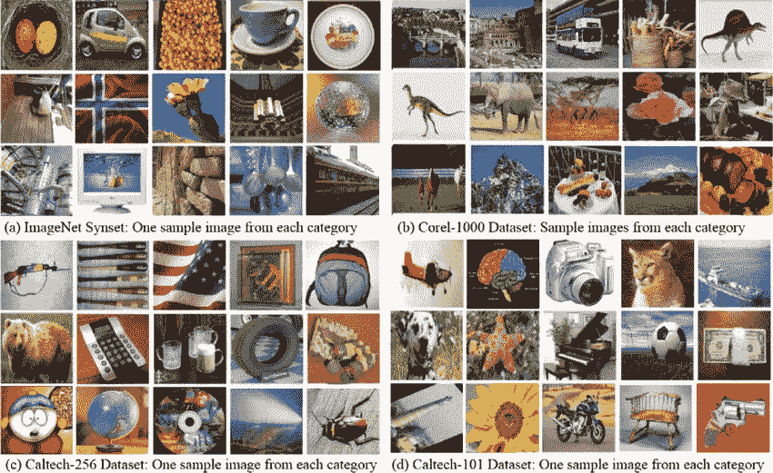
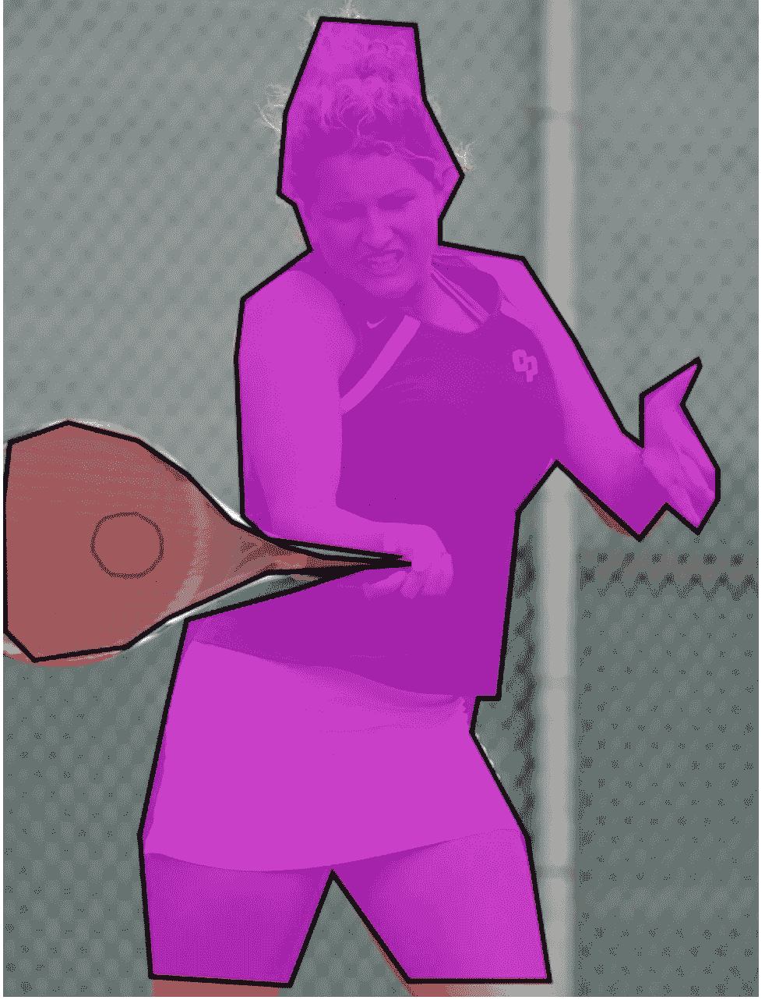
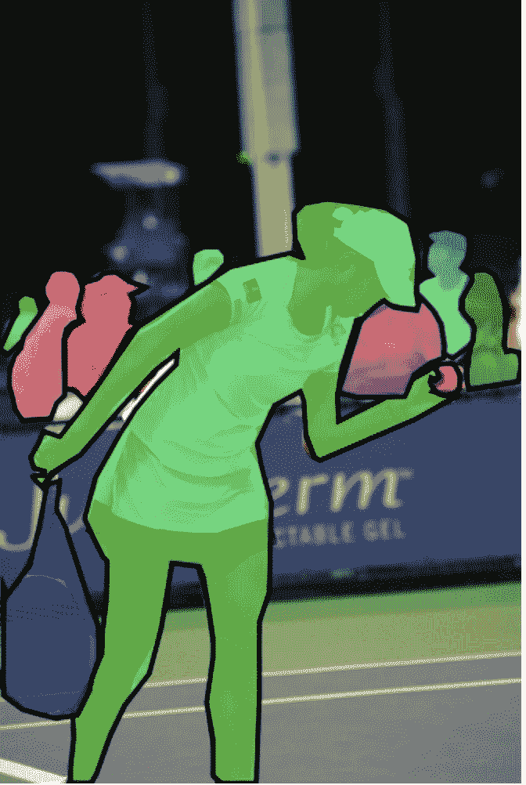

# 为自定义对象检测收集数据

> 原文：<https://towardsdatascience.com/collecting-data-for-custom-object-detection-e7d888c1469b?source=collection_archive---------6----------------------->

## 用于训练您的自定义检测模型的 5 种数据收集技术

在过去的十年里，深度学习在计算机视觉中的使用越来越多。在过去的几年中，计算机视觉应用，如人脸检测和车辆检测已经成为主流。原因之一是预训练模型的可用性。

被深度学习在这些应用上的成功所说服，企业现在已经开始使用深度学习来解决自己的问题。

> 但是如果可用的预先训练的模型不适合您的应用程序呢？

假设您有一个家禽养殖场，想要使用物体检测来将好鸡蛋与坏鸡蛋进行分类，这样您就可以在包装过程中自动剔除坏鸡蛋。

包装中的 5 个好鸡蛋和 1 个坏鸡蛋(图片由 [Caroline Attwood](https://unsplash.com/@carolineattwood?utm_source=unsplash&utm_medium=referral&utm_content=creditCopyText) 在 [Unsplash](https://unsplash.com/?utm_source=unsplash&utm_medium=referral&utm_content=creditCopyText) 上拍摄)

一个预先训练的模型也许能够检测鸡蛋，但它肯定不会区分好鸡蛋和坏鸡蛋，因为它从未被教会这样做。

> **那你会怎么做？**
> 
> *获取大量好鸡蛋和坏鸡蛋的图像，并训练一个定制的检测模型。*

创建良好的定制计算机视觉模型的一个常见挑战是**训练数据**。深度学习模型需要大量的数据来训练其算法，正如我们在基准模型中看到的那样，如 [MaskRCNN](https://github.com/matterport/Mask_RCNN) 、 [YOLO](https://pjreddie.com/yolo/) 和 [MobileNet](https://keras.io/applications/#mobilenet) ，这些模型是在现有的大型数据集 [COCO](http://cocodataset.org) 和 [ImageNet](http://image-net.org) 上训练的。

> 如何获取用于训练自定义检测模型的数据？

在本帖中，我们将探讨 5 种收集数据的方法，用于训练您的自定义模型来解决您的问题。

## 1.公开可用的开放标记数据集

如果你幸运的话，你可能会在网上得到你想要的带标签的数据集。

这里有一个免费的计算机视觉图像数据集列表，你可以从中选择。

[**ImageNet**](http://image-net.org/)**:**ImageNet 数据集包含总共约 1400 万张图像，涉及 21，841 个不同类别的对象(*截至 2020 年 2 月 12 日的数据*)。ImageNet 中一些流行的对象类别是动物([鱼](http://image-net.org/explore?wnid=n02512053)、[鸟](http://image-net.org/explore?wnid=n01503061)、[哺乳动物](http://image-net.org/explore?wnid=n01861778)、[无脊椎动物](http://image-net.org/explore?wnid=n01905661))、植物([树](http://image-net.org/explore?wnid=n13104059)、[花](http://image-net.org/explore?wnid=n11669921)、[植物](http://image-net.org/explore?wnid=n07707451))和活动([运动](http://image-net.org/explore?wnid=n00523513))。

ImageNet 数据集中的图像示例([来源](https://www.researchgate.net/figure/a-ImageNet-Synsets-with-15-image-samples-one-image-from-each-category-b-Corel-1000_fig2_316021174))

[**【COCO】**](http://mscoco.org/)**:**COCO 是一个大规模的对象检测、分割和字幕数据集。它包含大约 330，000 幅图像，其中 200，000 幅图像被标记为 80 种不同的物体类别。

COCO 数据集的图像示例([来源](http://cocodataset.org/#explore))

[**Google 的开放图像**](https://storage.googleapis.com/openimages/web/index.html) **:** 开放图像是一个约 900 万张图像的数据集，标注有图像级标签、对象边界框、对象分割遮罩和视觉关系。[它包含 1.9M 图像上 600 个对象类的总共 16M 的边界框，使其成为具有对象位置注释的最大现有数据集。](https://storage.googleapis.com/openimages/web/factsfigures.html)

开放图像数据集的图像示例([来源](https://www.freecodecamp.org/news/how-to-classify-photos-in-600-classes-using-nine-million-open-images-65847da1a319/))

[**MNIST 手写数据集**](http://yann.lecun.com/exdb/mnist/) :该数据集总共有 70，000 个手写数字图像，是可从 NIST 获得的更大集合的子集。数字已经过大小标准化，并在固定大小的图像中居中。

来自 MNIST 数据集的图像示例([来源](https://www.researchgate.net/figure/Example-images-from-the-MNIST-dataset_fig1_306056875))

[**Cityscapes 数据集**](https://www.cityscapes-dataset.com/) **:** 该数据集专注于城市街道场景的语义理解。它包含 30 个不同类别的大约 20，000 张带注释的图片。

来自 Cityscapes 数据集的注释图像示例([来源](https://www.cityscapes-dataset.com/examples/#coarse-annotations))

*注意:这些只是我找到的几个，还有很多其他的数据集你可以在网上找到。此外，请确保在使用这些数据集之前检查其许可。*

## 2.刮网

另一个选择是在网上搜索图片，然后手动选择下载。由于需要大量数据，这种方法效率不高。

*注意:网络上的图片可能受版权保护。在使用这些图片之前，一定要记得检查它们的版权。*

谷歌图片中的图片搜索示例

另一种方法是编写一个程序来抓取网页并下载你想要的图片。

一个这样的程序是[下载所有图片](https://chrome.google.com/webstore/detail/download-all-images/ifipmflagepipjokmbdecpmjbibjnakm?hl=en)，一个谷歌 Chrome 的扩展，允许你一次下载一堆图片。[在这篇博文](https://www.arunponnusamy.com/preparing-custom-dataset-for-training-yolo-object-detector.html)中， [Arun Ponnusamy](https://medium.com/u/9af1b843339?source=post_page-----e7d888c1469b--------------------------------) expalins 介绍了如何使用[下载所有图片](https://chrome.google.com/webstore/detail/download-all-images/ifipmflagepipjokmbdecpmjbibjnakm?hl=en)来下载戴头盔的人的图片。

*注意:图像的版权使用权可能不允许使用批量下载的图像。在使用之前，一定要检查每张图片的版权。*

## 3.拍照

如果您找不到您想要的对象的图像，您可以通过单击照片来收集它们。这可以手动完成，即通过自己点击每张图片或众包，即雇佣其他人为你拍照。另一种收集真实世界图像的方法是在你的环境中安装可编程的摄像机。

[张小姐](https://unsplash.com/@lzhang?utm_source=unsplash&utm_medium=referral&utm_content=creditCopyText)在 [Unsplash](https://unsplash.com/?utm_source=unsplash&utm_medium=referral&utm_content=creditCopyText) 上的照片

## 4.数据扩充

我们知道深度学习模型需要大量的数据。当你只有一个很小的数据集时，可能不足以训练一个好的模型。在这种情况下，您可以使用数据扩充来生成更多的训练数据。

诸如翻转、裁剪、旋转和平移等几何变换是一些常用的数据扩充技术。应用影像数据扩充不仅可以通过创建变化来扩展数据集，还可以减少过度拟合。

左边是一只狗的原始图像，右边是围绕中心水平翻转的图像([来源](https://snow.dog/blog/data-augmentation-for-small-datasets)

猫的原始和随机裁剪图像([来源](https://www.learnopencv.com/understanding-alexnet/))

猫的原始和旋转图像([来源](https://nanonets.com/blog/data-augmentation-how-to-use-deep-learning-when-you-have-limited-data-part-2/)

网球的原始图像和翻译图像([来源](https://nanonets.com/blog/data-augmentation-how-to-use-deep-learning-when-you-have-limited-data-part-2/)

## 5.数据生成

有时，真实数据可能不可用。在这种情况下，可以生成合成数据来训练您的自定义检测模型。由于其低成本，合成数据生成在机器学习中的使用越来越多。

生成对抗网络(GANs)是用于合成数据生成的许多技术之一。GAN 是一种生成性建模技术，其中人工实例是以保留原始集合的相似特征的方式从数据集创建的。

甘的现代艺术([来源](https://mc.ai/generating-modern-arts-using-generative-adversarial-networkgan-on-spell/))

## 摘要

收集训练数据集是训练您自己的定制检测机模型的第一步。在这篇文章中，我们看了一些用于收集图像数据的技术，包括搜索公共开放标签数据集、抓取网页、手动或使用程序拍照、使用数据增强技术和生成合成数据集。

*在下一篇帖子中，我们将看看训练您的自定义检测器的下一步，即* ***为您的数据集*** *贴标签。敬请关注。*

*您使用什么技术来收集图像数据集？* ***在下面留下你的想法作为评论。***

原载于*[*www.xailient.com/blog*](https://www.xailient.com/post/collecting-data-for-custom-object-detection)*。**

*找一个**预先训练好的人脸检测模型**。[点击这里](https://sdk.xailient.com/register.html)下载。*

*查看这篇文章了解更多关于创建一个健壮的物体检测模型的细节。*

**更多故事:**

*[*在你的 App 上集成人脸检测*](https://www.xailient.com/post/integrate-face-detection-in-your-app)*

*[*在计算受限的设备上运行深度学习计算机视觉的挑战*](https://www.xailient.com/post/challenges-of-running-deep-learning-computer-vision-on-computationally-limited-devices)*

*[*树莓上挣扎运行的物体检测*](https://www.xailient.com/post/struggles-of-running-object-detection-on-a-raspberry-pi)*

*[*你现在需要从云计算转移到边缘计算！*](https://www.xailient.com/post/cloud-computing-to-edge-computing)*

****关于作者****

*Sabina Pokhrel 在 Xailient 工作，这是一家计算机视觉初创公司，已经建立了世界上最快的边缘优化物体探测器。*

***资源:***

*Roh，y .，Heo，g .，& Whang，S. (2019 年)。机器学习的数据收集调查:大数据-人工智能集成视角。IEEE 知识与数据工程汇刊，1–1。土井指数:10.1109/tkde。58606.88868688666*

* [## 为训练 YOLO 对象检测器准备自定义数据集

### 2019 年 10 月 6 日 Arun Ponnusamy 来源:Tryo labs 在之前的帖子中，我们看到了如何使用 OpenCV 来使用预训练的 YOLO 模型…

www.arunponnusamy.com](https://www.arunponnusamy.com/preparing-custom-dataset-for-training-yolo-object-detector.html)  [## 如何为计算机视觉用例创建训练数据|阿彭

### 对于简单的计算机视觉项目，如识别一组图像中的模式，公开可用的图像…

appen.com](https://appen.com/blog/how-to-create-training-data-for-computer-vision-use-cases/)  [## 为计算机视觉建立训练数据的权威指南

### 谷歌、微软、亚马逊和脸书等科技巨头已经宣布了他们以人工智能为先的产品战略…

hackernoon.com](https://hackernoon.com/a-definitive-guide-to-build-training-data-for-computer-vision-1d1d50b4bf07)*