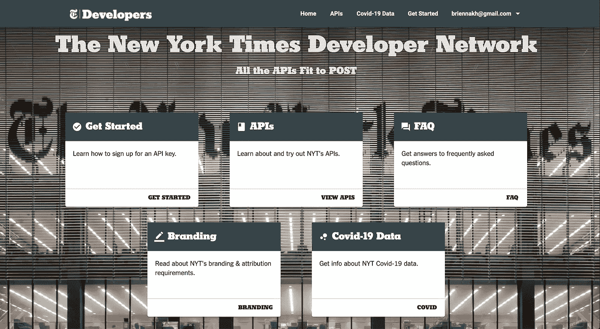
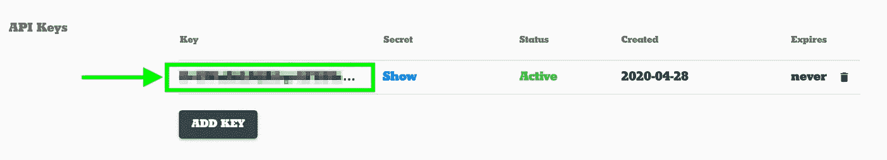
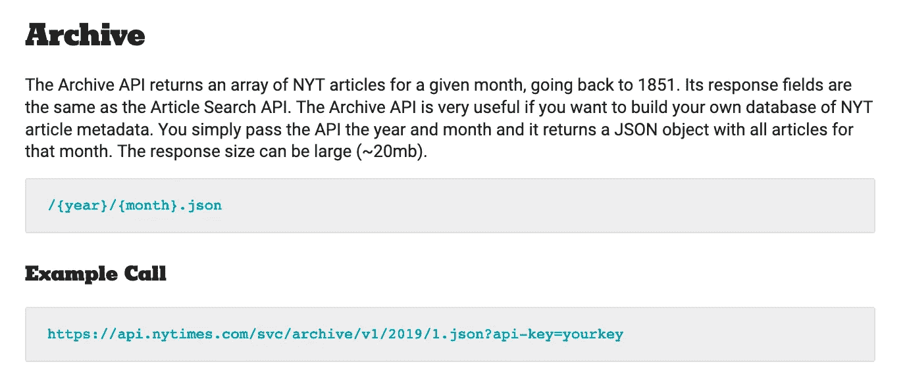
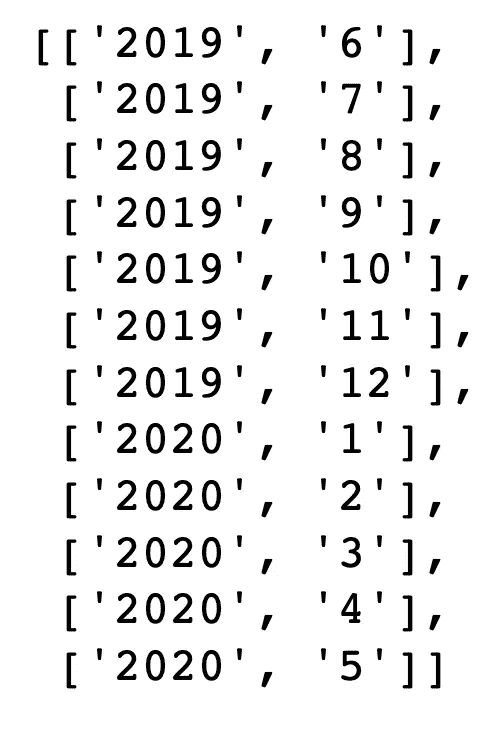
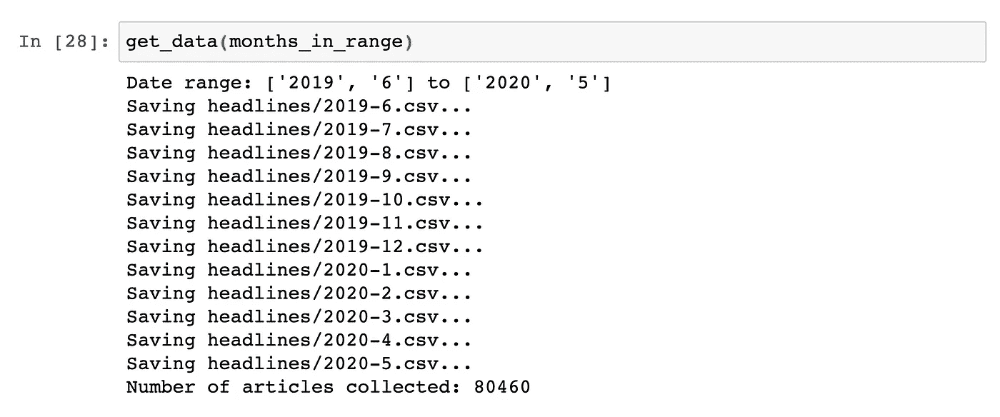
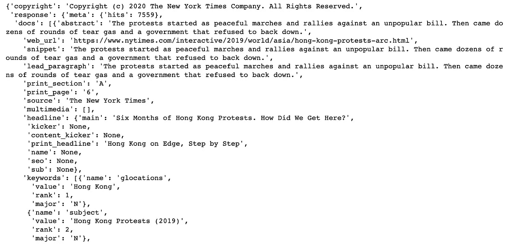
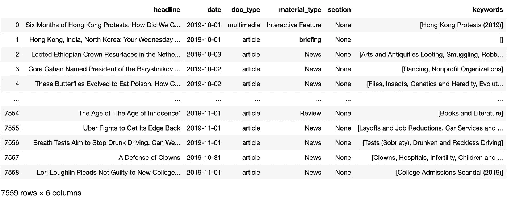

# 如何从《纽约时报》收集任何时期的数据

> 原文：<https://towardsdatascience.com/collecting-data-from-the-new-york-times-over-any-period-of-time-3e365504004?source=collection_archive---------21----------------------->

## Python 中的简单指南


来源:[JJ·古恩](https://stock.adobe.com/contributor/208385959/jj-gouin?load_type=author&prev_url=detail)，via [Adobe Stock](https://stock.adobe.com/contributor/208385959/jj-gouin?load_type=author&prev_url=detail&asset_id=328084627)

假设我们想知道在一段时间内,*《纽约时报》*中的话语是如何演变的。这些天来，分析这一点会很有趣，因为每当我们访问头版时，都会被关于冠状病毒的新闻淹没。疫情是如何塑造了美国最受欢迎的报纸之一的头条新闻的？

要回答这样的问题，我们需要从纽约时报收集文章元数据。这里我描述了如何用 Python 来做这件事。

**目录:**

1.  在哪里可以找到《纽约时报》的文章元数据
2.  如何从纽约时报*请求文章元数据*

# 在哪里可以找到《纽约时报》的文章元数据

*纽约时报*提供了一个由几个[API](https://developer.nytimes.com/apis)组成的开发者网络，让非员工向他们索取文章和元数据，这对于这种分析来说超级方便。

实际上，没有多少报纸这么做。维护一个 API 需要做很多工作。对于不提供 API 的报纸，我们需要一种不同的方法来获得它们的标题。还是有可能的，只是没那么容易。

**开始使用*纽约时报*API:**

在这里创建一个免费的开发者账户[。打开验证电子邮件中的链接后登录。进入开发者的主页。](https://developer.nytimes.com/get-started)



纽约时报开发者网络的主页。

在您的开发者帐户中注册一个新应用。

1.  点击右上角的电子邮件地址。
2.  在出现的下拉菜单中选择**应用**。
3.  在您的应用程序页面选择**+新应用程序**。
4.  输入任何名称和描述。
5.  激活存档 API。
6.  选择**创建**。

记下您刚刚注册的应用程序的 API 密钥。这是我们需要从《纽约时报》获取数据的唯一信息，我们很快就会需要它。



您的应用的 API 密钥。

# 如何从纽约时报*请求文章元数据*

我们将使用归档 API 来获取去年的所有文章元数据。这段代码可以在 1851 年到今天的任何时间内修改。



[归档 API 概述](https://developer.nytimes.com/docs/archive-product/1/overview)。

加载依赖项。

```
import os
import json
import time
import requests
import datetime
import dateutil
import pandas as pd
from dateutil.relativedelta import relativedelta
```

指定日期范围。

```
end = datetime.date.today()
start = end - relativedelta(years=1)
```

列出属于这个范围的月份，即使只是一部分。我们需要这些信息来调用归档 API，因为它一次只能运行一个月。

```
months_in_range = [x.split(' ') for x in pd.date_range(start, end, freq='MS').strftime("%Y %-m").tolist()]
```



**范围内的月份**

我编写了一些代码来请求和处理来自归档 API 的文章元数据。这段代码一次只能运行一个月，以实现最佳的内存管理。我们向 API 发送给定月份的请求，接收并解析响应，然后用每篇文章的一些详细信息填充数据框，包括其出版日期、主要标题、章节、主题关键字、文档类型和材料类型。最后，我们将数据帧保存为 CSV 文件，并继续下一个月，直到到达所需时间范围的末尾。

从纽约时报存档 API 请求和处理任意时间段的文章数据的代码。

注意，每个 API 有两个[速率限制](https://developer.nytimes.com/faq#a11):每天 4000 个请求和每分钟 10 个请求。为了避免达到每分钟的速率限制，我们在两次通话之间睡眠 6 秒钟。

不要忘记用你的 API 键在第 4 行切换出 **YOUR_API_KEY** 。

运行代码以获取并处理来自 **months_in_range** 的文章。



我们已经收集了去年 80，460 篇文章的元数据！每个月都被保存到 **headlines** 目录下的 CSV 文件中。

让我们看看我们处理的上个月的响应是什么样子的，它仍然在内存中。

```
response
```



还有很多。文档[告诉我们那里都有什么。](https://developer.nytimes.com/docs/archive-product/1/overview)

看看这个月的 CSV 文件是什么样子的。

```
df
```



正如在数据框中看到的，偶尔会有一致性问题需要注意。有时一个月的第一天被认为是前一个月的一部分。有时数据会缺失，比如 1978 年 9 月和 10 月，原因是多工会罢工。

我们可以利用我们现在的 **headlines** 目录中的所有文章元数据做很多事情。我们可以做的事情之一是探索*《纽约时报》在过去一年的报道中是如何演变的，重点是疫情冠状病毒。这将是有趣的，因为我们不仅考虑发生了什么，而且考虑媒体如何讨论它。*

完整的笔记本是[这里](https://github.com/brienna/coronavirus-news-analysis/blob/master/2020_05_01_get_data_from_NYT.ipynb)。

如果你想阅读更多我的文章或探索数百万篇其他文章，你可以注册一个中级会员:

[](https://brienna.medium.com/membership) [## 通过我的推荐链接加入 Medium-briena Herold

### 作为一个媒体会员，你的会员费的一部分会给你阅读的作家，你可以完全接触到每一个故事…

brienna.medium.com](https://brienna.medium.com/membership) 

**您还可以订阅我的电子邮件列表，以便在我发布新文章时得到通知:**

[](https://brienna.medium.com/subscribe) [## 每当布蕾娜·赫罗尔德发表。

### 每当布蕾娜·赫罗尔德发表。通过注册，您将创建一个中型帐户，如果您还没有…

brienna.medium.com](https://brienna.medium.com/subscribe) 

**你可能会对我的其他一些故事感兴趣:**

[](/how-to-download-twitter-friends-or-followers-for-free-b9d5ac23812) [## 如何免费下载 Twitter 好友或关注者

### Python 中的简单指南

towardsdatascience.com](/how-to-download-twitter-friends-or-followers-for-free-b9d5ac23812) [](/zonked-on-vicodin-in-the-presidential-race-generating-fake-headlines-with-markov-chains-87f06cccd866) [## 总统竞选中服用维柯丁:用马尔可夫链制造假头条

### 在讽刺和现实之间游走

towardsdatascience.com](/zonked-on-vicodin-in-the-presidential-race-generating-fake-headlines-with-markov-chains-87f06cccd866) [](/how-to-bulk-access-arxiv-full-text-preprints-58026e19e8ef) [## 如何批量获取 arXiv 全文预印本

### 使用 Python3 和 MacOS X 命令行

towardsdatascience.com](/how-to-bulk-access-arxiv-full-text-preprints-58026e19e8ef)