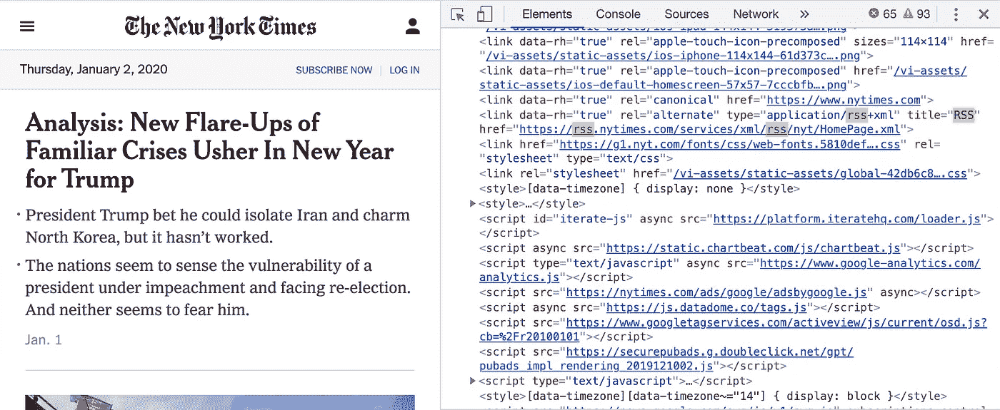
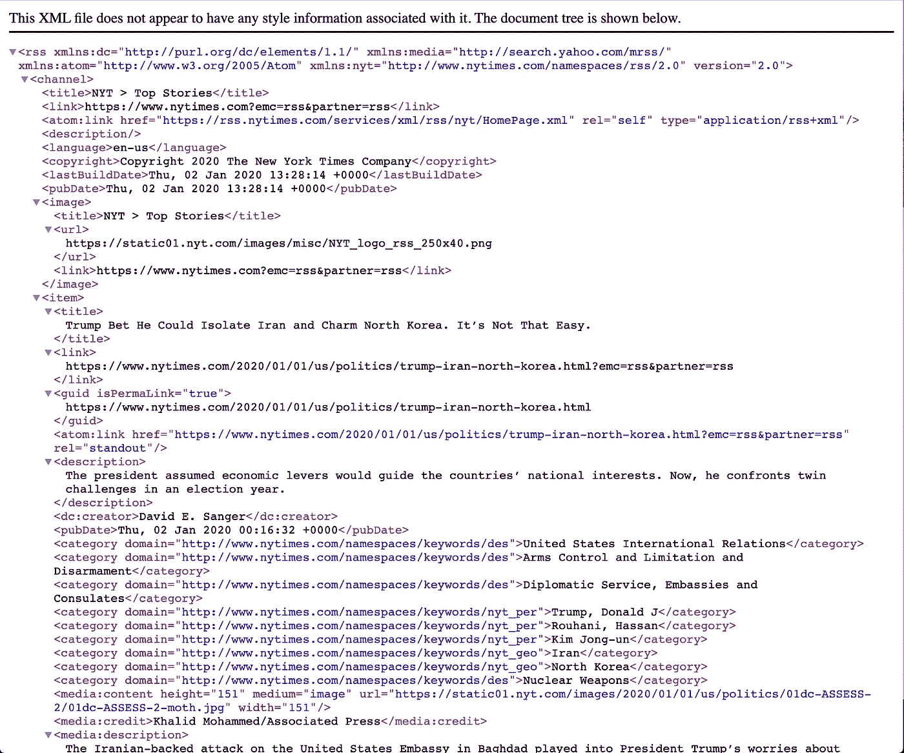
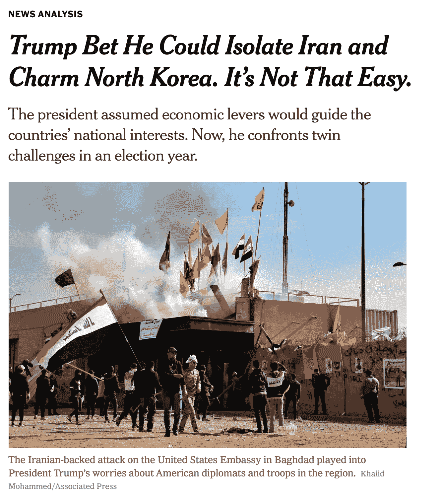
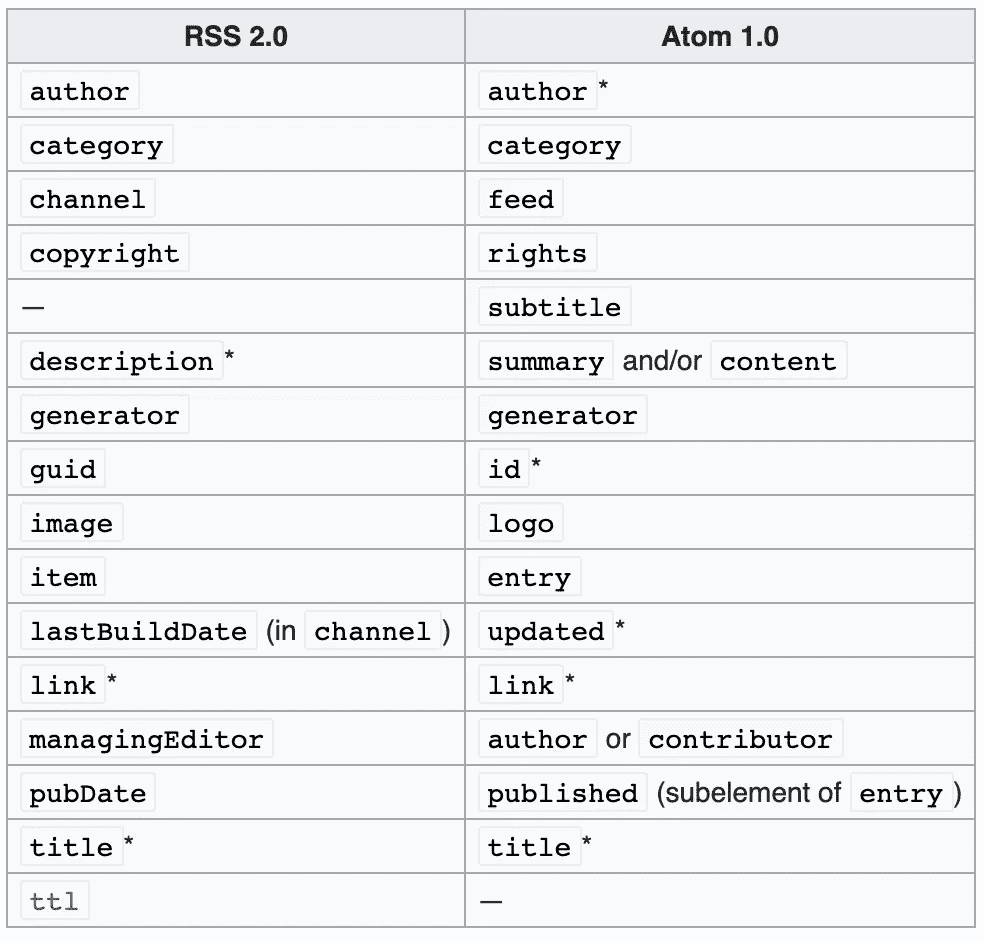

# 使用 Python 通过 RSS/Atom 提要收集新闻文章

> 原文：<https://towardsdatascience.com/collecting-news-articles-through-rss-atom-feeds-using-python-7d9a65b06f70?source=collection_archive---------5----------------------->

## 新闻捕手

## 或者如何停止依赖数据提供商


由 [Unsplash](https://unsplash.com?utm_source=medium&utm_medium=referral) 上的[Cup 先生/杨奇煜·巴拉](https://unsplash.com/@iammrcup?utm_source=medium&utm_medium=referral)拍摄的照片

在我之前的一篇文章中，我谈到了如何只用 5 行代码就能搜集和分析新闻文章:

[](/scrape-and-summarize-news-articles-in-5-lines-of-python-code-175f0e5c7dfc) [## 用 5 行 Python 代码抓取并总结新闻文章

### 好的程序员写代码，伟大的先搜索 github。

towardsdatascience.com](/scrape-and-summarize-news-articles-in-5-lines-of-python-code-175f0e5c7dfc) 

这次我将向您展示如何设置一个管道来自动收集几乎所有新闻提供商(如纽约时报、CNN、彭博等)发布的所有新文章。)

为了实现这个目标，我将向您展示如何使用 [feedparser Python 包](https://pythonhosted.org/feedparser/)自动收集新闻，该包有助于规范 RSS/Atom 提要。

# 这篇文章是写给谁的？

面向可能希望收集自己的数据并练习构建数据管道的数据工程师和数据科学家。

# 什么是 RSS 和 Atom？

RSS 是一种 XML 格式的纯文本，提供一些内容提供商(新闻、播客、个人博客等)最近发表的文章的简要摘要。)

RSS 最常见的生产者是新闻出版商。

RSS 提要的存在是为了提供对最新新闻的访问(例如，对于新闻聚合器和新闻辛迪加)。

RSS 提要不包含整篇文章的文本(在大多数情况下)，但提供一些基本信息，如作者、标题、描述、发表时间等。

Atom 是另一种 XML 格式，是作为 RSS 提要的替代而开发的。Atom 似乎比 RSS 更先进，但是我不会在这篇文章中比较这两种格式。

RSS XML 的一个例子:

```
<?xml version="1.0" encoding="UTF-8" ?>
**<rss** version="2.0"**>**
**<channel>**
 **<title>**RSS Title**</title>**
 **<description>**This is an example of an RSS feed**</description>**
 **<link>**http://www.example.com/main.html**</link>**
 **<lastBuildDate>**Mon, 06 Sep 2010 00:01:00 +0000 **</lastBuildDate>**
 **<pubDate>**Sun, 06 Sep 2009 16:20:00 +0000**</pubDate>**
 **<ttl>**1800**</ttl>** **<item>**
  **<title>**Example entry**</title>**
  **<description>**Here is some text containing an interesting description.**</description>**
  **<link>**http://www.example.com/blog/post/1**</link>**
  **<guid** isPermaLink="false"**>**7bd204c6-1655-4c27-aeee-53f933c5395f**</guid>**
  **<pubDate>**Sun, 06 Sep 2009 16:20:00 +0000**</pubDate>**
 **</item>****</channel>**
**</rss>**
```

# 通过 RSS 端点抓取新闻

所以，剩下的唯一事情就是收集我们感兴趣的新闻发布者的所有 URL(端点)。

对于本文，我采用纽约时报提要端点。为此，我不得不:

*   去看[https://www.nytimes.com/](https://www.nytimes.com/)
*   “检查”页面的源代码
*   搜索“rss”术语
*   抓取第一个结果



纽约时报页面的源代码

让我们抓住那个链接，检查它是否像我们需要的东西。



[https://rss.nytimes.com/services/xml/rss/nyt/HomePage.xml](https://rss.nytimes.com/services/xml/rss/nyt/HomePage.xml)

好的，正如我们所看到的，这是**“NYT>头条新闻”** RSS。

在 **<频道>** 部分，您可能会找到关于提要本身的一般信息——描述、构建时间、语言等。

此 RSS 下的每个 **<条目>** 代表文章。第一个项目代表标题( **< title >** )称为 ***的文章“特朗普打赌他能孤立伊朗，迷倒朝鲜。没那么容易。”***

如果我们拿这个 **<项下的>** 链接( **<链接>** )我们会被转发到一篇文章的原始页面:



[https://www . nytimes . com/2020/01/01/us/politics/trump-Iran-north-Korea . html？emc=rss & partner=rss](https://www.nytimes.com/2020/01/01/us/politics/trump-iran-north-korea.html?emc=rss&partner=rss)

RSS 不会给我们一篇文章的全文，但它会建议一个简短的 **<描述>** 来代替。

# Feedparser

现在，当我们知道什么是 RSS 以及如何使用它时，我们可以尝试自动获取新文章。

RSS/Atom 提要的主要缺点是它们没有被规范化。根据维基百科页面，RSS/Atom 只有几个必填字段(链接、标题、描述)。



[https://en.wikipedia.org/wiki/RSS](https://en.wikipedia.org/wiki/RSS)

> 这意味着，如果您想存储来自不同新闻出版商的数据，您应该考虑所有可能的键-值对，或者使用一些无模式技术(例如，elasticsearch)。

## 探索 feedparser 包

```
pip install feedparser
```

`import feedparser`

```
feed = feedparser.parse('[https://rss.nytimes.com/services/xml/rss/nyt/HomePage.xml'](https://rss.nytimes.com/services/xml/rss/nyt/HomePage.xml'))
```

现在我们的提要被加载到了`feed`变量下。在`.feed`属性下，我们可以找到关于提要元数据本身的主要信息。

```
**feed.feed**Out[171]: 
{‘title’: ‘NYT > Top Stories’,
 ‘title_detail’: {‘type’: ‘text/plain’,
 ‘language’: None,
 ‘base’: ‘[https://rss.nytimes.com/services/xml/rss/nyt/HomePage.xml'](https://rss.nytimes.com/services/xml/rss/nyt/HomePage.xml'),
 ‘value’: ‘NYT > Top Stories’},
 ‘links’: [{‘rel’: ‘alternate’,
 ‘type’: ‘text/html’,
 ‘href’: ‘[https://www.nytimes.com?emc=rss&partner=rss'](https://www.nytimes.com?emc=rss&partner=rss')},
 {‘href’: ‘[https://rss.nytimes.com/services/xml/rss/nyt/HomePage.xml'](https://rss.nytimes.com/services/xml/rss/nyt/HomePage.xml'),
 ‘rel’: ‘self’,
 ‘type’: ‘application/rss+xml’}],
 ‘link’: ‘[https://www.nytimes.com?emc=rss&partner=rss'](https://www.nytimes.com?emc=rss&partner=rss'),
 ‘subtitle’: ‘’,
 ‘subtitle_detail’: {‘type’: ‘text/html’,
 ‘language’: None,
 ‘base’: ‘[https://rss.nytimes.com/services/xml/rss/nyt/HomePage.xml'](https://rss.nytimes.com/services/xml/rss/nyt/HomePage.xml'),
 ‘value’: ‘’},
 ‘language’: ‘en-us’,
 ‘rights’: ‘Copyright 2020 The New York Times Company’,
 ‘rights_detail’: {‘type’: ‘text/plain’,
 ‘language’: None,
 ‘base’: ‘[https://rss.nytimes.com/services/xml/rss/nyt/HomePage.xml'](https://rss.nytimes.com/services/xml/rss/nyt/HomePage.xml'),
 ‘value’: ‘Copyright 2020 The New York Times Company’},
 ‘updated’: ‘Thu, 02 Jan 2020 15:03:52 +0000’,
 ‘updated_parsed’: time.struct_time(tm_year=2020, tm_mon=1, tm_mday=2, tm_hour=15, tm_min=3, tm_sec=52, tm_wday=3, tm_yday=2, tm_isdst=0),
 ‘published’: ‘Thu, 02 Jan 2020 15:03:52 +0000’,
 ‘published_parsed’: time.struct_time(tm_year=2020, tm_mon=1, tm_mday=2, tm_hour=15, tm_min=3, tm_sec=52, tm_wday=3, tm_yday=2, tm_isdst=0),
 ‘image’: {‘title’: ‘NYT > Top Stories’,
 ‘title_detail’: {‘type’: ‘text/plain’,
 ‘language’: None,
 ‘base’: ‘[https://rss.nytimes.com/services/xml/rss/nyt/HomePage.xml'](https://rss.nytimes.com/services/xml/rss/nyt/HomePage.xml'),
 ‘value’: ‘NYT > Top Stories’},
 ‘href’: ‘[https://static01.nyt.com/images/misc/NYT_logo_rss_250x40.png'](https://static01.nyt.com/images/misc/NYT_logo_rss_250x40.png'),
 ‘links’: [{‘rel’: ‘alternate’,
 ‘type’: ‘text/html’,
 ‘href’: ‘[https://www.nytimes.com?emc=rss&partner=rss'](https://www.nytimes.com?emc=rss&partner=rss')}],
 ‘link’: ‘[https://www.nytimes.com?emc=rss&partner=rss'](https://www.nytimes.com?emc=rss&partner=rss')}}
```

最重要的字段是`copyright`和`published`。

Feedparser 会小心地为这些属性分配正确的值，这样您就不必浪费时间自己对它们进行规范化。

## 标准化文章

与提要一样，您可能会在`.entries`属性下找到关于每篇文章的信息。

```
feed.entries[0].titleOut[5]: 'Trump Bet He Could Isolate Iran and Charm North Korea. It’s Not That Easy.'
```

这样，我们将知道提要中每个元素的基本信息。

如果你想要这篇文章的全文，你必须带着网址，使用报纸。检查一下我的另一篇文章，我已经把它嵌入了这篇文章的开头。

# 进一步的工作

试着想想如何构建一个数据管道来收集新文章，并对数据库中已经看到的文章进行重复数据删除。此外，在顶部增加一个 NLP 管道可能会带来很多有用的见解( [spaCy](https://spacy.io/) python 包非常适合这一点)。

在我的个人博客中，我讲述了我如何构建[新闻捕捉器](https://www.producthunt.com/upcoming/newscatcher)——一个从最受欢迎的新闻出版商那里获取新闻数据的 API。如果你想知道如何将我上面描述的内容扩展成成千上万的内容，请关注我的[媒体博客](https://medium.com/@kotartemiy)，并收听我的[推特](https://twitter.com/bugaralife)。