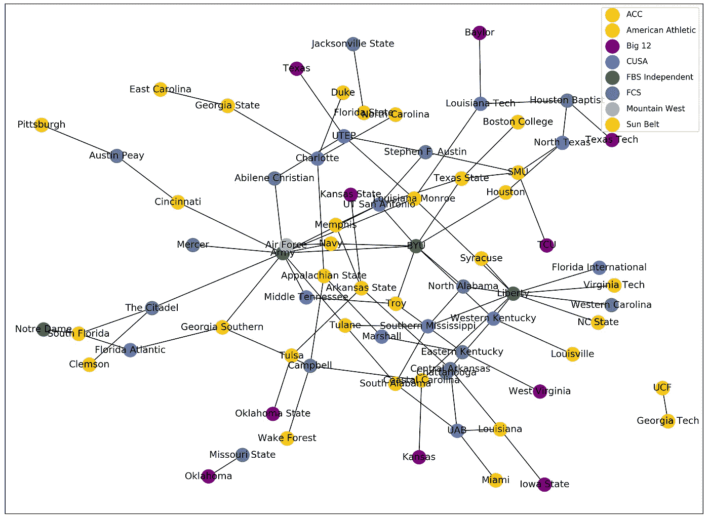
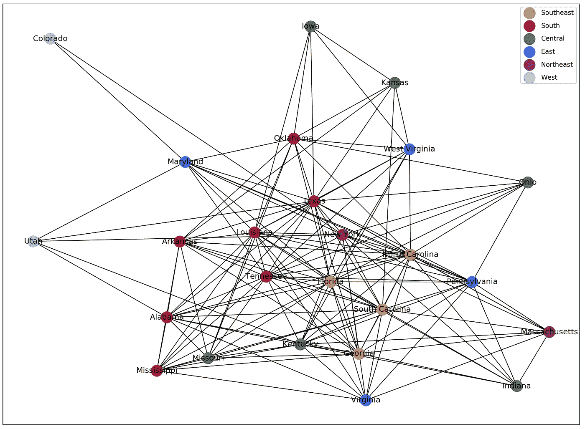

# COVID 期间大学足球旅行的图表

> 原文：<https://towardsdatascience.com/college-football-travel-during-covid-1ced0164840e?source=collection_archive---------48----------------------->

## 利用 NetworkX 对 2020 年大学足球赛程的网络分析及对大学足球艰难决策的思考


在 [Unsplash](https://unsplash.com?utm_source=medium&utm_medium=referral) 上 [NeONBRAND](https://unsplash.com/@neonbrand?utm_source=medium&utm_medium=referral) 拍摄的照片

当圣母大学在 8 月 17 日暂停面对面学习时，这是对新冠肺炎阳性病例激增的回应。我质疑，如果校园对学生关闭，这一举措将如何影响足球活动的继续。令人欣慰的是，在回到现场学习后，[圣母大学仪表盘](https://here.nd.edu/our-approach/dashboard/)上的数字显示阳性测试已经下降并保持稳定。然而，另一个集群的威胁仍然存在，特别是当班级和足球呈现出正常的味道。其他足球强国没有采取如此迅速的行动。例如，阿拉巴马大学塔斯卡卢萨分校(又名阿拉巴马)继续通过一个主要的集群进行个人学习。普遍获得系统[发布了一份报告](https://uasystem.edu/news/2020/09/sept-11-2020-covid-19-dashboard-update/)，对每周病例的下降有些乐观。这是一个好消息，希望这种趋势继续下去，然而，阿拉巴马州 6.1%的学生已经被检测为阳性。那太多了。对于学校的管理者来说，迫切的问题是多少阳性测试足以关闭校园？

## 阿拉巴马州(和其他州)将在秋季学期后转向远程教育

阿拉巴马州已经宣布允许 20%的主场足球比赛容量。超过 2 万人！！我相信许多学校无法证明在足球比赛上招待球迷是合理的，而学生被限制在校园内和远程学习。所以，学校会有两种选择；让球迷离开主场比赛，或者不管爆发的规模如何，坚持亲自学习。你认为学校管理者会喜欢哪一个？

## 足球的费用

大学橄榄球教练的费用随着收入的增加而增加。如果要求学生支付足球教练的薪水，那么在阿拉巴马，每个学生每年至少要支付 441.38 美元。该数字不包括与项目其他部分相关的成本，包括体育场维护、其他员工、差旅或奖学金成本。

[](https://medium.com/swlh/exploring-college-football-salaries-dc472448684d) [## 探索大学足球薪酬

### 按州和会议列出的每个学生的价格

medium.com](https://medium.com/swlh/exploring-college-football-salaries-dc472448684d) 

足球是许多体育院系的生命线，作为校园体验的一部分，它吸引了许多学生。与 COVID 相关的成本也是一个严重的问题。虽然大学年龄人口的死亡率相对于一般人群来说较低，但 COVID 可能会产生严重的长期影响。大约 15%的患有冠状动脉疾病的大学生运动员患上了心脏病，这是一种潜在的长期健康疾病。有多少学生会出现类似的情况？

## 旅行的风险

我们知道高风险活动，如航空旅行和足球，会增加感染 COVID 的可能性。这个赛季有多少场联盟外和州外的比赛？本文使用 NetworkX 创建网络来找出答案。完整的 2020 赛季时间表可以使用下面的命令从 collegefootballdata.com[API 下载:](https://api.collegefootballdata.com/api/docs/?url=/api-docs.json#/games/getTeamRecords)

```
curl -X GET “[https://api.collegefootballdata.com/games?year=2020&seasonType=regular](https://api.collegefootballdata.com/games?year=2020&seasonType=regular)" -H “accept: application/json”
```

本赛季 FBS 游戏总数为 **413。**参加 FBS 比赛的有 **91 支**队伍(包括部分 FCS 队伍)。为了构建网络，我们使用了 [NetworkX](https://networkx.github.io/) 和 matplotlib。本赛季有 322 场会议赛对 91 场非会议赛。这个赛季谁在打非联盟赛？为了找到答案，我们过滤了会议游戏中的所有内容，然后创建了一个图形对象，并根据团队的会议应用了颜色。



边表示由会议着色的团队之间的游戏。图片作者。

在上面的网络中，FBS 独立队今年玩了最多的会议外游戏(这并不奇怪)。有趣的是，圣母大学仍然被归类为 FBS 独立，尽管打了 ACC 赛程，使南佛罗里达成为唯一的非大会比赛。

随着一些州成为感染热点，今年去其他州旅行可能会成为一个大问题。不同州的球队之间打多少场比赛？原来 **86.2%或 356 场比赛**需要一个团队跨越州界。我们过滤掉来自同一个州的球队之间的比赛，而不是创建一个图形对象，并根据球队的区域应用颜色。



优势表示位于两个不同州的球队之间的比赛。图片作者。

各州之间有很多旅行。哪个州跨州参赛的队伍最多？那就是佛罗里达，它正在打败德克萨斯，来自 16 个不同州的球队来到阳光之州进行足球比赛。所有的代码、数据和图表都可以在项目 [GitHub](https://github.com/Datadolittle/College_Football_Networks) 上找到。

**结论**

大学足球的前景是不确定的，球迷、学生和球员的涌入可能会在今年秋天成为 COVID 的热点。我希望在足球赛季结束后，许多目前亲自去的大学会去偏远地区或混合地区。提前去看这些比赛的成本意味着要把球迷从主场比赛中赶走。一些体育部门和学校管理人员根本不能失去足球收入来资助他们的教练人员的年薪，有些高达数千万美元。我相信 COVID 将导致许多运动员质疑业余模式，因为学校似乎将足球美元看得比学生健康更重要。这里希望这个季节能够继续下去，不要在团队或学生群体中爆发任何重大疫情。

**附言:带回 NCAA 足球电子游戏！！！**

我叫科迪·格利克曼，可以在 LinkedIn 上找到我。一定要看看我下面的其他文章:

[](https://medium.com/swlh/exploring-college-football-salaries-dc472448684d) [## 探索大学足球薪酬

### 按州和会议列出的每个学生的价格

medium.com](https://medium.com/swlh/exploring-college-football-salaries-dc472448684d) [](/a-fantasy-draft-order-lottery-using-r-shiny-6668a5b275d2) [## 一个幻想草案秩序彩票使用 R 闪亮

### 作为 web 应用程序编写的 NBA 风格的彩票系统

towardsdatascience.com](/a-fantasy-draft-order-lottery-using-r-shiny-6668a5b275d2) [](/to-beard-or-not-to-beard-that-is-the-question-b46864d7e003) [## 刮胡子，还是不刮胡子，这是个问题

### 使用深度学习对有胡须和无胡须的照片进行年龄分类

towardsdatascience.com](/to-beard-or-not-to-beard-that-is-the-question-b46864d7e003)