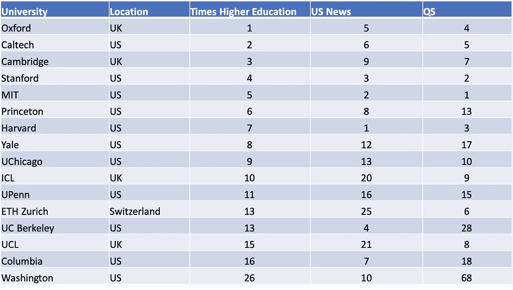
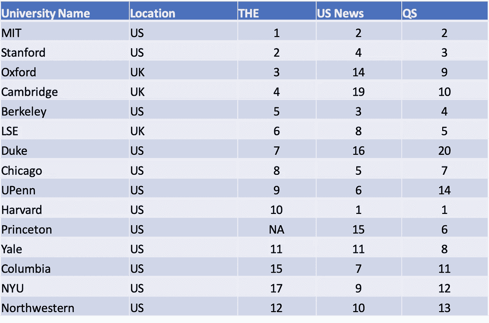

# 大学排名不靠谱

> 原文：<https://towardsdatascience.com/college-rankings-are-unreliable-8bc49e4fddd7?source=collection_archive---------36----------------------->

## 我们来看看数据。

瓦迪姆·谢尔巴科夫在 [Unsplash](https://unsplash.com?utm_source=medium&utm_medium=referral) 上拍摄的照片

大学排名没有兑现诱人的承诺。他们接受了决定在哪里学习或教学的丑陋的复杂性，并用一种客观性的幻觉来取代它们。

如果你像我一样，你会从数据中寻求清晰和指导。不幸的是，这些数据有时掩盖了对重大决策至关重要的细微差别。(谎言，可恶的谎言等。)

抛开上哪所大学是否重要的宏观问题不谈，我认为排名的主要来源是不可靠的。利用《泰晤士报高等教育》、《美国新闻》和 QS 的数据，我提出了三个论点:

1.  排名不一致
2.  排名是不相关因素的集合
3.  排名不够

## 排名不一致

这就是大学排名不靠谱的最简单的原因。我从三个主要来源整理了全球十大大学的排名:

比较泰晤士高等教育、美国新闻和 QS 的 2020 年排名

排名之间的平均标准差为 **7.1** 。这一数字无疑因一些异常值而增加，如华盛顿大学，它勉强进入了美国新闻排名的前十名，但在美国和 QS 分别排名第 26 位和第 68 位。

六所大学在这三份榜单中都进入了前十名，但即使是这一组也显示出巨大的差异。例如，牛津大学是世界上最好的大学之一，但是在另外两个榜单中并没有进入前三名。

为了更加仁慈，我决定限制我的搜索范围。这三个来源都按学科提供全球大学排名。我选择了经济学的排名，尽管应该注意的是，它将该主题列在“经济学和商业”之下，这与《美国新闻》和 QS 的“经济学和计量经济学”的分类略有不同。

2020 年经济学排名对比

特定经济学排名的平均标准偏差为 **3.5** ，约为未指定主题时标准偏差的一半。这似乎表明，在顶尖大学中，当受学科限制时，排名更加一致。

当然，如果受到个人因素的限制，如引用或教学声誉，他们也会更加一致。进一步缩小我的搜索标准将会偏离对大学排名的关注，因为它们通常被认为是(也因为它们出现在新闻中)。

我能想到两个反对以这种方式交叉比较排名的理由:

1.  就数量级而言，大学排名仍然是可靠的——排名第 1、#10、#100 和#1000 的大学之间有明显的区别。
2.  每份榜单使用不同的标准对大学进行排名，因此结果大相径庭也就不足为奇了。

我同意第一种反对意见。第二个问题揭示了一个更大的问题:

## 排名是不相关因素的集合

总体排名中使用的大多数标准都是不相关的。需要明确的是，师生比、研究生产率和引用率(都被使用)等维度是大学总分的合理组成部分。然而，任何给定的利益相关者都不应该关心考虑的大多数因素。

例如，学生不会因为他们的教授被大量引用而明显受益。至少，引用不值得占总分数的 30%,因为它们在列表中。也就是说，它的目标是比《美国新闻》更能代表教学质量，后者完全专注于研究成果。

另一方面，学者可能对薪水、职场文化和福利感兴趣。这些类别都没有直接包含在我检查过的列表中。

有人可能会说，排名是衡量一所大学声誉的标准。有趣的是，它包括一项声誉调查，衡量“教学机构的感知声望”，作为其[总分的一部分](https://www.timeshighereducation.com/world-university-rankings/world-university-rankings-2020-methodology)。这意味着他们的“教学”类别本身并不是教学声誉的衡量标准。

这一观点也与排名的交叉比较相矛盾。加州理工学院在非特定学科排行榜上一直排在耶鲁之上，然而人们很难认为耶鲁是这两所大学中更不出名的一所。

这并不是说*考虑的所有*因素都是合理和重要的。美国和 QS 都将国际学生的比例作为排名的一部分。我明白了为什么拥有一个多元化的学生群体可以提升学生体验，或者表明一个模范的全球声誉。然而，如果不考虑国际学生在某个大学学习的原因，把这个因素包括进去似乎是有问题的。

例如，迪拜的美国大学(排名第 600-650 位)和 T2 的伦敦经济学院(排名第 49 位)吸引了许多海外学生，这可能有不同的原因。在 QS 世界排名中，这两所大学的国际学生比例都是 100 分。

照片由[乔舒亚·戈德](https://unsplash.com/@joshgmit?utm_source=medium&utm_medium=referral)在 [Unsplash](https://unsplash.com?utm_source=medium&utm_medium=referral) 拍摄

我最近听到一句话，“垃圾进，垃圾出”适用于机器学习模型。这在这里同样相关。如果指标本身一开始就有缺陷，那么仔细组合几十个指标不会让大学排名更可靠。

## 排名不够

等等，什么？

首先，我要说的是，更多的全球大学排名出版物并不一定会增加可信度。然而，目前排名数量太少，无法对每个大学形成准确的看法。

让我们假设每一份名单都像同行评议研究一样严谨。即使在这种情况下，少数具有矛盾结果的研究也没有给我们提供多少新知识。在将研究结果用于决策之前，通常建议等待形成某种程度的共识；我不明白为什么我们要在这种情况下破例。

除了大量的数据，更集中的分析是必要的。比如哪些大学导致毕业生工资涨幅最高？校园文化哪里更有利于心理健康？在一个给定的机构中，不同系之间的教学质量如何不同？

这些问题没有一个有助于产生全面的分数，但它们最终会对学生、教师和私营部门组织产生影响。这些问题也可以由负责编制大学排名的研究人员来回答。

是时候离开年度新闻周期了，在这一周期中，我们浏览大学排名，就好像它们是体育排行榜一样。在那些给许多雄心勃勃的学生提供过度安慰的组织有序的清单下面，有一个相关的和必要的故事要讲述。