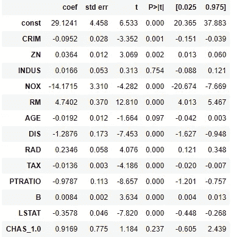
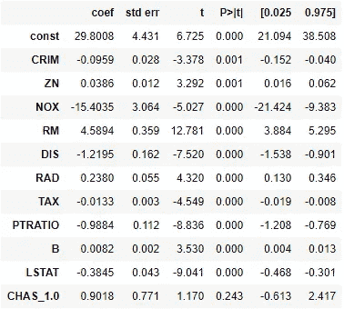
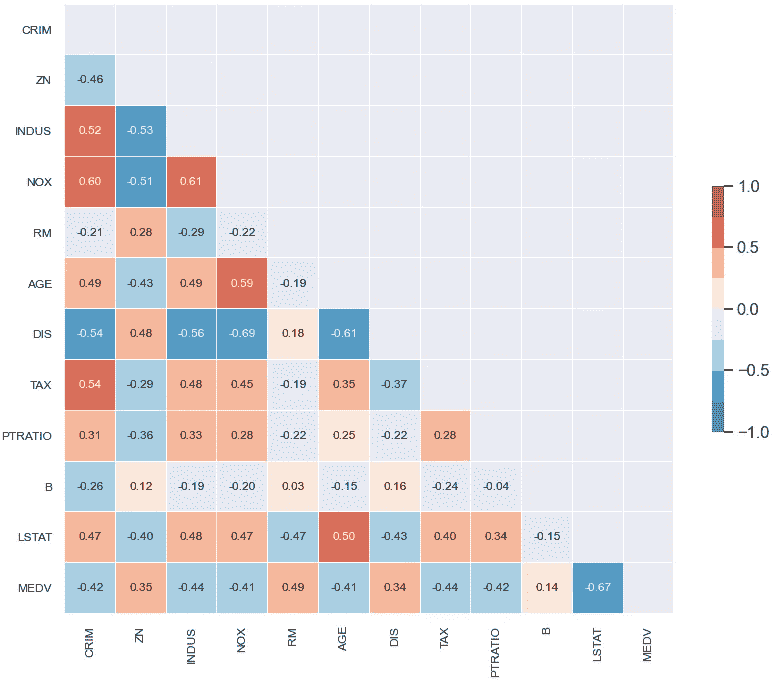
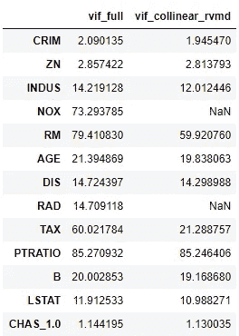
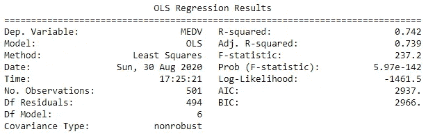
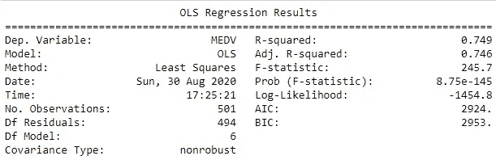

# 共线性度量

> 原文：<https://towardsdatascience.com/collinearity-measures-6543d8597a2e?source=collection_archive---------22----------------------->

## 减轻线性回归模型多重共线性的度量和方法

特征选择是选择对目标变量的预测/分类贡献最大的预测变量的过程。在线性回归模型的特征选择中，我们关注与变量有关的四个方面。作为助记“线”，这些是:

1.  不平等。所选变量与目标变量具有线性关系。
2.  **I** 预测变量的不依赖性。所选变量相互独立。
3.  **常态。残差通常遵循正态分布(平均值为零)。**
4.  **E** 方差质量。残差在预测变量的值之间通常是一致的(即，同方差)。

如果选定的预测变量不是相互独立的，我们将无法确定或归因于各种预测变量对目标变量的贡献——模型系数的可解释性成为一个问题。

特征选择的一种方法是通过使用 p 值；其中 p 值高于某个阈值(通常为+/- 0.05)的变量表现为对目标变量没有显著贡献，因此可以删除以降低模型复杂性。然而，当预测变量之间存在多重共线性时，这种方法具有挑战性，正如 sklearn 中的波士顿住房数据集所示。

```
# Original (full) set of variables
X_o = df_wdummy[['CRIM', 'ZN', 'INDUS', 'NOX', 'RM', 'AGE', 'DIS', 'RAD', 'TAX', 'PTRATIO', 'B', 'LSTAT', 'CHAS_1.0']]
X_o = sm.add_constant(X_o)
y_o = df_wdummy['MEDV']
# Baseline results
model_o = sm.OLS(y_o, X_o)
results_o = model_o.fit()
results_o.summary()
```



OLS 回归结果 1，注意 0.05 以上的 p 值(图片由作者提供)

基于 p 值，我们移除变量 INDUS 和 AGE，并检查更新的 p 值。

```
# Remove Age -> Remove INDUS, based on p-values.

X_r0 = df_wdummy[['CRIM', 'ZN', 'NOX', 'RM', 'DIS', 'RAD', 'TAX',
       'PTRATIO', 'B', 'LSTAT', 'CHAS_1.0']]
X_r0 = sm.add_constant(X_r0)
y_r0 = df_wdummy['MEDV']
# results
model_r0 = sm.OLS(y_r0, X_r0)
results_r0 = model_r0.fit()
results_r0.summary()
```



更新的 OLS 回归结果；请注意，p 值均不超过 0.05(图片由作者提供)

尽管所有 p 值都低于 0.05，但多重共线性仍然存在(在 TAX 和 RAD 变量之间)。)多重共线性的**存在可能会掩盖各变量对目标变量**的贡献的重要性，从而使 p 值的可解释性变得具有挑战性。我们可以使用相关性度量和矩阵来帮助可视化和减轻多重共线性。这种方法是好的，直到我们需要使用不同的相关措施(即 Spearman，Pearson，Kendall)由于变量的固有属性。在上面的例子中，变量 RAD(放射状公路可达性指数)是一个顺序变量。税收(每 10，000 美元的全价值财产税税率)是一个连续变量(非正态分布)。使用不同的相关性度量和矩阵，人们可能会忽略不同类别变量之间的相关性。

另一种识别多重共线性的方法是通过**方差膨胀因子。**VIF**表示每个变量系数的方差膨胀百分比。从值 1(无共线性)开始，介于 1-5 之间的 VIF 表示中度共线性，而大于 5 的值表示高度共线性。在某些情况下，高 VIF 是可以接受的，包括使用相互作用项、多项式项或虚拟变量(具有三个或更多类别的标称变量)。相关矩阵能够识别变量对之间的相关性，而 VIF 能够全面评估多重共线性。大多数连续变量的相关矩阵如下所示，以突出各种共线变量对。可以使用 statsmodels 软件包计算 VIF；下面的代码块显示了包含(左)和移除(右)共线变量的 VIF 值。**



连续变量的相关矩阵；肯德尔系数(图片由作者提供)

```
# Setting the predictor variables
X_o = df_wdummy[['CRIM', 'ZN', 'INDUS', 'NOX', 'RM', 'AGE', 'DIS', 'RAD', 'TAX', 'PTRATIO', 'B', 'LSTAT', 'CHAS_1.0']]
X_r1 = df_wdummy[['CRIM', 'ZN', 'INDUS', 'RM', 'AGE', 'DIS', 'TAX', 'PTRATIO', 'B', 'LSTAT', 'CHAS_1.0']]# 
from statsmodels.stats.outliers_influence import variance_inflation_factorvif = pd.Series([variance_inflation_factor(X_o.values, i) for i in range(X_o.shape[1])], index=X_o.columns,
                 name='vif_full')
vif_r = pd.Series([variance_inflation_factor(X_r1.values, i) for i in range(X_r1.shape[1])], index=X_r1.columns,
                  name='vif_collinear_rvmd')
pd.concat([vif, vif_r], axis=1)
```



预测变量的 VIF 值(图片由作者提供)

VIF 值对应于相关矩阵；例如，可变对 NOX 和 INDUS，相关系数在 0.5 (0.61)以上，各自的 VIF 值在 5 以上。共线变量 RAD 和 NOX 的去除改善了 VIF 图。仅仅根据最高的 VIF 数删除共线变量并不能保证构建出性能最佳的模型，这将在下一节中详述。

我们通过删除相关矩阵(如上所示)中确定的所有共线变量来构建基线模型，下一步将删除待定税和 RAD。

```
# Baseline variables 
X_bl = df_wdummy[['INDUS', 'RM', 'AGE', 'RAD', 'TAX', 'PTRATIO', 'LSTAT']]
y_bl = df_wdummy['MEDV']# Explore mitigating multi-collinearity
vif_bl = pd.Series([variance_inflation_factor(X_bl.values, i) for i in range(X_bl.shape[1])], index=X_bl.columns,
                 name='vif_bl')X_noTAX = X_bl.drop(['TAX'],axis=1)
X_noRAD = X_bl.drop(['RAD'],axis=1)
vif_noTAX = pd.Series([variance_inflation_factor(X_noTAX.values, i) for i in range(X_noTAX.shape[1])],
                      index=X_noTAX.columns, name='vif_noTAX')
vif_noRAD = pd.Series([variance_inflation_factor(X_noRAD.values, i) for i in range(X_noRAD.shape[1])],
                      index=X_noRAD.columns, name='vif_noRAD')
pd.concat([vif_bl, vif_noTAX, vif_noRAD], axis=1)
```


评估基线模型中预测变量的 VIF 图(图片由作者提供)

虽然基于 VIF 放弃税收变量似乎更好，但谨慎的方法是通过调整后的 R 平方度量进行检查(根据预测因素的数量进行调整，只有当下一个添加的变量对模型的改善程度超过偶然的预期时，度量才会增加)。

```
# Without TAX
model = sm.OLS(y, sm.add_constant(X_noTAX)).fit()
print_model = model.summary()
print(print_model)
```



模型指标摘要(不含税)(图片由作者提供)

```
# Without RAD
model = sm.OLS(y, sm.add_constant(X_noRAD)).fit()
print_model = model.summary()
print(print_model)
```



模型指标摘要(无 RAD)(图片由作者提供)

从更高的调整后的 R 平方数字，我们可以推断出模型在 RAD 变量被删除的情况下表现得更好！多重共线性问题解决后，下一步可能是探索增加交互项以潜在地提高模型性能。

总之，多重共线性的存在会掩盖预测变量对目标变量的重要性。相关矩阵和 VIF 的使用有助于识别相关变量对并评估所选变量(要素)之间的多重共线性。虽然仍然需要一些迭代来评估模型性能，但有了 VIF 和相关矩阵，我们将能够为特征选择做出更明智的决策。

代码托管在这里:[https://github.com/AngShengJun/petProj/tree/master/eda_viz](https://github.com/AngShengJun/petProj/tree/master/eda_viz)

参考资料:

1.  相关方法 1[https://data science . stack exchange . com/questions/64260/Pearson-vs-spearman-vs-Kendall](https://datascience.stackexchange.com/questions/64260/pearson-vs-spearman-vs-kendall)
2.  相关方法 2[https://support . minitab . com/en-us/minitab-express/1/help-and-how-to/modeling-statistics/regression/supporting-topics/basics/a-comparison-of-the-the-Pearson-and-spearman-correlation-methods/](https://support.minitab.com/en-us/minitab-express/1/help-and-how-to/modeling-statistics/regression/supporting-topics/basics/a-comparison-of-the-pearson-and-spearman-correlation-methods/)