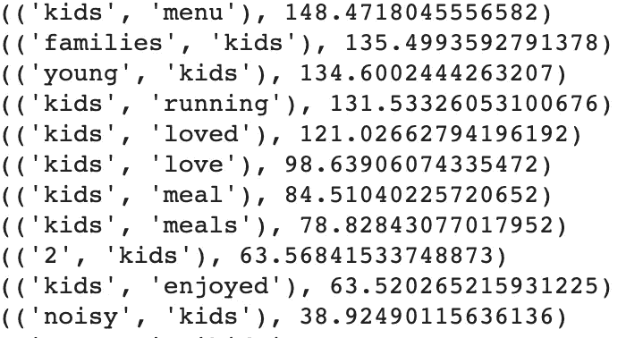
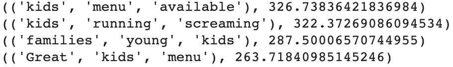

# 使用 NLTK 库的自然语言处理中的搭配

> 原文：<https://towardsdatascience.com/collocations-in-nlp-using-nltk-library-2541002998db?source=collection_archive---------13----------------------->


一棵树的两根树枝美丽地并列在一起。来源:[像素](https://www.pexels.com/photo/city-bridge-skyscrapers-tree-86653/)

搭配是包含多个单词的短语或表达，这些单词很可能同时出现。比如——‘社交媒体’、‘学校假期’、‘机器学习’、‘新加坡环球影城’等。

# 为什么需要搭配？

想象一下，有一个需求，您希望了解客户留下的文本评论。你想了解行为洞察，比如谁是你的顾客，有多少人光顾你的店，他们对什么感兴趣，他们买什么，他们参加什么活动，等等。

为了更简单，让我们假设你有一家餐馆，你有几千条评论。因此，如上所述，作为餐馆老板，你需要了解顾客的行为。

使用命名实体识别，我在人、事件、日期、产品类别中提取了某些有趣的实体。例如日期中的“星期六”。然后我想知道人们在“星期六”前后在他们的评论中写了什么！

因此，我缩小了几个广泛的主题，如“家庭”、“夫妇”、“假日”、“早午餐”等。搭配帮助我找到了两三个很有可能围绕这些主题同时出现的词。这两个或三个词一起出现，也被称为二元和三元。

# 搭配与常规的二元或三元组有何不同？

作为二元模型共现的两个单词的集合，以及作为三元模型共现的三个单词的集合，可能不会给我们有意义的短语。例如，句子“他应用了机器学习”包含二元词:“他应用了”、“应用了机器”、“机器学习”。“他应用”和“应用机器”没有任何意义，而“机器学习”是一个有意义的二元模型。仅仅考虑同现单词可能不是一个好主意，因为像‘of’这样的短语可能会频繁地同现，但实际上没有意义。因此，需要 NLTK 库中的[搭配](http://www.nltk.org/howto/collocations.html)。它只给我们有意义的二元模型和三元模型。

# 一个搭配怎么比另一个好？

哦！所以你基本上想知道评分是如何进行的？嗯，我用了点态互信息或 PMI 分数。讨论什么是 PMI 以及它是如何计算的不是这篇博客的范围，但是这里有一些很棒的文章，你可以阅读来了解更多:[第一条](https://eranraviv.com/understanding-pointwise-mutual-information-in-statistics/)和[第二条](https://stats.stackexchange.com/questions/179349/what-are-the-pros-and-cons-of-applying-pointwise-mutual-information-on-a-word-co)。我使用 PMI 分数来量化和排列搭配库产生的二元模型和三元模型。

# 如何实现搭配？

正如我前面提到的，我想知道人们围绕某些主题写些什么，比如一些特定的日期、事件或人物。因此，从我的代码中，你将能够看到特定单词周围的二元模型、三元模型。也就是说，我想知道除了我选择的“特定单词”之外，很可能形成的二元模型、三元模型。这个特定的词就是我们从命名实体识别中得到的主题。

```
import nltk
from nltk.collocations import *bigram_measures = nltk.collocations.BigramAssocMeasures()# Ngrams with 'creature' as a member
creature_filter = lambda *w: 'kids' not in w ## Bigrams
finder = BigramCollocationFinder.from_words(
   filtered_sentences)
# only bigrams that appear 3+ times
finder.apply_freq_filter(3)
# only bigrams that contain 'creature'
finder.apply_ngram_filter(creature_filter)
# return the 10 n-grams with the highest PMI
# print (finder.nbest(bigram_measures.likelihood_ratio, 10))
for i in finder.score_ngrams(bigram_measures.likelihood_ratio):
    print (i)
```



二元搭配代码的示例结果

结果显示，人们在评论中会写“儿童菜单”、“儿童跑步”、“儿童餐”。现在让我们看看“孩子”周围的三元组。

```
## Trigrams
trigram_measures = nltk.collocations.TrigramAssocMeasures()# Ngrams with 'creature' as a member
creature_filter = lambda *w: 'kids' not in w finder = TrigramCollocationFinder.from_words(
   filtered_sentences)
# only trigrams that appear 3+ times
finder.apply_freq_filter(3)
# only trigrams that contain 'creature'
finder.apply_ngram_filter(creature_filter)
# return the 10 n-grams with the highest PMI
# print (finder.nbest(trigram_measures.likelihood_ratio, 10))
for i in finder.score_ngrams(trigram_measures.likelihood_ratio):
    print (i)
```



三元组搭配代码的示例结果

代码输出让我们对上面挖掘的二元模型有了更深入的了解。因此，“儿童菜单可用”和“伟大的儿童菜单”是“儿童菜单”的延伸，这表明人们为有儿童菜单的餐厅鼓掌。同样，“孩子跑”与“孩子尖叫着跑”这一负面含义联系在一起。这意味着，当有孩子跑来跑去尖叫时，餐馆里的客人可能没有好好享受他们的时光。

这就结束了我对 NLTK 库提供的 NLP 中搭配应用的演示和解释。我希望这个博客对你有帮助。请让我知道你是否使用了不同的方法来评分或提取搭配。

感谢您的阅读，我也写过其他与软件工程和数据科学相关的[帖子](https://shubhanshugupta.com/blog/)。你可能想看看这里的。您也可以订阅我的博客，直接在收件箱中接收相关博客。