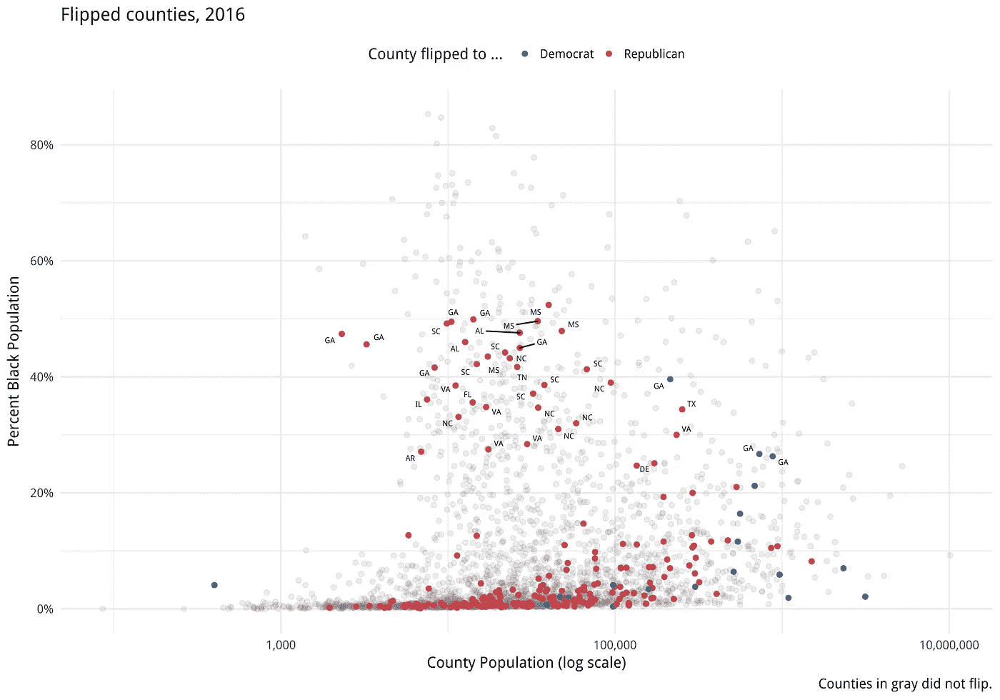

# 数据可视化中的颜色:少一些“如何”,多一些“为什么”

> 原文：<https://towardsdatascience.com/color-in-data-visualization-less-how-more-why-348514a3c4d8?source=collection_archive---------10----------------------->

## 太多时候，我们把颜色作为一种工具来制作漂亮的图片，而它应该被用来告诉我们的观众。

如果我们在可视化中使用颜色遵循[五个 w(和一个 H)](https://en.wikipedia.org/wiki/Five_Ws) ，我们在*如何*上花了太多时间，而在*为什么*上花的时间不够。当色彩应该被用来传达给我们的观众时，它却常常被看作是一种制作精美图片的工具。

举个例子，看看这个来自营销网站的“色彩情感指南”[点击](https://www.tapclicks.com/resources/blog/the-influence-of-color-in-data-visualization/)(当你在🧐).谷歌搜索“数据可视化中的色彩”时，这是最热门的结果之一

这里隐含的建议是我们应该使用颜色——无论何时何地——来捕捉某种形式的情感。不仅这种特定的分类相当奇怪(怪物能量饮料是和平的，维珍移动体现了“大胆的兴奋”，哈雷戴维森摩托车只是喊着“愉快的友好”)🤩)，导致新手从业者认为，应该只是为了用色而用色。

无端使用颜色的例子比比皆是。

这些例子说明了我的论点:当我们应该问*为什么*我们使用颜色的时候，我们经常问*我们如何在我们的可视化中使用颜色。*

1)默认的软件设置，2)对漂亮的调色板的痴迷，以及 3)缺乏对仔细的颜色考虑的重视，这些因素的结合导致了我们在一些最流行的数据可视化中对颜色的草率使用。

我看到的最常见的错误之一是过度使用颜色。例如，在上面的图表中，很明显有太多的颜色，没有明显的原因

很多时候，那些创建可视化的人会争辩说他们*必须*在他们的图表中包含 14 种颜色，因为数据集有 14 个数据点！一些最流行的数据 viz 工具(如 Excel)的默认设置是将分类变量映射到颜色，这并没有帮助。

然而，实际情况是，如果您的图表中需要多种颜色，您可能会以不同的方式呈现数据。从 Datawrapper 中取出[这个例子](https://blog.datawrapper.de/colors/):

外卖？当你强调一切时，你最终会什么都不强调*。这就是为什么我们停止不加批判地问如何在图表中使用颜色是很重要的。*

如果不能*告知查看者*,数据可视化只不过是一幅美丽的图画。如果你的图表显示了 14 个不同的数据点，它们都被映射成不同的颜色，那么它在讲述什么样的故事呢？我非常喜欢苹果数据可视化从业者 [Elijah Meeks](https://medium.com/@Elijah_Meeks/viz-palette-for-data-visualization-color-8e678d996077) 的这句话:

> *当你有如此多的维度时，不要试图找到不可能的 20 色调色板，停止使用颜色。这是难以区分的，令人困惑的，你只是把复杂性和决策权交给了你的读者。*

这就是为什么颜色应该更少地使用*和更周到地使用*。颜色是我们视觉化的最重要的部分之一，然而它们目前的使用太多时候是不必要的和压倒性的。**

# **那么，你应该如何运用色彩呢？**

**颜色不是敌人。更确切地说，对颜色的滥用和误用才是。那么，如何才能正确使用色彩呢？这取决于你视觉化的目的，作为推论，也取决于颜色的目的。你应该问:**我为什么要用颜色？****

# **1)颜色区分**

**颜色的一个用途是引起人们对感兴趣的数据点的注意。这种颜色的使用属于[解释性可视化](https://www.oreilly.com/library/view/designing-data-visualizations/9781449314774/ch01.html)的范畴，与其探索性的对应物相反。如果您已经探索、分析和探查了您的数据，现在您需要将这些见解传递给其他人(主管、客户或好奇的朋友)。向他们展示你所做的所有探索性工作是浪费时间，这就是为什么你的展示应该利用颜色来突出你的发现。**

**正如实践者安迪·基尔克[所说](https://www.visualisingdata.com/2015/01/make-grey-best-friend/)，在这个展示阶段的可视化实践者应该**让格雷成为他们最好的朋友**。这是因为没有色彩，而不是过度使用色彩，有助于描绘一幅图画和讲述一个故事。通过在可视化中使用灰色作为主要颜色，我们自动地将我们的观众的眼睛吸引到任何不是灰色的地方。这样，如果我们有兴趣讲述一个关于*一个数据点*的故事，我们可以很容易地做到。**

**这是我不久前在 R 做的一个简单的例子:**

****

**可视化的目的不是向我们的观众展示德克萨斯州每个县的幼儿园疫苗接种率。取而代之的是强调最低比率——特里县。这种可视化利用每隔一个酒吧的灰色填充，立即将观众的目光吸引到特里县。因为我们只使用了两种颜色，所以我们还可以突出字幕中的文本，让观众看起来更加清晰。颜色——如果谨慎使用的话——会让我们的视觉效果更容易理解，信息量更大。**

**现在，想象一下，如果我用下面的方式可视化同样的数据:**

****

**或者更糟的是:**

****

**看了那些碍眼的东西，你是不是很庆幸我们在最初的剧情中有节制地使用了色彩？**

**或许你对 2016 年各县选举结果的概览感兴趣。尽管你可能会忍不住根据特朗普/克林顿的分歧给所有县编码，但这比有见地更美好。相反，如果我们专注于那些在 2012 年至 2016 年间从一个政党转向另一个政党的著名县，会怎么样？摘自基兰·希利的书[数据可视化](https://socviz.co/refineplots.html#use-color-to-your-advantage):**

****

**正如我们在这里看到的，更多的县从 2012 年的多数民主党转向 2016 年的多数共和党。因为我们只关注所有数据点的一小部分，我们也可以观察到趋势:大多数翻转的县都有少量的黑人人口。没有一个县的黑人人口超过 53%(我自己的注释):**

****

**我们还注意到，翻转方向可能与人口规模相关:几乎所有对数人口低于 10 万的翻转县都转向了共和党，而如果对数人口超过 10 万，则所有翻转县中更大比例的人转向了民主党。**

****

**颜色可以，也应该被用来关注你的视觉效果中你想让你的观众看到的关键部分。通过有策略地使用颜色，我们可以减少理解*可视化所描绘的*内容所需的认知负荷。 [Kalyuga 等人](https://journals.plos.org/plosone/article?id=10.1371/journal.pone.0183884#pone.0183884.ref008)发现颜色编码“改善了注意力分散效应，从而降低了感知难度。”[其他研究人员](https://journals.plos.org/plosone/article?id=10.1371/journal.pone.0183884#pone.0183884.ref024)报告称，当给实验参与者提供颜色编码时，认知负荷会降低。**

**过度使用颜色会产生相反的效果。在 2019 年的一篇论文中，研究人员发现“与任务无关的数字颜色信息只会在触发与基本代码单词的语义属性冲突的情况下阻碍学习过程。”这是什么意思？如果颜色编码与它所代表的对象相冲突，就会阻碍学习，削弱理解。你不必理解这一切意味着什么(我并不完全理解)。这一点简单来说明:*我们应该关心颜色*。颜色可能会令人困惑和复杂，这就是为什么它的使用应该是有意的和最小的。它应该被用来引起对我们图表中重要部分的注意。**

# **2)色彩探索**

**颜色不一定要和普通的灰色形成对比。它还可以用作一种工具来展示映射到不同颜色的各种数据点。重要的是，这种用法应该节省。鉴于我们之前的例子，我们肯定不想要这样的情节(来自 Claus Wilke 的*数据可视化基础* 的[第 19 章):](https://serialmentor.com/dataviz/color-pitfalls.html)**

****

**一个更合适的替代方案可能是这样的:**

****

**这样，观众仍然可以看到数据中的一般模式，但他们不必像对待查找表一样对待填充图例！最理想的情况是，这个图表应该具有一定的交互性，这样用户就可以将鼠标悬停在某个点上来查看其相应的数据。**

**在这样的例子中，我们是在*探索*而不是*解释*，我们把探索留给了我们的用户；他们可以看到他们想看的东西，我们给他们所需的信息。**

**颜色的另一个常见用途是显示梯度上的数据级数(例如，从低到高、从差到好、从冷到暖)。**

**这些例子在 [choropleth 地图](https://en.wikipedia.org/wiki/Choropleth_map)中最常见，其中给定州(或县或地区)的颜色阴影对应于感兴趣的值。作为一个例子，这里有一个我用 D3.js 创建的 [choropleth 地图](https://connorrothschild.github.io/D3.js/map-overdoses/)，它可视化了美国阿片类药物过量死亡的情况:**

****

**从地图上我们可以看出，“铁锈地带”各州遭受阿片类药物危机的程度比西方各州要大得多。Choropleth 地图利用颜色显示地区差异，并说明颜色*阴影*的力量，以代表给定变量的严重性或范围。**

**然而，在这种情况下，颜色也可能被误用。可以根据分类色标或彩虹色标绘制数据，这使得很难看到进展。Claus O. Wilke 的图表是一个好(坏)的例子:**

****

**这张图表很漂亮！当彩虹秤被用于媒体或其他地方时，可能是因为它们的创造者问“我如何才能用颜色来制作一幅漂亮的画？”但是这种非单调色标的使用意味着难以检测数据点之间差异的相对大小。举个例子，看看你回答这个问题需要多长时间:用上面的图例，这个颜色和这个颜色的百分比差是多少？(答案是~70%。)**

**2019 年，[一组研究人员](https://ieeexplore.ieee.org/document/8494817)要求气候科学家评估描绘气候变化的地图，其中地图要么是彩虹状的(类似于上面的得克萨斯州地图)，要么是单调的(如早先的阿片类地图)。研究人员发现，当这些地图用单调亮度标度而不是传统的彩虹标度编码时，对这些地图中量值差异的评估明显更准确。其他研究一致发现彩虹色既有害又受欢迎。所有这些都是为了说明:颜色很重要。**

**所以，颜色可以用于探索的目的。也就是说，颜色不一定要专门用于焦点，它可以用在除了灰色以外的其他颜色的图表中！但是探索性的颜色使用(和所有的颜色使用一样)需要谨慎。**

# **结论**

**颜色很棘手。虽然它可以让你的情节更上一层楼，但也可能毁了它。区别？我们问的问题。我们是否在质疑*你如何*运用色彩；使用众多调色板中的哪一个，以及我们如何在变量间映射它们？这些都是[重要的问题](https://socviz.co/refineplots.html#use-color-to-your-advantage)，但是它们必须以*为什么*我们首先使用颜色这个问题为前提。如果颜色不能起到告知、澄清或引导观众的作用，它还有什么作用呢？**

**[https://twitter.com/CL_Rothschild](https://twitter.com/CL_Rothschild)**

***原载于* [*我的博客*](https://connorrothschild.github.io/datavis/color-in-data-vis) *。***