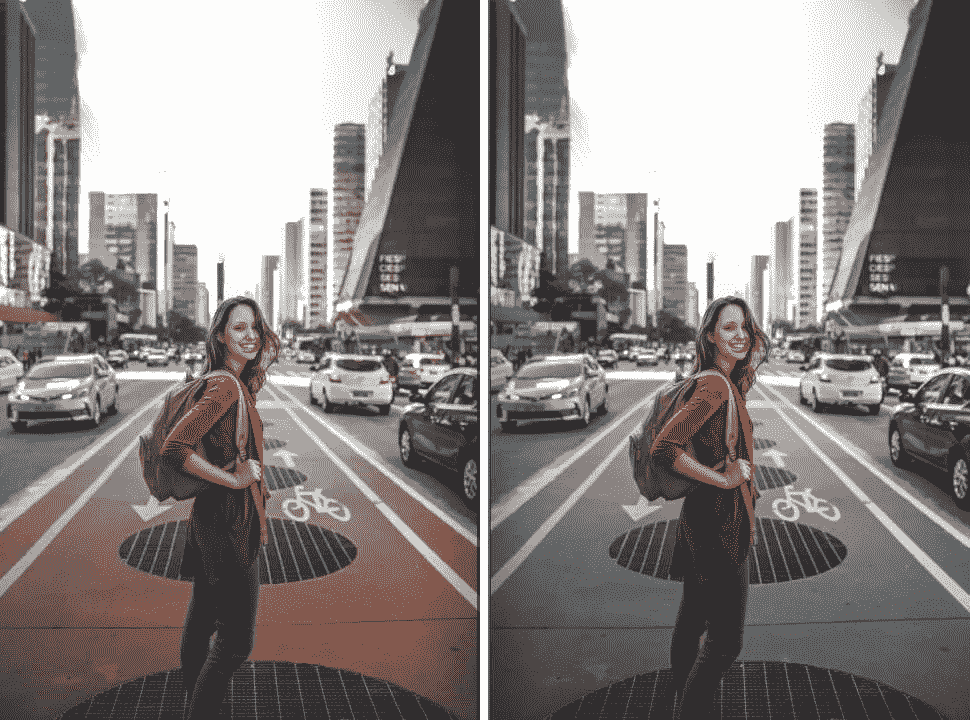
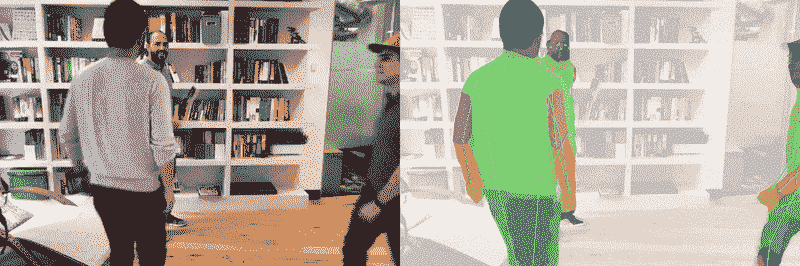
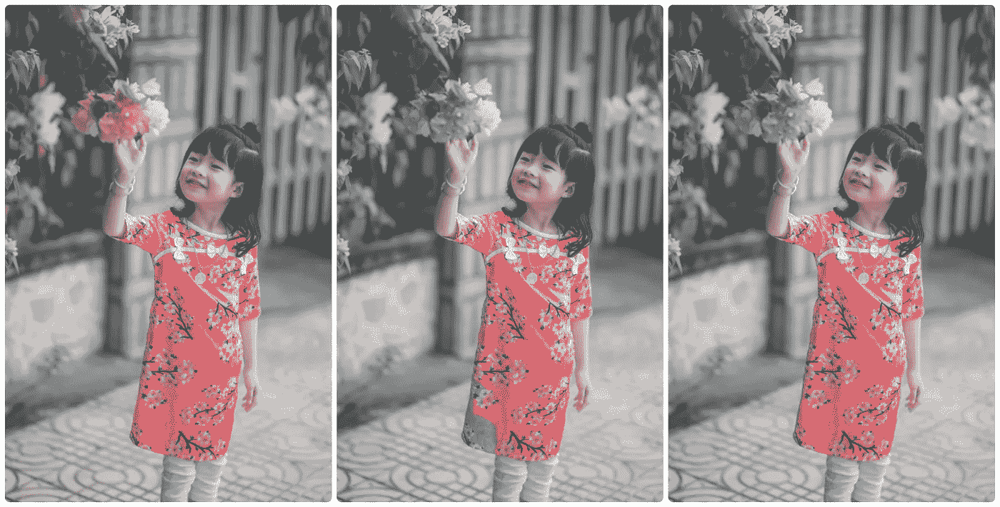
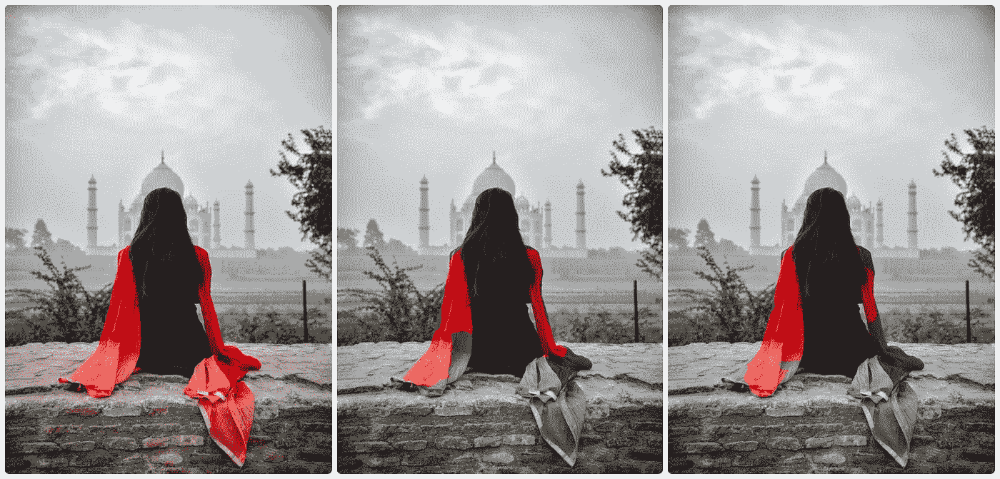

# 使用 BodyPix 和 TensorFlow.js 的颜色流行效果

> 原文：<https://towardsdatascience.com/color-pop-effect-using-bodypix-and-tensorflow-js-a584ddc48a02?source=collection_archive---------18----------------------->


在 [Unsplash](https://unsplash.com/photos/tBWmzPuQo3w) 上发现的女孩照片

O 谷歌照片应用程序中我最喜欢的小功能之一是它的**彩色流行**效果。颜色流行(也称为颜色飞溅)效果使主体(通常是人)从图像的其余部分中突出出来。主体保持彩色，但背景变成灰度。在大多数情况下，这给人一种愉快的感觉。



彩色流行效果示例。原稿左侧，彩色弹出右侧

虽然这项功能非常好用，但 Google 相册只将这种效果应用于一些它认为容易检测到人类的图像。这限制了它的潜力，并且不允许用户手动选择图像来应用这种效果。这让我思考，有没有什么方法可以达到类似于*的效果*，但是用*我选择的图片*？

大多数应用程序不提供自动化解决方案。它需要用户手动在他们的图像上绘制这种效果，这既耗时又容易出错。我们能做得更好吗？像 Google 相册这样的智能东西？是啊！😉

了解了如何手动实现这种效果，我发现以下两个主要步骤:

*   在图像中的人物周围创建一个遮罩(也称为分段)。
*   使用遮罩保留人物的颜色，同时使背景灰度化。

# 从图像中分割出人

这是这个过程中最重要的一步。一个好的结果很大程度上取决于分割掩模创建得有多好。这一步需要一些机器学习，因为它已经被证明在这些情况下工作良好。

从零开始建立和训练一个机器学习模型会花费太多时间(*不了解 ML 的人说*😛)，所以我搜索了一下有没有预先训练好的模型可以用。快速搜索将我带到了 [BodyPix](https://github.com/tensorflow/tfjs-models/tree/master/body-pix) ，这是一个 [Tensorflow.js](http://tensorflow.org/js/) 模型，用于人物分割和姿势检测。

[](https://github.com/tensorflow/tfjs-models/tree/master/body-pix) [## Tensorflow.js 的 BodyPix 模型

### 这个包包含一个名为 BodyPix 的独立模型，以及一些演示，用于运行实时人和身体…

github.com](https://github.com/tensorflow/tfjs-models/tree/master/body-pix) 

创作者提供的 BodyPix 现场演示。在这里尝试一下

正如你所看到的，它在检测图像中的一个人(包括多人)方面做得很好，并且在浏览器上运行相对较快。彩虹色的区域就是我们需要的**分割图**。🌈

让我们用 Tensorflow.js 和 BodyPix CDN 脚本建立一个基本的 HTML 文件。

```
<html>
  <head>
    <title>Color Pop using Tensorflow.js and BodyPix</title>
  </head>

<body>
  <!-- Canvas for input and output -->
  <canvas></canvas>

  <!-- Load TensorFlow.js -->
  <script src="https://cdn.jsdelivr.net/npm/@tensorflow/tfjs@1.2"></script>
  <!-- Load BodyPix -->
  <script src="https://cdn.jsdelivr.net/npm/@tensorflow-models/body-pix@2.0"></script>

  <!-- Color Pop code-->
  <script src="colorpop.js"></script>

</body>
</html>
```

## 在画布中载入图像

在分割之前，理解如何在 JavaScript 中**操作图像**的像素数据是很重要的。一个简单的方法是使用 HTML Canvas。Canvas 使得读取和操作图像的像素数据变得很容易。还兼容 BodyPix，双赢！

```
function loadImage(src) {
  const img = new Image();
  const canvas = document.querySelector('canvas');
  const ctx = canvas.getContext('2d');

  // Load the image on canvas
  img.addEventListener('load', () => {
    // Set canvas width, height same as image
    canvas.width = img.width;
    canvas.height = img.height;
    ctx.drawImage(img, 0, 0);

    // TODO: Implement pop()
    pop();
  });

  img.src = src;
}
```

## 正在加载 BodyPix 模型

BodyPix 的 README 很好地解释了如何使用该模型。加载模型的一个重要部分是您使用的`architecture`。ResNet 更准确，但速度较慢，而 MobileNet 不太准确，但速度较快。在构建和测试这个效果时，我将使用 MobileNet。稍后我将切换到 ResNet 并比较结果。
注意:最好加载一次模型，并多次重复使用它进行分段，因为每次加载模型时都必须下载架构。在下面的例子中，每次对图像应用颜色弹出效果时，都会加载模型(以保持主要功能清晰)。

```
async function pop() {
  // Loading the model
  const net = await bodyPix.load({
    architecture: 'MobileNetV1',
    outputStride: 16,
    multiplier: 0.75,
    quantBytes: 2
  });
}
```

## 执行分段👥

BodyPix 具有多种功能来分割图像。一些适合于身体部分分割，而另一些适合于单人/多人分割。所有这些都在他们的[自述文件](https://github.com/tensorflow/tfjs-models/tree/master/body-pix)中有详细解释。`segmentPerson()`将在这种情况下工作，因为它在一个单独的地图中为图像中的每个人创建一个分割地图。此外，它比其他方法相对更快。

`segmentPerson()`接受一个画布元素作为输入图像，以及一些配置设置。`internalResolution`设置指定分割前输入图像尺寸调整的因子。我将使用`full`进行设置，因为我想要清晰的分割图。我强烈建议你阅读一下其他的设置，并尝试一下。

```
async function pop() {
  // Loading the model
  const net = await bodyPix.load({
    architecture: 'MobileNetV1',
    outputStride: 16,
    multiplier: 0.75,
    quantBytes: 2
  });

  // Segmentation
  const canvas = document.querySelector('canvas');
  const { data:map } = await net.segmentPerson(canvas, {
    internalResolution: 'full',
  });
}
```

分割后的结果就是一个物体(如下图)。结果对象的主要部分是`data`，它是一个将分割图表示为一个数字数组的`Uint8Array`。我已经用 ES6 析构把`data`拿出来当`map`。这将用于应用颜色流行到图像！

```
{
  width: 640,
  height: 480,
  data: Uint8Array(307200) [0, 0, 0, 0, 0, 0, 0, 0, 1, 0, 1, 0, …],
  allPoses: [{"score": 0.4, "keypoints": […]}, …]
}
```

# 制作背景灰度

准备好分割数据后，下一部分涉及使用分割图实现颜色弹出，以使背景灰度化并保留图像中人物的颜色。为此，需要对图像进行像素级的操作，这也是 canvas 元素大放异彩的地方。`getImageData()`函数返回`ImageData`，其中包含 RGBA 格式的每个像素的颜色。在下面的代码中，我使用了析构来提取有用的`data`作为`imgData`

```
async function pop() {
  // ... previous code

  // Extracting image data
  const ctx = canvas.getContext('2d');
  const { data:imgData } = ctx.getImageData(0, 0, canvas.width, canvas.height);
}
```

## 应用效果

所有的材料都准备好了，这就是色彩流行魔法发生的地方！让我们从创建新的图像数据开始。`createImageData()`创建一个新的图像数据，我们对实际图像数据的所有修改都将存储在这里。

接下来，我们遍历地图中的像素，其中每个元素都是 1 或 0。

*   1 表示在该像素处检测到**人**。
*   0 表示**在该像素处没有检测到人**。

为了提高代码的可读性，我使用析构将颜色数据提取到`r` `g` `b` `a`变量中。然后使用 RGB 值，使用**亮度方法**计算适当的灰色。有各种方法来计算灰度值。[这篇文章](http://www.tannerhelland.com/3643/grayscale-image-algorithm-vb6/)有一个很好的列表，列出了其中的一些转换公式。

最后，基于分割图值(0 或 1 ),可以将灰度或实际的 RGBA 颜色分配给新的图像数据。请注意，RGB 中对应的灰色是通过为所有三个通道分配相同的灰度值来计算的。

处理完每个像素后，使用`putImageData()`功能在画布上绘制新的图像数据。

```
async function pop() {
  // ... previous code

  // Creating new image data
  const newImg = ctx.createImageData(canvas.width, canvas.height);
  const newImgData = newImg.data;

  // Apply the effect
  for(let i=0; i<map.length; i++) {
    // Extract data into r, g, b, a from imgData
    const [r, g, b, a] = [
      imgData[i*4],
      imgData[i*4+1],
      imgData[i*4+2],
      imgData[i*4+3]
    ];

    // Calculate the gray color
    const gray = ((0.3 * r) + (0.59 * g) + (0.11 * b));

    // Set new RGB color to gray if map value is not 1
    // for the current pixel in iteration
    [
      newImgData[i*4],
      newImgData[i*4+1],
      newImgData[i*4+2],
      newImgData[i*4+3]
    ] = !map[i] ? [gray, gray, gray, 255] : [r, g, b, a];
  }

  // Draw the new image back to canvas
  ctx.putImageData(newImg, 0, 0);
}
```

可以看到具有彩色 pop 效果的最终图像应用于原始图像。耶！🎉

# 探索其他架构和设置

我对 ResNet 和 MobileNet 架构进行了一些测试。在所有示例图像中，图像的一个维度(宽度或高度)的大小为 1080px。请注意，分割的内部分辨率被设置为`full`(分割期间图像不缩小)。

对于我的测试，我在加载 BodyPix 模型时使用了以下设置。

```
// MobileNet architecture
const net = await bodyPix.load({
  architecture: 'MobileNetV1',
  outputStride: 16,
  quantBytes: 4,
});

// ResNet architecture
const net = await bodyPix.load({
  architecture: 'ResNet50',
  outputStride: 16,
  quantBytes: 2,
});
```

## 测试 1 —单人

这里两个模特都发现了照片中的女孩。与 MobileNet 相比，ResNet 更好地分割了该图像。



从左至右:原始样本、MobileNet、ResNet

## 测试 2 —多人

这是一个有点棘手的问题，因为它有许多人在图像周围摆着不同的姿势和道具。ResNet 再次准确地分割了图像中的所有人。MobileNet 也很接近，但错过了一些边缘。
两者都错误地分割了坐垫的一部分。


从左至右:原始样本、MobileNet、ResNet

## 测试 3 —面朝后

另一个棘手的问题是，照片中的女孩面朝后。老实说，我期待着对图像中女孩的不准确检测，但 ResNet 和 MobileNet 在这方面都没有问题。由于 dupatta，两种架构中的分段都不准确。



从左至右:原始样本、MobileNet、ResNet

## 测试的结论是📋

从测试中可以明显看出，ResNet 比 MobileNet 执行更好的分段，但代价是更高的时间。两者都很好地检测了同一幅图像中的多人，但有时由于服装的原因无法准确分割。由于 BodyPix 打算在浏览器(或 Node.js) 中与 *Tensorflow.js 一起运行，所以当使用正确的设置时，它的执行速度令人印象深刻。*

这就是我如何能够创造受谷歌照片启发的彩色流行效果。总而言之，BodyPix 是一个很棒的人物细分模型。我很想在我未来的一些项目中使用这个和 Tensorflow.js。你可以在这里找到源代码和现场工作版本:[https://glitch.com/~color-pop-effect](https://glitch.com/~color-pop-effect)

我已经为这个颜色的流行效果创建了一个 Firebase 云函数。它在 Node 上使用 Tensorflow.js，这使得它比在用户的浏览器上运行要快得多。您可以检查[颜色弹出](https://github.com/blenderskool/color-pop)🌈在这里投影。我迫不及待地想看到你的❤️和对它的贡献！