# 使用克雷奥拉颜色为图像着色(Python)

> 原文：<https://towardsdatascience.com/coloring-an-image-using-crayola-colors-python-31ca1c7edb9d?source=collection_archive---------50----------------------->

## 我如何使用 cython 和 OpenCV 编写了一个 python 代码来将图像转换为好像它们是使用 Crayola 颜色着色的。

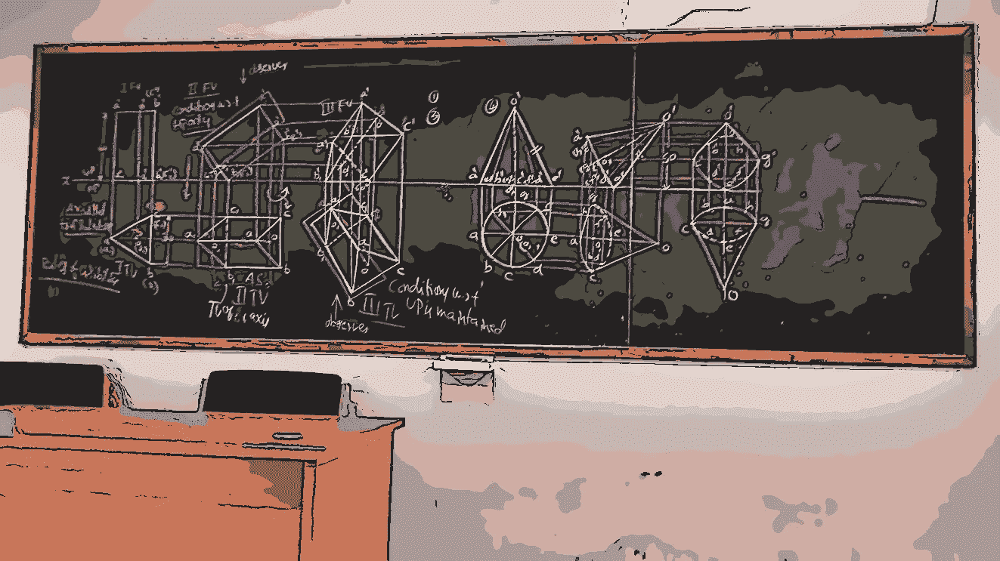

作者图片

创建一个颜色数组。首先，我为一个 120 色蜡笔[蜡笔盒](http://www.jennyscrayoncollection.com/2017/10/complete-list-of-current-crayola-crayon.html)选择相应的 RGB 值，并将它们复制到一个列表中。

```
colorsFile = open("colors.txt","r")
colors = []for line in colorsFile.readlines():
    colorset = line.strip().split(" ")
    rgbFormat = [int(x) for x in colorset[2].split(",")]
    colors.append(rgbFormat)
```

其次，我从挑选一张图片并把它调整到较小的尺寸开始。这主要是为了减少运行时间。此外，我注意到较小的图片似乎更好地带出预期的效果。

```
import cv2
import os
for imageFile in os.listdir("TestImages"):
    img_rgb = cv2.imread("TestImages/" + imageFile)
    img_rgb = cv2.resize(img_rgb, (0, 0), fx = 0.7, fy = 0.7)
```

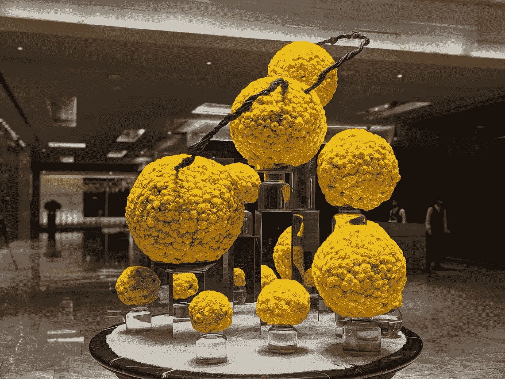

原始图像(作者)

接下来，我运行了一个[双边滤波器](https://www.geeksforgeeks.org/python-bilateral-filtering/)，它平滑了图像，但保留了边缘。边缘是很重要的，因为大多数蜡笔画都有强烈的、非常真实的、轮廓分明的边缘。OpenCV 中的双边滤镜由两个主要因素控制，sigmaColor(值越高，混合的远距离颜色越多)和 sigmaSpace(值越高，混合的远距离像素越多)。

```
#alpha = 6 Repeatedly running the filter with small values brought better results than a single run with a larger filter
for _ in range(alpha):
        img_rgb_smooth = cv2.bilateralFilter(img_rgb, d=9, sigmaColor=9, sigmaSpace=7)
```

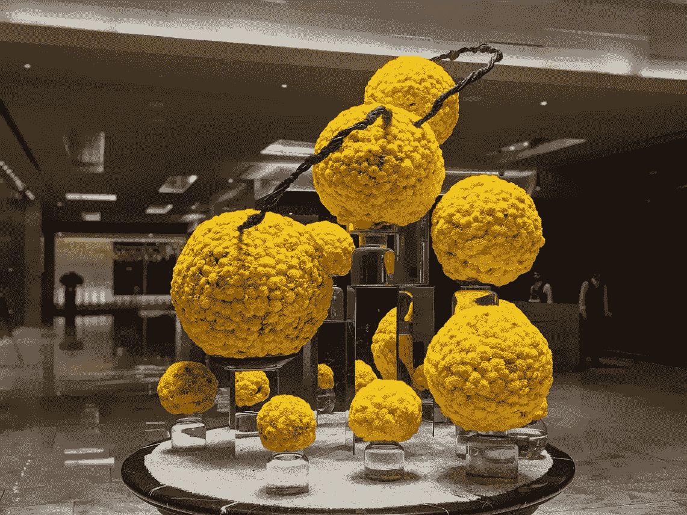

运行双边过滤器后

运行双边过滤器后，我识别了图像中的边缘。首先，我将图像转换成灰度。主要是因为我们将使用[自适应阈值](https://opencv-python-tutroals.readthedocs.io/en/latest/py_tutorials/py_imgproc/py_thresholding/py_thresholding.html)方法来识别边缘，这种方法只适用于灰度。我们基本上是在制作一个二进制图像，其中每个像素不是黑就是白。为创建这个二进制图像设置一个单一的阈值会遇到麻烦，比如图像上的光照不均匀。因此，最好是使用局部阈值，这将带来更好的结果。根据图像调整块大小会产生更好的结果。

```
img_gray = cv2.cvtColor(img_rgb, cv2.COLOR_RGB2GRAY)
img_edge = cv2.adaptiveThreshold(img_gray, 255,
    cv2.ADAPTIVE_THRESH_GAUSSIAN_C,
    cv2.THRESH_BINARY,
    blockSize=11,
    C=2)
```

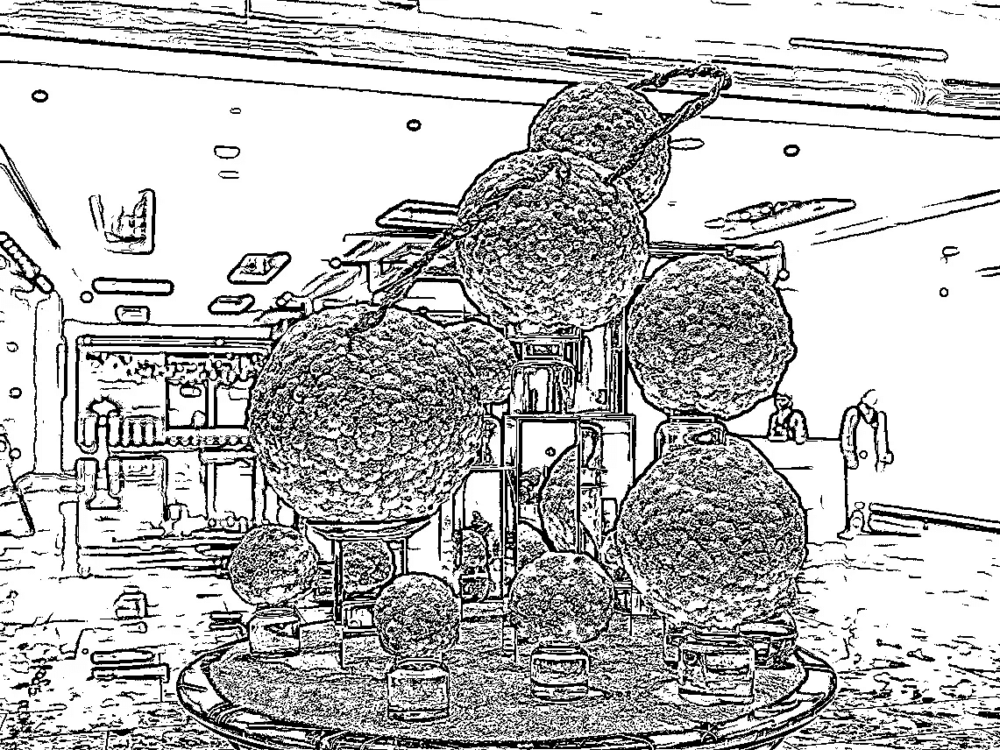

边缘提取

然后，我把固体边缘放回我们的图像上。我们可以使用逐位 and 算术运算符，对带有边缘的图像和 RGB 图像进行逐像素运算。

```
img_edge = cv2.cvtColor(img_edge, cv2.COLOR_GRAY2RGB)
img_rgb_edges = cv2.bitwise_and(img_rgb, img_edge)
```

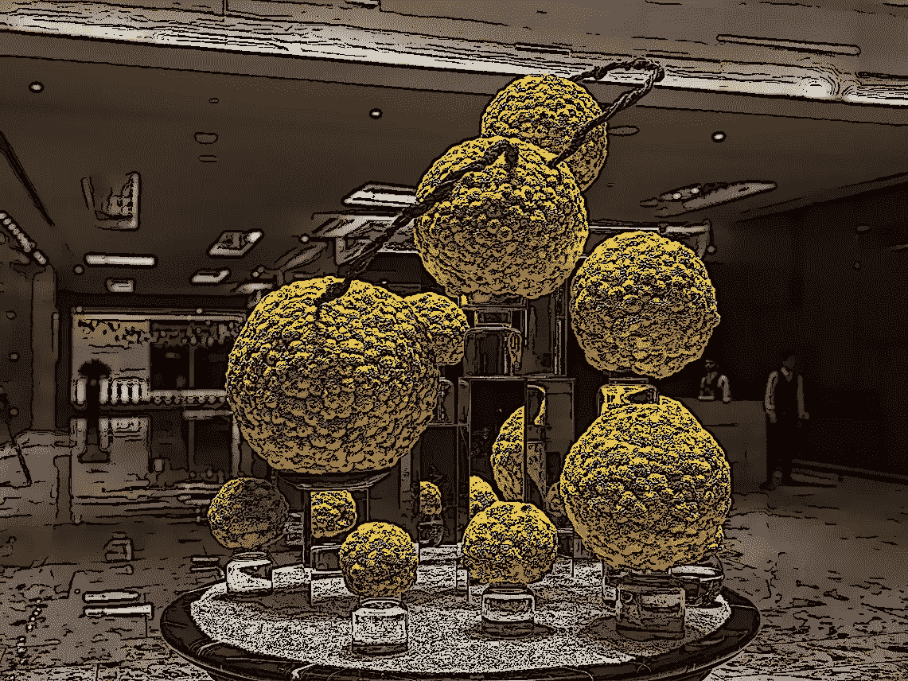

叠加边缘

然后我用调色板中最接近的颜色替换了每个像素的颜色。我花了很长时间才把它做好，这很容易成为本模块的核心步骤。我首先使用了当前颜色和调色板中每种颜色之间的纯欧几里德距离。输出不像我希望的那样真实。它通常会显示出与预期颜色的显著偏差。使用这里提供的[堆栈溢出解决方案缓解了这个问题](https://stackoverflow.com/questions/1847092/given-an-rgb-value-what-would-be-the-best-way-to-find-the-closest-match-in-the-d),它用我们感知颜色的灵敏度来增强公式。其他的[建议](https://en.wikipedia.org/wiki/Color_difference)是基于色调距离，然而，我觉得它并没有比欧几里得更好的表现。所以最初，我用 python 写了一个 for 循环来操作每个像素。

```
for x in range(0,width):
    for y in range(0,height):
        channels_xy = img_rgb_edges[y,x]
        colorSwapping(x,y,channels_xy)def colorSwapping(x,y,rgbArray):
    r1,g1,b1 = rgbArray
    shortestDistance = None
    sol = None
    for color,value in colors.items():
        r2,g2,b2 = value
        d = pow(((r2-r1)*0.30),2) + pow(((g2-g1)*0.59),2) + pow(((b2-b1)*0.11),2)
        if(shortestDistance == None or d < shortestDistance):
            shortestDistance = d
            sol = value
    img_rgb_edges[y,x] = sol
```

然而这真的很慢，然后我尝试使用线程。那也没多大帮助。Python 有一个叫做[的全局解释器锁](https://docs.python.org/3/c-api/init.html#thread-state-and-the-global-interpreter-lock)，它不允许在一个数组上并发运行。经过进一步的搜索，我发现 cython 可以帮助大大加快这个过程。在我的例子中，将像素操作逻辑转移到 cython 有助于将速度提高 20 倍。

```
import cythoncode
img_rgb_edges = cythoncode.coloringImage(img_rgb_edges, colors)
cv2.imwrite("Output/"+imageFile ,img_rgb_edges)
```

cython 功能，

```
#cythoncode.pyx
cpdef coloringImage(img,colors):
    cdef int height = img.shape[0]
    cdef int width = img.shape[1]
    for x in range(0,width):
        for y in range(0,height):
            pixelSwap(img,x,y, colors)
    return img

cpdef pixelSwap(img,x,y,colors):
    channels_xy = img[y,x]
    cdef int shortestDistance = -1
    sol = []
    cdef length = len(colors)
    for index in range(0,length):
        d = distanceCalculator(channels_xy,colors[index])
        if(shortestDistance == -1  or d < shortestDistance):
            shortestDistance = d
            sol = colors[index]
    img[y,x] = solcpdef int distanceCalculator(color1, color2):
    cdef int r2 = color1[0]
    cdef int g2 = color1[1]
    cdef int b2 = color1[2]
    cdef int r1 = color2[0]
    cdef int g1 = color2[1]
    cdef int b1 = color2[2]
    return int(((r2-r1)*0.30)**2 + ((g2-g1)*0.59)**2 + ((b2-b1)*0.11)**2)
```

Cython 就像 Python 的一个超集，具有来自 c 的函数。由于我对 cython 相对陌生，所以我只将简单的组件(如距离计算器)转移到 cython，这纯粹是计算。将 python 图像对象转换成数组可能有助于进一步提高速度。

Setup.py 构建模块，

```
from setuptools import setup
from Cython.Build import cythonize
setup(
    name='Cython Pixel Manipualtion Code',
    ext_modules=cythonize("cythoncode.pyx"),
    zip_safe=False,
)
```

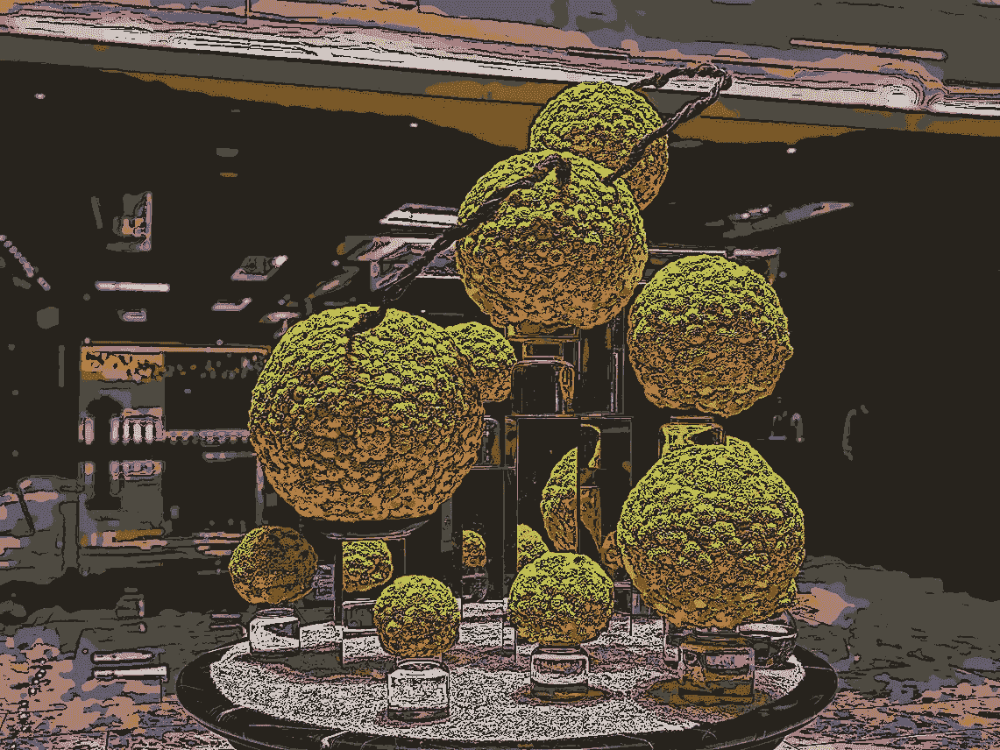

切换到最接近的克雷奥拉颜色

如你所见，最合适的颜色并不总是在图像中挑选。但是，仍然产生了相当好的卡通化效果。

这是我运行代码的更多图片，

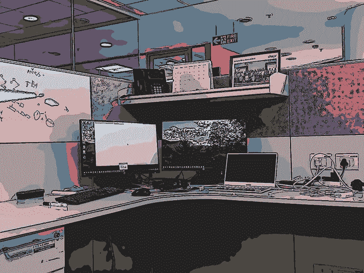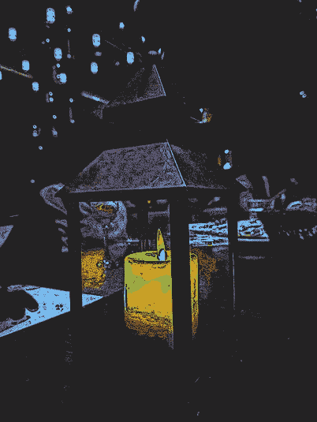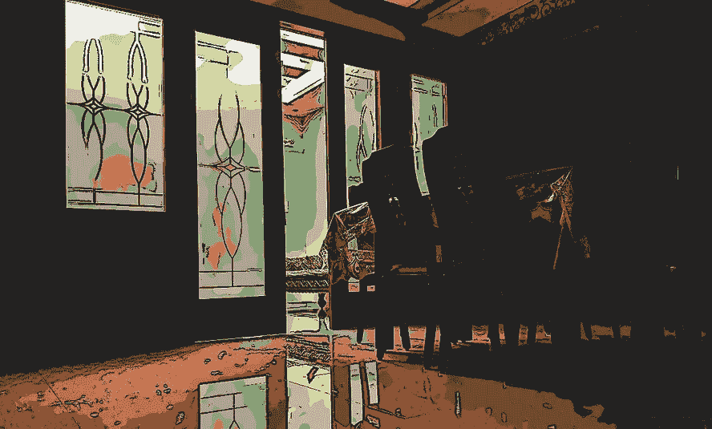

在 Pixel 3 上拍摄多张照片，然后使用代码进行转换

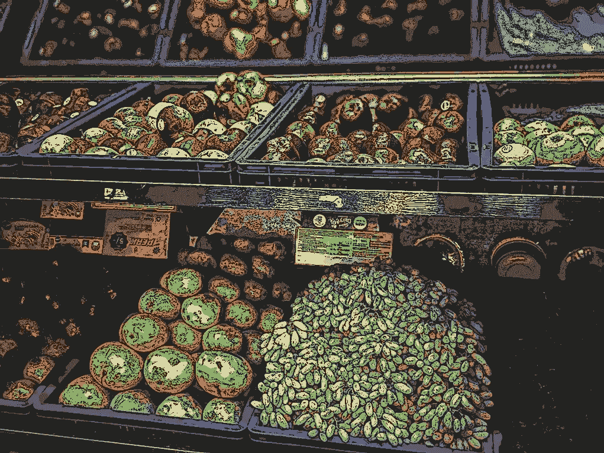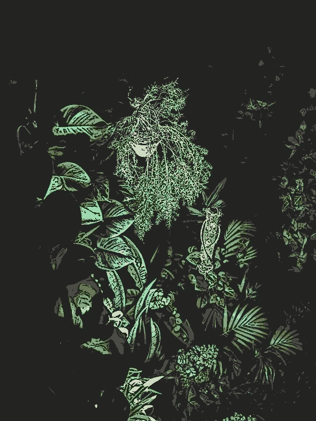