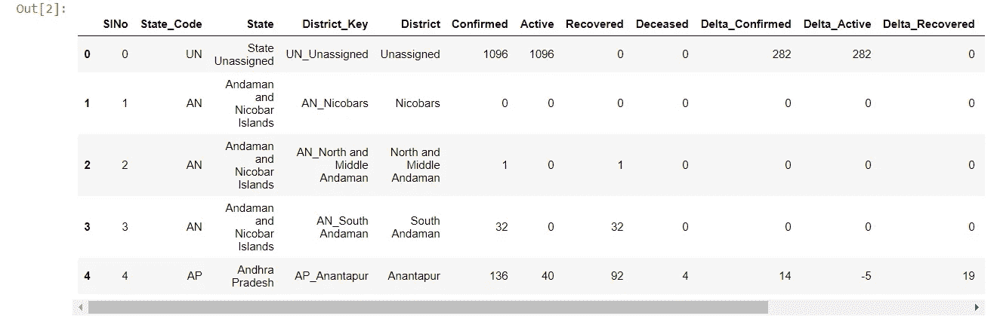
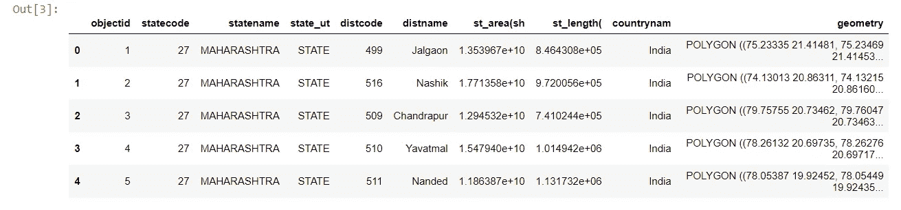
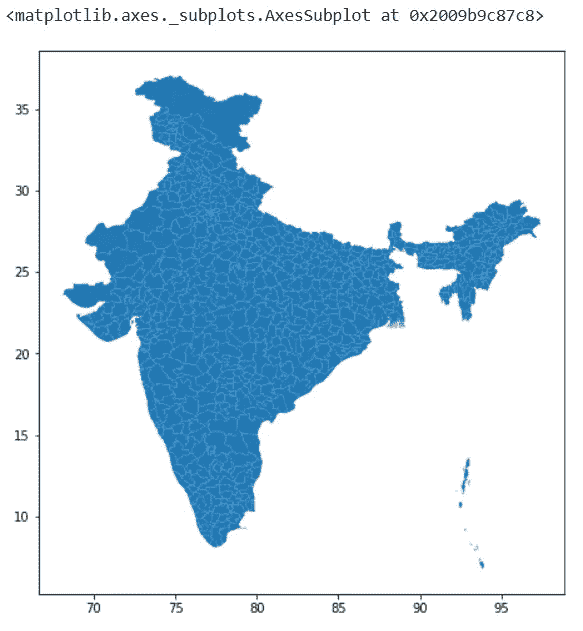
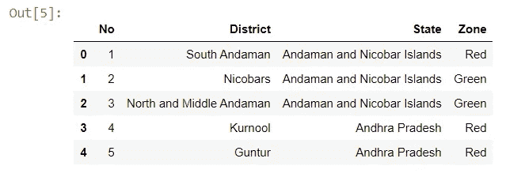
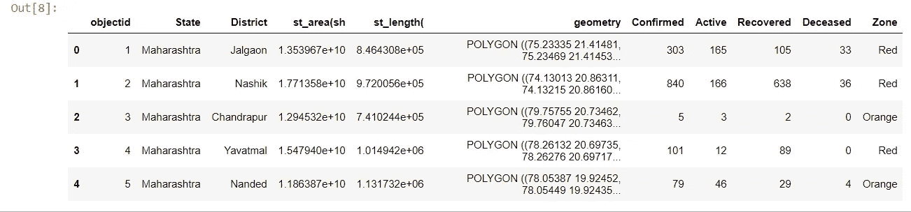
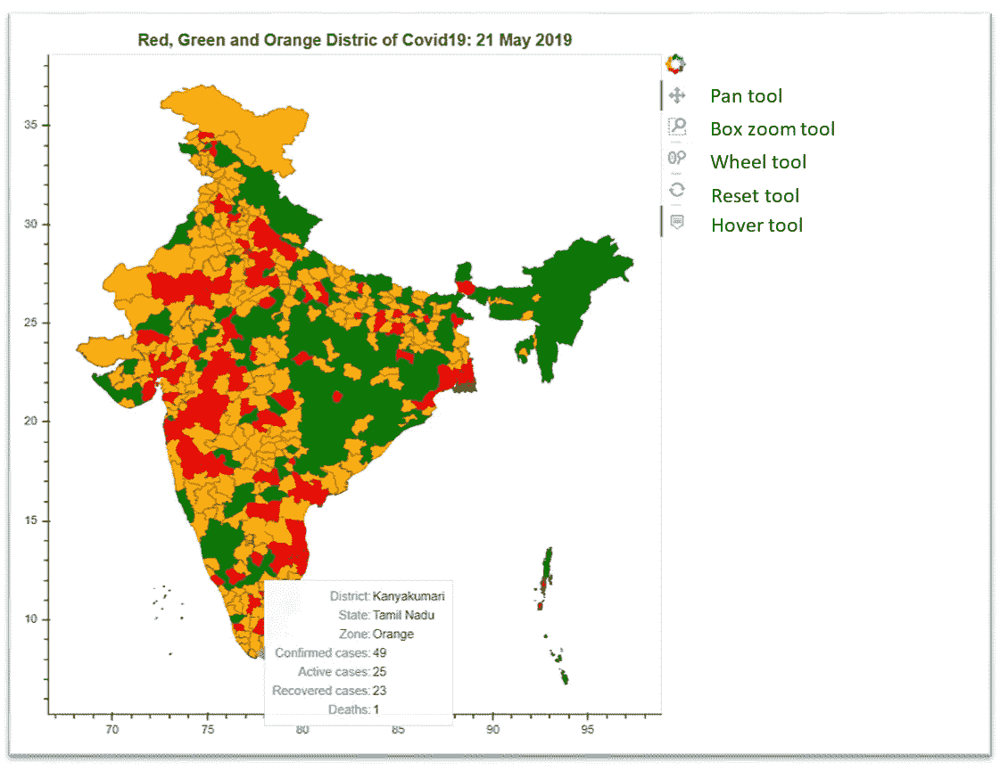

# 将印度染成红色、橙色和绿色:Covid19 Chloropleth 地图

> 原文：<https://towardsdatascience.com/coloring-india-red-orange-and-green-covid19-choropleth-map-fc21a00f005f?source=collection_archive---------33----------------------->

## 基于 Bokeh 的绘图/地图，显示印度不同地区的新型冠状病毒的实时数据和爆发严重程度


从 Freepik 创建的图像，请参见最后的致谢

***注*** *:* [*走向数据科学*](http://towardsdatascience.com/) *是以数据科学和机器学习研究为主的中型刊物。我们不是健康专家或流行病学家，本文的观点不应被解释为专业建议。想了解更多关于疫情冠状病毒的信息，可以点击* [*这里*](https://www.who.int/emergencies/diseases/novel-coronavirus-2019/situation-reports) *。*

新冠肺炎或新型冠状病毒已使世界各国政府强制全国封锁，以对抗这种致命的病毒。这种病毒现在已经感染了全球 400 多万人，并导致 30 万人死亡。

印度在 5 月 4 日实施了为期两周的第三次封锁，可能正在计划第四次封锁。一些人认为这是世界上最大的封锁，有近 13 亿人被困在家中。印度开始根据疾病传播的严重程度，将 733 个地区用颜色划分为红色、橙色和绿色区域。

*红色*:案件量最高的区，占各州案件量的 80%以上，或者加倍率少于 4 天的区。

绿色:一个超过 28 天没有报告任何病例的地区。

橙色:既不属于红色也不属于绿色的地区

政府试图利用国家的联邦结构来绘制和隔离疫情，建立限制级别，有效地分配资源，并追究责任。

在[经济时报](https://economictimes.indiatimes.com/news/politics-and-nation/colour-coding-of-districts-in-battle-against-covid-19/articleshow/75416339.cms)和[今日印度](https://www.indiatoday.in/india/story/red-orange-green-zones-full-current-update-list-districts-states-india-coronavirus-1673358-2020-05-01)阅读更多内容

作为一个呆在禁闭室内的极客，我试图用 Python 来绘制这些区域，这篇博客就是关于这个的。

目标:这个博客展示了为印度各区创建一个 choropleth 地图的步骤，并用它们的颜色标记出来。该地图是一种交互式绘图，它还显示每个地区受 Covid19 影响的人数。

代码已经内置在 Jupyter 笔记本中，可以在我的 Github repo 上找到:[[https://github.com/yatharthaggarwal/CovidIndia](https://github.com/yatharthaggarwal/CovidIndia)]。我一直在为基于 Python 的项目使用 [Anaconda](https://www.anaconda.com/products/individual) 工具包，并向其他人推荐同样的工具包。

**套餐**:

1.  [**geo pandas**](https://geopandas.org/)**:**是一个帮助用户处理地理空间数据的开源包。我们将关注的一个依赖项是 *shapely* ，GeoPandas 依赖于它来执行几何运算。在我们的例子中，印度每个地区的形状将通过 shapely 包编码为多边形或多多边形。然后通过 GeoPandas 来理解地理空间数据。
2.  [**散景**](https://docs.bokeh.org/en/latest/) **:** 它可以让我们创作出更复杂的剧情。Bokeh 是一个多功能的开源软件包，旨在帮助用户创建漂亮的交互式可视化效果。

**导入数据集**

**1。新冠肺炎患者数据**

首先，我们需要在地区级别加载 COVID 19 数据。印度政府/邦政府没有按地区提供数据。因此，我们需要依靠基于众包的门户网站，比如 https://www.covid19india.org/。

甚至他们提供的数据也有很大一部分是不正确的。他们在“未知”部分推送了大量数据。但是，我们将选择提到地区的行。下图是加载数据集的代码片段，我们感兴趣的是已确认、活动、已恢复和已死亡的列。确诊病例是另外三个的总和。

```
districtdata = pd.read_csv ('[https://api.covid19india.org/csv/latest/district_wise.csv'](https://api.covid19india.org/csv/latest/district_wise.csv'))
districtdata.head()
```



**2。印度地区形状文件**

为了创建一个地图，你需要一个形状文件。shp)。该文件告诉 Geopandas 我们正在绘制什么形状。在我们的例子中，我们需要一个概述每个地区的文件。我们使用一个 geometry 列，以便 Geopandas 包知道在哪里寻找每个州的形状信息。

一个优秀的更新 shapefile 可以在这里找到:[https://hub . ArcGIS . com/datasets/esriindia 1::India-districts-boundary](https://hub.arcgis.com/datasets/esriindia1::india-districts-boundary)。人们可以从这里下载并使用它。虽然有很多拼写错误，我已经在数据清理部分纠正了。请参见下面的代码片段:

```
df1 = gpd.read_file('India_Districts/c44c9b96-f570-4ee3-97f1-ebad64efa4c2202044-1-1rb4x6s.8xx6.shp')
df1.head()
```



我们可以利用绘图功能来查看 shapefile 中的内容。如果有人能找到任何官方文件，请做评论。这张地图不包含 2020 年的行政区，但出来的地图很漂亮。

```
# showing the India map based on the shapefile... See the districts boundary
df1.plot(figsize = (8,8))
```



shapefile 中的印度地区地图

**3。逐区分区数据**

该数据已由卫生和家庭福利部公布。我已经直接从 https://www.kaggle.com/xordux/india-corona-severity-zones[下载到工作目录下了。请参见下面的代码片段:](https://www.kaggle.com/xordux/india-corona-severity-zones)

```
zones = pd.read_csv('Zones in india.csv')
zones.head()
```



**数据清理**

数据清理部分是任何基于数据的项目非常必要的一部分，因为它提供了纠正/删除数据值、处理 NaN 值和格式化整个数据集的方法。我没有把代码片段放在这里，因为它只是纠正了大量的拼写错误。直接检查存储库中的代码部分，这里再次链接了。

**数据预处理**

用上面显示的所有数据创建一个公共数据框架。
在 df1 (shapefile)中，我们根据地区和州合并了 Covid19 患者的数据，然后类似地合并了 Zones 数据帧。一些不必要的栏目也被删除。在印度，不同的邦经常保留一个相似的区名，因此在' *merge'* 函数中我们需要同时检查[ *District '，' States']。*参见代码片段，其中包括几何图形、区域和患者数据以及区名和州名:

```
newdf = df1.merge(districtdata[['State', 'District', 'Confirmed', 'Active', 'Recovered', 'Deceased']], on = ['District', 'State'])newdf = newdf.merge(zones[['State', 'District', 'Zone']], on = ['District', 'State'])newdf = newdf.drop(columns = ['statecode', 'state_ut', 'distcode', 'countrynam'])
newdf.head()
```



现在，数据已经转换为适当的格式，我们可以按照以下步骤绘制地区的 choropleth 地图:

1.  创建体形对象
2.  将面片渲染器添加到图形中
3.  创建显示患者数据的悬停工具
4.  展示图

**导入散景库并创建数据类型格式**

```
import json
from bokeh.io import show
from bokeh.io import output_file, save
from bokeh.models import (CDSView, ColorBar, ColumnDataSource,
                          CustomJS, CustomJSFilter, 
                          GeoJSONDataSource, HoverTool,
                          CategoricalColorMapper, Slider)
from bokeh.layouts import column, row, widgetbox
from bokeh.io import output_notebook
from bokeh.plotting import figure
```

散景使用 GeoJSON 格式，用 JSON 表示地理要素。GeoJSON 将点、线和多边形(在散景中称为面片)描述为要素的集合。因此，我们将合并后的文件转换为 GeoJSON 格式。

此外，还创建了一个分类颜色映射器，用于将红色区域映射为红色，绿色和橙色区域也是如此。

a)用我们的初始数据创建 GeoJSONDataSource 对象

```
geosource = GeoJSONDataSource(geojson = newdf.to_json())
```

b)定义要使用的调色板并映射到区域的分类值

```
palette = ['red', 'orange', 'green']
color_mapper = CategoricalColorMapper(palette = palette, factors = ['Red', 'Orange', 'Green'])
```

**Choropleth 地图**

以下代码创建 figure 对象(包括缩放和平移工具)，添加渲染的修补程序(包括带列区域的 geosource 和 mapping 颜色映射器)，并创建悬停工具以显示特定地区的已确认、活动、已恢复和已死亡病例。

最后，以“HTML”格式保存绘图。现在经过上述步骤:

1.  在创建一个*人物*对象时，我们可以为情节设置标题、高度、宽度和交互工具。

```
p = figure(title = 'Red, Green and Orange Distric of Covid19: 19 May 2019',
           plot_height = 700 ,
           plot_width = 650, 
           toolbar_location = 'right',
           tools = "pan, wheel_zoom, box_zoom, reset")
```

2.补丁渲染器是我们输入数据源和颜色映射器的主要地方。

```
states = p.patches('xs','ys', source = geosource,
                   fill_color = {'field' :'Zone',
                                 'transform' : color_mapper},
                   line_color = 'black',
                   line_width = 0.25, 
                   fill_alpha = 1)
```

3.悬停工具允许我们将想要显示的数据放入绘图中。

```
p.add_tools(HoverTool(renderers = [states],
                      tooltips = [('District','[@District](http://twitter.com/District)'),
                                  ('State','[@State](http://twitter.com/State)'),
                                  ('Zone','[@Zone](http://twitter.com/Zone)'),
                                  ('Confirmed cases','[@Confirmed](http://twitter.com/Confirmed)'),
                                  ('Active cases','[@Active](http://twitter.com/Active)'),
                                  ('Recovered cases','[@Recovered](http://twitter.com/Recovered)'),
                                  ('Deaths','[@Deceased](http://twitter.com/Deceased)')
                                 ]))
```

4.最后是 HTML 格式的情节。这是一个巨大的 150 兆字节。我需要看看我如何能减少尺寸。保存功能将它保存在当前目录中。

```
output_file('plot.html', mode='inline')
save(p)
show(p, notebook_handle = True)
```



显示印度所有地区的 Choropleth 地图，工具位于右侧

恭喜你。！我们已经成功地创建了我们的 Choropleth 地图。人们可以在任何浏览器中简单地打开 plot.html 文件来查看其内容。或者只执行下面的命令，在新的选项卡中查看图形。

我制作了一个展示互动地图的小视频。

https://www.youtube.com/watch?v=JuF4cNeWKzc

Choropleth 地图工作

在这里可以直接看到代码。

如果你对我们如何进一步增强情节或代码有任何意见或建议，我很乐意听到！

跟我连线:[noobdatascientist@gmail.com](http://noobdatascientist@gmail.com)

感谢阅读！

*第一张图片(也充当缩略图)是使用 Freepik 的:* [*印度地图*](https://www.freepik.com/free-vector/india-state-map-outline_558652.htm#page=1&query=india%20map&position=31) *，* [*日冕感染*](https://www.freepik.com/free-photo/coronavirus-infection-with-copy-space_7248142.htm#page=1&query=corona&position=25)