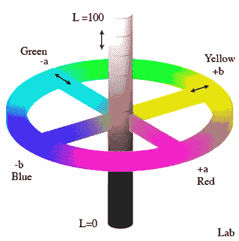
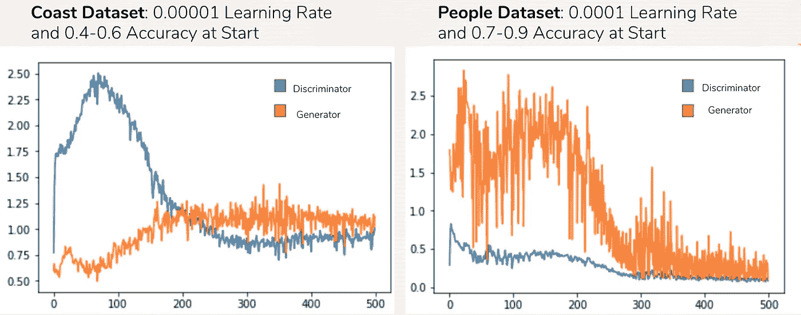
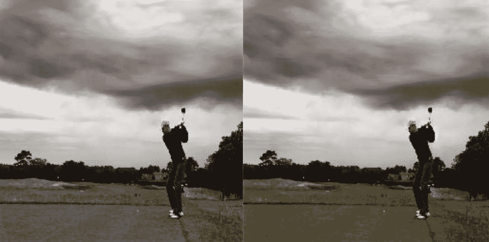
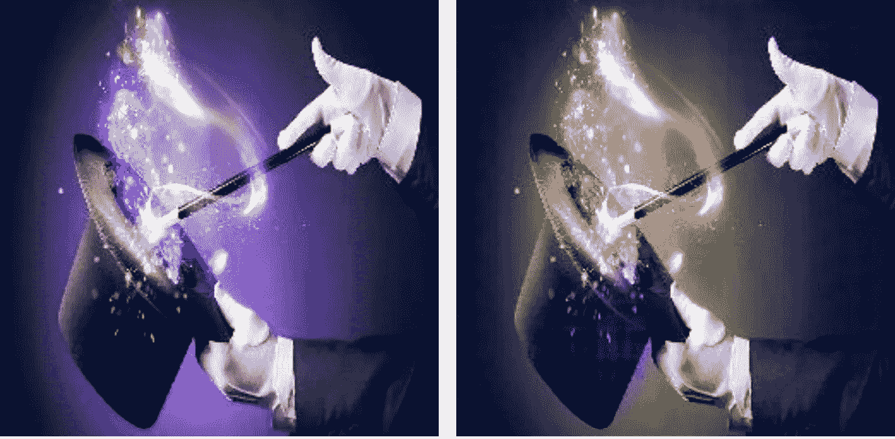

# 用生成对立网络给照片着色

> 原文：<https://towardsdatascience.com/coloring-photos-with-a-generative-adversarial-network-a435c4403b5d?source=collection_archive---------22----------------------->

## 用深度学习把黑白照片带到现在。

自从我开始学习数据科学和机器学习以来，一直有一种算法不断吸引我的注意力:生成敌对网络(GANs)。以至于我写的第二篇博客详细介绍了这些模型是如何工作的以及它们能创造什么。当我第一次了解它们时，大多数文章(包括我自己的)只报道了它们如何能够接受随机噪声向量并产生逼真的照片。

在我写完那篇博客文章后不久，我偶然发现了[周而复始的](https://arxiv.org/abs/1703.10593)(朱等)，它允许图像到图像的翻译。这意味着我们能够传入一个图像作为输入，并接收一个修改过的副本作为输出。这包括绘制梵高等艺术家的风格，将照片从夏天变成冬天，或将斑马变成马。

来源:[朱俊彦](https://junyanz.github.io/CycleGAN/)

在我写了前面提到的博文之后，我觉得我对 GANs、它们的工作方式以及它们的变体已经足够满意了，于是我决定创建自己的 GANs。然而，有这么多的应用程序可供选择，我很难决定我想创造什么。一天晚上，当我还在考虑不同的选择时，我看了[彼得·杰克逊的*他们不会变老*](https://www.imdb.com/title/tt7905466/) ，这是一部通过图像重建和重新着色创作的一战纪录片。这一点，结合我对迁移学习的了解，启发我创建了一个可以将黑白照片转换为彩色的模型。

(对于那些不熟悉生成性敌对网络的人，我建议在继续之前阅读我的第一篇博客

# 创建 GAN 的步骤:

1.  检索数据
2.  预处理图像
3.  创造建筑
4.  训练、监控和调整参数

# 获取数据:

在我开始编码或规划我的模型架构之前，我需要找到一个数据集来使用。我了解到，当谈到图像翻译时，GANs 在理解照片的纹理和对称性方面比他们在识别复杂的几何图形方面更有效率。这意味着，举例来说，他们能够比一个人或一只狗更容易地创作风景照片。这促使我收集了 2 个不同的数据集:

*   麻省理工学院计算视觉库数据集:只使用了海岸照片，因为它们包含简单的风景。
*   **MPII 人体姿态数据集:**进行各种活动的人的图像。

我第一次尝试从麻省理工学院的数据集开始，因为这些图像更容易建模，这使我可以专注于创建我的第一个架构和所有必要的预处理，然后再处理更大的 MPII 数据集。一旦我获得了所有的数据，我终于可以开始编码了。

下面是 [Github](https://github.com/jmt0221/ColorGan) 供参考。

# **图像预处理:**

由于 gan 的计算量非常大，因此限制图像的大小非常重要；我选择了 256x256 的图片尺寸。麻省理工学院的海岸照片已经是这个尺寸了，所以不需要对数据集中的照片做任何处理。另一方面，MPII 数据集图像的大小不一，大于 256x256，因此需要调整大小，这可以使用 Numpy 轻松完成。

我的第一个想法是将每张图像简单地转换为灰度，并将其传递到生成器中，使用标准 RGB(红绿蓝)颜色通道(其正常值为 0-255)创建全彩色图像。我很快意识到这种方法非常低效，为了转换我的图像，我需要使用一些不同的方法，而不是一个简单的解决方案。

资料来源:Photoscreenprint.com

在我的研究过程中，我仔细检查了研究人员试图给黑白照片上色的例子，并注意到其中的一种模式；许多人将图像从 RGB 颜色值转换为 LAB 颜色值。与 RGB 不同，RGB 合并红色、蓝色和绿色值来创建彩色图像，LAB 由一个光敏通道和两个颜色通道组成。L 通道包含照片的感光度信息，相当于黑白版本。A 和 B 是颜色通道，其中 A 控制绿-红权衡，B 控制蓝-黄权衡。Python 的 Scikit-Image 库提供了一个很好的方法，允许我们轻松地将 RGB 照片转换到实验室。

我最初的方法是尝试创建所有三个颜色通道，现在我决定将 L 通道作为输入通过生成器，并输出新的 A 和 B 颜色通道。最后，一旦我将图像转换到 LAB，我需要进行归一化，因为它们的像素值对于我的模型来说是一个非常低效的范围。我决定将像素值从-1 缩放到 1，这样我可以很容易地用 tanh 激活来复制它。

# 创建架构:

为了创建模型，我使用了 Keras，这是 Python 的深度学习库。首先，我分别创建了生成器和鉴别器；然后我把两者连接起来，这样生成器就可以根据它欺骗另一个模型的程度来学习。

## **发电机**

资料来源:i2tutorials.com

发生器可以分为两部分:编码器**和 T2 解码器**。原始图像，在我的情况下是 L 通道，通过卷积层缩小，直到达到所需的特征图大小。再次放大图像之前的这组特征图被称为图像的潜在空间表示。从这里，我执行所谓的转置卷积或反卷积，这允许我对我的图像大小进行上采样；这里的[动画](https://github.com/vdumoulin/conv_arithmetic/blob/master/README.md)链接展示了一个很好的例子，展示了这是如何工作的。我重复这个过程，直到我回到原来的大小，然后输出新的图像，A 和 B 通道。

我的生成器的**编码器**由四个卷积层组成，步长为 2，这样我可以缩小图像。我从 64 个特征地图开始，并将每一层的地图数量增加一倍，以便在我到达潜在空间表示(即网络的中间)时，我最多有 512 个地图，每个地图的大小为 16x16。然后，每层的输出经过批量标准化，最后是泄漏 ReLU 激活。**解码器**几乎是一个反向拷贝，因为它有四个去卷积层，其输出经过批量归一化和 ReLU 激活。最后一层是具有两个输出通道(A 和 B 颜色通道)的单步卷积，具有 tanh 激活，以匹配我们之前在预处理图像时设置的-1 到 1 比例。

## 鉴别器

鉴别器是一个比其对应的生成器简单得多的模型，因为它是一个标准的卷积神经网络(CNN)，用于预测 AB 通道是真是假。它有四个 2 步卷积层，每一层都包括丢失、泄漏 relu 激活，以及除第一层之外的批量归一化。像其他 CNN 一样，我把最后一层弄平，然后通过一个 s 形管来预测图像是真是假。

## 初始化模型

两个模型都将使用二进制交叉熵作为损失函数和 Adam 优化器。与我读到的一切相反，我需要对发电机使用更高的学习率，以防止它被压制。首先，初始化鉴频器，然后我创建并链接发电机的损耗到鉴频器的输出。

# 训练、监控和调整参数:

在完成了上面解释的过程之后，我准备好训练模型了，或者说我是这样认为的。当我在笔记本电脑上运行这个模型时，我收到了“内核死亡”的消息。对我的笔记本电脑来说，内存和计算需求太大了。在 CPU 上训练一个 GAN 也可能需要几天时间，这让我明白了两件事:我需要一台强大的计算机/实例和一个 GPU。为此，我去 AWS SageMaker 租了一个 GPU 实例，它为我提供了足够多的功能。

我做的最后一个调整是将我的历元大小限制为只有 320 个，而不是训练几百个历元，而是训练几千个。我用半个时期的真实图像和半个时期的虚假图像来训练鉴别器。最后，生成器生成一个完整时期的图像，并将其传递给鉴别器，如果图像被标记为假的，则生成器会受到惩罚。GANs 很难训练，因为与大多数其他深度学习算法不同，它不会最小化或最大化任何损失函数。相反，我寻找一个平衡点，或者说鞍点，在这个点上，两个网络保持竞争，并继续相互依赖。从下面的损失图可以看出，这是一个非常零星的训练周期。

可能需要多次尝试才能使模型稳定，但一旦你这样做了，耐心是很重要的，因为在 GPU 实例中可能需要 6-12 个小时来训练模型。帮助我控制长时间训练和模糊指标的两件事是经常打印图像和以一半的频率保存模型。为了查看照片，只需按比例缩小到原始像素值并转换为 RGB。

# 结果

左:原始|右:重新着色

左:原始|右:重新着色

正如你从上面的图片中看到的，模型有时会偏向某些颜色，特别是最后一张图片，倾向于绿色和红色以及一些渗色。

# 后续步骤

这个项目肯定仍在进行中，我的下一步是建立一个自我关注层，以帮助模型更好地理解照片中的几何图形。一旦我建立了新的模型，我的目标是在 Imagenet 数据集上训练它，这样它就可以推广到更多的照片，并创建一个 web 应用程序，允许任何人立即给他们的照片着色。