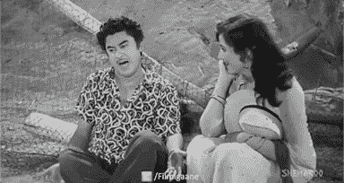
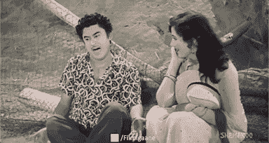
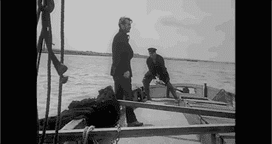
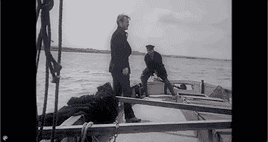
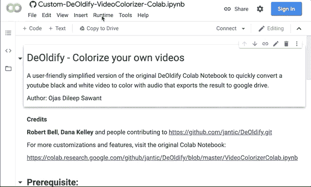
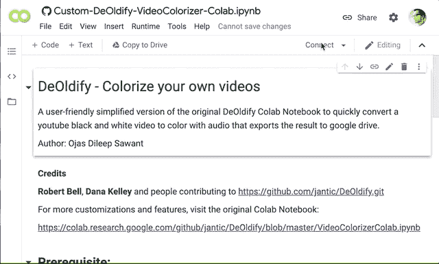
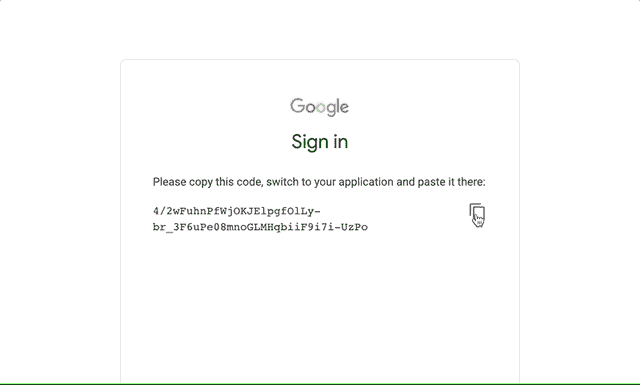

# 用深度学习给视频上色

> 原文：<https://towardsdatascience.com/colorize-a-video-with-deep-learning-15b30da3b57c?source=collection_archive---------8----------------------->

## 零本地设置/解密/ Colab 笔记本

## 一个用户友好的版本，可以将黑白视频转换成彩色视频，并免费自动导出到 Google Drive。

“Haal Hai Jana ab Ka”宝莱坞歌曲— 1958 年和“美丽的黑白好莱坞电影镜头集”

按照我的目标**轻松做事**，我想尝试[去锁定](https://github.com/jantic/DeOldify)一遍又一遍地将 B & W 视频内容转换成音频，而不必因为 [Google Colab](https://colab.research.google.com/notebooks/intro.ipynb#recent=true) 上的免费资源会话超时而改变代码或丢失进度。

以下是步骤——大约 10 次点击，让你做到这一点！请记住，我只测试了免费硬件资源的短视频(5 分钟)。

打开存储库中的 Colab 笔记本链接。这篇文章也可能让你熟悉 Colab 的力量，为你下一篇激动人心的人工智能论文做准备。

> [https://colab . research . Google . com/github/ojjsaw/video-processing/blob/master/Custom _ deol dify _ video colorizer _ colab . ipynb](https://colab.research.google.com/github/ojjsaw/video-processing/blob/master/Custom_DeOldify_VideoColorizer_Colab.ipynb)

首先，确保通过登录分配一个空闲的 GPU 资源。点击**运行时**菜单上方的> **改变运行时类型**>**GPU**>**保存**然后点击右上方的**连接**。

第一步

登录后，再次点击**连接**，然后**将网址**更新为你从 YouTube 视频的分享图标上获得的视频链接。默认网址是卢米埃尔兄弟的电影 101 历史 1895 中标志性的“火车到达”片段。

您可以选择修改默认的 google drive 导出目录路径。

点击左边的**运行图标**！每次打开这个页面(*会话*)，都会要求你授权 google drive 挂载到你当前的会话。

第二步

**复制粘贴**授权码，点击**进入**。点击 **Setup t** ext 部分将其聚焦，并点击页面顶部 **Runtime** **菜单**中的 **Run After** 选项。

第三步

> 坐着别动，去喝杯咖啡！只要确保你的机器正在运行，浏览器保持活跃。

处理需要**一段时间，但是成功转换后，**源**和**结果**视频将会上传到您选择的路径下的 google drive。**

同样，以上是最简单的转换方法，不需要花里胡哨。更多定制，请看一下[原装笔记本](https://colab.research.google.com/github/jantic/DeOldify/blob/master/VideoColorizerColab.ipynb)。

> 在未来的帖子中，我们将尝试*增加视频的每秒帧数*以获得更平滑的剪辑，甚至可能*将视频*升级到更高的分辨率，以满足当代显示设备的要求。

如果你想尝试更多从头到尾的快速 AI 实验，请访问我的上一篇帖子: [*训练神经网络对图像进行分类&在 10 分钟内优化 CPU 推理*](/train-a-neural-network-to-classify-images-and-openvino-cpu-inferencing-in-10mins-22ec868b4d1b)