# 人工智能给黑白照片上色。

> 原文：<https://towardsdatascience.com/colorize-black-and-white-photos-by-ai-cc607e164160?source=collection_archive---------31----------------------->

## 利用 Fastai 的生成性对抗网络(GAN)使黑白照片变得丰富多彩

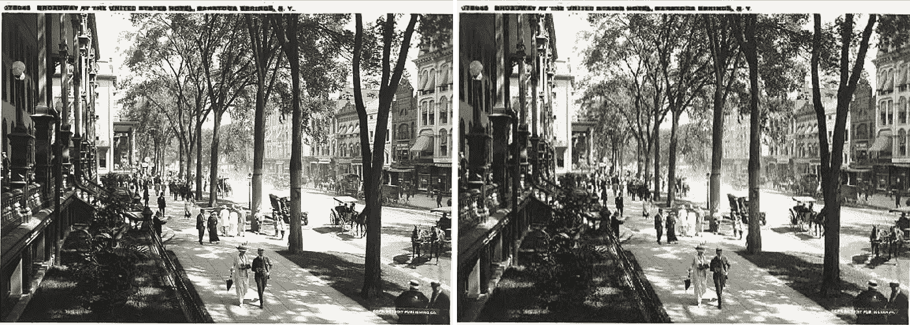

(左)百老汇在纽约州萨拉托加温泉市的美国酒店([https://www.loc.gov/pictures/item/2016818127/](https://www.loc.gov/pictures/item/2016818127/))(右)彩色照片

# 介绍

当我看到历史黑白照片时，我总是想知道真实的颜色是什么，摄影师在拍照时看到了什么。

发现 B&W 照片的确切颜色并不容易，但根据经验和想象给照片上色是可能的。这可以通过调查照片中物体的可能颜色来实现，例如，衣服、建筑物、树木、汽车等的颜色。，并用 Photoshop 等软件手工上色。

另一种方法是通过提供大量彩色照片来训练计算机理解不同物体的颜色，然后要求计算机通过识别检测到的物体的似乎合理的颜色来着色。由于深度学习的发展，它可以通过使用生成对抗网络(GAN)来完成。

# 生成对抗网络

生成性对抗网络的思想非常简单，它包含两个神经网络，生成器和鉴别器。生成器的工作是根据黑白照片预测颜色，然后生成彩色照片。然后，鉴别者的工作是判断生成的照片与真实照片相比是否足够真实。

如果鉴别器能轻易分辨出照片是生成的，说明生成器不够好，生成器需要更多的训练。当发生器正在改进并且鉴别器不能再分辨出差别时，鉴别器将被更多地训练以分辨出差别。

在这项工作中，我以杰森·安蒂克的 deol dify(【https://github.com/jantic/DeOldify】)为参考，用 fastai 训练了一个 GAN。

## 资料组

我使用 ImageNet 作为我的训练数据集。然而，由于计算限制(Colab 上 12 小时的运行时间限制)，使用所有的图像并不容易，所以我最终只使用了其中的 5000 张图像。

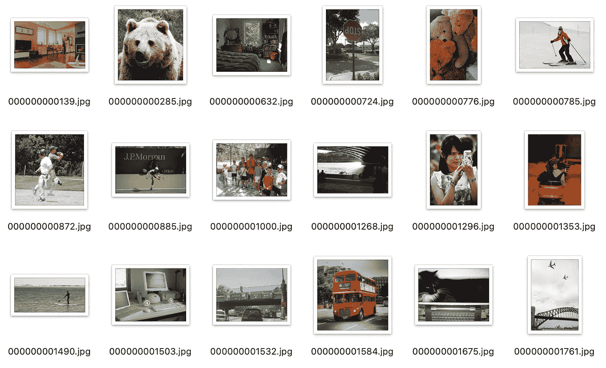

训练数据集的一部分

## 制作黑白照片

首先，我需要把彩色图像变成黑白的来进行训练。我还添加了一点噪点，给这些图片一些旧照片的感觉。

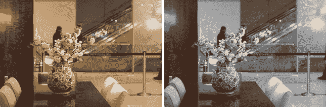

(左)ImageNet 中的一幅图像(右)带噪声的黑白图像。

## 预训练发电机

现在我已经准备好了数据集，可以开始训练了。我为生成器创建了 U-Net 学习器，并在 GAN 之前对其进行了预训练。fastai 库可以轻松完成。

我从小尺寸(64 像素)开始，所以我可以用更大的批量更快地训练它。

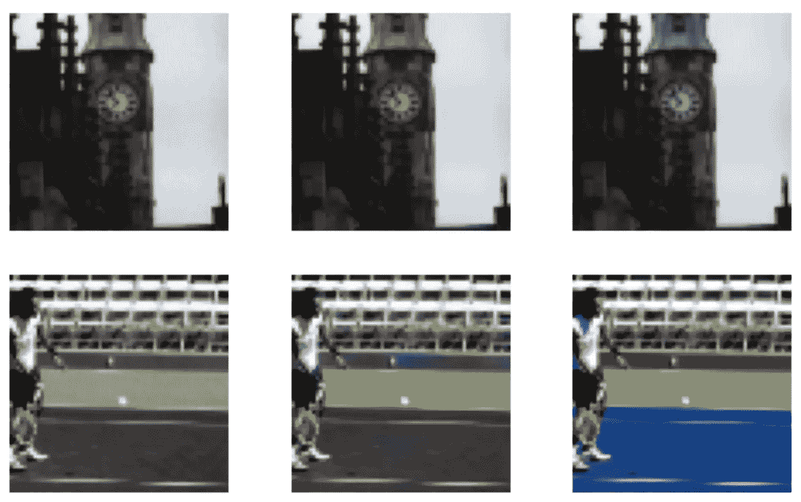

用 64 像素图像进行生成器预训练。

然后我把尺寸加大到 128 和 256。随着时代的增加，我开始看到一些好的结果。

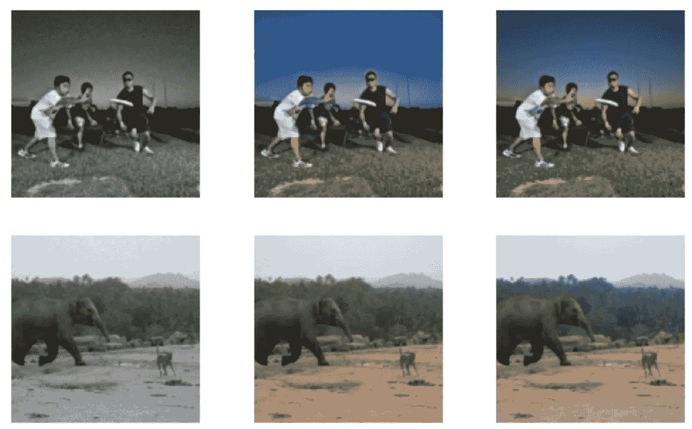

使用 128 像素图像进行生成器预训练。

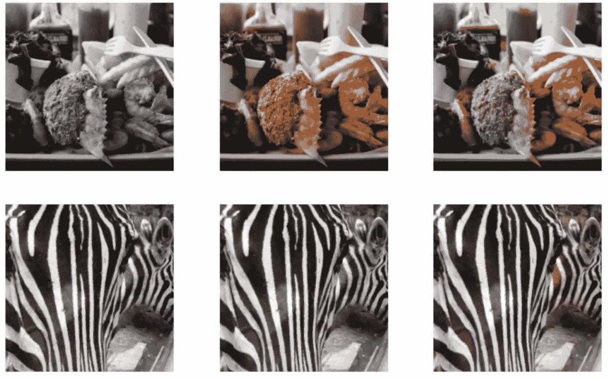

使用 256 像素图像进行生成器预训练。

## 训练前鉴别器

在生成器预训练之后，我使用生成器从黑白数据集生成彩色照片。然后我用这些生成的照片和原始照片来训练鉴别器。

在 10 个时期之后，鉴别器能够以 85%的准确度辨别图像是否被生成。

## 开始

现在是把它们放在一起的时候了。Fastai 为创建 GAN 提供了一个非常有用的工具，结合了预先训练的生成器和鉴别器。经过 50 个时代的训练，我得到了初步的结果。

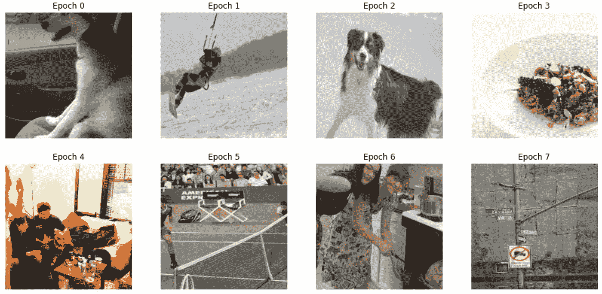

甘在训练的时候。

# 结果

我下载了一些黑白照片，这些照片是模特以前没有见过的，用来测试。以下是一些结果。

这个模型能够给树和草上色。它也做了很好的着色人类的皮肤。

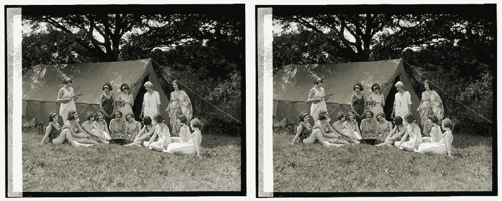

(左)纳特。我是。芭蕾舞，8/20/24([https://www.loc.gov/pictures/item/2016838246/](https://www.loc.gov/pictures/item/2016838246/))(右)彩色照片

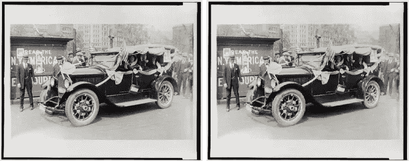

(左)9 月 24 日，罗莎莉·琼斯开始拉福莱特的竞选之旅(【https://www.loc.gov/pictures/resource/cph.3c15477/? 】)co=ggbain )(右)彩色照片

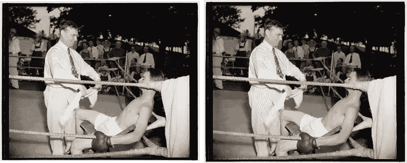

(左)拳击(【https://www.loc.gov/item/2016878085/】)(右)彩照

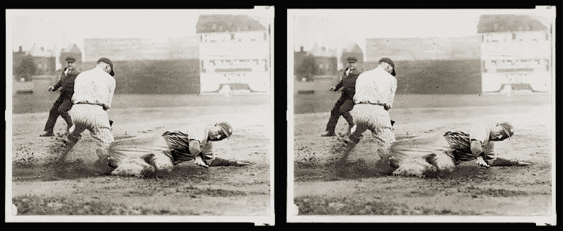

(左)裁判看着纽约扬基队球员在与华盛顿([https://www.loc.gov/pictures/resource/cph.3c35415/](https://www.loc.gov/pictures/resource/cph.3c35415/))的棒球比赛中滑入垒位

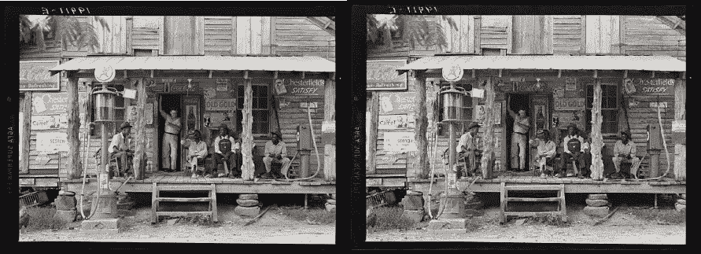

(左)土路上的乡村商店。周日下午。注意右边的煤油泵和左边的汽油泵。粗糙、未加工的木柱被用来支撑门廊屋顶。黑人正坐在门廊上。店主的兄弟站在门口。北卡罗来纳州戈登顿([https://www.loc.gov/pictures/resource/fsa.8b33922/](https://www.loc.gov/pictures/resource/fsa.8b33922/))(右)彩色

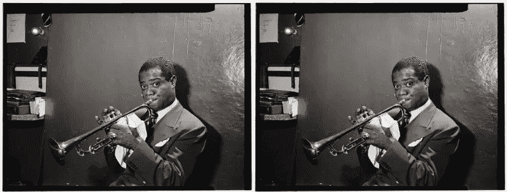

(左)路易斯·阿姆斯特朗的肖像，水族馆，纽约，加利福尼亚州。1946 年 7 月([https://www.loc.gov/item/gottlieb.00201/](https://www.loc.gov/item/gottlieb.00201/))(右)彩色照片

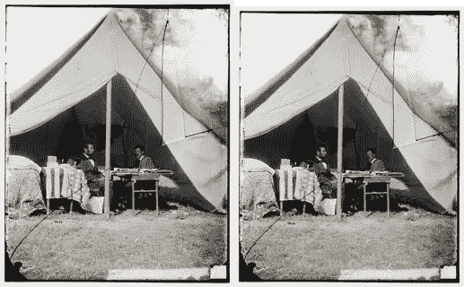

(左)马里兰州安蒂特姆，林肯总统和乔治·b·麦克莱伦将军在将军的帐篷里([https://www.loc.gov/pictures/resource/cwpb.04351/](https://www.loc.gov/pictures/resource/cwpb.04351/))(右)彩色照片

有些颜色不是很真实，但仍然很有说服力。

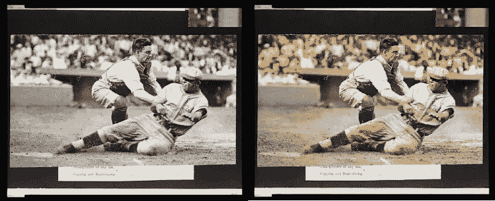

(左)费城运动家队的宾·米勒在一场棒球比赛中被华盛顿国民队的捕手“泥巴”鲁埃尔在本垒板标记出局(【https://www.loc.gov/pictures/item/2005685880/】)(右)彩色照片

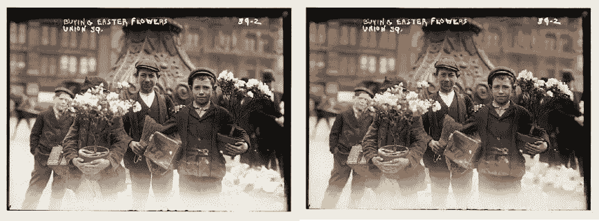

(左)购买复活节鲜花，联合广场。[纽约州](【https://www.loc.gov/pictures/resource/ggbain.00294/】)(右)彩色照片

请注意，这是仅由 5000 幅图像训练的，并没有很多历元，它可能会通过更密集的训练得到进一步改善。

# 网络应用

使用 Streamlit 可以快速创建 web 应用程序原型。它不需要大量的 HTML 和 Java 技能，所以它对像我这样的 web dummy 真的很有帮助。

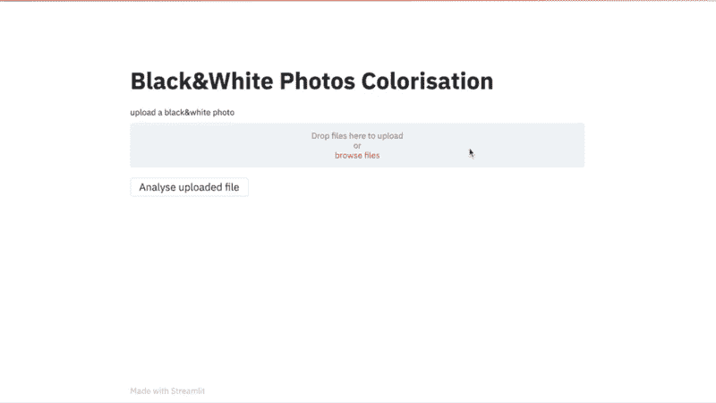

Streamlit 构建的 Web 应用程序

 [## 生成性对抗网络:构建一个用 Streamlit 给 B&W 照片着色的 web 应用程序

### 使用 Streamlit 快速将生成式对抗网络模型转换为 web 应用程序，并部署到 Heroku

towardsdatascience.com](/generative-adversarial-network-build-a-web-application-which-colorizes-b-w-photos-with-streamlit-5118bf0857af) 

感谢阅读，欢迎提出建议和反馈。

# 更多示例:

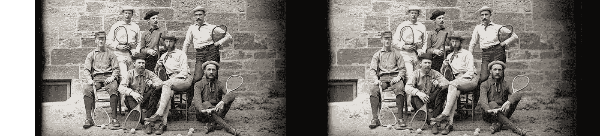

草地网球选手可能在波斯顿地区([https://www.loc.gov/resource/ppmsca.53290/](https://www.loc.gov/resource/ppmsca.53290/))

茱莉亚·欧贝尔，国家妇女党总部的信使([https://www.loc.gov/resource/cph.3d01840/](https://www.loc.gov/resource/cph.3d01840/))

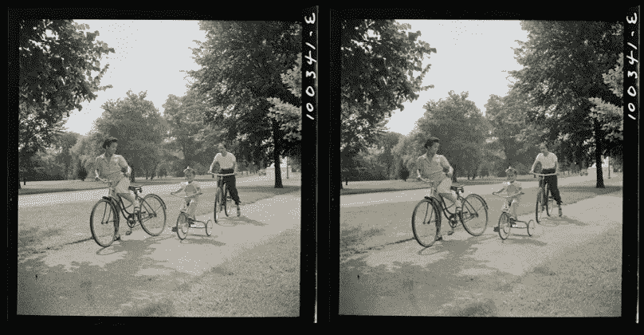

周日骑自行车的人在华盛顿特区的东波托马克公园([https://www.loc.gov/resource/fsa.8c34879/](https://www.loc.gov/resource/fsa.8c34879/))

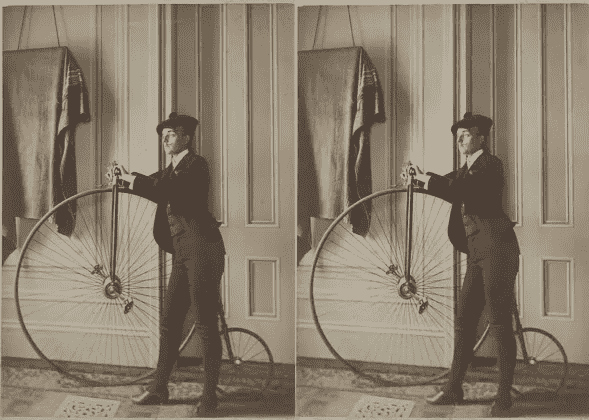

弗朗西丝·班杰明·庄士敦，装扮成假胡子男人的全身自画像，骑着自行车，面朝左([https://www.loc.gov/resource/ppmsc.04884/](https://www.loc.gov/resource/ppmsc.04884/))

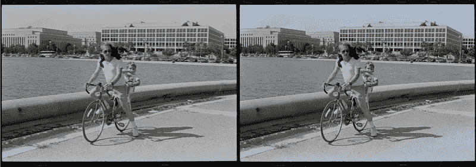

一名男子和一名男孩骑着自行车，一只狗骑在男子的肩膀上，靠近 https://www.loc.gov/resource/ppmsca.38847/的美国国会大厦倒影池

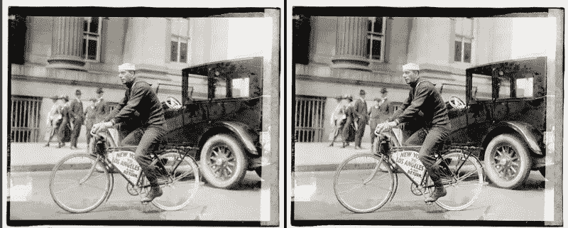

托尼·皮索([https://www.loc.gov/resource/npcc.01561/](https://www.loc.gov/resource/npcc.01561/))

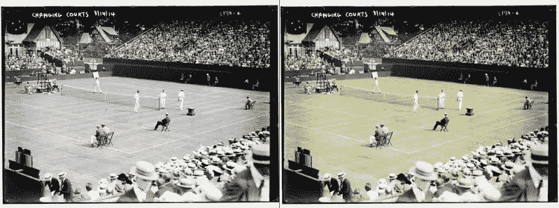

更换场地，14 年 8 月 14 日(网球)([https://www.loc.gov/resource/ggbain.16897/](https://www.loc.gov/resource/ggbain.16897/))

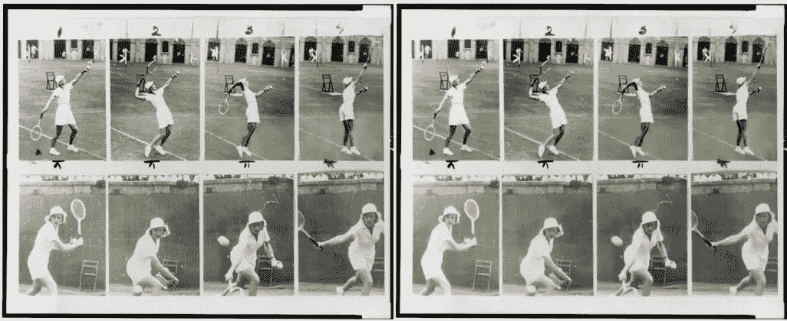

爱丽丝大理石在森林山打网球；展示她发球和反手击球的八张照片的合成(【https://www.loc.gov/resource/cph.3c15631/】T2

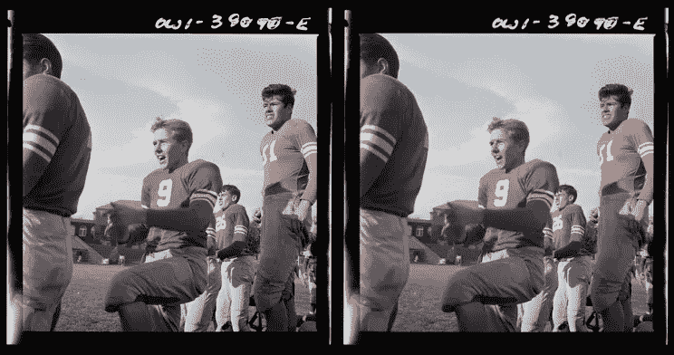

华盛顿特区，伍德罗·威尔逊高中足球队成员在场边观看比赛(【https://www.loc.gov/item/2017863035/】T4)

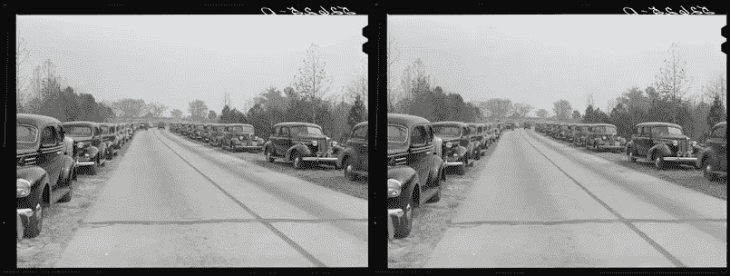

杜克大学-卡罗莱纳州足球赛当天高速公路沿线的汽车队。杜伦，杜克大学体育馆附近。北卡罗来纳州达勒姆县([https://www.loc.gov/item/2017801879/](https://www.loc.gov/item/2017801879/))

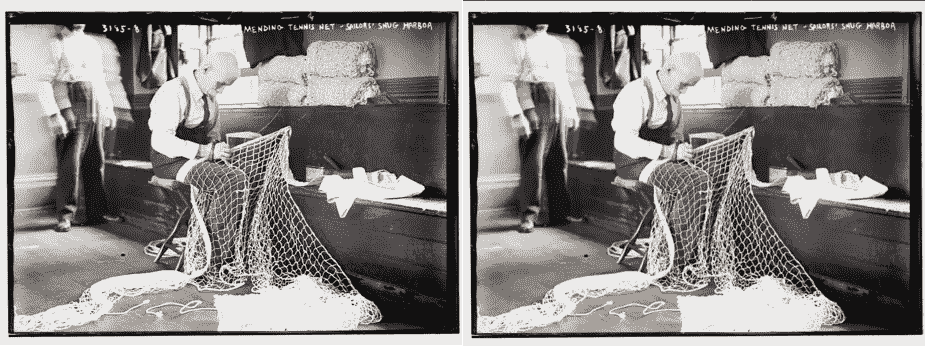

修补网球网——水手的舒适港湾([https://www.loc.gov/resource/ggbain.16850/](https://www.loc.gov/resource/ggbain.16850/))