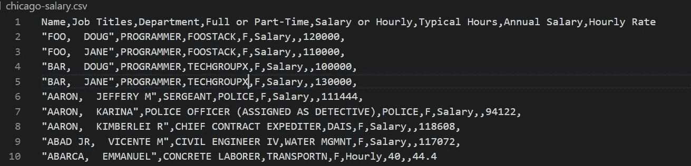
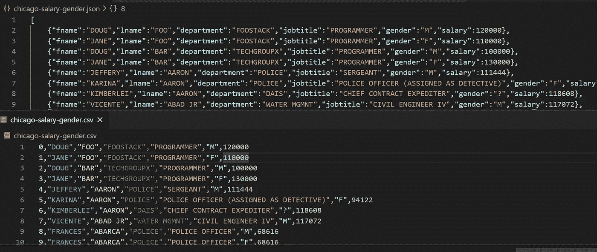
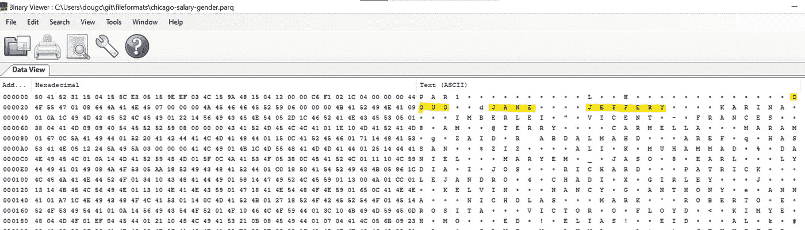
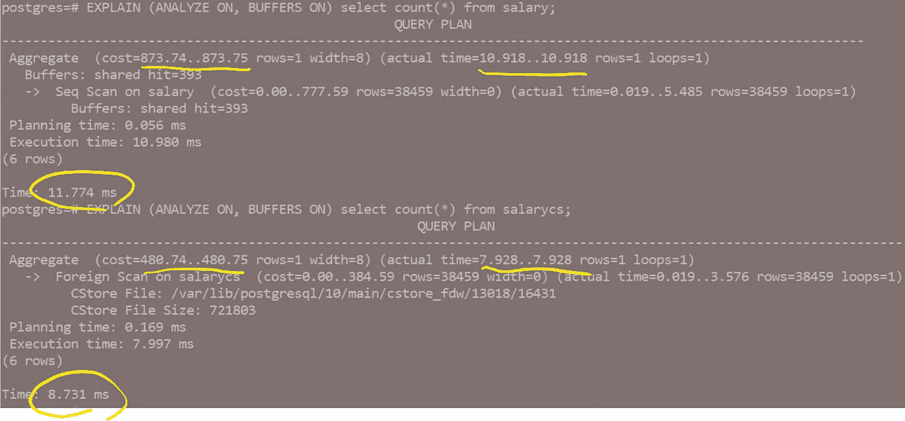
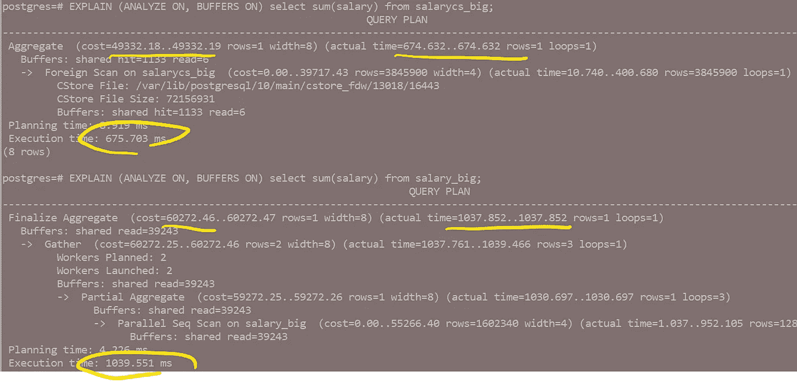
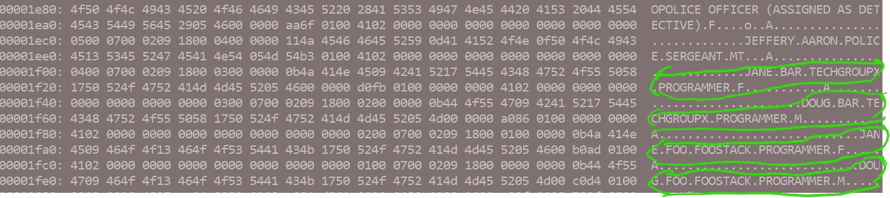
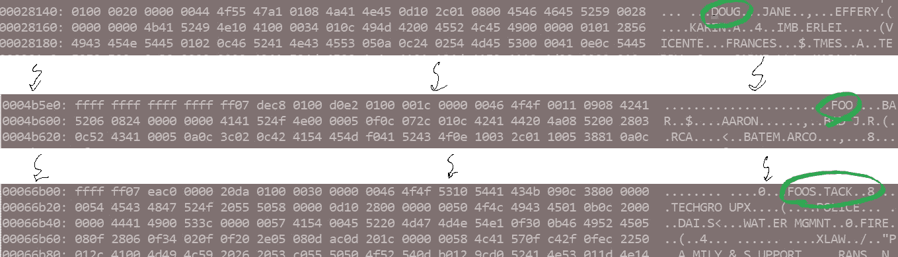
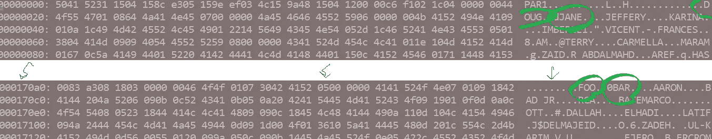
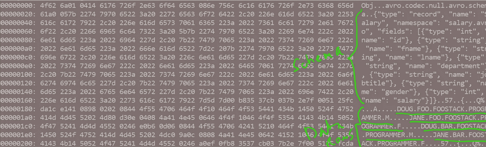

# 柱状商店——何时/如何/为什么？

> 原文：<https://towardsdatascience.com/columnar-stores-when-how-why-2d6759914319?source=collection_archive---------1----------------------->

## 揭开行与列大数据存储的神秘面纱(Parquet、Postgres、Avro 等)

照片由 [Unsplash](https://unsplash.com?utm_source=medium&utm_medium=referral) 上的 [Skyler Gerald](https://unsplash.com/@skylergeraldphoto?utm_source=medium&utm_medium=referral) 拍摄

很久以前，数据存储很简单——堆文件和 b 树，仅此而已。今天的选择是压倒性的——ORC、Parquet、HDFS 或 S3 上的 Avro 或者像 Postgresql、MariaDB 这样的 RDBMS 解决方案，或者像 Oracle 和 DB2 这样的商业解决方案。甚至在 RDBMS 引擎和云服务中也有很多选择！

本指南是对广阔的存储领域的“随机漫步”。

# **样本数据集**

我调出了芝加哥公务员的工资信息。你知道公务员的工资是以每个人的真实姓名公布的吗？查找你最喜欢的警察或专员的工资(不幸的是，它不包括加班、津贴或贿赂)。

我添加了一些虚拟的人——Foo & Bar 家族。否则它的真实数据。

# 面向列与面向行

首先是数据的基本存储机制。*行列*方向。

**面向行**将每个单独的记录存储在一起，Doug Foo 的完整记录，然后是 Jane Foo 的完整记录，依此类推。

> [Doug，Foo，Foostack，程序员，M，120000] [Jane，Foo，Foostack，程序员，F，110000] [Doug，Bar，…]..

**列**或 ***列*** 将所有列数据存储在一起—因此所有的名字(Doug、Jane 等)，然后是所有的姓氏、头衔等等，最后是所有的薪水。

> [道格、简、道格、简……][福、福、吧、吧……][程序员、程序员……][M、F、M、F……][120000、110000、100000、130000……]..

数据通常以 KB(或 MB/GB)为单位从磁盘中读取，因此对 1 条记录的单次读取会带来比您想要的更多的数据。

## 典型块大小[*1]:

*   HDFS: 128MB(块)
*   谷歌文件系统:64MB(块)
*   亚马逊 AWS S3: 128KB
*   Oracle 数据仓库:32KB
*   Postgres 数据库:8KB
*   Linux 和 Windows 文件系统:4KB

薪水记录非常小~ 50chars ( <50 bytes). An 8KB block with metadata could easily store 100+ ***行导向*** 记录【8192 / 50 = 163】)。因此，对包含“Doug Foo”的记录的块的一次读取包括更多内容。

对于**列**块读取—读取因列大小而异。例如，对于 8KB 数据块:

*   名字可能平均为 10 个字节，意味着大约 800 个以上的名字。
*   薪水可以放入一个 32 位的 Int(4 字节)中，产生大约 2000 个条目！
*   性别是 M/F/？—可以存储为 1 个字节，甚至半个半字节~ 8000！

在我们稍后进行更多分析时，记住这一点非常重要。

# 数据转换

我想添加一个 M/F 属性，所以我合并到一个婴儿名字数据库中，然后写出各种熊猫支持的格式(JSON、CSV 和 Parquet)。

基本熊猫性别数据

**注意同等磁盘格式的文件大小差异** *(38k 记录)* **:**

*   **不带头文件的 CSV** 为 2.526 MB
*   **压缩后的拼花**(柱状)为 606 KB(CSV 的 1/4)
*   **JSON** 为 4.615 MB(比 CSV 大 90%，比 Parquet 大 700%)

**拼花地板**是一种二进制压缩格式，因此需要一些努力来快速浏览——稍后将讨论细节。

注意一些奇怪的事情，它只显示了道格和简一次，尽管我们有两个道格和两个简。名字聚集在一起。

# 为什么不存储为 CSV 或 JSON？

显而易见，但让我们把它拼出来:

*   空间利用率差(字符串形式的数字浪费空间)
*   没有类型或结构检查(字符可能会出现在数字字段中)
*   CSV —无元数据/标题信息，JSON —重复的元/格式
*   没有重复值的本机压缩
*   没有本地索引/搜索能力

注意 CSV 和 JSON 具有非常容易阅读的明显优势，因此有时是很好的交换格式。

# 深入探究 Postgres 格式(RDBMS)

Postgres 是一个全功能的开源数据库，既有传统的基于行的存储(有时称为“堆文件”)，也有列存储扩展(cstore_fdw)。

我创建了一个模式并将工资数据加载到两个变量中，一个是标准的行和列版本。

查询 38k 记录时两者之间的一些基本统计/比较:

1.  **选择计数(*)** →列存储略快(7.9 毫秒对 10.9 毫秒)，并且“成本”较低(480 毫秒对 873 毫秒)(假设这是估计操作/读取的指标)。理论上，我们使用列存储读取**少于*的*块，因为您只需要扫描一列来获得计数，并且它是压缩的。**

count(*)测试，只是在列上快一点

2. **Select sum(salary)** →这应该是柱形图的一个经典案例，我们只需要扫描一列或一系列块，而基于行的需要扫描所有块，以便从每行中提取薪金。但是没有我们预期的那么快。成本便宜了 493 vs 873，但是计时是 14.1ms vs 17.1ms。

38k 行，即使在一个单独的列上，速度也快不了多少。

3.**更大的数据集—** 我将它提升到 380 万行，并重新运行 sum 查询。变化不大——有点令人惊讶！理论上，这应该比 20-30%的涨幅要快得多。其实柱状往往是缓存 生效后 ***变慢！(公平地说，您确实需要比您的内存缓存更大的 GB 到 TB 数据集才能获得真正的收益) **[*2]** 。***

3.8 米的行，还是没有快很多。

在阅读了一些 [bug](https://github.com/citusdata/cstore_fdw/issues/75) 报告和开发者[笔记](https://www.citusdata.com/blog/2014/06/14/columnar-store-benchmarks-ssds/)之后，我可以猜测作为一个扩展，它不如标准行存储健壮。例如，本机行格式提供多核处理和缓冲区缓存。我可能应该与本地列存储数据库进行比较…

请注意我加载 3.8m 行时的文件大小:

*   标准行格式: **321 MB**
*   柱状/压缩格式: **72 MB**

巨大的空间节省(几乎 4 倍)！注意磁盘上的行和列的原始数据转储(在 linux/wsl2 上使用“xxd -c 32”):

行方向非常简单

纵列由带有压缩子串的纵列展开

# 镶木地板——最受欢迎的？

Parquet 来自 Twitter 和 Cloudera (Hadoop ),作为 Apache 项目维护。这是 Spark 的实际格式，因此最受欢迎。(之前流行的格式包括 ORC 和 RCFile)。

Python/Pandas 本身也支持它，并提供多种压缩格式。基本的文件格式是一个由行组成的列，存储一个中央模式&组级元数据，以允许并行和部分读取。

对原始文件的适度深入研究显示:

类似于 Postgres CStore —列被分批分组并压缩，这样 Doug，Jane 在整个文件中只出现一次。

# AVRO —面向行的模式进化

与 Parquet 竞争激烈的是 Avro，它不仅仅是一种存储格式，但我们将只关注存储方面。这也是一个 Apache 项目。 **[*3]** 拼花地板的两个主要区别:

1.  更好的模式进化
2.  面向行的存储

模式和更改(新行和旧行的默认值)嵌入到文件中。添加新列只需要定义默认值，这使得渐变维度(SCD)和更改更容易处理。

请注意，它是面向行的，因此您不会获得像使用 Parq 那样的一些优势，例如压缩和性能——假设您的用例更多地是关于列聚合，而不是逐记录处理。

Avro 代码和数据文件示例:

# 其他存储选项(MongoDB、Kafka、KDB 等)

**NoSQL —** 像 MongoDB、AWS Dynamo 和 Cassandra 这样的名值对象存储通过不同的键存储整个 JSON(或任意)对象。该 API 使用基本的键值存储(put/get)语义，非常简单。高水平+/-:

*   +简单的编程接口
*   +快速启动并运行您的应用
*   -加载多个或复杂数据的效率低下
*   -索引和查询/搜索不灵活
*   -模式演变挑战

**日志结构化商店(和日志结构化合并树)**和它们的创新用途是一个迷人的领域——**卡夫卡**是领导者和创新者(不要被愚弄了，它不仅仅是消息传递，它真正关于 [***日志***](https://www.confluent.io/ebook/i-heart-logs-event-data-stream-processing-and-data-integration/)**根据联合创作者 Jay Kreps* 。 **[*4]***

*   *+简单的编程接口*
*   *+实时消息存储和数据库的可扩展替代方案*
*   *-复杂的集群管理*

***最后，KDB** 值得一提，他是列式、实时和时序内存数据库的先驱。最初编写于 90 年代，即使在今天也拥有无与伦比的单核性能。不幸的是，这是一种昂贵的利基产品，因此最近被出售给一级衍生品，很可能会失血而死…*

*   *+超快和低占用空间(800kb)适合 L1/L2 缓存*
*   *+利用矢量/SIMD CPU 指令*
*   *-不超过 1 台机器(不需要？)*
*   *-成本和晦涩的语言(K/Q)使大多数消费者望而却步。*

*Apache Arrow(内存列格式和串行器)和 OLAP 理工大学也是值得研究的两个领域。*

# ***总结:首要考虑事项***

1.  *列式是否适合您的典型用例(在几列上频繁聚合)？*
2.  *您现有的数据库是否提供像列存储这样的存储选项？*
3.  *模式演变/改变是常见的，也是一个关键的考虑因素吗？*
4.  *存储空间/容量是一个关键考虑因素吗？*

*仔细考虑一下，试运行一下。关系数据库在缓存和索引方面已经有了很大的改进，这在某些情况下可能会降低其必要性。*

# ***参考资料、脚注和灵感***

*   *对于文件系统/操作系统、数据库和大数据存储，如 S3/GFS，块大小在概念上是不同的。在每种情况下，它都是一个逻辑单元。AWS EBS 使用 4K，S3 是一个对象存储，但它的最小分配是 128KB。*
*   ***【2】-**列性能仅在冷启动/清除缓存时更快。一旦数据库填满了它的缓存，Postgres 上的传统行存储总是更快。但是，列存储适用于大数据~TB 大小的数据集，这些数据集大于内存，会表现出冷缓存行为。*
*   ***【3】**——更混乱的是，Avro 的序列化代码可以写入 Parquet 文件格式。它既是竞争对手，也是合作者。*
*   ***【4】**——大多数人认为 Kafka 只是下一个 MQ，但它是一个根本不同的方法，以**提交/事务日志**为中心，这是一个伪数据库。*
*   ***Postgres c store**——【https://github.com/citusdata/cstore_fdw *
*   ***Parquet 上的好读物**—[https://medium . com/swlh/insights-into-Parquet-storage-AC 7 e 46 b 94 FFE](https://medium.com/swlh/insights-into-parquet-storage-ac7e46b94ffe)*
*   ***Avro**—[https://www . perfectlyrandom . org/2019/11/29/handling-Avro-files-in-python/](https://www.perfectlyrandom.org/2019/11/29/handling-avro-files-in-python/)*
*   ***LSM 树 vs B 树**—[https://blog . yugabyte . com/a-busy-developers-guide-to-database-storage-engines-the-basics/](https://blog.yugabyte.com/a-busy-developers-guide-to-database-storage-engines-the-basics/)*
*   ***关于 LSM 树的更多信息—**[https://www . slide share . net/ConfluentInc/power-of-the-log LSM-append-only-data-structures](https://www.slideshare.net/ConfluentInc/power-of-the-loglsm-append-only-data-structures)*
*   ***克雷普斯** ♥ **日志(卡夫卡)**—[https://www . confluent . io/ebook/I-heart-logs-event-data-stream-processing-and-data-integration/](https://www.confluent.io/ebook/i-heart-logs-event-data-stream-processing-and-data-integration/)*
*   ***阿瑟·惠特尼对 KDB &的完整改写**——[https://kx.com/blog/small-core-code-and-hp-apl/](https://queue.acm.org/detail.cfm?id=1531242)*
*   ***源数据集**—[https://Data . cityofchicago . org/Administration-Finance/Current-Employee-Names-salary-and-Position-Title/aned-ke5c](https://data.cityofchicago.org/Administration-Finance/Current-Employee-Names-Salaries-and-Position-Title/aned-ke5c)*
*   ***本文 GitHub**——[https://github.com/dougfoo/fileformats](https://github.com/dougfoo/fileformats)*