# 结合贝叶斯神经网络和集成技术

> 原文：<https://towardsdatascience.com/combining-bayesian-neural-networks-and-ensemble-techniques-a4a3a9072e79?source=collection_archive---------28----------------------->

## 通过利用不确定性使机器学习变得有意义

在机器学习领域，追求越来越大的准确性推动了创新。然而，要使机器学习实用，一个同样重要的特征是能够定义给定预测的不确定性。在本文中，我们将讨论实现这些目标的各种技术，并在文献中给出实践示例，其中选择了这些技术并取得了成功。一般格式是贝叶斯深度学习框架的格式，该框架寻求将集合预测的准确性和稳健性与贝叶斯建模中可用的不确定性估计统一起来。因此，我们将把这一条分成:

技术

> 地图
> 集成技术
> 贝叶斯神经网络
> 随机地图采样
> 高斯混合模型

例子

> **'** '用于系外行星大气反演的贝叶斯神经网络集合'
> '神经网络中的不确定性:近似贝叶斯集合'
> '使用堆叠来平均贝叶斯预测分布'

# 术语

fᵂ(X) —神经网络模型
p(W|X，y)—nn 权值 w 给定数据 x，Y
p(Y|X，w)—nn 权值 w 来自数据 x，Y
p(W)的最大似然—nn 权值的先验概率
p(Y|X) —数据的边际概率
~N(μ，σ ) —均值为μ且方差为σ的正态分布
N —训练样本大小
M —集合大小
(下面显示的所有等式)

# 技术

## 地图

表示为 fᵂ(X 的神经网络(NN)模型由一组相互连接的权重 w 组成，允许我们从输入 x 预测输出 y。这是通过使用梯度下降和使用损失函数 l 的反向传播优化权重来实现的。在统计术语中，这导致给定数据 p(Y|X，w)的权重的频率最大似然估计(MLE)。

**最大后验概率估计** 使用神经网络的另一种方法是最大化最大后验概率(MAP)估计。换句话说，这就是找到最好地解释我们的数据的参数， *p(W|X，Y)* 。这可以使用贝叶斯规则来发现:p(W|X，Y) = p(Y|X，W)p(W)/p(Y|X)。如果我们针对 p(W|X，Y)进行优化，我们可以忽略归一化的 p(Y|X)并将其重新表述为针对 *p(W|X，Y)* 进行优化，这相当于针对 *p(Y|X，W)*p(W)进行优化。我们必须对 p(W)部分的权重进行先验分布，这是我们的先验信念(如果这是一致的，我们可以观察到我们的 MAP 和 MLE 估计是相同的)。在实践中，这相当于在我们的损失函数中增加正则化项来训练神经网络(L2 项相当于高斯先验，L1 相当于拉普拉斯先验)，如这里的[所示](https://machinelearningmastery.com/maximum-a-posteriori-estimation/)。这给了我们地图点估计预测。*

## 集成技术

集成技术包括训练多个模型(弱学习者)来解决同一问题，然后将这些模型组合起来以获得更好、更稳健的预测，这些预测具有更低的方差和/或更低的偏差。它们可以大致分为三种不同类型训练过程:装袋，助推和堆叠。

打包包括在 *N* 个不同的子数据集上不同次数地训练相同的基础模型 *N* 。这些子数据集是使用自举采样方法从初始数据集生成的。这有效地随机采样具有替换的初始较大数据集(确保采样的子数据集的大小足够小于初始数据集)。根据模型，从初始数据集中选择用于训练的特征也可以进行引导采样。为了对输入进行预测，这 N 个不同的模型都根据输入进行各自的预测，然后将得到的 N 个不同的预测进行平均。

Boosting 类似于 bagging，但是由顺序训练 N 个(相同基础)模型组成。每一个连续的模型都集中在先前模型错误预测的数据上。最终的集合由所有弱学习者组成，每个弱学习者根据他们的表现被适当地加权。例子包括 adaboost 和梯度增强。

Bagging 并不昂贵，因为它可以并行训练，而 boosting 由于其持续改进而导致较低的偏差。

堆叠包括训练不同的基础模型，然后通过将它们传递到另一个“元模型”来组合它们的预测，从而产生我们的最终预测。我们将初始数据集分成一个用于训练弱学习者的数据集和另一个弱学习者预测的数据集，元模型训练弱学习者的预测，以最终输出单个预测。

详细的精彩讲解可以在[这里](/ensemble-methods-bagging-boosting-and-stacking-c9214a10a205)找到。

## 贝叶斯神经网络

在神经网络中进行回归预测时，典型的用例是点估计。然而，对此的一个非常有用的补充扩展是，也能够衡量我们在预测中的自信或不确定程度。为此，我们利用了贝叶斯神经网络(BNN)。

**不确定性类型** 我们先来讨论一下不确定性的不同类型。有两种类型的不确定性:任意的和认知的。随机不确定性来自于数据集中固有的噪声，因此对于给定的 x 值，我们可能会得到多个 y 值(y 值的分布)。随机不确定性可分为两种类型:不确定性水平在所有 x 值上保持不变(同方差)或不确定性水平在 x 值上变化(异方差)，如下所示。

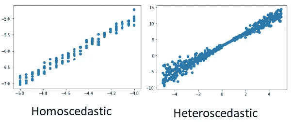

还存在认知上的不确定性，这种不确定性来自于我们建模的不足。这可以通过更好的建模和更多的数据来改善。

不同类型不确定性的完整解释可以在[这里](/what-uncertainties-tell-you-in-bayesian-neural-networks-6fbd5f85648e)找到。

**对认知不确定性建模** 为了对认知不确定性建模，我们使用了一个 BNN，我们现在将对其进行解释。这类似于神经网络，除了代替精确的参数，我们的权重 W 现在被建模为分布。

现在在常规的神经网络中，我们首先初始化我们的权重，然后求解一个优化任务来得到我们的最终权重。然而，在 BNN(我们也将表示为 fᵂ(X))中，最初我们在我们的权重上放置一个先验分布(通常是高斯先验)，p(W)。然后，我们执行贝叶斯推断，从贝叶斯定理中找到权重 p(W|X，Y)的后验分布，如下所示。

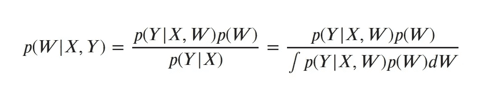

注意这里 p(Y|X，W)是我们的可能性。为了得到 p(Y|X ),我们需要在所有可能的权重上平均我们的可能性([边缘化](/probability-concepts-explained-marginalisation-2296846344fc)),从而得到积分。

然而，在 BNN 中获得后验分布 p(W|X，Y)通常是困难的，因此我们使用近似方法来尝试解决这个问题。变分推理就是这样一种方法。这包括将由θ参数化的简单分布 q*(W)拟合到后验分布。因此，这用简单分布参数的优化任务代替了难以处理的边缘化，该优化任务最好地最小化 q*(W)和真实模型后验 p(W|X，Y)之间的 KL 散度。

一个示例实现方法是丢弃变分推断。这里，为了近似后验分布，我们建立了 NN 模型，以在每个权重层中包括[丢失单元](/simplified-math-behind-dropout-in-deep-learning-6d50f3f47275) ⁴(这将权重随机设置为 0 或 1)。然后正常训练神经网络。然而，对于预测，我们再次使用 dropout(称为 monte carlo dropout)将一些权重随机设置为 0，这让我们可以从近似的后验样本中进行采样。这里的[和](https://arxiv.org/abs/1506.02158) ⁵表明，像这样使用漏失等价于对 q*(W)使用伯努利分布的变分推断。这种情况下的损失函数是:

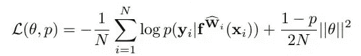

这里 N 是数据点的数量，漏失概率用 p 表示，θ是简单分布参数。我们的权重是从我们的简单分布 Wᵢ ~ q*(W)中抽取的。

**建模异方差随机不确定性** 为了建模随机不确定性，我们可以只使用一个正常的神经网络。然而，我们不是仅仅预测我们的输出 Y，而是通过将我们的输出改变为我们的平均值μ(本质上是正常的神经网络预测)和我们的方差σ来预测分布。分布方差σ让我们了解不确定性的水平。对于异方差，这个方差取决于输入，σ(Xᵢ).我们像往常一样用修正的损失函数训练神经网络:

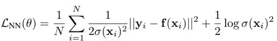

还可以添加重量衰减 L2 正则化项。

要注意的一个关键点是，我们只是在这里执行正常的优化，而不是变分推理。这产生了我们的模型权重 W 的地图点估计，而不是之前看到的分布 q*(W)。

**建模认知和随机不确定性** 在这种情况下，我们将使用异方差神经网络，并将其转化为 BNN，或者换句话说，我们将神经网络的权重建模为分布。我们的模型需要推断权重的后验分布，该分布将我们的输入 X 映射到输出(预测 y/μ和方差σ)。我们用损失函数训练这个 BNN:

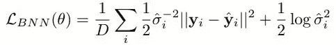

这类似于纯粹的任意神经网络。d 是样本数，yᵢ是实际产量，戴帽子的 yᵢ是预测产量，戴帽子的σᵢ是预测方差。当实现这个损失函数时，我们对其进行处理，以使我们预测 sᵢ而不是σᵢ:= logσᵢ为:

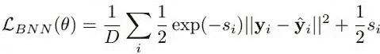

这是因为该损失函数在训练时被证明在数值上更加稳定，因为它避免了被零除。损失由两部分组成:第一部分是利用参数的不确定性通过模型输出的随机样本获得的均方残差，第二部分是不确定性正则化。我们不需要指定不确定性标签，因为模型从成本函数中隐含地学习了这一点。第二项防止网络预测无限的不确定性，因此零损失。

因此，我们得到[y，σ ]的 T 个样本，每个样本从近似分布 q(W)中抽取权重 W~q(W ),总方差由下式给出:

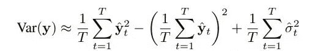

一个很好的讨论可以在[这里](https://arxiv.org/abs/1703.04977) ⁶.找到

## 随机地图抽样

在随机地图抽样中，我们的目的是尝试使用神经网络的集合来预测后验分布，并对认知不确定性进行建模。我们可以像往常一样想象我们的神经网络，我们称之为 fᵂ(X).然而，为了找到我们的模型权重，不是仅仅使用正常的映射损失函数(通常是 L2 正则化损失函数)来训练神经网络，我们还将噪声添加到我们的损失项中。

我们使用噪声损失函数的每个不同实例来训练多个模型，这为每个模型提供了不同的优化权重。因此，当使用所有模型进行预测时，我们得到了一个地图解的分布，它估计了我们的真实输出分布。现在，我们必须考虑如何将噪声添加到我们使用马尔可夫链蒙特卡罗(MCMC)程序的问题中。

首先让我们陈述这个问题。为了便于解释，我们将假设一个多元正态 n(μₚᵣᵢₒᵣ,σₚᵣᵢₒᵣ),n(μₗᵢₖₑ,σₗᵢₖₑ).的先验分布和概率在这种情况下，为了求解μₚₒₛₜ，存在一个标准解:

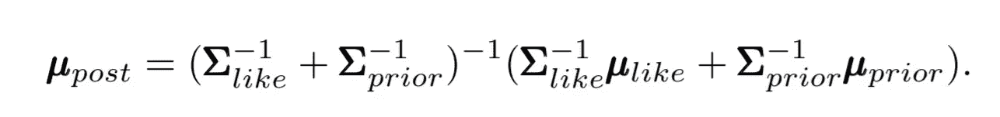

我们必须添加噪声，以使约束 var(μₚₒₛₜ=σₚₒₛₜ得以实施，或者换句话说，我们的输出分布的均值方差等于输出分布的方差。实际上，我们通过将μₚᵣᵢₒᵣ(我们先前分布的平均值)建模为随机噪声变量θ₀来注入这种噪声，导致损失函数如下:

对于足够宽的 NN，这里显示了[⁷，我们的符合约束的随机噪声变量可以有效地建模为θ₀~ n(μₚᵣᵢₒᵣ,σₚᵣᵢₒᵣ).](http://bayesiandeeplearning.org/2018/papers/78.pdf)

## 高斯混合模型

高斯混合模型(GMM)是一种在整个数据集中参数化正态分布子集的方法。因此，这是一种无监督学习的形式。在我们的情况下，我们可以考虑两种不同的情况。

这方面的一个例子是考虑男性和女性的一组正态分布的权重。仅给出体重数据而不给出性别归属，我们可以发现总体分布是两个缩放(方差变化)和移位(均值变化)正态分布的总和，这是 GMM 模型的一种形式。因此，我们的 GMM(数学模型如下所示)由两种类型的值参数化:分量权重和分量均值和方差。

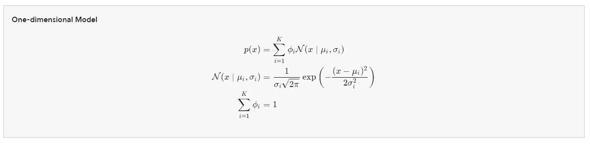

图片取自[https://brilliant.org/wiki/gaussian-mixture-model/](https://brilliant.org/wiki/gaussian-mixture-model/)

我们的 GMM 概率记为 p(x)。在上面的第一行中，我们可以看到这被建模为多个正态分布(我们的组件)的加权和。第二行只是定义了经典的正态分布公式，第三行给出了我们对权重的约束，这样它们加起来就是一。

GMM 建模的任务是计算其成分权重ϕᵢ、成分均值、μᵢ和成分方差σᵢ.如果组件权重未被学习，则它们可以被视为组件上的先验分布，如 p(由组件 Cₖ生成的 x)= ϕₖ.如果它们是已知的，那么它们就是给定数据的分量概率的后验估计。

为了学习模型的权重，我们使用了最大似然技术，称为期望最大化。EM 算法如下所示:

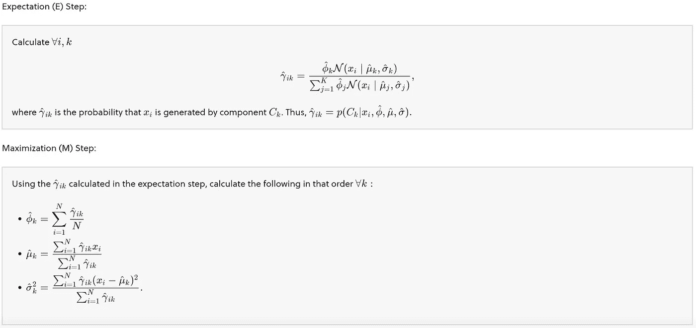

图片取自 https://brilliant.org/wiki/gaussian-mixture-model/

作为算法的开始，我们从数据集中随机分配样本，不替换我们的分量均值估计μ₁….μₖ并将所有分量方差估计值设置为样本方差:

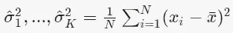

我们还将所有组件权重设置为均匀分布= 1/K，其中 K 是组件的数量。

然后，在如上所述的期望步骤中，我们找到给定其当前参数 p(Cₖ|xᵢ,ϕᵢ,μᵢ,σᵢ).的每个数据点的每个分量的期望然后，在最大化步骤中，我们根据模型参数ϕᵢ、μᵢ和σᵢ.最大化这些期望值

这个概念在这里[⁸.](https://brilliant.org/wiki/gaussian-mixture-model/)得到了更充分的解释

# 例子

## 用于系外行星大气反演的贝叶斯神经网络集成

摘自论文 [Cobb et al. 2019](https://arxiv.org/abs/1905.10659) ⁹的一个例子显示了上述实施的各种技术的组合，证明是成功和最先进的。在论文中，他们试图说明认知和随机的不确定性。

首先，他们使用输出均值和协方差矩阵的 BNN(以模拟随机不确定性),其架构为 4 个密集的混凝土脱落层，每层由 1024 个单元组成。批量大小为 512，使用了 adam 优化程序。负对数似然损失函数与训练期间保存的早期停止和最佳检查点一起使用。这些模型中的 5 个然后被用于整体平均过程。

让我们讨论一些细微差别。首先，在 BNN 的权重上假设高斯先验。在训练过程中，蒙特卡罗下降近似用于变分推断，这允许宽 NN 层。在预测阶段，它们通过网络向前传播 T 次，以获得 T 个预测，形成我们的经验输出分布，该分布封装了我们的认知不确定性。使用混凝土脱落层，这是一种技术，此处[⁰解释了这种技术，它有效地优化了每层中要脱落的单元的比例。](https://arxiv.org/abs/1705.07832)

然后将其整合到 5 个模型(5 个通过经验性能选择)的集合中，以增加其对权重初始化和优化路径的鲁棒性。当每个集合预测一个分布时，通过使用元高斯混合模型将它们组合在一起，其中每个分量的权重等于 1/M，其中 m 是给出最终输出分布为σₑₙₛ).θₑₙₛ~n(μₑₙₛ的模型的数量通过平均所有分量的平均值，并使用总方差的[定律，可以得到μₑₙₛ，σₑₙₛ为:](https://math.stackexchange.com/questions/1742578/law-of-total-variance-intuition)

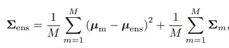

## **‘神经网络中的不确定性:近似贝叶斯集合’**

摘自论文 [Pearce et al. 2018](https://arxiv.org/abs/1811.12188) ⁴的一个例子展示了应用集成方法来模拟贝叶斯技术的能力。总的来说，集成方法不遵循任何正式的贝叶斯建模技术。

第一步是将我们的机器学习从 MLE 重新表述为映射问题，这将我们引向正则化的损失函数:

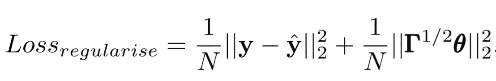

然后，我们实现上述随机 MAP 采样方法，其中我们假设我们将噪声添加到我们的先验分布中，从而得到上述锚定损失函数。

这种随机映射采样方法是用 100 个单元的单层神经网络运行的。少量的神经网络就足够了，因为我们在参数空间而不是输出空间进行推理，输出空间需要相对较少数量的集成神经网络。在论文测试中，随机地图抽样被证明是黄金标准(高斯过程和哈密顿蒙特卡罗)贝叶斯推断的良好近似。与不考虑相关性的平均场变分推断或 MC 丢失相比，它有过度预测方差的趋势，但在捕捉插值区域的不确定性方面表现更好。对于实际的图和结果，请参考上面的文章链接。

这证明了该方法的有效性，特别是其简单性及其与神经网络正常工作的相似性，增加了围绕来自先验分布的值进行正则化和使用集成技术进行重新采样的复杂性。

## **‘使用堆叠来平均贝叶斯预测分布’**

摘自 [Yao 等人 2018](https://arxiv.org/abs/1704.02030) 的一个例子试图将点估计文献中通常使用的叠加方法与预测分布的贝叶斯建模相结合，并将其有效性与通常的贝叶斯模型平均(BMA)进行比较。

问题公式化如下，给定遵循多维分布的数据集 X，然后我们可以从一系列候选模型中生成一个新模型，该模型将预测尽可能接近真实输出数据生成分布的输出分布 Y。这个问题包括三种不同的情况。

*   M-closed:真正的数据生成模型存在于我们的候选模型列表中， **M** = (M₁,….,Mₖ).
*   M-complete:真实的输出数据生成分布不在我们的列表中，但是我们知道这一点并选择我们的候选模型，因为真实的模型是难以处理的。
*   M-open:真正的数据生成模型对我们来说是未知的，因为它可能在概念上或计算上太困难了。

作为对最基本的 BMA 类型的一行总结，对于一个给定的数据点，它从一系列候选模型中挑选一个能最好地预测它的模型。然而，这通常是浪费知识和不稳定的，并且适合于 M-闭的情况。

*堆叠*使用候选模型列表， **M** ，并获得每个模型的每个数据点的 LOO 预测(留一预测:在除一个数据点之外的所有数据点上拟合一个模型，并在其上进行预测)。然后，通过获得所有模型预测的加权和，将这些模型组合起来进行预测。通过最小化 LOO 评分规则来确定为每个模型生成的权重:

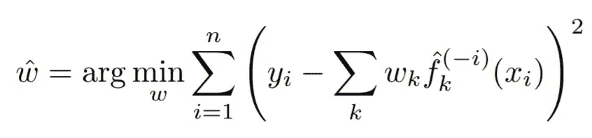

k 迭代模型，I 迭代数据点。这个等式表明，我们找到了使模型的加权和与实际输出之间的残差最小化的最佳权重。然后，预测由模型的加权和给出:

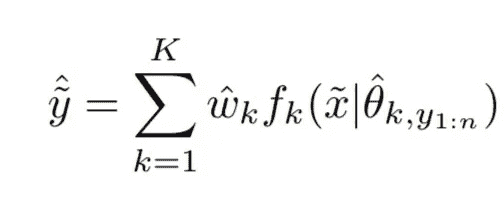

为了将此转化为预测分布的*叠加，我们需要首先提出一个评分规则。*

**评分规则** 评分规则是作用于概率空间和整数的一些函数，并返回关于概率空间预测整数的程度的值。评分规则的例子包括:二次评分、对数评分、连续排名概率评分、能量评分以及取决于分布的一阶和二阶矩的评分规则。二次和对数计分的分数由下式给出:QS(p，y)= 2p(y)-||p||₂和 LogS(p，y) = log(p(y))。

广义堆叠问题可以表述为:

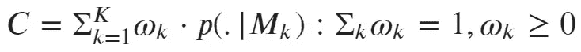

根据分布和它试图估计的点之间的一些评分规则标准，预测 C 是最优的，并且遵循模型权重总和应该为 1 并且模型权重必须为非负的约束。

在我们的例子中，我们通过用 LOO 预测分布替换预测分布 p(yₒᵤₜ|y,Mₖ来使用评分规则的 LOO 版本。我们可以这样做，因为对于样本大小→ ∞，LOO 预测分布和完全预测分布的得分之间的 L2 误差趋于零，因此证明堆叠渐进地给出了权重的最佳组合。然而在实践中，LOO 仍然过于繁重，因此使用了 PSIS-LOO ( [帕累托平滑重要性采样](https://arxiv.org/abs/1507.02646) ⁴)。

举一个例子，如果我们将此应用于一种情况，例如试图预测一个形式为 y～n(3.4，1)的真实基础模型，该模型具有形式为 n(μₖ,1(1≤k≤8)的 8 个候选解。BMA 会在 k = 3 时选择单一模型，叠加总会给我们 1/nσⁿᵢ₌₁yᵢ.对于预测分布结果的叠加，我们需要根据损失和约束条件优化权重:

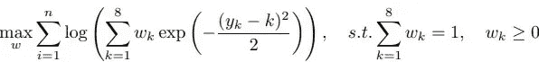

该论文表明，这完全优于均方误差训练点估计预测。这表明在 KL 散度上接近的两个分布在每个时刻都是接近的，而反之则不一定。这说明了匹配分布而不是匹配矩(如均值)的必要性。

# 结论

总的来说，这篇文章试图展示一种不同的方法在处理机器学习问题上的理论可能性和实践合理性。

[1] *J. Brownlee* ，《机器学习的最大后验概率(MAP)的温柔介绍》(2019)，[https://machinelingmastery . com/Maximum-A-posterior-estimation/](https://machinelearningmastery.com/maximum-a-posteriori-estimation/)
【2】*j . Rocca*，《集成方法:装袋、助推和堆叠》(2019)，[https://towardsdatascience . com/Ensemble-methods-bagging-boosting-and-stacking-c 9214 a10a 205】劳曼《贝叶斯神经网络中的不确定性告诉你什么》(2019)](/ensemble-methods-bagging-boosting-and-stacking-c9214a10a205)[https://towards data science . com/What-unabilities-tell-you-in-Bayesian-Neural-Networks-6 FBD 5 f 85648 e](/what-uncertainties-tell-you-in-bayesian-neural-networks-6fbd5f85648e)
【4】C*。Ranjan* ，用背后的简化数学理解辍学(2019)，[https://towardsdatascience . com/Simplified-Math-behind-Dropout-in-Deep-Learning-6d 50 F3 f 47275](/simplified-math-behind-dropout-in-deep-learning-6d50f3f47275)
【5】[y . Gal](https://arxiv.org/search/stat?searchtype=author&query=Gal%2C+Y)， [Z. Ghahramani](https://arxiv.org/search/stat?searchtype=author&query=Ghahramani%2C+Z) ，带伯努利近似变分推理的贝叶斯卷积神经网络(2016)，[https://arxiv.org/abs/1506.02158](https://arxiv.org/abs/1506.02158)
(2017)，[https://arxiv.org/abs/1703.04977](https://arxiv.org/abs/1703.04977)
【7】t .皮尔斯，M .扎基，a .尼利，贝叶斯神经网络系综(2018)，[http://bayesiandeeplearning.org/2018/papers/78.pdf](http://bayesiandeeplearning.org/2018/papers/78.pdf)
[j .麦戈纳格](https://brilliant.org/profile/john-9143r5/about/)， [G .皮林](https://brilliant.org/profile/geoff-bfbkja/)， [A .多布尔](https://brilliant.org/profile/andrei-vjp2fw/about/)，【2020】，[https://brilliant.org/wiki/gaussian-mixture-model/](https://brilliant.org/wiki/gaussian-mixture-model/)
【9】科布，亚当 系外行星大气反演的贝叶斯神经网络集成(2019 年)，[https://arxiv.org/abs/1905.10659](https://arxiv.org/abs/1905.10659)
【10】[y . Gal](https://arxiv.org/search/stat?searchtype=author&query=Gal%2C+Y)， [J. Hron](https://arxiv.org/search/stat?searchtype=author&query=Hron%2C+J) ， [A. Kendall](https://arxiv.org/search/stat?searchtype=author&query=Kendall%2C+A) ，Concrete Dropout(2017 年)，[https://arxiv.org/abs/1705.07832](https://arxiv.org/abs/1705.07832)
【11】[全方差直觉定律](https://math.stackexchange.com/questions/1742578/law-of-total-variance-intuition) (2016 年)，[https://math . stac](https://math.stackexchange.com/questions/1742578/law-of-total-variance-intuition) [A. Vehtari](https://arxiv.org/search/stat?searchtype=author&query=Vehtari%2C+A) ， [D. Simpson](https://arxiv.org/search/stat?searchtype=author&query=Simpson%2C+D) ， [A. Gelman](https://arxiv.org/search/stat?searchtype=author&query=Gelman%2C+A) ，[https://arxiv.org/abs/1704.02030](https://arxiv.org/abs/1704.02030)
【14】[a . Vehtari](https://arxiv.org/search/stat?searchtype=author&query=Vehtari%2C+A)， [D. Simpson](https://arxiv.org/search/stat?searchtype=author&query=Simpson%2C+D) ， [A. Gelman](https://arxiv.org/search/stat?searchtype=author&query=Gelman%2C+A) ， [Y .姚](https://arxiv.org/search/stat?searchtype=author&query=Yao%2C+Y)，