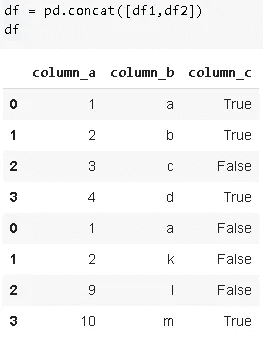
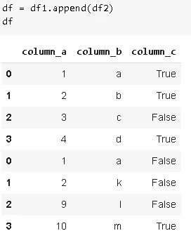
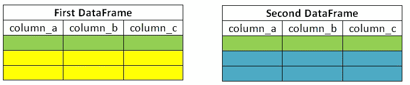

# 使用 Pandas 合并数据帧

> 原文：<https://towardsdatascience.com/combining-dataframes-using-pandas-b9e2e83b9869?source=collection_archive---------13----------------------->

## 关于 concat 和 merge 函数的完整教程

照片由[派恩瓦特](https://unsplash.com/@pinewatt?utm_source=unsplash&utm_medium=referral&utm_content=creditCopyText)在 [Unsplash](https://unsplash.com/s/photos/merge?utm_source=unsplash&utm_medium=referral&utm_content=creditCopyText) 上拍摄

Pandas 是一个高效且广泛使用的数据分析工具。Pandas 的核心数据结构是**D**[**ATA frame**](https://pandas.pydata.org/pandas-docs/stable/reference/api/pandas.DataFrame.html)，它以表格的形式表示数据，带有标记的行和列。DataFrame 有许多强大而灵活的功能和方法，可以简化和加快数据清理和分析过程。

**注意:**键入“DataFrame”可能不是正确的英语，但它在 Pandas 语法中作为 DataFrame 存在。因此，在这篇文章中，我将把它写成 DataFrame，这样你就会习惯了。如果您将其键入为“dataframe”或“Dataframe ”,将会出现错误。

数据科学项目通常需要我们从不同的来源收集数据。因此，作为数据准备的一部分，我们可能需要组合数据框架。在这篇文章中，我将解释组合数据帧的不同方法。

让我们首先创建两个数据帧:

# 串联

组合或连接数据帧的一种方法是 **concat()** 函数。通过改变**轴**参数，它可用于沿行或列连接数据帧。axis 参数的默认值为 0，表示沿行组合。

正如您在上面的第一张图中所看到的，保留了各个数据帧的索引。为了改变它并重新索引组合数据帧， **ignore_index** 参数设置为真。

**concat()函数的 join** 参数决定如何组合数据帧。默认值为“outer ”,返回两个数据帧中的所有索引。如果选择了' inner '选项，则只返回具有共享索引的行。我将改变 df2 的索引，以便您可以看到“内部”和“外部”的区别。

join =“内部”vs join =“外部”

Pandas 还提供了标记数据帧的方法，以便我们知道哪个部分来自哪个数据帧。我们只是使用**键**参数按顺序传递组合数据帧列表。

它还使得方便地访问数据帧的不同部分变得更加容易:

关于 concat()函数的一个重要注意事项是，它制作了数据的副本。为了防止进行不必要的复印，需要将**复印**参数设置为假。默认值为 True。

**append()** 函数也用于组合数据帧。它可以被看作是 concat()函数的一个特例(axis=0，join='outer ')，所以我不会详细讨论它，而只是给出一个例子来展示语法。

# 合并

组合数据帧的另一个广泛使用的函数是 **merge()** 。Concat()函数只是将数据帧一个接一个地相加或并排相加。它更像是附加数据帧。Merge()根据共享列中的值组合数据帧。与 concat()函数相比，Merge()函数提供了更多的灵活性。看到例子就更清楚了。

让我们先来看看初始数据帧:

上的**参数选择用于合并的列或索引级别。**

列名不必相同。我们关注的是列中的值。假设两个数据帧在一个列中有共同的值，您希望使用该列来合并这些数据帧，但是列名不同。在这种情况下，可以使用 **left_on** 和 **right_on** 参数，而不是 **on** 参数。为了显示差异，我将在 df2 中更改列名，然后使用 merge:

尽管 column_a 和 new_column_a 中的返回值是相同的，但由于具有不同的名称，合并的数据帧包括这两个列。

您也可以将多个值传递给参数上的**。返回的数据帧只包括在所有传递给**参数上的**的列中具有相同值的行。**

df1 和 df2 是根据 column_a 中的公共值合并的，是时候介绍一下**how**merge()的参数了。顾名思义，表示你想怎么组合。how 的可能值为“内部”、“外部”、“左侧”、“右侧”。

*   内部:只有在参数上的**指定的列中具有相同值的行(**如何**参数的默认值)**
*   外部:所有行
*   左侧:左侧数据帧中的所有行
*   右侧:右侧数据帧中的所有行

“如何”的概念在下图中更加清晰。如果您熟悉 SQL，其逻辑与 SQL 连接相同。

下面的数字更清楚地代表了参数的概念。

outer '，' left '和' right '选项包括不在其中一个数据帧中的数据。缺少的零件自动用 **NaN** 值填充。NaN 是熊猫缺失价值观的典型代表。

如何= '内在'

how 的默认值是“inner ”,因此您不必在函数中显式编写。“Inner”只返回 column_a 中具有公共值的行。

如何= '外部'

当 how 参数选择' outer '时，合并的数据帧包括两个数据帧中 column_a 的所有值。但是，公共值(column_a = 1 和 column_a = 2)不会重复。

怎么= '左'

当 how 参数选择' left '时，合并数据帧包括左侧数据帧中所有行。如果 column_a(传递给 on 参数的列)中的值不在右数据帧中，则右数据帧中的列将填充 NaN 值。很少使用“right”选项，因为您只能在 merge 函数中更改数据帧的顺序(而不是(df1，df2)使用(df2，df1))。

您可能已经注意到，两个数据帧中相同的列名会添加一个后缀。区分哪一列来自哪一个数据帧是很有用的。您可以使用**后缀**参数指定要添加的后缀。

感谢您的阅读。如果您有任何反馈，请告诉我。

# 我的其他帖子

*   [朴素贝叶斯分类器——解释](/naive-bayes-classifier-explained-50f9723571ed)
*   [支持向量机—解释](/support-vector-machine-explained-8d75fe8738fd)
*   [决策树和随机森林——解释](/decision-tree-and-random-forest-explained-8d20ddabc9dd)
*   [梯度增强决策树—解释](/gradient-boosted-decision-trees-explained-9259bd8205af)
*   [用熊猫处理缺失值](/handling-missing-values-with-pandas-b876bf6f008f)
*   [用机器学习预测二手车价格](/predicting-used-car-prices-with-machine-learning-fea53811b1ab)
*   [数据清理和分析，附带奖励故事](/data-cleaning-and-analysis-with-a-bonus-story-36b3ae39564c)