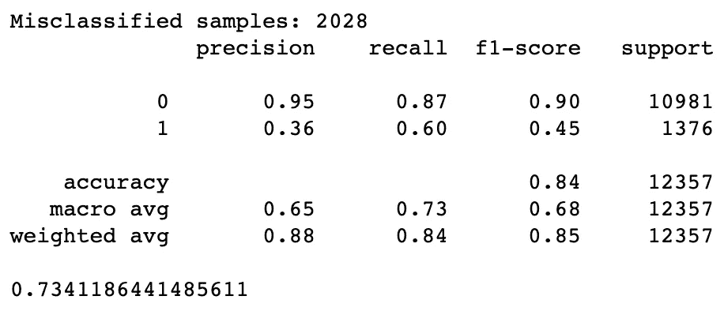
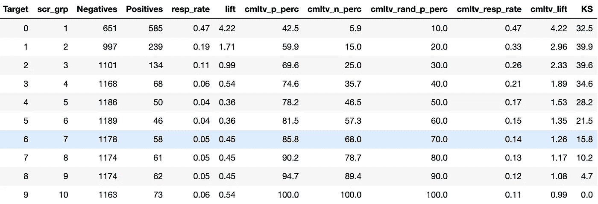
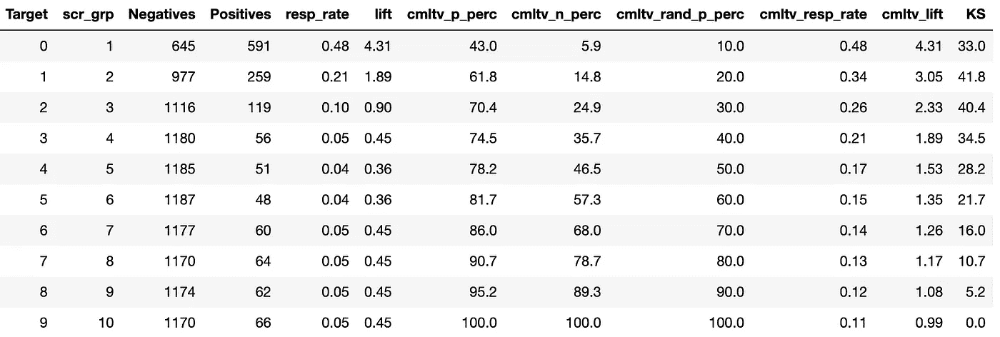

# 结合逻辑回归和决策树

> 原文：<https://towardsdatascience.com/combining-logistic-regression-and-decision-tree-1adec36a4b3f?source=collection_archive---------19----------------------->


安杰伊·西曼斯基

## 降低逻辑回归的线性度

逻辑回归是最常用的机器学习技术之一。它的主要优点是结果清晰，并且能够以简单的方式解释从属特征和独立特征之间的关系。它需要相对较少的处理能力，并且通常比随机森林或梯度增强更快。

然而，它也有一些严重的缺点，主要是它解决非线性问题的能力有限。在本文中，我将演示如何通过将决策树合并到回归模型中来改进非线性关系的预测。

这个想法与证据权重非常相似，这是一种在金融领域广泛用于构建记分卡的方法。WoE 采用一个特征(连续的或分类的),并将其分成多个带，以最大限度地区分商品和坏商品(正面和负面)。决策树执行非常类似的任务，将数据分成节点，以实现积极和消极之间的最大隔离。主要区别在于，WoE 是为每个特征单独构建的，而决策树的节点同时选择多个特征。

我们知道决策树善于识别从属和独立特征之间的非线性关系，因此我们可以将决策树的输出(节点)转换为分类变量，然后通过将每个类别(节点)转换为虚拟变量，将其部署在逻辑回归中。

在我的专业项目中，在 1/3 的情况下，在模型中使用决策树节点会优于逻辑回归和决策树结果。然而，我一直在努力寻找任何可以复制它的公开数据。这可能是因为可用的数据只包含少数预先选择和清理的变量。根本没多少可挤的！当我们有成百上千的变量可供支配时，找到从属特征和独立特征之间关系的其他维度就容易得多。

最后，我决定使用来自银行活动的[数据。使用这些数据，我已经设法得到了一个次要的，但仍然是一个改进的组合逻辑回归和决策树超过这两种方法单独使用。](https://github.com/AndrzejSzymanski/TDS/blob/master/banking.csv)

导入数据后，我做了一些清理。本文使用的代码是 GitHub 上的可用的[。我已经将清理后的数据保存到一个单独的](https://github.com/AndrzejSzymanski/TDS/blob/master/Logistic%20Regression%20with%20Decision%20Tree.ipynb)[文件](https://github.com/AndrzejSzymanski/TDS-LR-DT/blob/master/banking_cleansed.csv)中。

由于频率较小，我决定使用 SMOTE 技术对数据进行过采样。

```
import pandas as pd
from sklearn.model_selection import train_test_split
from imblearn.over_sampling import SMOTEdf=pd.read_csv('banking_cleansed.csv')
X = df.iloc[:,1:]
y = df.iloc[:,0]os = SMOTE(random_state=0)
X_train, X_test, y_train, y_test = train_test_split(X, y, test_size=0.3, random_state=0)
columns = X_train.columns
os_data_X,os_data_y=os.fit_sample(X_train, y_train)
os_data_X = pd.DataFrame(data=os_data_X,columns=columns )
os_data_y= pd.DataFrame(data=os_data_y,columns=['y'])
```

在接下来的步骤中，我构建了 3 个模型:

*   决策图表
*   逻辑回归
*   具有决策树节点的逻辑回归

**决策树**

如果你想和逻辑回归结合，保持决策树深度最小是很重要的。我希望决策树的最大深度为 4。这已经给出了 16 个类别。太多的类别可能会导致基数问题，并使模型过拟合。在我们的示例中，深度 3 和 4 之间的可预测性增量很小，因此我选择最大深度= 3。

```
from sklearn.tree import DecisionTreeClassifier
from sklearn import metrics
from sklearn.metrics import roc_auc_scoredt = DecisionTreeClassifier(criterion='gini', min_samples_split=200,min_samples_leaf=100, max_depth=3)
dt.fit(os_data_X, os_data_y)
y_pred3 = dt.predict(X_test)print('Misclassified samples: %d' % (y_test != y_pred3).sum())
print(metrics.classification_report(y_test, y_pred3))
print (roc_auc_score(y_test, y_pred3))
```



下一步是将节点转换成新的变量。为此，我们需要编写决策树规则。幸运的是，有一个程序可以帮我们做到这一点。下面的函数产生了一段代码，它是决策树拆分规则的复制。

现在运行代码:

```
tree_to_code(dt,columns)
```

输出如下所示:


现在，我们可以将输出复制并粘贴到下一个函数中，用它来创建新的分类变量。

现在，我们可以快速创建一个新变量(“节点”)并将其转移到虚拟变量中。

```
df['nodes']=df.apply(tree, axis=1)
df_n= pd.get_dummies(df['nodes'],drop_first=True)
df_2=pd.concat([df, df_n], axis=1)
df_2=df_2.drop(['nodes'],axis=1)
```

添加节点变量后，我重新运行 split 来训练和测试组，并使用 SMOTE 对训练数据进行过采样。

```
X = df_2.iloc[:,1:]
y = df_2.iloc[:,0]os = SMOTE(random_state=0)
X_train, X_test, y_train, y_test = train_test_split(X, y, test_size=0.3, random_state=0)
columns = X_train.columns
os_data_X,os_data_y=os.fit_sample(X_train, y_train)
```

现在，我们可以运行逻辑回归，并比较虚拟节点对可预测性的影响。

**排除虚拟节点的逻辑回归**

我已经创建了一个所有功能的列表，不包括虚拟节点:

```
nodes=df_n.columns.tolist()
Init = os_data_X.drop(nodes,axis=1).columns.tolist()
```

并使用初始化列表运行逻辑回归:

```
from sklearn.linear_model import LogisticRegression
lr0 = LogisticRegression(C=0.001, random_state=1)
lr0.fit(os_data_X[Init], os_data_y)
y_pred0 = lr0.predict(X_test[Init])print('Misclassified samples: %d' % (y_test != y_pred0).sum())
print(metrics.classification_report(y_test, y_pred0))
print (roc_auc_score(y_test, y_pred0))
```


**带节点虚拟模型的逻辑回归**

在下一步中，我重新运行回归，但是这次我包含了节点虚拟对象。

```
from sklearn.linear_model import LogisticRegression
lr1 = LogisticRegression(C=0.001, random_state=1)
lr1.fit(os_data_X, os_data_y)
y_pred1 = lr1.predict(X_test)print('Misclassified samples: %d' % (y_test != y_pred1).sum())
print(metrics.classification_report(y_test, y_pred1))
print (roc_auc_score(y_test, y_pred1))
```


**结果比较**

具有虚拟节点的逻辑回归具有最好的性能。尽管增量改进并不巨大(尤其是与决策树相比)，但正如我之前所说，很难从只包含少量预选变量的数据中挤出任何额外的东西，我可以向您保证，在现实生活中，差异可能会更大。

我们可以通过使用模型提升来比较正面和负面在十分位数分数上的分布，对模型进行更多的审查，我在我的上一篇文章中已经介绍过了。

第一步是获得概率:

```
y_pred0b=lr0.predict_proba(X_test[Init])
y_pred1b=lr1.predict_proba(X_test)
```

接下来我们需要运行下面的函数:

现在我们可以检查这两个模型之间的差异。首先，我们来评估一下没有决策树的初始模型的性能。

```
ModelLift0 = lift(y_test,y_pred0b,10)
ModelLift0
```

在应用决策树节点之前提升模型…



…接下来是带有决策树节点的模型

```
ModelLift1 = lift(y_test,y_pred1b,10)
ModelLift1
```



具有决策树节点的模型的前 2 个十分位数的响应有所改善，Kolmogorov-Smirnov 测试(KS)也是如此。一旦我们将提升转化为财务价值，这种最小的增量改进可能会在我们的营销活动中产生可观的回报。

总的来说，逻辑回归和决策树的结合不是一个众所周知的方法，但它可能优于决策树和逻辑回归的单独结果。在本文给出的例子中，决策树和第二逻辑回归之间的差异可以忽略不计。然而，在现实生活中，当处理未加工的数据时，结合决策树和逻辑回归可能会产生更好的结果。这在我过去管理的项目中相当常见。节点变量可能不是魔棒，但绝对是值得了解和尝试的东西。