# 结合医学和数据科学来预测心脏病

> 原文：<https://towardsdatascience.com/combining-medicine-and-data-science-to-predict-heart-disease-f2e0ad92485f?source=collection_archive---------54----------------------->

裘德·贝克在 [Unsplash](https://unsplash.com?utm_source=medium&utm_medium=referral) 上的照片

# 介绍

**这个项目的目的是结合数据科学和医学的原理，开发一个可以预测心脏病的模型。这种模型的优势在于它易于解释，并且与医学文献同步，不像其他机器学习模型产生不可解释的结果。采用这种方法帮助我建立了一个模型，通过筛查 34%的人口就可以预测 84%的心脏病发病率。**

根据世卫组织的数据，心脏病(广泛称为心血管疾病或心血管疾病)每年夺去约 1790 万人的生命，占全球死亡人数的 31%。这将心血管疾病列为全球头号死因。[1]

现在，如果我们可以建立一个有意义的模型，仅仅根据一些参数就可以预测病人患心脏病的可能性，会怎么样？这里的‘有意义’这个词很重要。我们不一定想要一个能给我们最高准确率的模型，而是一个包含重要特征并能从医学角度解释的模型。对于这个项目，我使用 Google Colab 来开发我的模型。

# 资料组

我使用了来自 Kaggle 的“UCI 克里夫兰心脏病”数据集(该数据集最初由 UCI 发布在他们的 ML 知识库中，标题为“心脏病数据集”)。Kaggle 数据集包含 297 名患者的数据、13 个特征和 1 个称为“条件”的二元目标变量(0 =无心脏病，1 =有心脏病)。所有 14 个属性的详细描述已经包含在[这里](https://github.com/dikshasen24/Heart-Disease-Prediction)。

# 第一步:医学文献要说什么？

医学研究强调 5 个因素对预测心脏病最有影响。

*   ***年龄***——年龄增长会增加患心脏病的风险[2]
*   ***性别***——男性比绝经前的女性患心脏病的风险更高。男性和绝经后女性的风险相当。[3]
*   ***血清胆固醇水平***——血清胆固醇水平升高有助于心脏病的发展。[4]
*   ***血压***——高血压或高血压是心脏病发展的巨大风险因素。[5]
*   ***胸痛***——大约 25–50%的心脏病患者患有无症状心肌缺血(SMI)，这意味着他们不会感到任何胸部不适。因此，即使没有胸痛也可以表明存在心脏病。[6]

幸运的是，上述所有 5 个因素都作为变量包含在我们的数据集中！让我们快速看一下它们是如何分布的。

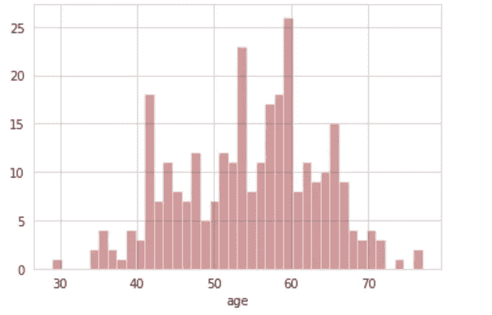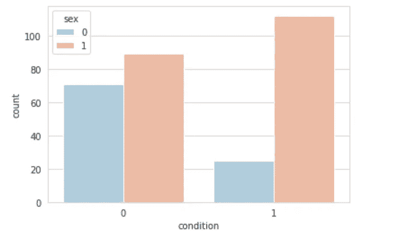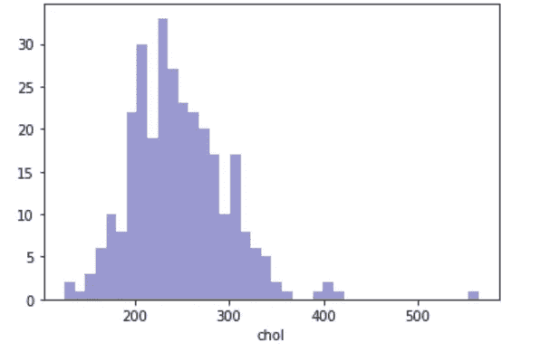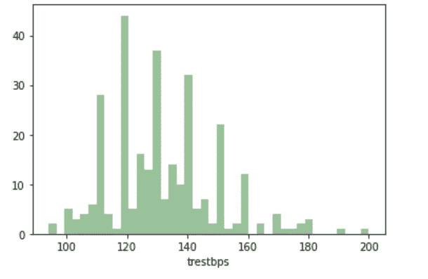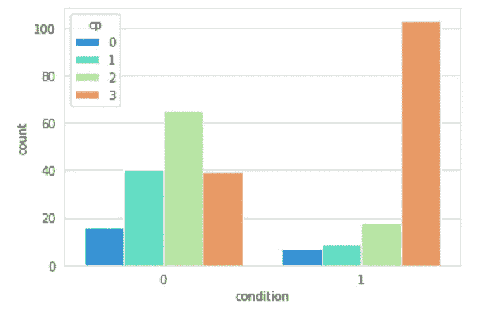

**图一。**顶行:分别为年龄、性别和胆固醇(chol)分布；底部一行:分别为静息血压(trestbps)和胸痛(cp)的分布

## 观察

*   患者年龄分布广泛，平均约 55 岁。
*   总的来说，在这项研究中，男性(类别= 1)比女性(类别= 0)多。从这个图中可以明显看出，男性比女性更容易患心脏病。患心脏病的男性比不患心脏病的男性多。相反，患心脏病的女性比不患心脏病的女性少得多。
*   血清胆固醇水平分布广泛，平均约为 250 mg/dl。
*   静息血压的分布相当不规律，平均约为 130 毫米汞柱。
*   在患有心脏病的人中，大多数患者是无症状的(类别= 3)。因此，数据支持医学文献。典型心绞痛(类别= 0)、非典型心绞痛(类别= 1)和非心绞痛(类别= 2)形式的胸痛主要由没有心脏病的患者报告。

# 第二步:用所有 13 个特征运行逻辑回归模型。

我的第一直觉是运行一个包含所有 13 个特征的逻辑回归模型，以检查最具包容性的模型是否也是最具医学意义的模型。我选择了逻辑回归，因为它很容易解释。该模型对测试数据的总体准确率为 86.7%，并能够正确预测 82.9%的患者存在心脏病(预测类别= 1)。很好，对吧？当我看到每个变量的系数时，我非常失望。

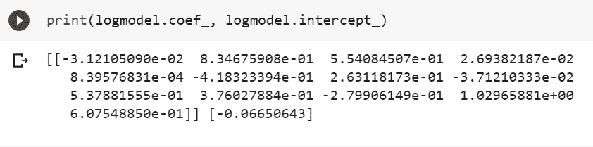

**图二。**13 特征逻辑回归模型结果

第一个系数(-0.03121)对应于年龄变量。就在几分钟前，我们讨论了医学文献如何表明年龄增长会增加患心脏病的风险。既然如此，年龄不应该有一个正系数吗？类似地，空腹血糖的系数为负(-0.41832)。根据医学文献，当 fbs > 100 mg/dL 时(在这种情况下，如果 fbs >120 mg/dL，class = 1；如果 fbs < 120 mg/dL，class = 0)，心脏病的风险大大增加[7]。因此，理想情况下，系数的符号应为正。

从医学角度来看，接受一个变量符号不正确的模型是不正确的，即使它是高度准确的。

# 步骤 3:根据医学文献运行新的逻辑回归模型

既然我已经建立了一个完全基于机器学习的模型，我决定尝试一个更有意义的模型。我想构建一个包含 13 个特征子集的模型，只包括那些符合医学文献的特征。因此，我最终得到了一个逻辑回归模型，根据医学文献，该模型具有 5 个最重要的特征— **年龄、性别、血清胆固醇水平(chol)、静息血压(trestbps)和胸痛(cp)** 。

该模型对测试数据的总体准确率为 74.4%，并能够正确预测 75.6%的患者存在心脏病(预测类别= 1)。模型的特征系数和截距如下所示。

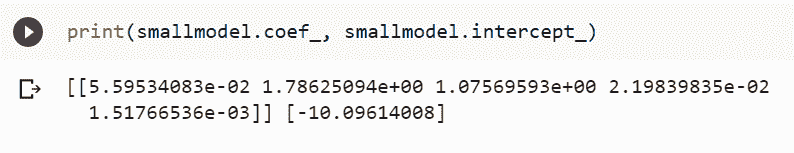

**图三。**五特征逻辑回归模型结果

所有的系数都是正的，正如我们所料！虽然这个模型可能不是最准确的，但它是有意义的，并且可以被任何医疗从业者容易地解释。

# 第四步:如何使新模型更加可靠？

具有变量子集的新的逻辑回归模型是有意义的，但是低于 13 特征模型的预测能力(82.9%对 75.6%)。

为了克服这些缺点，我们必须用另一个包含所有 13 个特征的 ML 模型来补充它。这种结合将更好地预测病人是否患有心脏病。

我开发了具有所有 13 个特征的 5 ML 模型，下表总结了它们的性能。

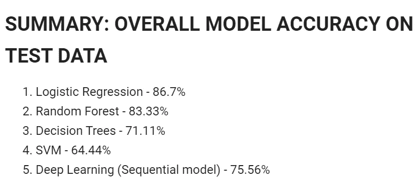

**图四。**所有五个 13 特征模型的结果汇总

虽然逻辑回归恰好是五个模型中最准确的，但基于上面概述的原因(变量的非直观迹象)，我有意识地忽略了它。我们最好的选择是选择随机森林模型，该模型对测试数据的总体准确率为 83.33%，并正确预测 78.05%的患者存在心脏病(预测类别= 1)。随机森林(RF)要素重要性图表如下所示。

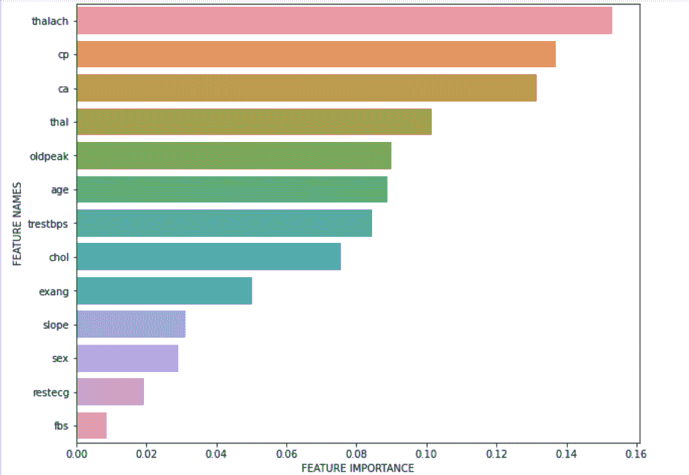

**图 5。**随机森林模型特征重要性图表

有趣的是，根据 RF，前 4 个变量是达到的最大心率(thalach)、胸痛(cp)、荧光透视着色的主要血管数量(ca)和心脏缺陷(thal)，而我们的逻辑模型的重要特征(年龄、性别、胆固醇、静息血压)则位于底部。这告诉我们，随机森林模型本身不应该被信任，而应该与我们的 5 特征逻辑回归模型结合使用，以获得良好的预测结果。

# 步骤 5:结合两个模型和最终建议

这一部分讲述了我结合两个分数得出最佳预测的方法。我创建了一个表格，比较模型预测和我们测试数据集中所有真正患有心脏病的患者的实际情况。我在本节中使用的符号也在下面进行了描述。

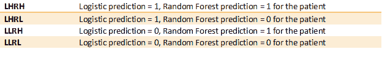

**图 6。**使用的符号

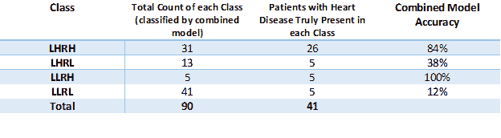

**图七。**比较所有真正患有心脏病的患者的组合模型预测和实际状况的表格

有意思！如果我们仅仅依靠我们的逻辑模型来正确预测心脏病(LH)，我们将得到 31/44 或 70.5%的准确率。另一方面，如果我们只依赖我们的随机森林模型(RH)，我们将得到 31/36 或 86.11%的准确度分数。RF 得分很高，因为 100%出现在 LLRH 类中，这可能是该类样本量小的结果，即只有 5 名患者。

如果我们依赖两个模型的组合(LHRH)，我们最终只选择了 31 名患者(31/90 =我们测试样本的 34%)，他们的心脏病发生率是 26/31 或 84%。因此，我们已经能够将命中率从 50%(发现心脏病的几率为 50-50%)提高到 84%，同时确保医学文献的神圣性。该模型是有效的，并且做了很好的预测。

至于逻辑模型和 RF 模型给出冲突预测的类别(LHRL 和 LLRH)，需要更多的研究。

# 结论

在医学领域，最精确的模型可能不是最有意义的，反之亦然。像这样的模型是我们可以将机器学习模型形式的数据科学原理与医学文献相结合的方式的一个例子，以给我们提供可能的最佳结果。这种模型的优点是易于解释，并且与医学文献同步。关于心脏病的准确预测，它已经能够将只筛查 34%人口的命中率从 50%提高到 84%。这种模式可以用于远程医疗，特别是在没有心脏病专家的不发达国家。未来的努力可能需要与心脏病专家合作，在其他医学数据集上工作，并检查这个模型的神圣性。

这个项目的代码可以在[这里](https://github.com/dikshasen24/Heart-Disease-Prediction)找到。

# 参考

***《心脏病克利 UCI》数据集上***[https://www.kaggle.com/cherngs/heart-disease-cleveland-uci?select = heart _ Cleveland _ upload . CSV](https://www.kaggle.com/cherngs/heart-disease-cleveland-uci?select=heart_cleveland_upload.csv)

***数据集原始来源:***【https://archive.ics.uci.edu/ml/datasets/Heart+Disease】T4

[1] *心血管疾病世卫组织* (2020 年)，[https://www . who . int/health-topics/cardio vascular-Diseases/# tab = tab _ 1](https://www.who.int/health-topics/cardiovascular-diseases/#tab=tab_1)

[2] R. Dhingra 和 R.S. Vasan，*年龄作为心血管危险因素* (2012)，[https://www.ncbi.nlm.nih.gov/pmc/articles/PMC3297980/](https://www.ncbi.nlm.nih.gov/pmc/articles/PMC3297980/)

[3] J.L. Sullivan，*铁与心脏病风险的性别差异* (2003)，[https://www . science direct . com/science/article/ABS/pii/s 0140673681924636](https://www.sciencedirect.com/science/article/abs/pii/S0140673681924636)

[4] W.B. Kannel，W.P. Castelli，T. Gordon 和 p . m . mcn amara，*血清胆固醇、脂蛋白和冠心病的风险* (1971)，[https://www . ACP journals . org/doi/ABS/10.7326/0003-4819-74-1-1](https://www.acpjournals.org/doi/abs/10.7326/0003-4819-74-1-1)

[5] C. Rosendorff，H.R. Black，C.P. Cannon，B.J. Gersh，J. Gore，J.L. IzzoJr，N.M. Kaplan，C.M. O'Connor，P.T. O'Gara 和 S. Oparil，*缺血性心脏病预防和管理中的高血压治疗* (2007 年)，[https://www . aha journals . org/doi/full/10.1161/circulation ha](https://www.ahajournals.org/doi/full/10.1161/circulationaha.107.183885)

[6] A.H. Ahmed，K.J. Shankar，H. Eftekhari，M.S. Munir，J. Robertson，A. Brewer，I.V. Stupin 和 S.W. Casscells，*无症状心肌缺血:当前观点和未来方向* (2007)，[https://www.ncbi.nlm.nih.gov/pmc/articles/PMC2359606/](https://www.ncbi.nlm.nih.gov/pmc/articles/PMC2359606/)

[7] C. Park，E. Guallar，J.A. Linton，D. Lee，Y. Jang，D.K. Son，E. Han，S.J. Baek，Y.D. Yun，S.H. Jee 和 J.M. Samet，*空腹血糖水平与动脉粥样硬化性心血管疾病事件的风险* (2013)，[https://pubmed.ncbi.nlm.nih.gov/23404299/](https://pubmed.ncbi.nlm.nih.gov/23404299/)