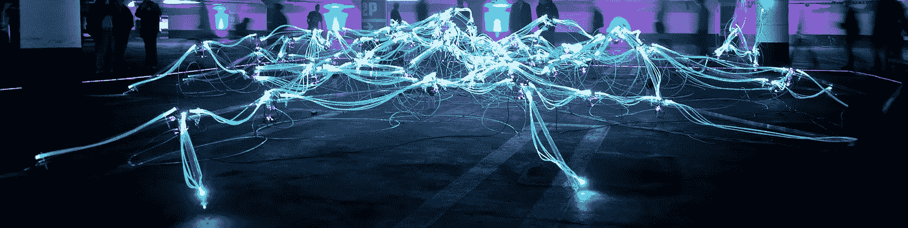
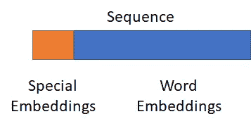

# 在深度神经网络中结合数字和文本特征

> 原文：<https://towardsdatascience.com/combining-numerical-and-text-features-in-deep-neural-networks-e91f0237eea4?source=collection_archive---------11----------------------->

## 如何使用 Keras 多输入模型为文本和数字数据训练一个端到端的深度神经网络



马里乌斯·马萨拉尔在 [Unsplash](https://unsplash.com/?utm_source=unsplash&utm_medium=referral&utm_content=creditCopyText) 上的照片

在应用机器学习中，数据通常由多种数据类型组成，例如文本和数字数据。为了建立一个结合两个领域特征的模型，有必要将这些特征堆叠在一起。这篇文章展示了在 Keras(端到端学习)的一个单一模型中结合自然语言处理和传统功能的不同解决方案。

# 真实世界的数据是不同的

科学数据集通常仅限于一种数据，例如文本、图像或数字数据。这很有意义，因为我们的目标是将新的模型和现有的方法进行比较。在现实世界的场景中，数据通常更加多样化。为了利用端到端学习神经网络，而不是手动堆叠模型，我们需要在神经网络内部组合这些不同的特征空间。

假设我们想要解决一个文本分类问题，并且我们的语料库中的每个文档都有额外的元数据。在简单的方法中，我们的文档由一个[单词包](https://en.wikipedia.org/wiki/Bag-of-words_model)向量表示，我们可以将元数据作为附加单词添加到向量中，这样就完成了。但是当使用像单词嵌入这样的现代方法时，就有点复杂了。

# 特殊代币

简单的解决方案是添加我们的元数据作为额外的特殊嵌入。类似于语言模型中的特殊标记，如 [BERT](https://huggingface.co/transformers/model_doc/bert.html) ，这些嵌入是可以像单词一样出现的标记。它们是二元的，因此我们没有连续的值空间。我们需要通过宁滨或一键编码将数据转换成分类特征。在我们确定了我们需要多少额外的特征之后，我们可以根据额外特征的数量来扩展词汇表，并将它们视为额外的单词。

我们的字典有 100 个单词，我们还有 10 个额外的功能。



该图显示了每个序列是如何以编码为特殊嵌入的特征开始的

嵌入序列现在总是从元数据特征(特殊标记)开始，因此我们必须将序列长度增加 10。这 10 个特殊嵌入中的每一个都代表了一个增加的特性。

这种解决方案有几个缺点。我们只有分类特征，没有连续值，更重要的是，我们的嵌入空间混合了文本和元数据。

# 多输入模型

为了构建一个可以处理连续数据和文本数据而没有这些限制因素的模型，我们来看看模型内部数据的内部表示。在某些时候，每个神经网络都有数据的内部表示。通常，这种表示就在涉及网络的最后(全连接)层之前。对于 NLP 中的递归网络(例如 LSTMs ),这种表示是文档嵌入。通过用我们的附加特征扩展这种表示，我们克服了限制。

在这样的模型中发生的事情是，我们基本上将两个模型堆叠在彼此之上，但是保留由相同的目标标签同时训练的能力。因此，它被称为端到端模型。

**举例:**

在 Keras 中，这对于多输入模型是可能的。我们又有了 100 个单词和 10 个附加特征。

```
nlp_input = Input(shape=(seq_length,)) 
meta_input = Input(shape=(10,))
emb = Embedding(output_dim=embedding_size, input_dim=100, input_length=seq_length)(nlp_input) 
nlp_out = Bidirectional(LSTM(128))(emb) 
concat = concatenate([nlp_out, meta_input]) 
classifier = Dense(32, activation='relu')(concat) 
output = Dense(1, activation='sigmoid')(classifier) 
model = Model(inputs=[nlp_input , meta_input], outputs=[output])
```

我们使用双向 LSTM 模型，并将其输出与元数据相结合。因此，我们定义了两个输入层，并在不同的“数据路径”中处理它们( **nlp_input** 和 **meta_input** )。我们的 NLP 数据经过嵌入变换和 LSTM 层。元数据正在进行一些规范化，所以我们可以直接将它与 LSTM 输出连接起来( **nlp_out** )。这个组合的向量现在是我们输入的完整表示，并且可以最终被分类在完全连接的层中。


一个简单的多输入模型的结构

这个概念可用于任何其他领域，其中来自 RNNs 的序列数据与非序列数据混合。更进一步，甚至可以将图像、文本和序列混合到一个单一的模型中。

这篇文章最初发表在我的博客上。