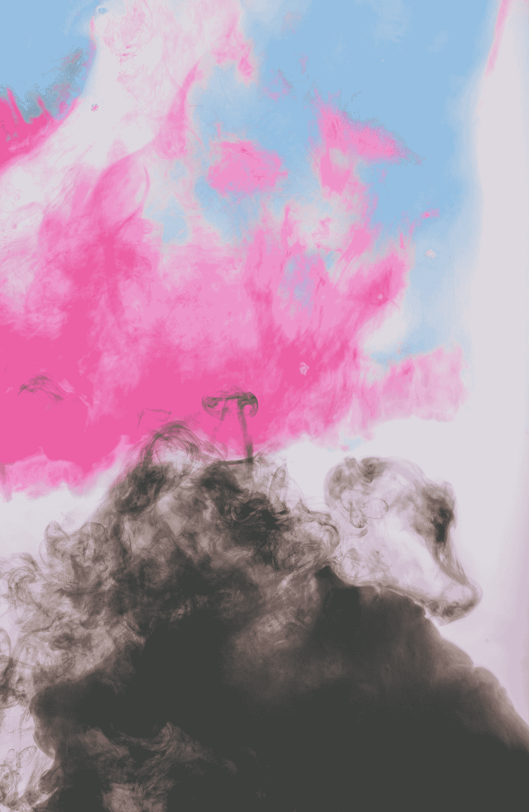
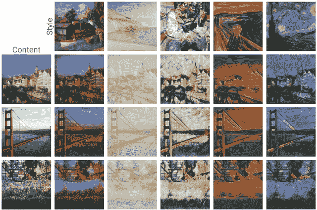
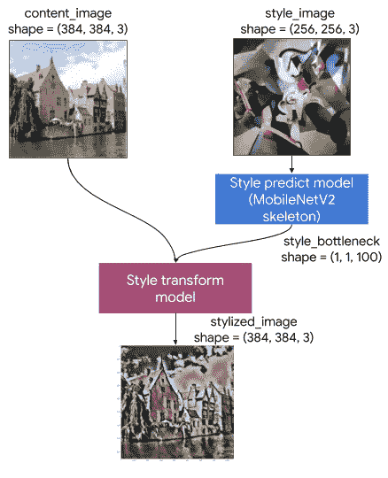
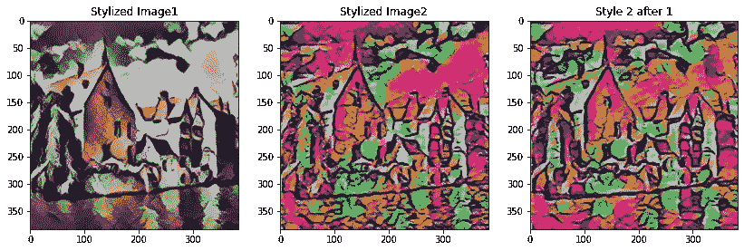
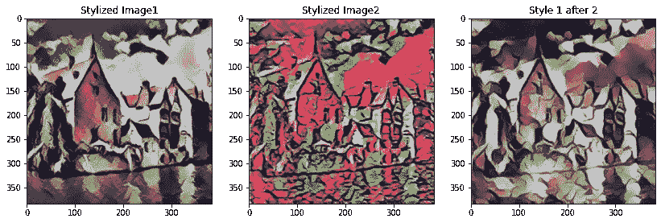
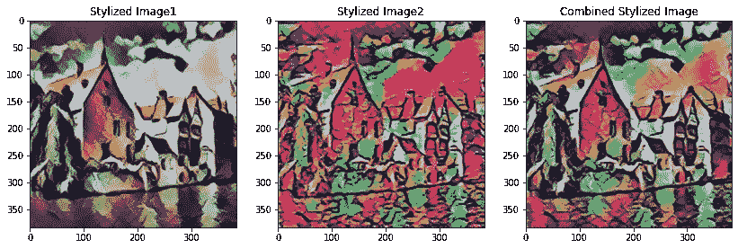
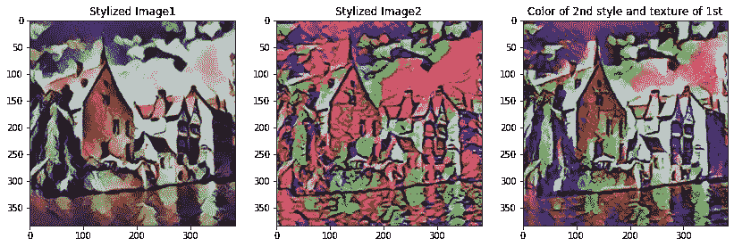
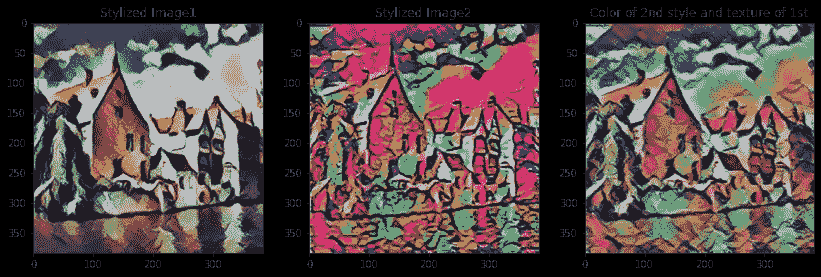
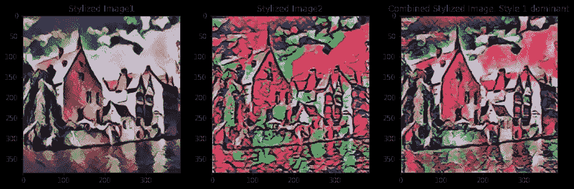
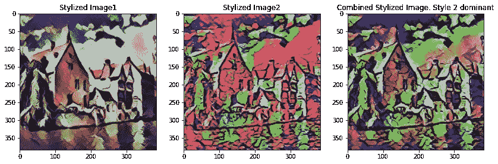

# 在 Tensorflow 中结合众多艺术风格

> 原文：<https://towardsdatascience.com/combining-numerous-artistic-styles-in-tensorflow-6e12a99b103f?source=collection_archive---------61----------------------->

## 神经类型转换在 Tensorflow 中非常容易，但只有一种类型。了解如何对图像应用多种样式。



安妮·斯普拉特在 [Unsplash](https://unsplash.com?utm_source=medium&utm_medium=referral) 上的照片

去年，发布了一篇关于使用 Tensorflow Lite 的[艺术风格转换的文章，其中内容图像的风格根据您喜欢的任何风格进行更改。这是超级有趣，非常容易使用。你只需要指定图片的路径就可以了。它使用两个 TfLite 模型，一个用于预测样式，另一个用于转换。](https://www.tensorflow.org/lite/models/style_transfer/overview)



一些图片风格转换的例子。[来源](https://www.tensorflow.org/lite/models/style_transfer/overview)。

因此，它在将单一样式传递到内容图像方面非常有效，但是我们如何传递多种样式呢？这就是你将在这篇文章中发现的。

# 目录

1.  艺术风格转移阐释
2.  组合样式

*   等量地
*   一个的样式和一个的颜色
*   一个支配另一个

# 艺术风格转移阐释

在这一节中，我将解释风格转换是如何工作的。如果你已经了解它，只是想结合不同的风格，请随意进入下一部分。进行必要的导入，如 TensorFlow、NumPy 和 Matplotlib。设置内容和样式图像的路径，并下载所需的 Tensorflow Lite 模型。

```
import tensorflow as tf
import matplotlib.pyplot as plt
import matplotlib as mpl
mpl.rcParams['figure.figsize'] = (12,12)
mpl.rcParams['axes.grid'] = False
import numpy as npcontent_path = content.jpg 
style_path = style.jpgstyle_predict_path = tf.keras.utils.get_file('style_predict.tflite', 'https://tfhub.dev/google/lite-model/magenta/arbitrary-image-stylization-v1-256/int8/prediction/1?lite-format=tflite')
style_transform_path = tf.keras.utils.get_file('style_transform.tflite', 'https://tfhub.dev/google/lite-model/magenta/arbitrary-image-stylization-v1-256/int8/transfer/1?lite-format=tflite')
```

加载图像和模型后，我们需要对它们进行预处理。图像应该是 RGB 格式的 float32 值，像素值需要在 0 和 1 之间。样式图像的尺寸应为(1，256，256，3)，内容图像的尺寸应为(1，384，384，3)。在 Tensorflow 博客中，宽度和高度的较小维度分别根据样式或内容图像等于 256 或 384，然后在中央裁剪。

```
# Function to load an image from a file, and add a batch dimension.
def load_img(path_to_img):
  img = tf.io.read_file(path_to_img)
  img = tf.io.decode_image(img, channels=3)
  img = tf.image.convert_image_dtype(img, tf.float32)
  img = img[tf.newaxis, :] return img# Function to pre-process by resizing an central cropping it.
def preprocess_image(image, target_dim):
  # Resize the image so that the shorter dimension becomes 256px.
  shape = tf.cast(tf.shape(image)[1:-1], tf.float32)
  short_dim = min(shape)
  scale = target_dim / short_dim
  new_shape = tf.cast(shape * scale, tf.int32)
  image = tf.image.resize(image, new_shape) # Central crop the image.
  image = tf.image.resize_with_crop_or_pad(image, target_dim, target_dim) return image# Load the input images.
content_image = load_img(content_path)
style_image = load_img(style_path)# Preprocess the input images.
preprocessed_content_image = preprocess_image(content_image, 384)
preprocessed_style_image = preprocess_image(style_image, 256)print('Style Image Shape:', preprocessed_style_image.shape)
print('Content Image Shape:', preprocessed_content_image.shape)
```

现在，我们需要使用加载的模型来预测样式图像上的样式。如果你想知道如何在 Python 中使用 [Tensorflow Lite，你可以看看这篇文章。创建模型的*解释器*并获取其输出。样式模型输出一个*样式瓶颈*，它有一个(1，1，1，100)的形状，我们将对它进行修改以组合多种样式。](https://www.tensorflow.org/lite/convert/python_api)

```
# Function to run style prediction on preprocessed style image.
def run_style_predict(preprocessed_style_image):
  # Load the model.
  interpreter = tf.lite.Interpreter(model_path=style_predict_path) # Set model input.
  interpreter.allocate_tensors()
  input_details = interpreter.get_input_details()
  interpreter.set_tensor(input_details[0]["index"], preprocessed_style_image) # Calculate style bottleneck.
  interpreter.invoke()
  style_bottleneck = interpreter.tensor(
      interpreter.get_output_details()[0]["index"]
      )() return style_bottleneck# Calculate style bottleneck for the preprocessed style image.
style_bottleneck = run_style_predict(preprocessed_style_image)
print('Style Bottleneck Shape:', style_bottleneck.shape)
```

在这之后，我们需要在我们的内容图像上应用这个样式瓶颈来改变它的样式，所以我们使用另一个加载的模型。

```
# Run style transform on preprocessed style image
def run_style_transform(style_bottleneck, preprocessed_content_image):
  # Load the model.
  interpreter = tf.lite.Interpreter(model_path=style_transform_path) # Set model input.
  input_details = interpreter.get_input_details()
  interpreter.allocate_tensors() # Set model inputs.
  interpreter.set_tensor(input_details[0]["index"], preprocessed_content_image)
  interpreter.set_tensor(input_details[1]["index"], style_bottleneck)
  interpreter.invoke() # Transform content image.
  stylized_image = interpreter.tensor(
      interpreter.get_output_details()[0]["index"]
      )() return stylized_image# Stylize the content image using the style bottleneck.
stylized_image = run_style_transform(style_bottleneck, preprocessed_content_image)# Visualize the output.
stylized_image = tf.squeeze(stylized_image, axis=0)
plt.imshow(stylized_image)
plt.title('Stylized Image')
```

这篇文章中的流程图最好地概括了这个过程。



[来源](https://www.tensorflow.org/lite/models/style_transfer/overview)

# 组合样式

我将要处理的图像如下所示。


前两张是文章中的相同图片，第三张取自[这里](https://www.pinterest.co.uk/pin/353251164510356461/)。

任何人对组合它们的第一个猜测都是先应用一种样式，然后在生成的图像上应用第二种样式。让我们看看我们通过它得到的结果。



前两张图片是个人风格。在第三幅图像中，样式 2 应用于第一幅图像



在第三个图像中，样式 1 应用于第二个图像

这样的结果不太好。结果看起来有点笨拙，只有应用于它的最终样式的颜色。所以，让我们来研究一下风格瓶颈，看看会发生什么。

## 等量地

为了给两种风格以同等的权重，我们可以采用风格瓶颈的平均值。

```
style_bottleneck = style_bottleneck1.copy()
for i in range(100):
    style_bottleneck[0, 0, 0, i] += style_bottleneck2[0, 0, 0, i]
    style_bottleneck[0, 0, 0, i] /= 2
```



通过手段结合他们的风格瓶颈后的结果。

这看起来比我们之前得到的结果更好，而且颜色组合得更好。

## 一个的样式和一个的颜色

这个结果完全出乎意料，是瞎混的结果。这并不是说其他风格不会像我们获得的第一个结果那样对图像的颜色有任何发言权，在此之后我们继续进行风格瓶颈，但这将是微妙的，并淡化其他风格。将您想要的颜色样式放在所有偶数索引处，将您想要的纹理样式放在奇数索引处。

```
style_bottleneck = style_bottleneck1.copy()
for i in range(100):
    if i % 2 == 0: # change 0 to 1 for second image
        style_bottleneck[0, 0, 0, i] = style_bottleneck2[0, 0, 0, i]
```



第二种款式的颜色和第一种的质地。



第一款的颜色和第二款的质地。

## 一个支配另一个

我们知道风格瓶颈的大小是(1，1，1，100)。因此，如果我们取一种风格的前 50 个值，取另一种风格的后 50 个值，那么取前 50 个值的风格应该更占优势。

```
style_bottleneck = style_bottleneck1.copy()
for i in range(50, 100): #change to (50) for second image
    style_bottleneck[0, 0, 0, i] = style_bottleneck2[0, 0, 0, i]
```



风格 1 优于风格 2



风格 2 优于风格 1

我尝试在一张图片中结合两种风格。你可以试着把两个以上的组合起来，看看是什么样子。完整的代码如下所示。